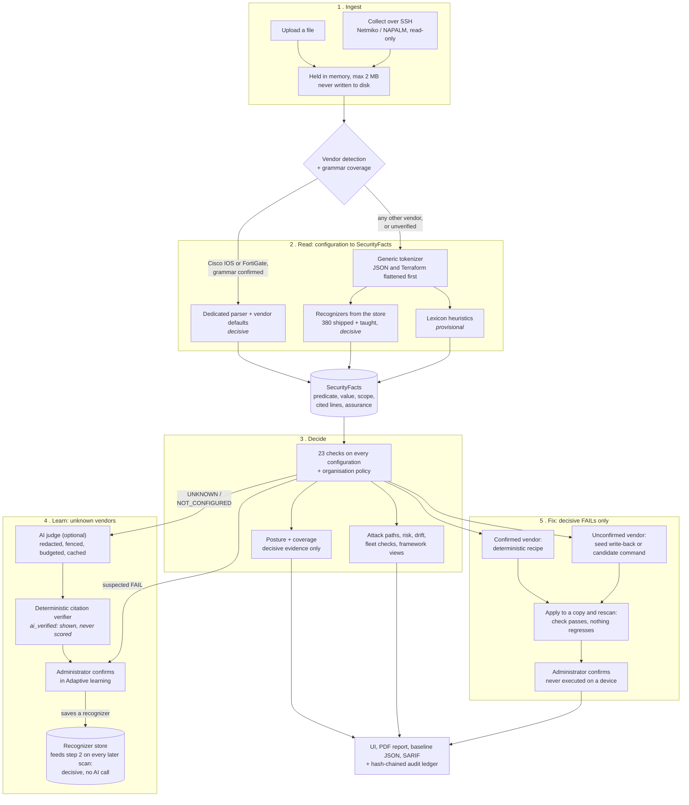

# NetAuditAI

**A network configuration security auditor that refuses to guess.**

Built for Smart India Hackathon 2026, problem statement **SIH26155** (NTRO, Cybersecurity):
*AI-Driven Multi-Vendor Network Security Compliance Auditor*.

NetAuditAI reads router, switch, firewall and cloud firewall configurations, answers **23 security checks** on
every one of them, and cites the exact configuration line behind every answer. When it cannot decide, it says so
instead of passing the check. It fixes what it is sure about, proves every fix by rescanning a copy, and never
runs a command on a device.

```text
Upload or SSH-collect a config  →  cited PASS / FAIL / UNKNOWN per check  →  posture + coverage
                                →  verified fixes  →  PDF report, SARIF, tamper-evident audit ledger
```

---

## Contents

- [Why it is different](#why-it-is-different)
- [Quickstart](#quickstart)
- [Demo](#demo)
- [How it works](#how-it-works)
- [Reading the results](#reading-the-results)
- [Vendor support](#vendor-support)
- [The 23 checks](#the-23-checks)
- [Measured accuracy](#measured-accuracy)
- [More than a checklist](#more-than-a-checklist)
- [Configuration](#configuration)
- [Command line and CI](#command-line-and-ci)
- [What is stored](#what-is-stored)
- [Deploying safely](#deploying-safely)
- [Known limitations](#known-limitations)
- [Repository layout](#repository-layout)
- [Testing](#testing)
- [Documentation](#documentation)
- [License](#license)

---

## Why it is different

Most config auditors either support a handful of vendors with hand-written rules, or put an LLM in front of the
file and trust what comes back. NetAuditAI does neither.

| Principle | What it means in practice |
|---|---|
| **Undecided is an answer** | `UNKNOWN` and `NOT_CONFIGURED` exist so missing evidence is never silently a PASS. Posture is computed from decided checks only, and **coverage** says how much could be decided. |
| **Every verdict is traceable** | Framework requirement → check → vendor-neutral fact → configuration line → verdict. No verdict without a cited line (or a documented vendor default). |
| **AI proposes, code verifies, a human confirms** | The AI only looks at checks the engine left undecided, its citations are verified deterministically, and its answers are never scored until an administrator confirms them. |
| **Learning without training** | An administrator confirms how an unfamiliar line reads; that becomes a typed, validated **recognizer** that answers decisively on every later scan, with no AI call. |
| **Fixes are proven, not generated** | Fixes come from fixed recipes or from the same recognizer that read the line. Each one is applied to a copy and rescanned; it only counts if the check now passes and nothing else regressed. |
| **Read-only toward devices** | Live collection opens one SSH session with read-only commands. Nothing NetAuditAI produces is ever executed on a device. |

---

## Quickstart

**Prerequisites:** Python 3.10+, Node.js 18+. An AI key is optional; everything except AI explanations, chat and
AI proposals works without one.

```bash
# 1. Backend  (http://localhost:8000, API docs at /docs)
cd backend
python -m venv venv
source venv/bin/activate            # Windows: venv\Scripts\activate
pip install -r requirements.txt
uvicorn app.main:app --reload --port 8000

# 2. Frontend, in a second terminal  (http://localhost:5173)
cd frontend
npm install
npm run dev
```

Open http://localhost:5173, choose **New scan**, and upload `demo-sih/cisco_oneclick.cfg`.

No UI needed? Scan from the command line:

```bash
cd backend
python -m app.cli scan ../demo-sih/ --fail-on high
```

Optional settings live in `backend/.env` (copy `backend/.env.example`) and `frontend/.env`. See
[Configuration](#configuration).

---

## Demo

Four demos in [`demo-sih/`](demo-sih/README.md). Each goes from a bad first scan to **posture 100 with 0
problems** once the corrected file is rescanned. This is pinned by `backend/tests/test_demo_fix_to_100.py`.

| File | First scan | How it gets to 100 |
|---|---|---|
| `cisco_oneclick.cfg` | posture 41, 15 problems | One click. Deterministic Cisco recipes, no input needed. |
| `paloalto_ai_human.cfg` | posture 30, 10 problems | 5 fixed by seed write-back (no parser), 5 by an AI-drafted or typed command, each verified on a copy. |
| `unknown_vendor.cfg` | no score, 3 suspected problems | Teach 3 lines in **Adaptive learning**, then 3 verified commands. |
| `fortigate/` (3 files, one upload) | fleet posture 80, 13 problems | One click; the download is a `.zip` of 3 corrected files. Also shows a cross-device NTP mismatch and a closed attack path. |

The two-minute judge path and the full walkthrough are in [docs/demo.md](docs/demo.md). A browser test
(`cd frontend && npm run e2e`) walks the same path.

---

## How it works



| Stage | What happens | Code |
|---|---|---|
| Ingest | Upload or SSH collection. Collection is restricted to private address space by default; credentials are used for one session and never stored. | `app/collect/` |
| Detect | The vendor is **confirmed** only when the file follows its grammar (coverage threshold 0.7). Look-alikes (NX-OS, ASA, Arista, FortiSwitch, mixed files) are reported as unverified and take the generic path. | `app/parsers/detector.py`, `coverage.py` |
| Read | Parsers, recognizers and heuristics all produce the same vendor-neutral **SecurityFacts**. This is the Security Baseline Model, downloadable from `GET /api/scan/{id}/baseline`. | `app/parsers/`, `app/structure/`, `app/facts/` |
| Decide | Every check runs on every configuration; the vendor only decides where facts come from. | `app/controls/`, `app/analysis/` |
| Learn | AI proposals and suspected lines become recognizers only through an administrator. | `app/ai/judge.py`, `app/adaptive/`, `app/db/` |
| Fix | Recipes (Cisco, FortiGate), seed write-back and candidate commands, each verified by rescanning a copy. | `app/remediation/` |
| Report | PDF per device, executive summary, SARIF, hash-chained ledger. | `app/reporting/`, `app/ledger.py` |

The full design, including the exact gates a recognizer must pass, is in [docs/architecture.md](docs/architecture.md).

---

## Reading the results

**Status per check**

| Status | Meaning |
|---|---|
| `PASS` | Evidence says the setting is secure, with a cited line or a documented vendor default. |
| `FAIL` | Evidence says the setting is insecure. One FAIL per failing scope (interface, VTY range, policy). |
| `UNKNOWN` | Something relevant exists but could not be decided (conflict, missing unit, unread syntax, AI proposal awaiting confirmation). |
| `NOT_CONFIGURED` | Nothing relevant was found. Never counted as a PASS. |
| `N_A` | Proven not to apply, for example no VPN on a device whose parser reads VPNs. Only a confirmed parser can prove this. |

**Assurance per verdict**

| Assurance | Source | Counts toward posture? |
|---|---|---|
| `parser` | Dedicated Cisco IOS / FortiGate parser | Yes |
| `confirmed` | Shipped seed recognizer or administrator-confirmed recognizer | Yes |
| `default` | Documented default of a confirmed vendor | Yes |
| `heuristic` | Lexicon reading of an unfamiliar line ("Suspected FAIL") | No |
| `ai_verified` | AI proposal whose citations passed verification ("AI proposes ...") | No |

**Scores**

```text
posture  = weighted decisive PASS / weighted decisive (PASS + FAIL) x 100     "-" when nothing was decided
coverage = weighted decisive (PASS + FAIL) / weighted applicable checks
weights  = critical 10, high 6, medium 3, low 1
```

Posture and coverage are always shown together, with the range posture would take if every undecided check
failed or passed, and a list of **critical checks not assessed**. The response still carries a deprecated
`score` field for old scripts; the UI ignores it.

**Framework views** regroup the same results under NIST SP 800-53 Rev. 5, the DISA Network Device Management
SRG, ISO/IEC 27001:2022 Annex A and, for confirmed vendors, verified CIS Benchmark items. They are evidence, not a
compliance certification. PCI DSS and CIS Controls v8 are deliberately not mapped.

---

## Vendor support

| Configuration | How it is read | Decisive? | Remediation |
|---|---|---|---|
| **Cisco IOS / IOS-XE** | Dedicated parser, confirmed by grammar coverage | Yes | Deterministic recipes, verified |
| **Fortinet FortiGate** (with a `config firewall` / `config vpn` section) | Dedicated parser, confirmed by grammar coverage | Yes (password storage and AAA are not read: `UNKNOWN`) | Deterministic recipes, verified |
| **Juniper Junos, Palo Alto PAN-OS, Arista EOS, Huawei VRP, Aruba AOS-CX, Check Point Gaia, Extreme EXOS, MikroTik RouterOS, Cisco NX-OS / ASA / IOS-XR, SONiC, Cumulus NVUE, Dell OS10, VyOS, FortiSwitchOS** | Generic tokenizer + shipped recognizers + heuristics | Where a recognizer reads the line; otherwise provisional | Seed write-back, or candidate commands verified on a copy |
| **Terraform** (AWS, Azure, GCP) and **cloud exports** (AWS security groups, Azure NSG, GCP firewall JSON) | Flattened to one statement per rule, read by shipped recognizers; device-only checks are `N_A` | Yes for an open rule; an unresolved `var.x` stays undecided | None generated |
| **Anything else** | Generic tokenizer + heuristics + optional AI judge | Provisional until an administrator teaches it | Candidate commands once a finding is decisive |

The vendor is always decided by code. An AI vendor guess is shown as evidence only and never selects a parser,
defaults or remediation. Device identity (hostname, OS version, FortiGate model and firmware) is reported only
when the file states it; serial numbers and chassis details are never invented.

The **380 shipped recognizers** live in [`backend/data/seed_recognizers.json`](backend/data/seed_recognizers.json),
load into an empty database on first start, and are marked `source=seed` so shipped knowledge can be audited
separately from what a deployment was taught. See [docs/seed-knowledge.md](docs/seed-knowledge.md).

---

## The 23 checks

<details>
<summary>Show all checks</summary>

| ID | Severity | Check |
|---|---|---|
| MGMT-001 | Critical | Insecure management protocol (Telnet) enabled |
| MGMT-002 | High | Insecure HTTP management enabled |
| MGMT-003 | Critical | Unrestricted management access |
| MGMT-004 | Critical | Weak or default SNMP community strings |
| MGMT-005 | Critical | Plaintext or weakly encrypted passwords |
| MGMT-006 | Medium | Missing or disabled session timeout |
| MGMT-007 | High | SSH version 1 or weak SSH configuration |
| MGMT-008 | High | AAA not configured |
| MGMT-009 | Low | Missing login banner |
| MGMT-010 | Critical | Management reachable from an untrusted interface |
| MGMT-011 | High | SNMPv1/v2c in use |
| AUTH-001 | High | No login brute-force protection |
| AUTH-002 | Medium | Weak password policy |
| AUTH-003 | Medium | Default administrator account in use |
| BOUNDARY-001 | Critical | Overly permissive firewall / ACL rules |
| BOUNDARY-002 | Medium | IP source routing enabled |
| BOUNDARY-003 | Medium | CDP / LLDP enabled on an external interface |
| BOUNDARY-004 | Medium | Interface hardening (redirects, proxy-ARP, directed broadcast) |
| LOG-001 | High | No remote syslog server |
| LOG-002 | Medium | NTP not configured or unauthenticated |
| LOG-003 | Medium | Traffic rules that do not log |
| CRYPTO-001 | High | Weak VPN / IPsec algorithms |
| CRYPTO-002 | High | Weak management cryptography (SSH / HTTPS) |

Per-vendor facts and remediation: [docs/detection-rules.md](docs/detection-rules.md).

</details>

---

## Measured accuracy

Every labelled configuration run through the real pipeline with **shipped knowledge only and no AI**. Reproduce
with `python backend/scripts/benchmark.py`; full table in [benchmark/RESULTS.md](benchmark/RESULTS.md), labels in
[benchmark/labels.json](benchmark/labels.json).

| Set | Insecure settings caught (decided FAIL) | Missed | False alarms on secure settings |
|---|---|---|---|
| 20 vulnerabilities planted in the demo files (Cisco IOS, PAN-OS) | **19/20** (the other 1 flagged as suspected) | **0** | **0** of 4 |
| 31 labelled fixtures: 8 vendors without a parser, SONiC, Cumulus, Terraform, Azure / GCP exports | **92/112** (1 more flagged as suspected, 19 left undecided) | **0** | **0** of 84 |
| **Held-out:** 9 real configurations never seen during development (pybatfish example networks), labels committed before the first run. **Not in the repository: needs the download step below** | **21/21** (first run 20/21; the miss was a parser bug, since fixed) | **0** | **0** of 13 |

"Undecided" is not a miss: the engine shows the line and what it would need, and never calls an insecure setting
secure. `tests/test_benchmark.py` fails if detection drops or a single miss or false alarm appears. The held-out
files are not committed (they are pybatfish's); `backend/scripts/benchmark.py` prints the command that fetches
them at the pinned commit, and the same test then holds them to zero misses and zero false alarms.

**Reproducing from a clone:** the planted and fixtures sets reproduce as shown (their files, including the
`teach/*_5_configs` dialect sets, are committed). The held-out row does not until you fetch the pybatfish files into
`datasets/pybatfish/` with the command `backend/scripts/benchmark.py` prints; without them it is skipped, not failed.
See [testing.md](docs/testing.md#on-a-clean-clone).

A separate live probe of 6 prompt-injection attacks against the AI judge succeeded 0 times
(`backend/scripts/probe_injection.py`), and a fully hijacked model is tested to change no verdict.

---

## More than a checklist

| Feature | What it does |
|---|---|
| **Attack paths** | Chains decided FAILs into how an attacker gets in (reach the login → capture the password → log in as admin), each step citing its line, plus the one fix that breaks the path. Each path is validated against a positive and a negative configuration. |
| **Contextual risk** | Worst problem, internet exposure, attack paths and the asset importance you set, by a formula shown on screen and in the report. |
| **Fix order** | Remediation sorted by risk removed per unit of effort, with the reason for each position. |
| **Changes since last audit** | Rescan a device and see what was fixed, what newly broke and which attack paths closed. Losing evidence is never counted as a fix. |
| **Fleet checks** | Problems only visible across devices: the same SNMP community on several devices (compared by hash, never shown) and inconsistent NTP / syslog servers. |
| **Organisation policy** | Your own stricter baseline (idle timeout, login attempts, password length, approved NTP / syslog servers). It can only tighten, never loosen. See [docs/policy.md](docs/policy.md). |
| **Known CVEs** | CVEs for the OS version the file states, from a committed NVD cache. Labelled as context, not an assessment. No live call. |
| **Audit ledger** | Scans, taught recognizers, fix decisions and reports are hash-chained. Editing any entry is detected, and a report PDF can be checked byte for byte. |
| **Assistant** | Ask about the open scan; it answers from that scan's redacted results and is told that undecided is not failed. |
| **Offline AI** | `LOCAL_AI_URL` sends every AI call to a local OpenAI-compatible server (Ollama, llama.cpp, vLLM) so nothing leaves the network. |

---

## Configuration

Every setting is optional. Backend settings go in `backend/.env`, frontend settings in `frontend/.env`.

| Variable | Default | Purpose |
|---|---|---|
| `GROQ_API_KEY`, `GROQ_API_KEY_1` to `_4` | empty | AI judge, explanations and chat. Tried in order; the next key is used on 429 / 401 / 403 / 404. Keys from one Groq organization share one daily quota. |
| `LOCAL_AI_URL`, `LOCAL_AI_MODEL`, `LOCAL_AI_TIMEOUT` | empty, `llama3.1:8b`, `120` | Use a local OpenAI-compatible model instead of Groq. When set, the Groq keys are ignored. |
| `AI_JUDGE_MAX_CALLS_PER_SCAN` | `2` | AI judge requests per scan. Cache hits are free. |
| `API_KEY` | empty | When set, every `/api` request needs an `X-API-Key` header. **The bundled frontend does not send it yet**, so only set it for API-only use or behind a proxy that adds it. |
| `CORS_ORIGINS` | `*` | Comma-separated list of allowed origins. |
| `ADAPTIVE_DB_PATH` | `backend/data/adaptive.db` | SQLite file for recognizers, rejected lines, the AI cache, the scan archive and the audit ledger. |
| `DATABASE_URL` | empty | Postgres URI (e.g. Supabase session pooler) instead of SQLite, for hosts that wipe their disk on restart. |
| `VENDOR_PARSE_COVERAGE_THRESHOLD` | `0.7` | Share of lines that must follow a vendor's grammar before its parser is trusted. |
| `LIVE_COLLECTION_ENABLED` | `true` | SSH collection from devices. **Set `false` on any backend others can reach.** |
| `LIVE_COLLECTION_NETWORKS` | `private` | Only RFC1918 and loopback hosts may be collected from; link-local (cloud metadata) is always refused. `any` lifts the restriction. |
| `ADAPTIVE_AI_FOR_KNOWN_VENDORS` | `false` | Legacy line interpreter for Cisco / FortiGate lines the parsers skip. Results only reach the review queue. |
| `VITE_API_BASE_URL` (frontend) | `http://localhost:8000/api` | Backend URL. Vite reads it only at startup. |

Live collection with NAPALM (preferred where it has a driver) needs `pip install -r requirements-live.txt`.
Netmiko is already included and covers all 12 supported platforms: Cisco IOS / IOS-XE, NX-OS and IOS-XR, Arista EOS,
Juniper Junos, FortiGate, Palo Alto PAN-OS, HPE Aruba AOS-CX, Huawei VRP, Check Point Gaia, Extreme EXOS and MikroTik
RouterOS.

---

## Command line and CI

The same engine without a server, built for pipelines:

```bash
cd backend
python -m app.cli scan ../configs/ --fail-on high --sarif netaudit.sarif
```

- **Deterministic:** AI is always off, and a throwaway database holds only shipped knowledge, so the same files
  give the same result.
- **Only decided FAILs fail the build.** Suspected problems are reported but never block.
- **Exit codes:** `0` passed, `1` a decided problem at or above `--fail-on`, `2` bad input.
- **SARIF 2.1.0** output shows each problem on its line in a pull request (GitHub code scanning).

Options, `--policy`, `--framework` and a ready GitHub Actions workflow: [docs/cli.md](docs/cli.md).

---

## What is stored

| Data | Where | Survives a restart? |
|---|---|---|
| Uploaded or collected configurations | Backend memory only | No. Never written to disk. |
| Active scans (needed to teach and fix) | Backend memory | No. After a restart an archived scan reopens read-only; teaching or fixing asks for the file again. |
| Scan archive: redacted results and remediation plans | `scans` table | Yes |
| Recognizers and learned mappings (shipped and taught) | `learned_mappings` | Yes |
| Lines an administrator rejected | `rejected_lines`, redacted | Yes |
| Verified AI judge answers | `ai_judge_cache`, keyed by a hash of the redacted prompt | Yes |
| Audit ledger: hashes of scans, recognizers, fix decisions, reports | `ledger` | Yes |
| History list in the UI | Browser `localStorage`, summaries only | Browser only |

Tables live in SQLite by default or in Postgres when `DATABASE_URL` is set; the same SQL runs on both. A line
holding a password, key or community string is refused as a recognizer, and every AI prompt, archived scan and
report is redacted.

---

## Deploying safely

This is a prototype built to run on a laptop for a demo. If you expose it anyway:

1. Set `LIVE_COLLECTION_ENABLED=false`. Otherwise the backend will open SSH sessions to hosts it is given.
2. Never set `LIVE_COLLECTION_NETWORKS=any` on a public host.
3. Set `API_KEY` and put a proxy in front that adds the header for the UI.
4. Set `CORS_ORIGINS` to your frontend origin.
5. Set `DATABASE_URL` if the host loses its disk on restart, or everything administrators taught is lost.

Trust boundaries and guarantees: [docs/security-model.md](docs/security-model.md).

---

## Known limitations

- **Access control** is one optional shared key: no users, no roles, no per-tenant isolation.
- **Parsers** exist for Cisco IOS / IOS-XE and FortiGate only. The IOS grammar is a curated list of command roots,
  so an unusual but valid IOS file can come out unverified.
- **Shipped recognizers** answer part of each dialect, not all of it. Anything they do not cover has to be taught.
- **Heuristics** can misread an unfamiliar dialect until an administrator confirms or rejects the line. They never
  affect posture.
- **Redaction** is pattern-based; a secret behind an unlisted keyword could reach the AI.
- **The AI judge** runs only for unknown or unverified vendors. Undecided checks on Cisco / FortiGate are not
  escalated.
- **Candidate commands** for unconfirmed vendors are verified only when they remove or switch off the cited lines,
  or when a reviewed recognizer reads every line. A verified candidate means the finding is gone from this file,
  not that the command is safe to run on the device.
- **Adding a missing setting** on an unconfirmed vendor is limited to syslog and the login banner.
- `/api/assistant/status` reports AI as available whenever a key is set, even when the quota is used up.

The full list of open items is in [docs/roadmap.md](docs/roadmap.md).

---

## Repository layout

```text
backend/
  app/
    collect/        SSH collection (Netmiko, optional NAPALM)
    parsers/        vendor detection, grammar coverage, Cisco IOS and FortiGate parsers
    structure/      generic tokenizer, JSON and Terraform flattening
    facts/          predicates, parser facts, defaults, lexicon, heuristics, recognizers, seed loader
    controls/       23-check catalog, judges, evaluator, framework views, policy
    analysis/       scoring, attack paths, risk, drift, fleet checks, CVE lookup
    ai/             model client, redaction, prompt fence, AI judge, remediation drafts
    adaptive/       teaching flow: capture, relevance, matching, review service
    remediation/    recipes, verifying engine, seed write-back, candidate commands
    reporting/      PDF reports
    db/             SQLite / Postgres, recognizer store, scan archive
    api/routes/     scan, collect, remediation, adaptive, assistant, report, ledger
    cli.py          command line for CI
    ledger.py       hash-chained audit ledger
  data/             shipped recognizers, factory defaults, CVE cache, attack-path validation
  scripts/          benchmark, CVE cache builder, injection probe, architecture PDF
  tests/            pytest suite and labelled fixtures
frontend/src/       React 19 + Vite app (hand-written CSS, no component library)
benchmark/          ground-truth labels and generated results
demo-sih/           the three demo configurations
sample/             extra sample configurations
docs/               design and reference documentation
```

---

## Testing

```bash
# backend: every AI call is mocked, every test gets its own SQLite database
cd backend
python -m pytest tests -q -n auto
NETAUDIT_LIVE_AI=1 python -m pytest tests -q          # also runs the 2 live-AI tests (needs a Groq key)

# frontend
cd frontend
npm test
npm run build
npm run e2e                                              # Playwright demo walkthrough
```

Details: [docs/testing.md](docs/testing.md).

---

## Documentation

Start at the **[documentation index](docs/README.md)**, which has reading paths for judges, operators, developers and
security reviewers.

| Document | Contents |
|---|---|
| [project-overview.md](docs/project-overview.md) | System context, repository map, module dependencies, frontend pages |
| [architecture.md](docs/architecture.md) | The full pipeline, facts, checks, scoring, AI, recognizers, persistence, remediation |
| [architecture-brief.pdf](docs/architecture-brief.pdf) | Two-page architecture brief (evaluation deliverable) |
| [security-model.md](docs/security-model.md) | Trust boundaries and safety guarantees |
| [ai-design.md](docs/ai-design.md) | AI judge, verification, cache, remediation drafts |
| [seed-knowledge.md](docs/seed-knowledge.md) | Shipped recognizers and how to add one |
| [detection-rules.md](docs/detection-rules.md) | The 23 checks: how each is decided, per-vendor sources, fixes, every framework requirement |
| [parser-design.md](docs/parser-design.md) | Vendor detection, grammar coverage, the two parsers |
| [api.md](docs/api.md) | Endpoints and response fields (interactive docs at `/docs` when the backend runs) |
| [cli.md](docs/cli.md) | Command line, exit codes, SARIF, GitHub Actions |
| [policy.md](docs/policy.md) | Organisation policy file |
| [data-model.md](docs/data-model.md) | Every object and table, all 23 predicates |
| [decisions.md](docs/decisions.md) | 16 decision records: context, decision, consequences |
| [glossary.md](docs/glossary.md) | Every term used in the code and the UI |
| [requirements.md](docs/requirements.md) | SIH26155 requirements and where each is met |
| [demo.md](docs/demo.md) | Two-minute judge path and full walkthrough |
| [setup.md](docs/setup.md), [testing.md](docs/testing.md), [deployment.md](docs/deployment.md) | Running, testing, deploying |
| [roadmap.md](docs/roadmap.md) | Done and not yet done |

---

## License

**All rights reserved.** See [LICENSE](LICENSE). No copying, use, modification or redistribution without written
permission from the author. Organisers, evaluators and judges of Smart India Hackathon 2026 may view, download and
run it to evaluate this submission.
