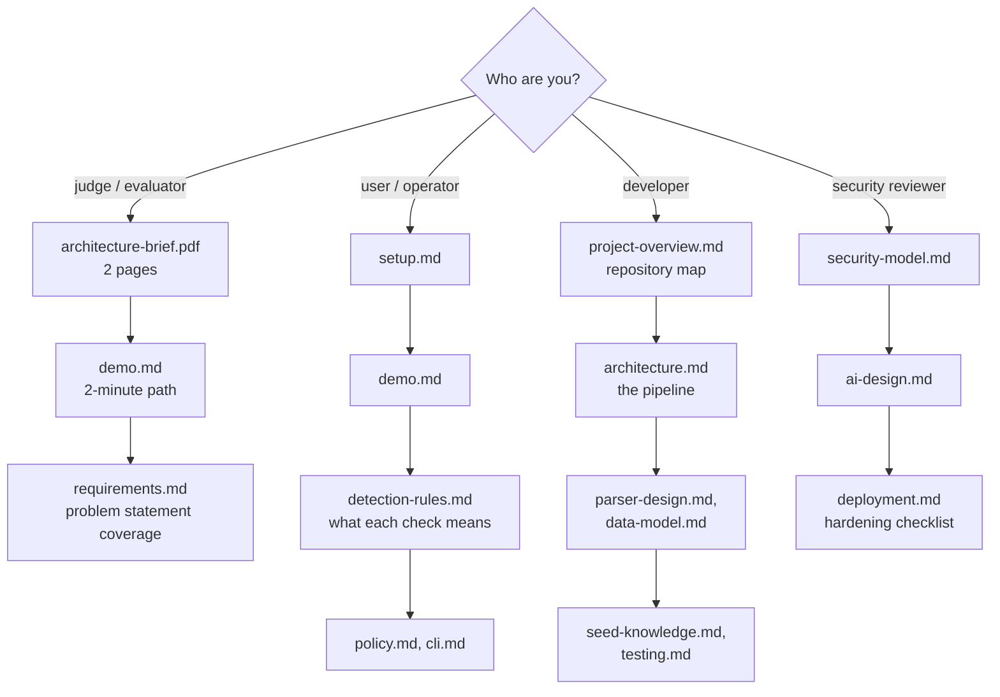

# NetAuditAI documentation

Everything about how NetAuditAI works, why it was built that way, and how to run, test, extend and deploy it. Start
with the reading path that matches why you are here.

---

## Reading paths

---

## All documents

### Understand it

| Document | Contents |
|---|---|
| [architecture-brief.pdf](architecture-brief.pdf) ([source](architecture-brief.md)) | Two-page architecture brief (evaluation deliverable). Rebuild with `python backend/scripts/build_architecture_pdf.py` |
| [project-overview.md](project-overview.md) | System context, repository map, module dependencies, frontend pages |
| [architecture.md](architecture.md) | The full pipeline: ingest, detection, generic path, facts, controls, scoring, analysis, AI, recognizers, persistence, remediation, frameworks, reporting, ledger |
| [decisions.md](decisions.md) | 16 decision records: context, decision, consequences |
| [glossary.md](glossary.md) | Every term used in the code and the UI |

### Look it up

| Document | Contents |
|---|---|
| [detection-rules.md](detection-rules.md) | The 24 checks: how each is decided, what feeds it per vendor, how it is fixed, every framework requirement (generated from the catalog) |
| [parser-design.md](parser-design.md) | Vendor detection, grammar coverage, the Cisco IOS and FortiGate parsers, the generic path |
| [data-model.md](data-model.md) | Every object and table, with class and ER diagrams, and all 23 predicates |
| [seed-knowledge.md](seed-knowledge.md) | The 396 shipped recognizers: slot types, gates, coverage matrix and per-dialect measured coverage, how to add one |
| [api.md](api.md) | Every endpoint, request and response field, and status code |
| [ai-design.md](ai-design.md) | AI judge, verifier, candidates, assistant, redaction, prompt injection, key rotation |
| [security-model.md](security-model.md) | Trust boundaries, every guarantee with the code and test that enforce it, what is not protected |

### Use it

| Document | Contents |
|---|---|
| [setup.md](setup.md) | Install, configure, first scan, troubleshooting |
| [demo.md](demo.md) | Fix-to-100 flows, the two-minute judge path, the full walkthrough |
| [cli.md](cli.md) | Command line for CI: options, exit codes, SARIF, GitHub Actions and GitLab examples |
| [policy.md](policy.md) | Organisation policy file: your own stricter baseline |
| [deployment.md](deployment.md) | Local and hosted deployment, hardening checklist, production gaps |

### Work on it

| Document | Contents |
|---|---|
| [testing.md](testing.md) | Suite shape, isolation, accuracy gates, every test file |
| [requirements.md](requirements.md) | SIH26155 requirements and non-functional targets, with evidence |
| [roadmap.md](roadmap.md) | Done, known gaps, next |

---

## Conventions used in these docs

* **Paths** are relative to the repository root unless they start with `app/`, which means `backend/app/`.
* **Decided** means a verdict from decisive evidence (`parser`, `confirmed`, `default`). **Provisional** means
  `heuristic` or `ai_verified`. See the [glossary](glossary.md).
* Numbers that come from the code (396 recognizers, 41 recipes, 80 requirements) were checked against it when these
  docs were written; [detection-rules.md](detection-rules.md) and the seed coverage matrix are generated directly from
  the code.
* Diagrams are Mermaid, rendered by GitHub.
