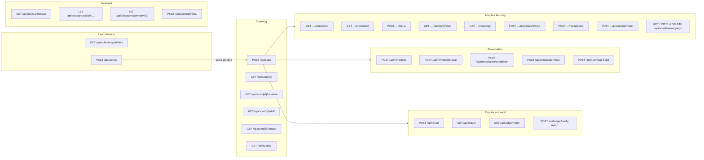
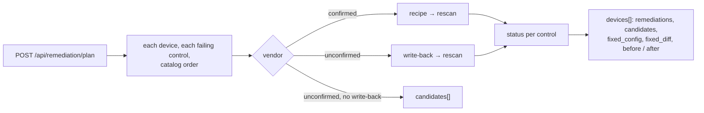

# API Documentation

The FastAPI backend exposes the endpoints below. All routes except `/health` are under `/api`. Interactive docs are available at `http://localhost:8000/docs` when the backend is running.

Request and response models are defined in `backend/app/api/schemas.py`. Every response that quotes a configuration
is redacted with that configuration's own secrets; the only exceptions are the two download routes that return the
operator's own corrected file.

## Endpoint map



A typical session: `POST /api/scan` (or `/api/collect`) → read the response → `GET …/unresolved` and teach lines →
`POST /api/remediation/plan` with operator inputs → `POST /api/download-fixed` → `POST /api/report` →
`GET /api/ledger/verify`.

### Status codes used across the API

| Code | Meaning here |
|---|---|
| `400` | empty file, not UTF-8, no files, nothing verified to download |
| `401` | `API_KEY` set and `X-API-Key` missing or wrong |
| `403` | live collection disabled |
| `404` | unknown scan, device index, control or candidate |
| `409` | the action needs something this scan does not have: a confirmed vendor (or the opposite), a decisive FAIL, a configuration still held in memory (archived scans are read-only), an unverified candidate |
| `413` | a configuration over 2 MB |
| `422` | invalid input: framework, criticality, policy, operator input, a recognizer gate, a command shape |
| `502` | every device of a collection failed |
| `503` | AI unavailable for an AI-only action |

**API key.** When `API_KEY` is set in `backend/.env`, every `/api` route needs an `X-API-Key: <key>` header and
answers `401 {"detail": "Missing or invalid API key"}` without it. `/health` stays open. Empty (default) = no key.
Allowed browser origins come from `CORS_ORIGINS` (`*` by default); `Content-Disposition` is exposed so downloads
keep their file name.

## Health

### `GET /health`
Returns a simple status payload confirming the backend is running.

## Scanning

### `POST /api/scan`
Upload one or more raw configuration files for analysis.
* **Request:** `multipart/form-data` with one or more `files` fields (UTF-8 text or JSON, max 2 MB each), optional
  asset context for the risk rating only (`criticality`: `low` | `medium` | `high` | `critical`; `internet_facing`:
  `true`), an optional organisation `policy` (the JSON text of a policy file, see [policy.md](policy.md); a policy
  that loosens a default or is not valid JSON is refused with 422), and an
  optional `framework` field (`NIST_800_53` | `CIS` | `DISA_STIG` | `ISO_27001`). Every control runs either way;
  the choice limits the framework views, the findings' compliance mapping and the PDF report to one benchmark.
  An unknown name is refused with 422.
* **Response:** `ScanResultResponse`:
  * `scan_id`, `timestamp`, `devices[]` in upload order (hostname, vendor -`unknown` unless confirmed, `os_version`
    from Cisco `version` or the FortiGate `#config-version=` header, `model` from that FortiGate header only; `unknown`
    / null when the file does not state them). For a
    configuration no parser reads, the hostname is the one a single statement states (`hostname X`, `system-name X`,
    `set … hostname X`); `unknown` when absent or conflicting. Hostnames can repeat: a device is identified by its
    position, `config_index`.
  * `framework`: the benchmark chosen at upload, `null` when every framework is reported
  * `policy`: the organisation policy the scan was checked against, `null` for the defaults
  * `vendor_identification[]`: `detected_vendor`, `status` (`confirmed` / `unverified` / `unknown`), `parse_coverage`, `uncovered_lines`, `reason`
  * `results[]`: every control for every config -`status`, `assurance`, `proposed_status` (AI verdict awaiting confirmation), `scope`, `reason`, `evidence`,
    and the evidence chain: `facts[]` (the normalized fields the answer read: `field`, `subject`, `value` redacted,
    `unit`, `assurance`, `line_numbers`) and `requirements[]` (`framework`, `version`, `requirement_id`, `title`;
    CIS only for the confirmed vendor it was written for)
  * `findings[]`: FAIL results with their `config_index` (`assurance` heuristic = suspected, not scored) and severity counts
  * Every configuration quote (evidence lines, reasons, adaptive lines and their context) is redacted with that
    configuration's own secrets, e.g. `username admin password 0 <SECRET:type0>`. Evidence keeps its line numbers.
  * `posture` (null when nothing decided), `coverage`, `posture_bounds`, `critical_unassessed`
  * `assessed_count`, `unresolved_count`: applicable controls decided from decisive evidence, and the ones left
    undecided -the resolution queue below lists exactly the latter
  * `unreadable_configs[]`: indexes of uploaded files holding no security configuration at all (prose, a README).
    They are reported as unreadable and never scored; an unfamiliar *configuration* is a different thing.
  * `frameworks[]`: the same results by framework version -`coverage`, `counts`, `requirements[]` (`status` pass / fail / partial / unknown / not_configured / n_a, `provisional`, mapped `controls[]` with status, assurance, evidence)
  * each `devices[]` entry also carries its own `posture`, `coverage` and `risk` (`score` 0-100, `level`,
    `reasons[]`, `formula`; `app/analysis/risk.py`): worst decided problem + exposure + attack paths, times asset
    criticality. Risk never changes a check result or the posture.
  * each `devices[]` entry also carries `known_cves` (`app/analysis/cve.py`), or `null`: for a platform a parser
    confirmed (Cisco IOS / IOS-XE, FortiOS) whose file states its version, the NVD CVE totals (`critical`, `high`)
    for that release `train` and the five highest-scoring (`top[]`: `id`, `score`, `severity`, `published`,
    `summary`, `url`), with `cache_date`, `source` and a `caveat`. Read from the committed
    `backend/data/cve_cache.json` (built with `backend/scripts/build_cve_cache.py`); never a network call, never
    part of any score, finding or fix.
  * `attack_paths[]`: potential attack paths per device (`app/analysis/attack_paths.py`): `config_index`,
    `path_id`, `title`, `outcome`, `severity`, `steps[]` (`title`, `how`, `controls[]` with `control_id`, `title`,
    up to 3 redacted `lines`), `break_with` (the checks of the cheapest step: fixing them all closes the path) and
    `break_step`. A path appears only when every step is a decided FAIL; heuristic and AI verdicts never open one.
  * `path_validation`: `{commit, generated}` of the recorded proof that every chain appears on its positive
    configuration and a copy with only the fix shows none of it (`backend/data/path_validation.json`, written by
    `backend/scripts/build_path_validation.py`); `null` when the record is older than the chain catalog.
  * `fleet_findings[]`: problems visible only across devices, for scans of two or more (`app/analysis/fleet_checks.py`):
    `check` (`shared-snmp-community`, `ntp-mismatch`, `syslog-mismatch`), `severity`, `title`, `why`, and `devices[]`
    (`config_index`, `lines`, `value`). Decided facts only. A shared community string is matched by hash and its
    `value` is always `null`; for mismatches `value` lists the servers each device uses.
  * `score`: **deprecated** penalty score, kept for existing scripts; do not use for compliance
* **`adaptive` block:** present when lines went through the adaptive layer. It holds:
  * `ai_calls`, `ai_cache_hits`: AI judge requests and cached answers for this config
  * `unrecognized_lines`, each with its `structural_path`
  * `ai_mappings`: source, confidence tier, status, cited `value_evidence`
  * `learned_matches`
  * `ai_called`
  * `ai_unavailable_lines`
  * `vendor_evidence`: likely vendor plus `identified` / `conflicting` / `unknown`, for information only
  * the reasons a score is provisional

### `GET /api/scan/{scan_id}`
Retrieve a scan. While the backend holds it, the response is rebuilt from memory; after a restart it is served from
the redacted **scan archive** (`scans` table) and is read-only: teaching or fixing it answers `409` and asks for the
configuration again. `404` only when neither has it.

### `GET /api/catalog`
Every check (`control_id`, `title`, `question`, `category`, `severity`, `kind`, `reads[]` normalized fields) with every
framework requirement it answers (`framework`, `version`, `requirement_id`, `title`, `vendor` for product benchmarks),
plus `requirements` (distinct requirements per framework) and `requirement_total`. The UI's **Rules catalog** page.

### `GET /api/scan/{scan_id}/baseline?config_index=0`
The **Security Baseline Model** of one configuration: the vendor-neutral fields every control reads, whatever the
vendor. A Cisco IOS file and a Junos file produce the same fields. Redacted like every response that quotes
configuration (no secret appears in a value or a line; an SNMP community's value is always `<SECRET:redacted>`).
`409` for a scan restored from history (its configuration is not kept). The results page offers it as
**Download baseline (JSON)**.

```json
{
  "schema": "netauditai.security-baseline/1",
  "device": {"hostname": "SRX-EDGE-01", "vendor": "unknown", "os_version": null, "model": null, "serial": null},
  "settings": [
    {"field": "mgmt.ssh.version", "subject": null, "scope": null, "value": 2, "unit": null,
     "assurance": "confirmed", "lines": [{"number": 6, "text": "            protocol-version v2;"}], "note": null},
    {"field": "auth.central_aaa.enabled", "subject": null, "scope": null, "value": "not_set", "unit": null,
     "assurance": "confirmed", "lines": [],
     "note": "no line states it; Juniper Junos states it as 'authentication-order [ … password ]'"}
  ],
  "not_stated": ["auth.login.max_attempts", "..."],
  "read_by": {"mgmt.ssh.version": ["MGMT-007"], "...": []}
}
```

`value` is the normalized value, `"not_set"` (read as absent) or `null` (stated but undetermined). `assurance` is
`parser` | `confirmed` | `default` | `heuristic` | `ai_verified`. `not_stated` lists the fields nothing in the file
answers; `read_by` says which checks read each field.

### `GET /api/scan/{scan_id}/drift`
Changes since the last audit. Each device of the scan is compared with the most recent earlier archived scan holding
the same hostname and vendor, from the redacted archived responses only (no configuration is stored). Devices seen
for the first time are left out, so `devices` is empty on a first scan. Per device: `previous_scan_id`,
`previous_at`, `posture` and `risk` as `[before, after]`, `fixed` (decided FAIL → decided PASS), `new_problems`
(→ decided FAIL), `no_longer_decided` (decided FAIL → undecided: the evidence went away, which is not a fix), and
`paths_closed` / `paths_opened` (attack path titles). Works for archived scans too; 404 for an unknown scan.

### `GET /api/scan/{scan_id}/status`
Whether the backend still holds a scan: `{"scan_id": "123-abc", "held": false}` (always `200`). The History page uses it
to mark entries expired after a restart.

## Audit ledger

An append-only, hash-chained record (`backend/app/ledger.py`): every archived scan state, taught recognizer,
confirmed or rejected candidate fix and generated PDF report appends `{seq, at, kind, subject, content_hash,
prev_hash, hash}`, where `content_hash` is the SHA-256 of the redacted artefact (never a secret or configuration)
and `hash` = SHA-256 of the entry including the previous hash. The report PDF prints the scan's ledger entry.

### `GET /api/ledger?limit=100`
The most recent entries, newest first: `{"entries": [...]}`.

### `GET /api/ledger/verify`
Recomputes the chain: `{"ok": true, "entries": 12, "broken_at": null, "reason": null, "head": "<hash>"}`. On
tampering `ok` is false, `broken_at` names the first bad entry and `reason` says why (`entry #n is missing`, `it
does not follow the entry before it`, `its content was changed after it was recorded`).

### `POST /api/ledger/verify-report`
`multipart/form-data` with `file`: `{"match": true, "sha256": "...", "entry": {...}, "chain": {...}}`: whether the
PDF is byte for byte a report NetAuditAI generated. Only the hash is compared; the file is not kept.
Also takes the .zip a multi-device report downloads as: `match` is true only when every PDF in it matches, and `files[]` gives each one's `name`, `sha256` and `entry` (a damaged archive matches nothing).

## Live collection

Pull running configurations off devices over SSH instead of uploading them, as the problem statement's suggested
workflow describes. Collection is only a fetch in front of `POST /api/scan`: the text it retrieves goes through the
same pipeline, with the same vendor detection, the same secret redaction and the same AI rules, so a collected device
and an uploaded file produce the same `ScanResultResponse`.

Collection is **on by default**. Netmiko is in `requirements.txt` and reads every supported platform, so this works
on a normal install; `pip install -r backend/requirements-live.txt` adds NAPALM, which `auto` prefers where it has a
driver. `LIVE_COLLECTION_ENABLED=false` closes both routes, and any internet-reachable deployment should set it: an
endpoint that opens an SSH session to whatever host it is handed is a way into the network the backend sits
in. Where it stays on, `LIVE_COLLECTION_NETWORKS` (default `private`) bounds it: the host is resolved and
refused unless it is RFC1918 or loopback, with link-local refused outright because `169.254.169.254` is the
cloud metadata endpoint. The driver is given the vetted address rather than the name, so a second DNS lookup
cannot answer differently from the one that was checked. A refused host comes back in `failures`, like any
other unreachable device.

Credentials are request-scoped. They are used to open one session and are never written to the scan store, the scan
archive or the logs; `Target.__repr__` is overridden so a traceback cannot print one either.

### `GET /api/collect/capabilities`
What this backend can collect, so the form can say so before a credential is typed. Always `200` -"collection is off
here" and "Netmiko is not installed" are answers, not errors.
* **Response:** `enabled` (the setting), `methods[]` (the drivers installed: `napalm`, `netmiko`), and `platforms[]`
  with `platform`, `label`, `command` (what will actually be run), `napalm_driver`, `methods[]` and `available`.

### `POST /api/collect`
Collect from each device, then audit what was collected.
* **Request:** `{"targets": [...], "framework": null}`. Each target takes `host`, `platform` (a key from
  `/api/collect/capabilities`), `username`, `password`, optional `port` (22), `enable`, `timeout` (30s) and `method`
  (`auto` | `napalm` | `netmiko`). `auto` prefers NAPALM where it has a driver for the platform -it asks the device
  for its configuration rather than typing a command at it -and falls back to Netmiko, which reaches more platforms.
* **Response:** `{"scan": ScanResultResponse, "collected": ["10.0.0.1"], "failures": [{"host", "error"}]}`.
* **Partial success is normal.** A device that cannot be reached is reported in `failures` and the rest are still
  scanned: one unreachable device does not deny an audit of the others. A device absent from the audit has not passed
  it, and the UI says so rather than navigating straight to the results.
* `403` when collection has been disabled, `422` for an unknown framework, and `502` only when *every* device failed,
  because then there is nothing to audit.

## Remediation

Remediation is deterministic (`backend/app/remediation/`). It runs only for a **decisive FAIL** (parser, confirmed recognizer or documented default) on a **confirmed Cisco IOS / FortiGate** configuration. It is reported `fixed` only after the generated configuration was rescanned and verified. No request field carries command text, and AI output is never used.

For a configuration whose vendor is **not** confirmed, `/api/remediation/candidate*` offers reviewed *candidate*
remediation instead: command text an administrator typed or the AI proposed, validated, simulated on a copy of the
uploaded configuration where an effect can be derived, and confirmed by a human. A candidate is never executed and
never applied to the uploaded configuration; a **verified** one can be downloaded as a corrected copy of the file
(`/api/remediation/candidate/download`).

For an unconfirmed vendor whose failing line a reviewed recognizer read, the plan also includes **seed write-back**
fixes (`app/remediation/writeback.py`): the same recognizer writes the secure value, the copy is rescanned, and a
verified write-back is reported `fixed` and included in `/api/download-fixed` like a confirmed vendor's fix.

Every remediation response (`RemediationResponse`) has:

| Field | Meaning |
|---|---|
| `status` | `fixed` · `needs_input` · `manual_review` · `verification_failed` · `no_recipe` · `vendor_unverified` · `provisional` · `not_failing` |
| `reason`, `explanation`, `warnings` | Why this status; what the recipe changes (empty for `manual_review`: nothing was generated); operational warnings |
| `scopes`, `evidence` | Failing scopes and the cited configuration lines (before state) |
| `required_inputs`, `missing_inputs` | Operator values the recipe uses / still needs |
| `diff` | The proposed deterministic change (unified diff) |
| `fixed_config` | Generated configuration (after state), for review; also returned when verification failed |
| `checks` | Rescan checks: `vendor`, `parse_coverage`, `target`, `no_regression` |
| `control_status_before` / `_after`, `before` / `after` | Control status and posture, coverage, critical-unassessed, parse coverage before and after |

`evidence`, `diff` and `fixed_config` are **redacted** (the configuration's secrets and the `ntp_key` input become
`<SECRET:…>`). Only `POST /api/download-fixed` returns the real, deployable configuration.

Inputs (all optional, validated, `422` when invalid):

| Input | Rule | Used by |
|---|---|---|
| `syslog_server` | IPv4 address | LOG-001 |
| `ntp_server` | IPv4 address | LOG-002 (added when no server exists) |
| `ntp_key_id` | 1 to 65535 | LOG-002 |
| `ntp_key` | 8 to 32 characters of `A-Z a-z 0-9 . _ + = @ % -` | LOG-002 |
| `banner_text` | the warning shown before login | MGMT-009 write-back (unconfirmed vendors) |
| `management_subnet` | IPv4 CIDR, not `/0` | MGMT-003 |



### `POST /api/remediate`
Remediate one control on one device.
* **Request JSON:** `{"scan_id": "123-abc", "rule_id": "LOG-001", "device_hostname": "CORP-RTR-01", "config_index": 0, "inputs": {"syslog_server": "10.20.0.5"}}`
* `config_index` selects the uploaded configuration (the UI always sends the finding's `config_index`); the hostname
  must match it. Without `config_index`, a hostname shared by several uploads is refused with `409`.
* **Response JSON:** `RemediationResponse`, e.g. `{"status": "fixed", "diff": "…\n+logging host 10.20.0.5\n end", "checks": [{"name": "target", "passed": true, "detail": "LOG-001 now passes: Logs are forwarded to 10.20.0.5"}, …], …}`. Without the input: `{"status": "needs_input", "missing_inputs": ["syslog_server"], "fixed_config": null, …}`. Unknown or unverified vendor: `{"status": "vendor_unverified", …}`.

### `POST /api/remediation/plan`
Remediate every failing control of every device, in catalog order, verifying each step.
* **Request JSON:** `{"scan_id": "123-abc", "inputs": {}, "device_inputs": {"0": {"ntp_key": "NtpKey-2026"}}}`
  -`inputs` apply to every device; `device_inputs` holds one device's own values by config index and overrides
  `inputs` for that device only. The UI sends only `device_inputs`, so one router's answer never fills in another's
  unless the person ticks *Use these values for every device that still needs them*.
* **Response JSON:** `RemediationPlanResponse`: `inputs` (every input spec) and `devices[]`, each with `vendor_status`, `remediations[]`, `candidates[]` (unconfirmed vendors), `fixed_controls`, the combined `checks`, `before` / `after`, `fixed_config` (every verified change; `null` when none) and `fixed_diff` (the uploaded file against `fixed_config`, both redacted, for the *Preview the corrected file* panel).
* A refused value answers `422` with `{"message": "Please check what you entered", "errors": {"NTP key": "use 8-32 letters, … e.g. NtpKey-2026"}}`, keyed by the field's label.

### `POST /api/remediation/final`
The score with the commands you confirmed: the Fix page's **Next**, offered as soon as one command is confirmed (items still undecided are simply left out). Same request as the plan. For each device it builds
one file from every verified fix plus every candidate you confirmed whose effect NetAuditAI could simulate
(a removal it verified), rescans it once and returns `before` / `after`, `included` (control ids in the file),
`by_hand` (confirmed commands it could not simulate: never written into the file), `changed` and `diff`
(redacted). A confirmed removal clears its finding but is not proven secure; the page says so.

### `POST /api/remediation/candidate/derive` (unconfirmed vendors)
The change NetAuditAI works out for itself, already verified when it returns. **Request JSON:** the candidate
shape (`scan_id`, `rule_id`, `device_hostname`, `config_index`). It takes the lines the decisive FAIL cites,
removes them from a copy, re-reads the copy with the generic engine and runs the same `target` /
`no_regression` / `generic_path` checks any candidate faces. No AI and no vendor grammar: the text is built
from the configuration's own block path and keywords.

`422` when nothing can be derived -the control requires a setting to exist (a removal cannot satisfy it, see
`DERIVABLE_KINDS`), the cited line opens a block, or the change cannot be stated safely. `409` when the vendor
is confirmed (it has recipes) or the finding is not a decisive failure. The uploaded configuration is never
edited and the scan's posture, coverage and results never move; a derived candidate still needs human
confirmation and is never applied to a device.

### `POST /api/remediation/candidate*` (unconfirmed vendors)

Six operations on one candidate. A candidate is identified by the finding it is about, so at most one candidate per
(`config_index`, `rule_id`) exists at a time and a new proposal replaces it. Candidates live in the scan's memory
only -they are never written to the database.

All six take the same body: `{"scan_id": "123-abc", "rule_id": "MGMT-001", "device_hostname": "JUNIPER-EDGE-01", "config_index": 0, "command": "delete system services telnet;", "reason": null}` (`command` is required for
`/candidate` and ignored elsewhere; `reason` is used by `/reject`).

| Route | Does |
|---|---|
| `POST /api/remediation/candidate` | Record the command an administrator typed → `draft` (`422` when the text is empty, over 2000 characters, over 20 lines, or holds control characters) |
| `POST /api/remediation/candidate/generate` | Ask the AI for one → `draft`, `source: "ai"` (`503` when AI is unavailable or its answer is not exactly the expected shape) |
| `POST /api/remediation/candidate/verify` | Simulate it on a copy and re-evaluate every control → `verified` / `rejected` / `unverified` |
| `POST /api/remediation/candidate/confirm` | An administrator accepts a `verified` or `unverified` candidate → `confirmed` (`409` from any other state: a draft must be checked first) |
| `POST /api/remediation/candidate/reject` | Discard it → `rejected`; nothing about the scan changes |
| `POST /api/remediation/candidate/download` | Download the verified corrected **copy** of the uploaded configuration (see below) |

Common refusals: `404` unknown control, unknown device, or no candidate yet; `409` the vendor **is** confirmed (use
`POST /api/remediate`); `409` the finding is not decided from validated evidence (a heuristic or AI verdict -confirm
the reading under Adaptive learning first).

Every response is a `RemediationCandidateSchema`:

| Field | Meaning |
|---|---|
| `source` | `derived` · `manual` · `ai` |
| `status` | `draft` · `verified` · `unverified` · `rejected` · `confirmed` |
| `command` | The proposed text, redacted for display. It is never executed |
| `reason` | What the state means, in full sentences |
| `explanation`, `confidence`, `assumptions` | From an AI proposal (`low` / `medium` / `high`); empty for a typed command |
| `evidence` | The failing lines the candidate has to address (redacted) |
| `control_status_before` / `_after` | The control before and on the simulated copy, e.g. `fail` → `not_configured` (absence is never a PASS) |
| `checks` | `target`, `no_regression`, `generic_path` -empty when nothing could be simulated |
| `effect` | `applied` (reviewed recognizers read every line, so the command was written into the copy) or `removal` (the cited statements were removed) |
| `diff` | The simulated change on the copy (redacted). The uploaded configuration is untouched |
| `download_available` | Whether `/candidate/download` can hand out the verified corrected copy. The copy itself is never in this JSON |
| `created_at`, `confirmed_at` | When it was proposed and, if it happened, confirmed |

A device's candidates are also returned with the plan (`devices[].candidates`), so a reload shows the same state.
**A confirmed candidate is not a fix:** the control still FAILs until the device is changed and scanned again.

#### `POST /api/remediation/candidate/download`

The verified corrected **copy** of the uploaded configuration for one candidate: the uploaded text with that
candidate's simulated change, byte-for-byte the text that was re-analysed when the candidate verified.

* **Request JSON:** the same body as the other candidate routes (`command` and `reason` are ignored).
* **Response:** `text/plain`, `Content-Disposition: attachment; filename="<hostname>_<rule_id>_verified_copy.cfg"`
  (built only from `[A-Za-z0-9._-]`), plus `X-NetAuditAI-Note: Verified corrected copy of the uploaded
  configuration; not applied to any device`. The file itself carries no added header, so it stays identical to the
  text that was verified.
* **Refusals:** `409` for any candidate that is not `verified` (or `confirmed` after verifying) -a draft, an
  unverified, a rejected or a re-checked-and-failed candidate has no copy at all; `409` when the vendor **is**
  confirmed (that path is `/api/download-fixed`); `404` unknown scan, control, device, or no candidate yet.
* One copy per candidate: candidate changes are never combined into one file.
* This is **not** a device configuration NetAuditAI generated, and nothing was applied anywhere. It is separate
  from `/api/download-fixed`, which stays confirmed-vendor only.

### `POST /api/download-fixed`
Download the configuration(s) with every verified fix applied (unverified changes are never included).
* **Request JSON:** `{"scan_id": "123-abc", "inputs": {}, "device_inputs": {}, "include_confirmed": false}` -
  `include_confirmed: true` downloads exactly the file `/api/remediation/final` scored (after **Next**).
* **Response:** one `.cfg` (text/plain) or a `.zip` of `<hostname>_fixed.cfg`. `409` when no configuration has a confirmed vendor; `400` when nothing was verified.
* Confirmed vendors only, unchanged: an unconfirmed vendor's verified candidate copy is never included here, and is
  downloaded from `/api/remediation/candidate/download` instead.
* The UI sends exactly the inputs the displayed plan was generated with, and disables the download while the input
  fields differ from them, so a downloaded file always matches a reviewed plan.

## Reporting

### `POST /api/report`
`variant`: `full` (default, the technical report) or `executive` (one page: risk and why, score, attack paths, the first three things to do). Every generated PDF is recorded in the audit ledger.
The compliance report as PDF. **Request JSON:** `{"scan_id": "123-abc", "config_index": 0, "inputs": {}}` -
`config_index` omitted reports every device of the scan. One device returns `application/pdf`
(`<hostname>_compliance_report.pdf`); several return a `.zip` with one PDF per device. `404` for an unknown
scan or device index.

It opens with **At a glance** for a reader who stops there: the risk, the score and the score with the verified automatic fixes applied, the three most serious problems with why each matters, and how many need a person. The report restates the scan; it never re-evaluates anything. Its six sections are device identification,
assessment summary (posture, coverage, assessed / undecided counts), compliance findings with the assurance
behind each result and the lines it cites, the framework view, remediation (the deterministic change per
failing control, or why there is none), and the checks needing administrator input. Serial numbers and
hardware inventory are **not** reported: a configuration file does not state them. Every quoted line is
redacted by the same layer that redacts the API, and `tests/test_pdf_report.py` re-checks the rendered PDF
against the secrets of the configuration it was built from.

## Assistant (AI)

### `GET /api/assistant/status`
Report whether AI features are configured and where they run: `{"ai_available": true, "provider": "groq"}`. `provider` is `"local"` when `LOCAL_AI_URL` points at a local model (offline), `"groq"`, or `null` without AI. **Known issue:** this returns `true` whenever a key is set, even if the Groq quota is exhausted.

### `GET /api/assistant/explain/{scan_id}/{rule_id}/{hostname}`
Explain a specific finding (the finding drawer's *Explain this*). The prompt is built from the redacted
configuration. `ai_generated: false` means the model gave nothing back (no key, quota used up) and `explanation`
is the stored recommendation.

### `GET /api/assistant/summary/{scan_id}`
Summarize the scan results. Falls back to static text without AI.

### `POST /api/assistant/chat`
Ask a question about a scan.
* **Request JSON:** `{"scan_id": "123", "message": "What does rule MGMT-001 mean?", "history": [{"role": "you", "content": "…"}, {"role": "assistant", "content": "…"}]}`
  -`history` is optional; only the last 8 turns, each cut to 600 characters, are sent to the model.
* **Response JSON:** `{"response": "...", "scan_id": "123"}`

## Adaptive Training

These endpoints back the Adaptive learning pages (Teach and Learned). They are protected only by the optional shared `API_KEY`. A stored recognizer carries `source`: `seed` for knowledge shipped in `backend/data/seed_recognizers.json`, `runtime` for what this deployment was taught ([seed-knowledge.md](seed-knowledge.md)). A mapping or recognizer whose text holds a secret (password, key, community string) is refused with `422`; rejected lines are stored redacted.

### `GET /api/adaptive/scans/{scan_id}/provisional`
Undecided or provisional control results of unknown-vendor configs, with the heuristic lines and verified AI proposal lines an administrator can confirm.

### `GET /api/adaptive/scans/{scan_id}/unresolved`
The resolution queue: every applicable control the scan could not decide, i.e. exactly what coverage left out.
**Response:** `assessed_count`, `unresolved_count` and `items[]` with `control_id`, `title`, `question`, `severity`,
`status` (`unknown` / `not_configured`), `reason`, the `evidence` it did cite, the `needs` predicates,
`suggested_lines[]` (lines of this configuration that mention the setting, with a heuristic's reading where there is
one) and `action`: `teach`, or `blocked` with a `blocked_reason` (a confirmed parser reads this config, or no
recognizer can express the setting). Listing a control never changes it -it stays undecided until confirmed
evidence decides it.

### `POST /api/adaptive/scans/{scan_id}/ask-ai`
*Ask AI to find the line* on the Teach page. **Request JSON:** `{"config_index": 0, "control_id": "MGMT-008"}`.
Runs the scan's AI judge for this one undecided check (redacted, scrubbed excerpts only; one call). A suggestion is
kept only when the deterministic verifier finds its quote on the cited line; kept suggestions then appear in
`/unresolved` `suggested_lines`, and a person still confirms them. **Response:** `{"found": true}` only when the
answer names a line the teach page can show for confirmation; otherwise `{"found": false, "note": "…"}`, including
when the AI answered without such a line (for example, judging the setting absent). `503` without an AI key, `409` for a check that is already decided, `422` for a
configuration a parser reads.

### `GET /api/adaptive/scans/{scan_id}/configs/{config_index}/lines`
The uploaded configuration, redacted for display, so a person can point at any line: `lines[]` with `line_number`,
`text` and `teachable` (a tokenizer statement a recognizer could come from). Read-only -nothing in this API
writes the uploaded configuration back.

### `GET /api/adaptive/scans/{scan_id}/meanings?control_id=…&line_number=…&config_index=0`
What an administrator may say one line means for one control: `options[]` of `{predicate, subject, value}`. A
true/false setting offers both polarities; a value setting (a version, a timeout, an address) offers only "this line
states it" -the value is read from the line, never from the person.

### `POST /api/adaptive/scans/{scan_id}/recognizers/draft`
Draft a recognizer from a provisional line. **Request JSON:** `{"config_index": 0, "control_id": "MGMT-001", "line_number": 71, "command_pattern": null, "scope_template": null, "value": null, "any_dialect": false, "negatives": []}`. **Response:** the draft, gate `errors` and the `replay` of results it would change on scans held by the backend.

To resolve a control from a line no heuristic read, add the administrator's answer: `"predicate"`, `"asserted_value"`
and `"subject"` (one of the options above). It is a proposal like any other -`validate_recognizer` still has to find
that meaning on the line itself, so a line that does not state the value cannot teach it (`422`).

### `POST /api/adaptive/scans/{scan_id}/recognizers`
Save the recognizer (same body) to the knowledge store and return the re-evaluated scan. `422` when a gate fails, `409` on a conflicting recognizer.

### `POST /api/adaptive/scans/{scan_id}/provisional/reject`
Record a provisional line as reviewed-but-unmapped: heuristics and AI ignore it on later scans. **Request JSON:** `{"config_index": 0, "control_id": "MGMT-001", "line_number": 71, "reason": null}`.

The review-queue endpoints below serve the legacy line interpreter (`ADAPTIVE_AI_FOR_KNOWN_VENDORS`, off by default).

### `GET /api/adaptive/fields`
Normalized fields an interpretation may map to. Each entry has `field`, `value_type`, `label`, `description` and `value_rule`. The list comes from `backend/app/models/field_catalog.py`.

### `GET /api/adaptive/scans/{scan_id}/review?include_resolved=false`
Review queue for a scan: MEDIUM/LOW/contradicted and AI-unavailable interpretations. Each item includes its `structural_path`.

### `POST /api/adaptive/scans/{scan_id}/review/{item_id}/accept`
Accept the AI's interpretation and save it as a learned mapping.
* **Request JSON (optional fields):** `{"concept": "...", "command_pattern": "..."}`

### `POST /api/adaptive/scans/{scan_id}/review/{item_id}/edit`
Save a corrected mapping.
* **Request JSON:** `{"normalized_field": "services.ssh_enabled", "extracted_value": "true", "concept": null, "command_pattern": null}`

### `POST /api/adaptive/scans/{scan_id}/review/{item_id}/reject`
Reject an interpretation. The line is not sent to the AI again.
* **Request JSON (optional):** `{"reason": "..."}`

Accept, edit and reject all return `ReviewActionResponse`:
* the updated `item`
* the saved `mapping` (if any)
* `auto_resolved`: other pending lines resolved by the new mapping
* the re-analyzed `scan`

### `GET /api/adaptive/mappings?include_inactive=false`
List learned mappings.

### `PATCH /api/adaptive/mappings/{mapping_id}`
Edit a learned mapping. Any of these may be supplied:
`concept`, `normalized_field`, `vendor`, `command_pattern`, `extraction_method`, `constant_value`, `active`.
Returns `404` if the mapping is not found, `409` on a conflict with another mapping, and `422` if the mapping is invalid.

### `DELETE /api/adaptive/mappings/{mapping_id}`
Deactivate a learned mapping. It is kept for audit but no longer matched.
