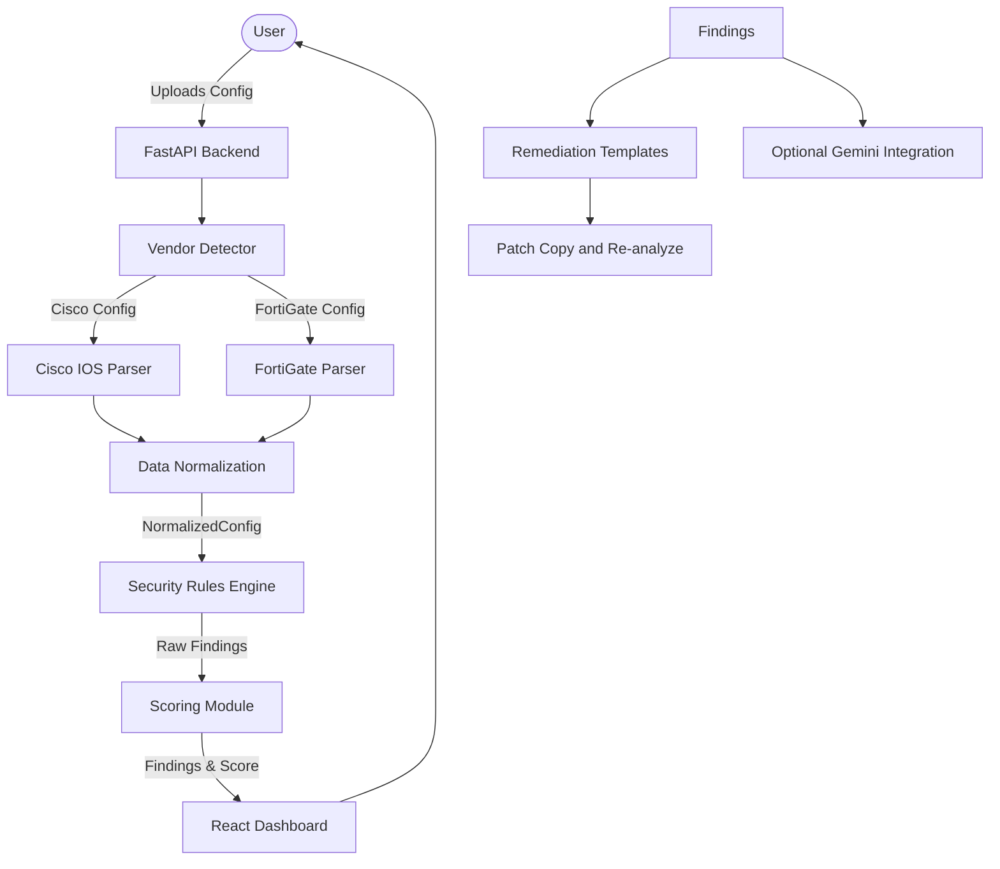

# System Architecture

The main idea of NetAuditAI is to keep vendor-specific parsing separate from security analysis. This lets us support different configuration formats while reusing the same security rules.

## The Pipeline

1. **Upload**: User uploads a config file.
2. **Detect**: The system identifies the vendor (e.g., Cisco IOS, FortiGate) automatically using our detector.
3. **Parse**: Extract raw config lines into meaningful structures.
4. **Normalize**: **(The most important step)** We map vendor-specific concepts into a generic `NormalizedConfig` model.
5. **Analyze**: Our deterministic rules engine runs against the *normalized* model, not the raw configs.
6. **Score**: We calculate a security score based on the findings.
7. **Remediation**: Select a deterministic vendor-specific command template for a finding.
8. **Optional AI layer**: Pass finding context to Gemini for explanations, summaries, and chat.

## Why this approach?

By separating parsing from analysis, we don't have to write rules for every single vendor. We write the parser once for each vendor to map to our normalized model, and then write the rules *once* to check the normalized data.

## Simple Architecture Diagram

*(Status: The main pipeline, parsers, rules, scoring, remediation templates, verification flow, frontend, and optional AI integration are implemented. Persistence and broader vendor support are still planned.)*
