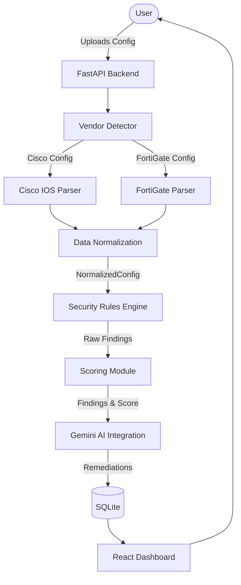

# System Architecture

Hey guys, here is a quick overview of how our project works. The core idea is to decouple vendor-specific config parsing from the actual security analysis. 

## The Pipeline

1. **Upload**: User uploads a config file.
2. **Detect**: The system identifies the vendor (e.g., Cisco IOS, FortiGate) automatically using our detector.
3. **Parse**: Extract raw config lines into meaningful structures.
4. **Normalize**: **(The most important step)** We map vendor-specific concepts into a generic `NormalizedConfig` model.
5. **Analyze**: Our deterministic rules engine runs against the *normalized* model, not the raw configs.
6. **Score**: We calculate a security score based on the findings.
7. **AI Layer (Planned)**: Pass the findings to Gemini to generate remediation steps and explanations.

## Why this approach?

By separating parsing from analysis, we don't have to write rules for every single vendor. We write the parser once for each vendor to map to our normalized model, and then write the rules *once* to check the normalized data.

## Simple Architecture Diagram

*(Status: Pipeline exists conceptually. Data models and detector are implemented. Parsers are WIP. Rules engine and AI are planned.)*
