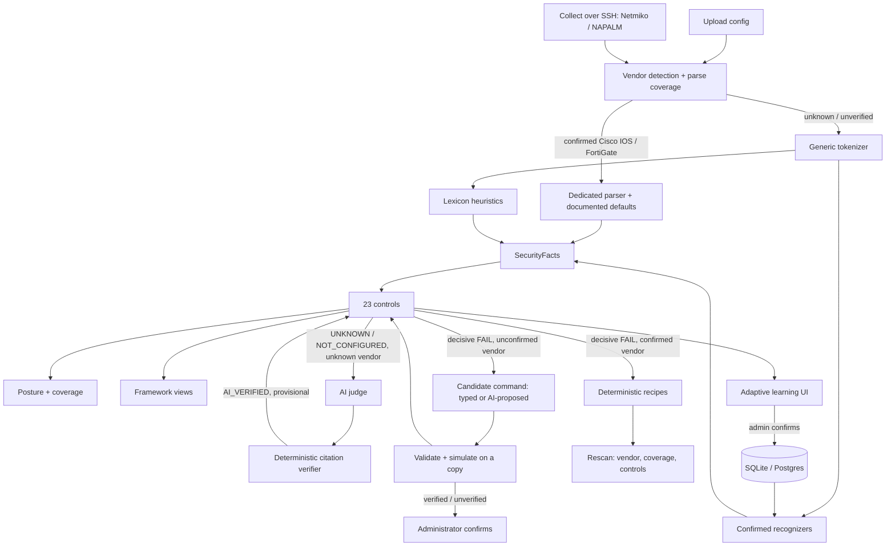

# System Architecture

NetAuditAI answers security questions about configurations and only understands what those questions need.
**Controls** (security questions) are evaluated and reported; **security facts** (scoped, cited, assurance-tagged
statements) are what gets extracted, confirmed and learned. Vendor parsers are the most trusted source of facts.
AI is an optional, budgeted escalation step whose output stays a proposal until a human confirms it.

## 1. Pipeline

```text
Raw Configuration  (an uploaded file, or collected from a live device over SSH)
      ↓
Ingest (UTF-8, ≤ 2 MB, in memory) + redaction before any AI call
      ↓
Vendor Detection + Parse Coverage
      ↓
Parser (confirmed vendor)  OR  Generic Tokenizer (unknown / unverified vendor)
      ↓
SecurityFacts
      ↓
Control Evaluation (every control, every configuration)
      ↓
Posture + Coverage
      ↓
UNKNOWN / NOT_CONFIGURED controls
      ↓
AI Escalation where eligible (unknown / unverified vendors, budgeted, cached)
      ↓
Deterministic Validation of every citation
      ↓
Provisional AI Proposal (never scored)
      ↓
Human Confirmation
      ↓
Confirmed Recognizer (SQLite or Postgres)
      ↓
Future Scan Reuse (decisive, no AI)
      ↓
Deterministic Remediation (confirmed vendors, decisive FAILs)
      ↓
Re-parse + Re-verify

   -or, for an unconfirmed vendor -

Candidate Remediation (command text: administrator-typed, or AI-proposed)
      ↓
Deterministic Validation + Simulation on a COPY of the configuration
      ↓
Re-read with the generic engine + Re-evaluate every control
      ↓
Human Confirmation (still never executed on a device)
```


```mermaid
flowchart TD
    Upload[Upload config] --> Detect[Vendor detection + parse coverage]
    Collect[Collect over SSH: Netmiko / NAPALM] --> Detect
    Detect -->|confirmed Cisco IOS / FortiGate| Parser[Dedicated parser + documented defaults]
    Detect -->|unknown / unverified| Tokenizer[Generic tokenizer]
    Tokenizer --> Recognizers[Confirmed recognizers]
    Tokenizer --> Heuristics[Lexicon heuristics]
    Parser --> Facts[SecurityFacts]
    Recognizers --> Facts
    Heuristics --> Facts
    Facts --> Controls[23 controls]
    Controls --> Score[Posture + coverage]
    Controls --> Frameworks[Framework views]
    Controls -->|UNKNOWN / NOT_CONFIGURED, unknown vendor| Judge[AI judge]
    Judge --> Verify[Deterministic citation verifier]
    Verify -->|AI_VERIFIED, provisional| Controls
    Controls --> Review[Adaptive learning UI]
    Review -->|admin confirms| DB[(SQLite / Postgres)]
    DB --> Recognizers
    Controls -->|decisive FAIL, confirmed vendor| Remediation[Deterministic recipes]
    Remediation --> Rescan[Rescan: vendor, coverage, controls]
    Controls -->|decisive FAIL, unconfirmed vendor| Candidate[Candidate command: typed or AI-proposed]
    Candidate --> Simulate[Validate + simulate on a copy]
    Simulate --> Controls
    Simulate -->|verified / unverified| Confirm[Administrator confirms]
```

### 1.1 Where a configuration comes from

Two sources, one pipeline. A configuration is either uploaded as a file, or pulled off a live device over SSH
(`app.collect`, `POST /api/collect`) as the problem statement's suggested workflow describes. Collection is only
the fetch step: it hands `scan.run_scan` the same text an upload would have carried, and nothing downstream is
told -or needs to be told -which it was. A collected configuration is therefore never treated as more trusted
than an uploaded one, and never as less redacted.

Netmiko ships in `requirements.txt` and has a driver and a command for every platform in the table, so
collection works on a normal install. NAPALM is the optional upgrade (`requirements-live.txt`): `auto` prefers
it where it has a driver, because `get_config` asks the device for its configuration rather than typing a
command at it, and falls back to Netmiko otherwise. Neither is imported until a collection runs, so a backend
missing one still starts, serves and scans, and reports what it cannot do. The platform list is deliberately
wider than the three parsers: a Junos or MikroTik device is worth collecting even though its verdicts come from
recognizers and heuristics.

Collection is **on by default**: it is a deliverable the suggested workflow asks for, and an operator auditing
their own network should not have to export configurations by hand. Two bounds make that defensible.
`LIVE_COLLECTION_ENABLED=false` closes it entirely, which any internet-reachable deployment should set. And
`LIVE_COLLECTION_NETWORKS` (default `private`) stops the endpoint being a server-side request forgery: a host
that arrives in a request is resolved and refused unless it is RFC1918 or loopback, with link-local refused by
name -`is_private` is true for `169.254.169.254`, the cloud metadata endpoint, so the obvious check is the wrong
one. The driver is then handed the vetted address rather than the name, because checking a name and passing that
name on leaves the driver to resolve it a second time, and a short-TTL record under the caller's control can
answer differently each time. Credentials are request-scoped: used to open one session, never written to the
scan store, the archive or the logs, and `Target.__repr__` is overridden because a dataclass repr is the
likeliest way for a password to reach a traceback. A device that cannot be reached is reported per host and the
rest are still scanned -one unreachable device does not deny an audit of the others, and the UI says which were
missed rather than letting an absent device look like a pass.

## 2. Vendor detection and parser support

`app/parsers/detector.py` fingerprints the text, runs the matching parser and checks **grammar coverage**
(`app/parsers/coverage.py`):

* FortiOS: balanced `config/edit/next/end` statement grammar plus a FortiGate-only section (`config firewall` /
  `config vpn`), so FortiSwitchOS is not taken for a FortiGate.
* Cisco IOS / IOS-XE: known command roots with argument checks where look-alikes differ (interface names, `line`
  ranges, `username`, `enable`, `service`, `vrf`, `router`, ACLs), validated `interface` / `line` children and
  banner bodies.

A vendor is **confirmed** only when the grammar matches. It is **unverified** when the product profile does not
match, when 5 or more consecutive top-level statements are foreign (a pasted foreign block), or when coverage is
below `vendor_parse_coverage_threshold` (0.7) with at least 3 foreign lines. Unverified configurations take the
generic path with `device.vendor = unknown`.

Dedicated parsers exist for **Cisco IOS / IOS-XE** and **Fortinet FortiGate** only. A confirmed vendor selects:
its parser, its documented defaults (`app/facts/defaults.py`: FortiOS `admintimeout`, `admin-ssh-v1`,
`pre-login-banner`, `ip-src-routing`, and "no SNMP community" for both), its remediation recipes and its CIS
benchmark mappings.

Device identification reads only what the file states: the Cisco `version` line gives the OS version; a leading
FortiOS `#config-version=<model>-<version>-FW-<build>` export header gives the model and firmware, citing that line.
Neither is guessed when absent, and serial numbers and chassis details never are.

**Palo Alto, Juniper, Arista and every other vendor have no parser.** They are analyzed by the generic path and
shown in the UI as "Generic / adaptive analysis". An AI vendor guess is reported as *vendor evidence* only.

## 3. Generic tokenizer (unknown vendors)

`app/structure/tokenizer.py` turns every line into a `Statement(line, text, scope_path, key_tokens, values,
polarity)`:

* scope from indentation, braces, `config`/`edit`/`next`/`end`, `/section` headers and flat prefix blocks;
* statement terminators (`;`) are punctuation, in configuration lines and in recognizer templates alike;
* `set` dropped, `key=value` split, IPs, numbers (with units) and quoted strings as values;
* polarity from `no` / `unset` / `delete` / `undo`, `enable(d)` / `disable(d)` / `on` / `off` / `yes` / `no`,
  switches such as `disabled=yes`;
* descriptions, remarks, comments and banner bodies never yield keywords.

`app/facts/heuristics.py` reads statements with the synonym lexicon (`app/facts/lexicon.py`, whole tokens only) and
produces HEURISTIC facts only with a predicate keyword, a typed value and a resolved polarity. Disagreeing
candidates become one undetermined fact citing all of them (UNKNOWN). Three readings use structure rather than
the single line, and none of them lets an absent line state anything:

* **presence as polarity** -a bare statement whose single keyword is a management protocol, inside a block that
  already identifies it as a service (`services { telnet; }`), states that the protocol is on. A block switched
  off wins over it; a negation of the same feature contradicts it, so the fact is undetermined (UNKNOWN).
* **version values** -a version fact reads `v2` / `ver2` / `version2` as 2. Elsewhere a token with a letter is
  still not a number.
* **rule composition** -when a rule states its selectors and its action in separate statements
  (`source-address any; … permit;`), the rule is the action's own block or its parent: the first block wide
  enough to state both wildcards, never one holding a second action, and never one holding a narrowing selector
  (a protocol, port or application). A selector that names a wildcard itself (`application any`) widens the rule
  rather than narrowing it. Evidence cites every line of the rule.

## 4. SecurityFacts

`app/facts/predicates.py` defines 16 predicates, each consumed by a control (for example
`mgmt.remote_access.protocol_enabled` with subject `telnet`, `log.remote.destination`, `crypto.ipsec.proposal`).
A `SecurityFact` has predicate, subject, scope, value, unit, assurance, cited evidence lines and provenance.

* value `None` -present but undetermined (provenance says why);
* `NOT_SET` -a confirmed parser read the whole configuration and the setting is absent (the control decides what
  absence means). On the generic path `NOT_SET` comes only from **learned absence**
  (`app/facts/recognizers.py`, `_dialect` / `_absence`), for the five settings no device ships with: an AAA server,
  a remote syslog server, a login banner, an NTP server and NTP authentication. It needs all of:
  * the configuration is **understood**: one dialect's learned knowledge (the vendor label of the seeds that
    matched, clear winner, plus taught recognizers whose fingerprint matches) answered at least 3 settings in it;
  * that dialect **knows how it writes** the missing setting (a seed or taught recognizer for it);
  * **nothing** states it: no fact of any assurance, and no line even names the concept in the lexicon's words
    (`server-profile tacplus …` in an untaught variant keeps absence silent).
  The fact is `confirmed`, cites no line, and its FAIL reason says how the dialect would write it
  ("Palo Alto PAN-OS states it as 'set deviceconfig system syslog-server …'"). Every other absence on the generic
  path stays `NOT_CONFIGURED`: no vendor code, and a syntax nobody taught is never read as a missing setting.

Sources and assurance:

| Source | Assurance | Decisive |
|---|---|---|
| Confirmed vendor parser (`from_normalized.py`) | `parser` | yes |
| Recognizer (shipped seed or administrator-confirmed) or learned mapping | `confirmed` | yes |
| Documented default of a confirmed vendor | `default` | yes |
| Lexicon heuristic | `heuristic` | no |
| AI judge proposal that passed verification | `ai_verified` | no |

## 5. Controls and ControlResult

`app/controls/catalog.py` declares 23 controls (MGMT-001…011, AUTH-001…003, BOUNDARY-001…004, LOG-001…003, CRYPTO-001…002) with
question, kind (prohibition, requirement, threshold, relational), severity, needed predicates and versioned
framework mappings. `app/controls/judges.py` says what one fact means for one control; the generic evaluator
(`app/controls/evaluate.py`) combines them. No vendor decides whether a control runs.

| Status | Meaning |
|---|---|
| `PASS` | A decisive-or-provisional fact says the setting is secure, with a cited line (or a documented default) |
| `FAIL` | A fact says the setting is insecure; one FAIL per failing scope (interface, VTY range, policy …) |
| `UNKNOWN` | Something relevant exists but could not be decided (conflict, missing unit, parser does not read it, relational control with no facts, an AI proposal awaiting confirmation) |
| `NOT_CONFIGURED` | Nothing relevant was found. Never scored, never a PASS |
| `N_A` | Proven not to apply: the control asks about an optional feature (`Control.optional_feature`) and a confirmed vendor's parser, which reads that feature, found none of it. CRYPTO-001 on a device with no VPN. Left out of coverage, never scored, never listed as needing administrator input |

Combination per control: any FAIL → FAIL per failing scope; else UNKNOWN; else PASS (needs a cited line unless
DEFAULT); else N_A for an optional feature a confirmed parser found none of, UNKNOWN for relational controls,
otherwise NOT_CONFIGURED. An unconfirmed vendor never gets N_A: absence cannot be proven without a parser. A
confirmed vendor whose parser does not read a needed predicate reports UNKNOWN. A PASS / FAIL whose weakest
evidence is `ai_verified` is reported as UNKNOWN with `proposed_status`. An AI fact is bound to the control
that asked (`SecurityFact.control_id`), so it never answers another control. Findings are the view of decisive
and heuristic FAIL results (`app/controls/views.py`); heuristic findings are labelled "Suspected".

## 6. Posture, coverage and critical controls not assessed

`app/analysis/scoring.py`, weights critical 10 / high 6 / medium 3 / low 1, one outcome per (device, control)
(several failing scopes count once at the worst severity):

```text
posture  = Σw(decisive PASS) / Σw(decisive PASS + decisive FAIL) × 100     ("-" when nothing decided)
coverage = Σw(decisive PASS + FAIL) / Σw(applicable)                       (applicable = everything but N/A)
bounds   = posture if every undecided control failed … if every undecided control passed
critical_unassessed = critical controls not decided decisively
```

Heuristic and AI verdicts, UNKNOWN and NOT_CONFIGURED are undecided. A configuration with nothing decided shows
posture "-" and coverage 0, never 100. The legacy `score` (100 − penalties) is still returned, deprecated, and not
used by the UI, remediation or framework views.

## 7. AI: role and boundaries

Details: [ai-design.md](ai-design.md). The AI judge (`app/ai/judge.py`) runs only for unknown / unverified vendors
and only for controls that are UNKNOWN (then NOT_CONFIGURED, as evidence discovery), only when a cited or related
line exists, most severe first, up to 4 controls per call and `ai_judge_max_calls_per_scan` (2) calls per scan.

* The whole configuration is redacted, and every excerpt and prompt is scrubbed of every known secret.
* The excerpt is the tokenizer scope of the relevant lines, never the whole configuration.
* A deterministic verifier checks every proposal: the control asked, the predicate is needed, line references
  exist, quoted evidence is on a cited line, all cited lines share one scope, and the cited line itself states the
  value (the lexicon reads it the same way, or an unfamiliar line names related vocabulary and writes the value,
  polarity or unit). Anything else is discarded.
* Verified proposals are `ai_verified`: shown as "AI proposes PASS/FAIL, awaiting confirmation", never counted in
  posture, coverage, findings, severity counts, framework status or remediation.
* AI never infers PASS from absence (absence cannot be cited), never selects a vendor, never writes remediation
  and never saves a recognizer.
* Cache: `ai_judge_cache`, key = hash(prompt version + model + system prompt + redacted prompt). Only
  answers with at least one verified proposal are stored; a cached answer is verified again, and one that no longer
  verifies is asked again and replaced.

If AI is unavailable, over budget or fails, controls keep their deterministic and heuristic results and the scan
completes.

## 8. Human-in-the-loop: recognizers

A fresh deployment does not start blank. `backend/data/seed_recognizers.json` ships 161 reviewed recognizers for
eleven dialects that have no dedicated parser (Junos, PAN-OS, Arista EOS, Huawei VRP, RouterOS, Aruba AOS-CX,
Check Point Gaia, Extreme EXOS, Cisco NX-OS, ASA, IOS-XR) and AWS security groups -one generalized entry per concept per dialect, never one
per line;
`app/facts/seed.py` loads them into the knowledge store the first time a process opens the database. They pass the same gates
listed below, are decisive in the same way, and are marked `source = "seed"` so shipped knowledge and what this
deployment was taught stay distinguishable. Loading is idempotent and never overwrites or revives a row an
administrator changed or stopped. This is shipped knowledge, not training: nothing is inferred or written back.
See [seed-knowledge.md](seed-knowledge.md).

Everything below is how an administrator adds to it.

An UNKNOWN or NOT_CONFIGURED control is not the end of the assessment: it is the reason to ask. The **resolution
queue** (`GET /api/adaptive/scans/{id}/unresolved`) lists every applicable control coverage left out, built from the
same `control_outcomes` the posture is counted from, so what the queue calls unresolved is exactly what coverage
excluded. Each item carries why the engine could not decide, the evidence it did cite, the lines of this
configuration that mention the setting -and, when nothing does, the administrator picks any line of the file
(`…/configs/{i}/lines`, read-only) and states what it means (`…/meanings`). The answer becomes an asserted
candidate and goes through the drafting and gates below unchanged; a line that does not state the value cannot
teach it. Saving re-evaluates the same configuration: the control decides from CONFIRMED evidence, posture and
coverage are recalculated by the unchanged scoring engine, and the queue shrinks -or the control stays undecided
and nothing is counted. The uploaded configuration is only ever read, and no file is uploaded again.

1. The scan lists provisional results (heuristic lines and verified AI proposals) and the resolution queue on the
   **Teach** page.
2. The administrator confirms a line, or states what a line means; the backend drafts a recognizer: a typed-slot template
   (`{int}`, `{host}`, `{ip}`, `{duration[:unit]}`, `{enum:name}`, `{polarity}`, `{neg}`, `{any}`; never raw
   regex), predicate, subject, optional scope template, dialect fingerprint and value table. The draft
   generalizes what varies and keeps what identifies: addresses, hostnames, numbers, durations and the
   facilities, ids and instance names that qualify a value go into slots, while keywords and polarity stay
   literal. A *leading* negator becomes `{neg}`, so one recognizer reads `telnet server` and `no telnet
   server` as opposites instead of needing two.
3. Gates (`app/facts/recognizers.validate_recognizer`, `app/db/mappings.validate_mapping`): at least two keywords
   besides stopwords **counting the scope template** -a hierarchical dialect keeps the nouns in the block header,
   so `server {host}` scoped to `ntp` is specific enough while `server {host}` unscoped is not, and a scope can
   never carry a recognizer whose own template has no keyword; the scope is the block the statement is *in*,
   never an outer ancestor, so an NTP `server` recognizer does not answer `ntp { traceoptions { server … } }`;
   a line carrying a value can only teach a boolean listed in `PRESENCE_PREDICATES` -a source restriction
   and central AAA are stated by naming an address, every other boolean is a toggle a value says nothing
   about; a line that states no on/off of its own, and any line read through a value slot, must also name
   the setting it is taught as (`CONCEPT_WORDS`), so `uid 2001` cannot teach anything, while a line that
   does state an on/off may be named in any words, because that is what teaching an unfamiliar dialect is;
   all of it in the gate, not only in the draft; stated polarity or a true/false table -or, for a scoped
   bare statement, presence, which can only ever mean "on"; a unit for durations; the template must match its
   example line; no identical active recognizer (pattern **and** scope, so `server {ip}` under `ntp` and under
   `syslog` are different recognizers); dialect overlap unless "any dialect"; and **no secret** in any stored text.
   A drafted recognizer is produced against these same gates: the only field a draft can leave for the
   administrator is a duration unit the configuration itself never states.
4. Replay shows which results the recognizer would change on the scans held by the backend.
5. Save writes it to `learned_mappings` (confirmed, active). The scan is re-evaluated.
6. Every later scan -including after a backend restart, in a new process -loads active confirmed recognizers from
   the database. A matching line yields a `confirmed` (decisive) fact; heuristics and AI facts step aside for that
   line; conflicting recognizers give UNKNOWN citing both. The AI is not asked about recognized lines. A heuristic
   elsewhere that merely repeats a recognizer's answer (the same predicate, subject and value) also steps aside:
   citing it too would report a decided control as provisional, since a verdict takes the weakest assurance it
   cites. A heuristic that contradicts one still speaks, so a recognizer never hides a line that disagrees.

Rejecting a line records it (redacted) so heuristics and AI ignore it on later scans. Nothing is learned without an
administrator; AI output never becomes a recognizer by itself.

## 9. Persistence

| Store | Contents | Survives restart | Secrets |
|---|---|---|---|
| `learned_mappings` | Recognizers (shipped `seed` and taught `runtime`) and learned field mappings | Yes | Refused at save |
| `rejected_lines` | Rejected lines (redacted text, key from the redacted line) | Yes | Redacted |
| `ai_judge_cache` | Verified AI answers keyed by a hash of the redacted prompt | Yes | Prompts were redacted |
| `scans` | Each scan's redacted response and remediation plans, as the browser saw them | Yes | Redacted; the configuration itself is never stored |
| Backend memory (`_scan_store`) | Parsed configurations of scans being worked on (teach, fix) | No | -|
| Browser `localStorage` | History summaries (hostnames, vendors, posture, coverage, counts) | Browser only | None stored |

The tables live in SQLite at `ADAPTIVE_DB_PATH` (default `backend/data/adaptive.db`), or in Postgres when
`DATABASE_URL` is set (e.g. Supabase, for a host whose disk is wiped on restart). `app/db/database.py` writes the
SQL once for both (`ON CONFLICT`, `RETURNING`); Postgres connections are pooled and reads are cached per process,
cleared on every write. Migrations are tracked with `PRAGMA user_version` on SQLite and a `schema_version` table on
Postgres. Tests always use SQLite. Uploaded files are never written to disk. After a restart an archived scan reopens read-only -results, frameworks, remediation plan, PDF- and teaching or fixing it asks for the configuration again (409), because the configuration holds secrets and is not kept (`tests/test_scan_archive.py`). `tests/test_phase9_frameworks_persistence.py`
saves a recognizer in one Python process and proves a second process reuses it;
`tests/test_seed_knowledge.py` proves the same for shipped seed knowledge alongside it.

## 10. Remediation

`app/remediation/recipes.py` holds 28 deterministic recipes keyed by (control, vendor) for Cisco IOS and FortiGate;
`app/remediation/engine.py` runs and verifies them.

* Runs only for a **decisive FAIL** on a **confirmed** vendor. Heuristic / AI verdicts → `provisional`; unknown or
  unverified vendors → `vendor_unverified`.
* Parameters come from the parser model and the FAIL citations (VTY ranges, interfaces, proposals); edits are local:
  replace a setting in place with its indentation, or add it as the last child of its block; comments,
  `config/edit/next/end` nesting and unrelated lines are kept.
* Operator values (syslog / NTP server, NTP key, management subnet) are validated inputs, never placeholders.
  Missing → `needs_input`. No known-safe change (weak stored passwords, AAA without a strong local account,
  any-to-any rules) → `manual_review`. No recipe → `no_recipe`.
* The generated configuration is rescanned like an upload. **Fixed** only if the vendor is still confirmed, parse
  coverage did not drop, the control PASSes decisively on every scope and no other control regressed; otherwise
  `verification_failed`, with the output kept for review. Before / after posture and coverage come from scoring v2.
* Idempotent: a fixed configuration has no decisive FAIL, so running again changes nothing.

### Seed write-back (unconfirmed vendors)

`app/remediation/writeback.py`. A confirmed recognizer states how a dialect writes a setting and what each
slot value means, so the recognizer that **read** a failing line can **write** its secure form: the same
reviewed template with only the slot changed (`disable-telnet no` → `yes` from the value table,
`protocol-version v1` → `v2`, `idle-timeout 0` → `10`, `telnet yes` → `no`). Nobody supplies command text,
human or AI.

* Runs only for a decisive FAIL whose cited line a recognizer read. The same recognizer must re-read the new
  line as secure before it is kept.
* A setting stated by naming a thing (`permitted-ip 0.0.0.0/0`) keeps its line and takes the operator's
  `management_subnet` in place of the wildcard; missing → `needs_input`.
* The corrected copy is rescanned like an unknown-vendor upload. **Fixed** only if the control is now a
  **decisive PASS** (not `NOT_CONFIGURED`), no other control regressed and the copy is still read generically.
  Fixes then behave exactly like a confirmed vendor's: the plan lists them as `fixed`, and `/download-fixed`
  returns one corrected file.
* **A missing setting is added** when its FAIL was read from absence (no cited line): the understood dialect's own
  reviewed, unscoped template with one value, filled from a validated input -`syslog_server` (LOG-001) or
  `banner_text` (MGMT-009, quoted) -and appended only if its first word opens a top-level line of this file
  (`set …` in a set-style file, never at the end of a brace-structured one). The same recognizer reads it back and
  the rescan verifies it like any rewrite. AAA (a shared secret) and NTP (needs authentication too) are never added.
* Not written: a secure form that needs more than the slot (NTP authentication also needs a key the recognizer
  does not describe), a `{neg}` toggle (the negator is `no`, `delete` or `undo` depending on the dialect), and
  anything read only by heuristics (SNMP, any-any rules, IPsec). Those keep the candidate path below.
* **A command someone else wrote** (typed, or drafted by the AI) is held to the same standard. If a reviewed
  recognizer for a setting the control consumes reads **every line** of it, on its own and outside any block,
  it is applied to a copy (a line with the same identity -the line without its value -is replaced, otherwise
  added) and must make the control a decisive PASS (`effect: "applied"`). Once an administrator confirms it,
  it joins the corrected configuration. A command in the wrong syntax, or with any line the engine cannot
  read, is never applied this way; a negation (`no …`, `delete …`) goes to the removal check below, which
  proves only that the finding is gone (`effect: "removal"`) and never joins the corrected configuration.
* Ceiling: a recognizer reads one setting per line, so a fix that also needs lines no recognizer reads (the
  NTP key beside `authentication-type symmetric-key`) cannot be applied complete. The part the recognizers
  read verifies; the rest is the administrator's to add.

### Candidate remediation (unconfirmed vendors)

`app/remediation/candidates.py`. An unconfirmed vendor has no recipe and no trusted grammar, so the command text
comes from outside the engine -typed by the administrator, or proposed by the AI
(`app/ai/remediation.py`). It is a **candidate**, never a fix, and the engine stays vendor-neutral: the
configuration and the proposed text are read with the same generic tokenizer for every dialect.

* Eligibility: a **decisive** FAIL (recognizer, parser or documented default) on an **unconfirmed** vendor. A
  heuristic or AI verdict gets no candidate -confirm the reading under Adaptive learning first. A confirmed vendor is
  refused (`409`): it keeps the deterministic path.
* Validation: shape and size (≤ 2000 characters, ≤ 20 lines, no control characters), then *coverage* -a statement
  of the command must negate (`delete` / `no` / `unset` / `undo` / a `disable` keyword) the failing statement and
  name every word of its block path, and every statement of the command must be about one of the cited lines.
* Simulation: the only effect derivable from unfamiliar text is a negation, so the cited statements are removed from
  an **in-memory copy**. The copy is re-read by the generic engine (tokenizer, confirmed recognizers, learned
  mappings, heuristics, no AI) and every control is re-evaluated. The uploaded configuration is never modified.
* Outcome: `verified` when the targeted control no longer FAILs, no other control got worse and the copy is still
  read by generic analysis; `rejected` when the simulation does not hold; `unverified` when no effect could be
  derived (prose, a command about something else, or one that also does something uncheckable); then `confirmed`
  once an administrator accepts it. Absence is still NOT_CONFIGURED, never PASS, so a verified candidate typically
  reads `FAIL → NOT_CONFIGURED`.
* The verified copy is retained: a `verified` candidate keeps the edited copy it was verified against
  (`Candidate.verified_config`), so an administrator can download it from
  `POST /api/remediation/candidate/download` -a *verified corrected copy of the uploaded configuration*, one per
  candidate, never combined. Every other status clears it, so a draft, an unverified, a rejected or a
  re-checked-and-failed candidate has nothing to hand out. Confirming a candidate that only ever reached
  `unverified` still gives no file.
* A candidate changes nothing else: not the stored configuration, the control results, findings, posture or
  coverage, and not the confirmed-vendor `/download-fixed` output. It lives in the scan's memory for that scan only
  and is never persisted as knowledge -
  recognizers answer "what does this line mean?", which is a different question from "what command changes it".

Two different things produce a file, and they are kept apart:

| | Confirmed vendor | Unconfirmed vendor |
|---|---|---|
| Change comes from | A fixed recipe in `recipes.py` | The change NetAuditAI derives from the configuration itself, or command text a person typed / the AI proposed |
| Verified by | Full rescan as the confirmed vendor | Simulation on a copy, re-read by the generic engine |
| Download | `POST /api/download-fixed` -the corrected configuration | `POST /api/remediation/candidate/download` -a *verified corrected copy of the uploaded configuration* |
| Claim | This change is deterministic for this vendor | This text removes the finding from **this file**; it is not known to be correct or safe for the device |

**Derived candidates.** `candidates.derive` is what makes the unconfirmed path self-serving: it takes the lines a
decisive FAIL cites, removes them from a copy and runs the same verification, so a configuration in a dialect nobody
taught still gets a change NetAuditAI worked out itself. The text is built from the configuration's own words -its
block path, then the statement's keywords -so no vendor grammar is claimed and none is needed; what is verified is
the effect on the *file*, and whether the wording is also the device's CLI syntax is the administrator's call.

Two limits keep it honest. It only derives for controls a removal can resolve (`DERIVABLE_KINDS`: prohibitions and
relational controls). A control that requires a setting, or holds one to a threshold, is refused -deleting an idle
timeout would make the check stop failing while leaving the device worse, so that change stays with the person who
owns the command. And a block opener is never removed on its own, whatever the dialect, since removing it would
orphan its contents.

Neither is ever applied to a device. NetAuditAI performs detection → candidate remediation → verification against
the configuration file → human confirmation. It does **not** execute commands on physical devices, and a verified
candidate never claims it is safe to run on one.

## 11. Framework views

`app/controls/frameworks.py` regroups the scan's control results by framework requirement -nothing is evaluated
again. Mappings are the catalog's, with exact versions:

* **NIST SP 800-53 Rev. 5** (OSCAL release 5.2.0) -every control, every vendor.
* **CIS Benchmarks** -Cisco IOS XE 17.x v2.2.1 (L1/L2) and v2.1.0 (L1), FortiGate 7.4.x v1.0.1 (L1/L2); only items
  verified for that benchmark version, attached only to devices of that confirmed vendor.
* **DISA STIG** -Network Device Management SRG V4, vendor-agnostic; only requirements a control actually answers.
* **ISO/IEC 27001:2022 Annex A** -every control, every vendor. Annex A controls are organisational: a device
  result is evidence towards one, never proof the Annex A control is met.

A requirement is FAIL if any mapped control FAILs decisively, PASS only if every applicable mapped control PASSes
decisively, PARTIAL if some pass and the rest are undecided, NOT_CONFIGURED if every mapped control is, otherwise
UNKNOWN. Provisional verdicts mark a requirement `provisional` and never make it PASS or FAIL. Coverage is the share
of applicable requirements decided. PCI DSS and CIS Controls v8 are **not mapped**: no mapping was verified.

## 12. Reporting

`app/reporting/report.py` builds the per-device compliance report, and `POST /api/report` returns it as PDF (one
device → a PDF, several → a zip of one PDF per device). It is built in two steps: `report_blocks` produces a plain
document model -headings, paragraphs, tables, monospace blocks -and `render_pdf` lays that out with ReportLab.
The tests read the model, so what the report says is asserted without parsing PDF streams.

Its input is the same redacted `ScanResultResponse` the browser gets plus the remediation plan, so the report and
the application can never disagree, and the redaction that protects the API protects the report with it. Nothing is
evaluated, scored or remediated in this layer.

Two rules follow the rest of the product:

* it reports only what the uploaded file states. A serial number, hardware model or OS version is printed when
  the text states it (`show version` / `show inventory` output, PAN-OS `show system info`, an XML export -read by
  `stated_identity`), and the report says it is not stated otherwise, never inventing one;
* provisional readings are labelled provisional and never presented as compliance, and no vendor command appears
  for a vendor that was not confirmed.

## 13. Legacy and deprecated parts

* `score` / `calculate_score` -deprecated penalty score, still returned for existing scripts.
* `adaptive_ai_for_known_vendors` (default off) -the line-by-line interpreter, `FIELD_REGISTRY` AI vocabulary and
  the line review queue for confirmed vendors; its interpretations only reach the review queue.
* `generate_remediation` / `apply_remediation` -compatibility shims over the Phase 8 engine (command text passed in
  is ignored).
* `NormalizedConfig` -the parsers' internal model; controls read facts, not this model.

See the README for current limitations.
