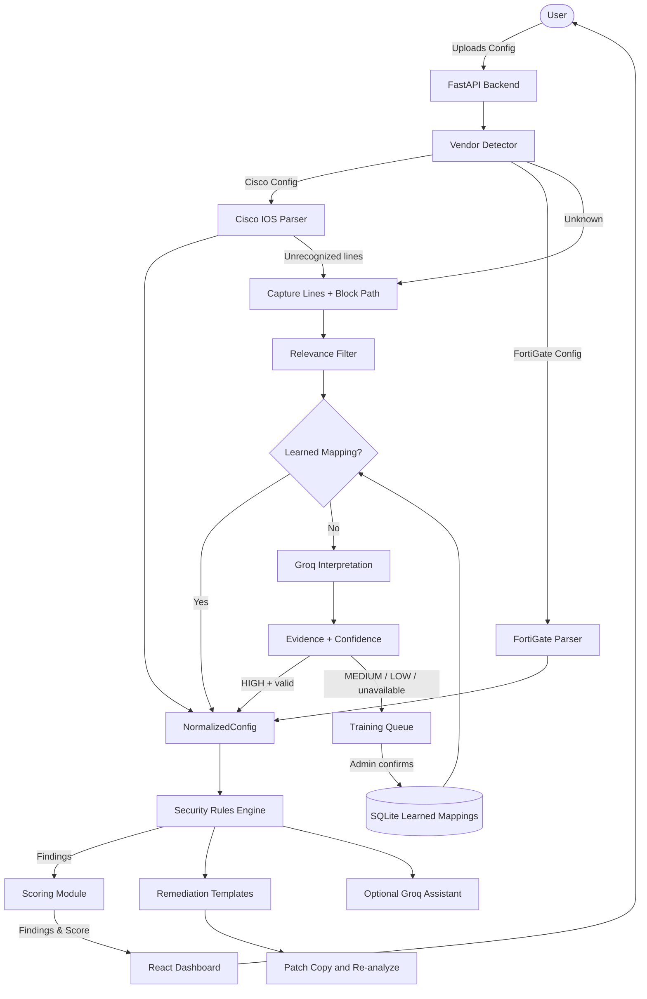

# System Architecture

The main idea of NetAuditAI is to keep vendor-specific parsing separate from security analysis. This lets us support different configuration formats while reusing the same security rules.

## The Pipeline

1. **Upload**: User uploads a config file.
2. **Detect**: The detector identifies the vendor (Cisco IOS, FortiGate) from deterministic patterns, or returns `unknown`.
3. **Parse**: The vendor parser extracts config lines into structures. Lines it does not understand are captured.
4. **Normalize**: **(The most important step)** Vendor-specific concepts are mapped into the generic `NormalizedConfig` model.
5. **Adapt**: Captured lines and unknown-vendor configs go through the adaptive layer:
   * relevance filter
   * confirmed learned mappings
   * AI interpretation into a fixed field vocabulary
   * evidence validation and confidence tiers

   Uncertain results wait in the Training queue.
6. **Analyze**: The deterministic rules engine runs against the *normalized* model, not the raw configs.
7. **Score**: A security score is calculated from the findings. Scores that depend on adaptively normalized values are flagged provisional.
8. **Remediation**: A deterministic vendor-specific command template is selected for a finding.
9. **Optional AI assistant**: Finding context can be sent to Groq for explanations, summaries and chat.

## Why this approach?

By separating parsing from analysis, we don't have to write rules for every single vendor. Each parser (or the adaptive layer) maps to the normalized model, and the rules are written *once* against the normalized data.

The adaptive layer lets configs from vendors without a parser still be analyzed. It learns only from administrator-confirmed mappings stored in SQLite, never by retraining a model. The AI never sets `device.vendor` and never enables vendor-specific rules. See [ai-design.md](ai-design.md).

## Architecture Diagram

```mermaid
flowchart TD
    User([User]) --> |Uploads Config| API[FastAPI Backend]
    API --> Detector[Vendor Detector]
    Detector --> |Cisco Config| CiscoParser[Cisco IOS Parser]
    Detector --> |FortiGate Config| FortiParser[FortiGate Parser]
    Detector --> |Unknown| Capture[Capture Lines + Block Path]

    CiscoParser --> Normalizer[NormalizedConfig]
    FortiParser --> Normalizer
    CiscoParser --> |Unrecognized lines| Capture

    Capture --> Relevance[Relevance Filter]
    Relevance --> Learned{Learned Mapping?}
    Learned --> |Yes| Normalizer
    Learned --> |No| AI[Groq Interpretation]
    AI --> Validate[Evidence + Confidence]
    Validate --> |HIGH + valid| Normalizer
    Validate --> |MEDIUM / LOW / unavailable| Training[Training Queue]
    Training --> |Admin confirms| DB[(SQLite Learned Mappings)]
    DB --> Learned

    Normalizer --> RulesEngine[Security Rules Engine]
    RulesEngine --> |Findings| Scorer[Scoring Module]
    Scorer --> |Findings & Score| Frontend[React Dashboard]
    RulesEngine --> Templates[Remediation Templates]
    Templates --> Verify[Patch Copy and Re-analyze]
    RulesEngine --> Assistant[Optional Groq Assistant]
    Frontend --> User
```

*(Status: the main pipeline, parsers, adaptive layer, rules, scoring, remediation templates, verification flow, Training tab and optional AI integration are implemented. Scan results are still kept in memory. Only learned mappings are persisted.)*
