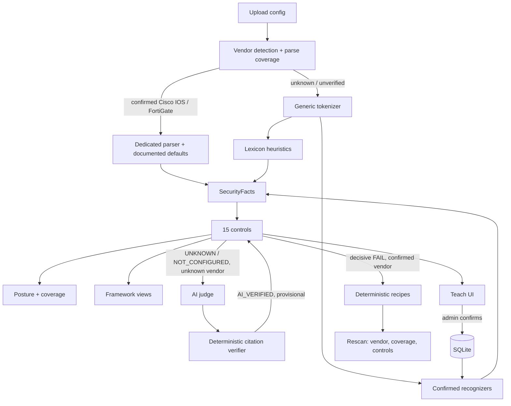

# System Architecture

NetAuditAI answers security questions about configurations and only understands what those questions need.
**Controls** (security questions) are evaluated and reported; **security facts** (scoped, cited, assurance-tagged
statements) are what gets extracted, confirmed and learned. Vendor parsers are the most trusted source of facts.
AI is an optional, budgeted escalation step whose output stays a proposal until a human confirms it.

## 1. Pipeline

```text
Raw Configuration
      ↓
Ingest (UTF-8, ≤ 2 MB, in memory) + redaction before any AI call
      ↓
Vendor Detection + Parse Coverage
      ↓
Parser (confirmed vendor)  OR  Generic Tokenizer (unknown / unverified vendor)
      ↓
SecurityFacts
      ↓
Control Evaluation (every control, every configuration)
      ↓
Posture + Coverage
      ↓
UNKNOWN / NOT_CONFIGURED controls
      ↓
AI Escalation where eligible (unknown / unverified vendors, budgeted, cached)
      ↓
Deterministic Validation of every citation
      ↓
Provisional AI Proposal (never scored)
      ↓
Human Confirmation
      ↓
Confirmed Recognizer (SQLite)
      ↓
Future Scan Reuse (decisive, no AI)
      ↓
Deterministic Remediation (confirmed vendors, decisive FAILs)
      ↓
Re-parse + Re-verify
```


```mermaid
flowchart TD
    Upload[Upload config] --> Detect[Vendor detection + parse coverage]
    Detect -->|confirmed Cisco IOS / FortiGate| Parser[Dedicated parser + documented defaults]
    Detect -->|unknown / unverified| Tokenizer[Generic tokenizer]
    Tokenizer --> Recognizers[Confirmed recognizers]
    Tokenizer --> Heuristics[Lexicon heuristics]
    Parser --> Facts[SecurityFacts]
    Recognizers --> Facts
    Heuristics --> Facts
    Facts --> Controls[15 controls]
    Controls --> Score[Posture + coverage]
    Controls --> Frameworks[Framework views]
    Controls -->|UNKNOWN / NOT_CONFIGURED, unknown vendor| Judge[AI judge]
    Judge --> Verify[Deterministic citation verifier]
    Verify -->|AI_VERIFIED, provisional| Controls
    Controls --> Review[Teach UI]
    Review -->|admin confirms| DB[(SQLite)]
    DB --> Recognizers
    Controls -->|decisive FAIL, confirmed vendor| Remediation[Deterministic recipes]
    Remediation --> Rescan[Rescan: vendor, coverage, controls]
```

## 2. Vendor detection and parser support

`app/parsers/detector.py` fingerprints the text, runs the matching parser and checks **grammar coverage**
(`app/parsers/coverage.py`):

* FortiOS: balanced `config/edit/next/end` statement grammar plus a FortiGate-only section (`config firewall` /
  `config vpn`), so FortiSwitchOS is not taken for a FortiGate.
* Cisco IOS / IOS-XE: known command roots with argument checks where look-alikes differ (interface names, `line`
  ranges, `username`, `enable`, `service`, `vrf`, `router`, ACLs), validated `interface` / `line` children and
  banner bodies.

A vendor is **confirmed** only when the grammar matches. It is **unverified** when the product profile does not
match, when 5 or more consecutive top-level statements are foreign (a pasted foreign block), or when coverage is
below `vendor_parse_coverage_threshold` (0.7) with at least 3 foreign lines. Unverified configurations take the
generic path with `device.vendor = unknown`.

Dedicated parsers exist for **Cisco IOS / IOS-XE** and **Fortinet FortiGate** only. A confirmed vendor selects:
its parser, its documented defaults (`app/facts/defaults.py`: FortiOS `admintimeout`, `admin-ssh-v1`,
`pre-login-banner`, `ip-src-routing`, and "no SNMP community" for both), its remediation recipes and its CIS
benchmark mappings.

**Palo Alto, Juniper, Arista and every other vendor have no parser.** They are analyzed by the generic path and
shown in the UI as "Generic / adaptive analysis". An AI vendor guess is reported as *vendor evidence* only.

## 3. Generic tokenizer (unknown vendors)

`app/structure/tokenizer.py` turns every line into a `Statement(line, text, scope_path, key_tokens, values,
polarity)`:

* scope from indentation, braces, `config`/`edit`/`next`/`end`, `/section` headers and flat prefix blocks;
* `set` dropped, `key=value` split, IPs, numbers (with units) and quoted strings as values;
* polarity from `no` / `unset` / `delete` / `undo`, `enable(d)` / `disable(d)` / `on` / `off` / `yes` / `no`,
  switches such as `disabled=yes`;
* descriptions, remarks, comments and banner bodies never yield keywords.

`app/facts/heuristics.py` reads statements with the synonym lexicon (`app/facts/lexicon.py`, whole tokens only) and
produces HEURISTIC facts only with a predicate keyword, a typed value and a resolved polarity. Disagreeing
candidates become one undetermined fact citing all of them (UNKNOWN).

## 4. SecurityFacts

`app/facts/predicates.py` defines 16 predicates, each consumed by a control (for example
`mgmt.remote_access.protocol_enabled` with subject `telnet`, `log.remote.destination`, `crypto.ipsec.proposal`).
A `SecurityFact` has predicate, subject, scope, value, unit, assurance, cited evidence lines and provenance.

* value `None` — present but undetermined (provenance says why);
* `NOT_SET` — a confirmed parser read the whole configuration and the setting is absent (the control decides what
  absence means). Unknown vendors never produce `NOT_SET`: absence is never evidence there.

Sources and assurance:

| Source | Assurance | Decisive |
|---|---|---|
| Confirmed vendor parser (`from_normalized.py`) | `parser` | yes |
| Administrator-confirmed recognizer or learned mapping | `confirmed` | yes |
| Documented default of a confirmed vendor | `default` | yes |
| Lexicon heuristic | `heuristic` | no |
| AI judge proposal that passed verification | `ai_verified` | no |

## 5. Controls and ControlResult

`app/controls/catalog.py` declares 15 controls (MGMT-001…009, BOUNDARY-001…003, LOG-001…002, CRYPTO-001) with
question, kind (prohibition, requirement, threshold, relational), severity, needed predicates and versioned
framework mappings. `app/controls/judges.py` says what one fact means for one control; the generic evaluator
(`app/controls/evaluate.py`) combines them. No vendor decides whether a control runs.

| Status | Meaning |
|---|---|
| `PASS` | A decisive-or-provisional fact says the setting is secure, with a cited line (or a documented default) |
| `FAIL` | A fact says the setting is insecure; one FAIL per failing scope (interface, VTY range, policy …) |
| `UNKNOWN` | Something relevant exists but could not be decided (conflict, missing unit, parser does not read it, relational control with no facts, an AI proposal awaiting confirmation) |
| `NOT_CONFIGURED` | Nothing relevant was found. Never scored, never a PASS |
| `N_A` | Proven not to apply (not emitted by any current control) |

Combination per control: any FAIL → FAIL per failing scope; else UNKNOWN; else PASS (needs a cited line unless
DEFAULT); else NOT_CONFIGURED (UNKNOWN for relational controls). A confirmed vendor whose parser does not read a
needed predicate reports UNKNOWN. A PASS / FAIL whose weakest evidence is `ai_verified` is reported as UNKNOWN
with `proposed_status`. An AI fact is bound to the control that asked (`SecurityFact.control_id`), so it never
answers another control. Findings are the view of decisive and heuristic FAIL results
(`app/controls/views.py`); heuristic findings are labelled "Suspected".

## 6. Posture, coverage and critical controls not assessed

`app/analysis/scoring.py`, weights critical 10 / high 6 / medium 3 / low 1, one outcome per (device, control)
(several failing scopes count once at the worst severity):

```text
posture  = Σw(decisive PASS) / Σw(decisive PASS + decisive FAIL) × 100     ("—" when nothing decided)
coverage = Σw(decisive PASS + FAIL) / Σw(applicable)                       (applicable = everything but N/A)
bounds   = posture if every undecided control failed … if every undecided control passed
critical_unassessed = critical controls not decided decisively
```

Heuristic and AI verdicts, UNKNOWN and NOT_CONFIGURED are undecided. A configuration with nothing decided shows
posture "—" and coverage 0, never 100. The legacy `score` (100 − penalties) is still returned, deprecated, and not
used by the UI, remediation or framework views.

## 7. AI: role and boundaries

Details: [ai-design.md](ai-design.md). The AI judge (`app/ai/judge.py`) runs only for unknown / unverified vendors
and only for controls that are UNKNOWN (then NOT_CONFIGURED, as evidence discovery), only when a cited or related
line exists, most severe first, up to 4 controls per call and `ai_judge_max_calls_per_scan` (2) calls per scan.

* The whole configuration is redacted, and every excerpt and prompt is scrubbed of every known secret.
* The excerpt is the tokenizer scope of the relevant lines, never the whole configuration.
* A deterministic verifier checks every proposal: the control asked, the predicate is needed, line references
  exist, quoted evidence is on a cited line, all cited lines share one scope, and the cited line itself states the
  value (the lexicon reads it the same way, or an unfamiliar line names related vocabulary and writes the value,
  polarity or unit). Anything else is discarded.
* Verified proposals are `ai_verified`: shown as "AI proposes PASS/FAIL, awaiting confirmation", never counted in
  posture, coverage, findings, severity counts, framework status or remediation.
* AI never infers PASS from absence (absence cannot be cited), never selects a vendor, never writes remediation
  and never saves a recognizer.
* Cache: SQLite `ai_judge_cache`, key = hash(prompt version + model + system prompt + redacted prompt). Only
  answers with at least one verified proposal are stored; a cached answer is verified again, and one that no longer
  verifies is asked again and replaced.

If AI is unavailable, over budget or fails, controls keep their deterministic and heuristic results and the scan
completes.

## 8. Human-in-the-loop: recognizers

1. The scan lists provisional results (heuristic lines and verified AI proposals) on the **Teach** page.
2. The administrator confirms a line; the backend drafts a recognizer: a typed-slot template
   (`{int}`, `{ip}`, `{duration[:unit]}`, `{enum:name}`, `{polarity}`, `{any}`; never raw regex), predicate,
   subject, optional scope template, dialect fingerprint and value table.
3. Gates (`app/facts/recognizers.validate_recognizer`, `app/db/mappings.validate_mapping`): at least two keywords
   besides stopwords, stated polarity or a true/false table, a unit for durations, the template must match its
   example line, no identical active recognizer, dialect overlap unless "any dialect", and **no secret** in any
   stored text.
4. Replay shows which results the recognizer would change on the scans held by the backend.
5. Save writes it to SQLite `learned_mappings` (confirmed, active). The scan is re-evaluated.
6. Every later scan — including after a backend restart, in a new process — loads active confirmed recognizers from
   the database. A matching line yields a `confirmed` (decisive) fact; heuristics and AI facts step aside for that
   line; conflicting recognizers give UNKNOWN citing both. The AI is not asked about recognized lines.

Rejecting a line records it (redacted) so heuristics and AI ignore it on later scans. Nothing is learned without an
administrator; AI output never becomes a recognizer by itself.

## 9. Persistence

| Store | Contents | Survives restart | Secrets |
|---|---|---|---|
| SQLite `learned_mappings` | Recognizers and learned field mappings | Yes | Refused at save |
| SQLite `rejected_lines` | Rejected lines (redacted text, key from the redacted line) | Yes | Redacted |
| SQLite `ai_judge_cache` | Verified AI answers keyed by a hash of the redacted prompt | Yes | Prompts were redacted |
| Backend memory (`_scan_store`) | Scan results, parsed configurations | No | — |
| Browser `localStorage` | History summaries (hostnames, vendors, posture, coverage, counts) | Browser only | None stored |

The database path is `ADAPTIVE_DB_PATH` (default `backend/data/adaptive.db`); migrations are tracked with
`PRAGMA user_version`. Uploaded files are never written to disk. `tests/test_phase9_frameworks_persistence.py`
saves a recognizer in one Python process and proves a second process reuses it.

## 10. Remediation

`app/remediation/recipes.py` holds 28 deterministic recipes keyed by (control, vendor) for Cisco IOS and FortiGate;
`app/remediation/engine.py` runs and verifies them.

* Runs only for a **decisive FAIL** on a **confirmed** vendor. Heuristic / AI verdicts → `provisional`; unknown or
  unverified vendors → `vendor_unverified`.
* Parameters come from the parser model and the FAIL citations (VTY ranges, interfaces, proposals); edits are local:
  replace a setting in place with its indentation, or add it as the last child of its block; comments,
  `config/edit/next/end` nesting and unrelated lines are kept.
* Operator values (syslog / NTP server, NTP key, management subnet) are validated inputs, never placeholders.
  Missing → `needs_input`. No known-safe change (weak stored passwords, AAA without a strong local account,
  any-to-any rules) → `manual_review`. No recipe → `no_recipe`.
* The generated configuration is rescanned like an upload. **Fixed** only if the vendor is still confirmed, parse
  coverage did not drop, the control PASSes decisively on every scope and no other control regressed; otherwise
  `verification_failed`, with the output kept for review. Before / after posture and coverage come from scoring v2.
* Idempotent: a fixed configuration has no decisive FAIL, so running again changes nothing.

## 11. Framework views

`app/controls/frameworks.py` regroups the scan's control results by framework requirement — nothing is evaluated
again. Mappings are the catalog's, with exact versions:

* **NIST SP 800-53 Rev. 5** (OSCAL release 5.2.0) — every control, every vendor.
* **CIS Benchmarks** — Cisco IOS XE 17.x v2.2.1 (L1/L2) and v2.1.0 (L1), FortiGate 7.4.x v1.0.1 (L1/L2); only items
  verified for that benchmark version, attached only to devices of that confirmed vendor.

A requirement is FAIL if any mapped control FAILs decisively, PASS only if every applicable mapped control PASSes
decisively, PARTIAL if some pass and the rest are undecided, NOT_CONFIGURED if every mapped control is, otherwise
UNKNOWN. Provisional verdicts mark a requirement `provisional` and never make it PASS or FAIL. Coverage is the share
of applicable requirements decided. ISO/IEC 27001, DISA SRGs and CIS Controls v8 are **not mapped**: no mapping was
verified.

## 12. Legacy and deprecated parts

* `score` / `calculate_score` — deprecated penalty score, still returned for existing scripts.
* `adaptive_ai_for_known_vendors` (default off) — the line-by-line interpreter, `FIELD_REGISTRY` AI vocabulary and
  the line review queue for confirmed vendors; its interpretations only reach the review queue.
* `generate_remediation` / `apply_remediation` — compatibility shims over the Phase 8 engine (command text passed in
  is ignored).
* `NormalizedConfig` — the parsers' internal model; controls read facts, not this model.

See the README for current limitations and [plan.md](../plan.md) for the phase-by-phase record.
