# System Architecture

NetAuditAI answers security questions about network configurations and only understands what those questions
need. Four ideas carry the whole design:

1. **Controls** (23 security questions) are what gets evaluated and reported.
2. **Security facts** (scoped, cited, assurance-tagged statements) are what gets extracted, confirmed and learned.
3. **Assurance** decides what may be counted: only `parser`, `confirmed` and `default` evidence moves a score.
4. **AI is an optional escalation** whose output stays a proposal until a person confirms it.

This document walks the pipeline stage by stage, from bytes to verdict to verified fix. Every section names the
module that implements it, so each claim can be checked against the code.

**Related:** [parser-design.md](parser-design.md) (detection and parsers in depth) ·
[detection-rules.md](detection-rules.md) (every control) · [data-model.md](data-model.md) (objects and tables) ·
[ai-design.md](ai-design.md) · [security-model.md](security-model.md) · [seed-knowledge.md](seed-knowledge.md)

---

## Contents

1. [Pipeline at a glance](#1-pipeline-at-a-glance)
2. [Ingest: where a configuration comes from](#2-ingest-where-a-configuration-comes-from)
3. [Vendor detection and parser support](#3-vendor-detection-and-parser-support)
4. [Generic path: tokenizer, flattening, heuristics](#4-generic-path-tokenizer-flattening-heuristics)
5. [SecurityFacts and assurance](#5-securityfacts-and-assurance)
6. [Controls and ControlResult](#6-controls-and-controlresult)
7. [Posture, coverage and critical controls not assessed](#7-posture-coverage-and-critical-controls-not-assessed)
8. [Analysis on top of results](#8-analysis-on-top-of-results)
9. [AI: role and boundaries](#9-ai-role-and-boundaries)
10. [Human in the loop: recognizers](#10-human-in-the-loop-recognizers)
11. [Persistence](#11-persistence)
12. [Remediation](#12-remediation)
13. [Framework views](#13-framework-views)
14. [Reporting and the audit ledger](#14-reporting-and-the-audit-ledger)
15. [Legacy and deprecated parts](#15-legacy-and-deprecated-parts)

---

## 1. Pipeline at a glance

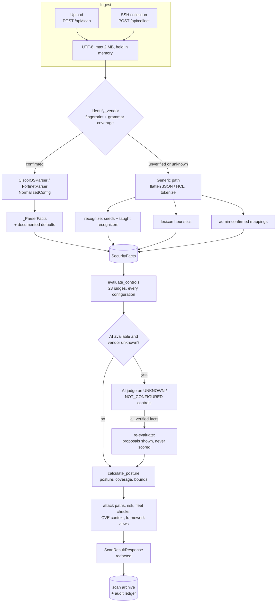
```mermaid
flowchart TD
    subgraph INGEST["Ingest"]
        UP["Upload<br/>POST /api/scan"]
        SSH["SSH collection<br/>POST /api/collect"]
        CHK["UTF-8, max 2 MB, held in memory"]
        UP --> CHK
        SSH --> CHK
    end

    CHK --> ID{"identify_vendor<br/>fingerprint + grammar coverage"}

    ID -->|"confirmed"| PARSE["CiscoIOSParser / FortinetParser<br/>NormalizedConfig"]
    ID -->|"unverified or unknown"| GEN["Generic path<br/>flatten JSON / HCL, tokenize"]

    PARSE --> PF["_ParserFacts<br/>+ documented defaults"]
    GEN --> RECOG["recognize: seeds + taught recognizers"]
    GEN --> HEUR["lexicon heuristics"]
    GEN --> MAPS["admin-confirmed mappings"]

    PF --> FACTS[("SecurityFacts")]
    RECOG --> FACTS
    HEUR --> FACTS
    MAPS --> FACTS

    FACTS --> EVAL["evaluate_controls<br/>23 judges, every configuration"]
    EVAL --> JUDGE{"AI available and<br/>vendor unknown?"}
    JUDGE -->|"yes"| AI["AI judge on UNKNOWN /<br/>NOT_CONFIGURED controls"]
    AI -->|"ai_verified facts"| EVAL2["re-evaluate:<br/>proposals shown, never scored"]
    JUDGE -->|"no"| SCORE
    EVAL2 --> SCORE["calculate_posture<br/>posture, coverage, bounds"]

    SCORE --> ANALYSIS["attack paths, risk, fleet checks,<br/>CVE context, framework views"]
    ANALYSIS --> RESP["ScanResultResponse<br/>redacted"]
    RESP --> ARCH[("scan archive<br/>+ audit ledger")]
```

The same pipeline runs for every caller: the web UI, `POST /api/collect` (which only fetches text and then calls
the same `run_scan`) and the command line (`python -m app.cli scan`, AI forced off). Nothing downstream knows which
of them supplied the text.

### The pipeline in one scan, as a sequence

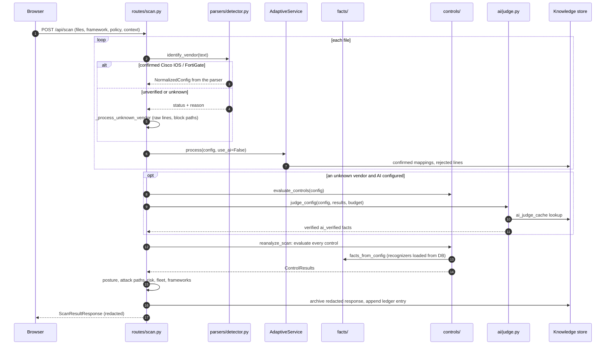
```mermaid
sequenceDiagram
    autonumber
    participant UI as Browser
    participant API as routes/scan.py
    participant DET as parsers/detector.py
    participant ADP as AdaptiveService
    participant FAC as facts/
    participant CTL as controls/
    participant AI as ai/judge.py
    participant DB as Knowledge store

    UI->>API: POST /api/scan (files, framework, policy, context)
    loop each file
        API->>DET: identify_vendor(text)
        alt confirmed Cisco IOS / FortiGate
            DET-->>API: NormalizedConfig from the parser
        else unverified or unknown
            DET-->>API: status + reason
            API->>API: _process_unknown_vendor (raw lines, block paths)
        end
        API->>ADP: process(config, use_ai=False)
        ADP->>DB: confirmed mappings, rejected lines
    end
    opt an unknown vendor and AI configured
        API->>CTL: evaluate_controls(config)
        API->>AI: judge_config(config, results, budget)
        AI->>DB: ai_judge_cache lookup
        AI-->>API: verified ai_verified facts
    end
    API->>CTL: reanalyze_scan: evaluate every control
    CTL->>FAC: facts_from_config (recognizers loaded from DB)
    CTL-->>API: ControlResults
    API->>API: posture, attack paths, risk, fleet, frameworks
    API->>DB: archive redacted response, append ledger entry
    API-->>UI: ScanResultResponse (redacted)
```

---

## 2. Ingest: where a configuration comes from

Two sources, one pipeline. A configuration is either uploaded as a file, or pulled off a live device over SSH
(`app/collect/collector.py`, `POST /api/collect`). Collection is only the fetch step: it hands `scan.run_scan` the
same text an upload would have carried. A collected configuration is never treated as more trusted than an uploaded
one, and never as less redacted.

| Check | Where | What happens |
|---|---|---|
| Empty file | `_run_scan` | `400 '<name>' is empty` |
| Over 2 MB | `scan_configs` and again in `_run_scan` | `413`. Checked twice because a device can return a configuration as large as a file. |
| Not UTF-8 | `scan_configs` | `400 not a valid text file` |
| Unknown `framework` | `validated_framework` | `422` |
| Bad `criticality` | `scan_configs` | `422` |
| Policy invalid or looser than defaults | `parsed_policy` | `422 Organisation policy: …` |

Uploaded bytes are never written to disk. They live in `_scan_store[scan_id]["configs"]` for as long as the backend
process runs; what survives a restart is the redacted scan response (section 11).

### Live collection

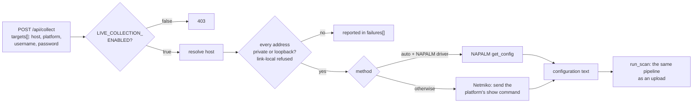
```mermaid
flowchart LR
    REQ["POST /api/collect<br/>targets[]: host, platform,<br/>username, password"] --> EN{"LIVE_COLLECTION_<br/>ENABLED?"}
    EN -->|"false"| F403["403"]
    EN -->|"true"| RES["resolve host"]
    RES --> NET{"every address<br/>private or loopback?<br/>link-local refused"}
    NET -->|"no"| FAIL["reported in failures[]"]
    NET -->|"yes"| DRV{"method"}
    DRV -->|"auto + NAPALM driver"| NAP["NAPALM get_config"]
    DRV -->|"otherwise"| NET2["Netmiko: send the<br/>platform's show command"]
    NAP --> TXT["configuration text"]
    NET2 --> TXT
    TXT --> SCAN["run_scan: the same pipeline<br/>as an upload"]
```

Netmiko ships in `requirements.txt` and covers all **12 platforms** in `PLATFORMS`: Cisco IOS / IOS-XE, NX-OS,
IOS-XR, Arista EOS, Juniper Junos, FortiGate, Palo Alto PAN-OS, HPE Aruba AOS-CX, Huawei VRP, Check Point Gaia,
Extreme EXOS and MikroTik RouterOS. NAPALM is optional (`requirements-live.txt`); `auto` prefers it where it has a
driver because `get_config` asks the device for its configuration instead of typing a command. Neither library is
imported until a collection runs, so a backend missing one still starts and scans.

The platform list is deliberately wider than the two parsers: a Junos or MikroTik device is worth collecting even
though its verdicts come from recognizers and heuristics.

Collection is **on by default** because an operator auditing their own network should not have to export files by
hand. Two settings bound it:

* `LIVE_COLLECTION_ENABLED=false` closes it. Any internet-reachable deployment should set this.
* `LIVE_COLLECTION_NETWORKS=private` (default) stops the endpoint becoming a server-side request forgery. The host
  is resolved and refused unless every address is RFC1918 or loopback; link-local is refused **by name**, because
  Python's `is_private` is true for `169.254.169.254`, the cloud metadata endpoint. The driver is then handed the
  vetted address instead of the name, so a short-TTL DNS record cannot answer differently the second time.

Credentials are request-scoped: used to open one session, never written to the scan store, the archive or the
logs. `Target.__repr__` is overridden because a dataclass repr is the likeliest way for a password to reach a
traceback. One unreachable device is reported in `failures[]` and the rest are still scanned; `502` only when every
device failed.

---

## 3. Vendor detection and parser support

`app/parsers/detector.py: identify_vendor` makes a deterministic, three-stage decision. AI output never feeds it.

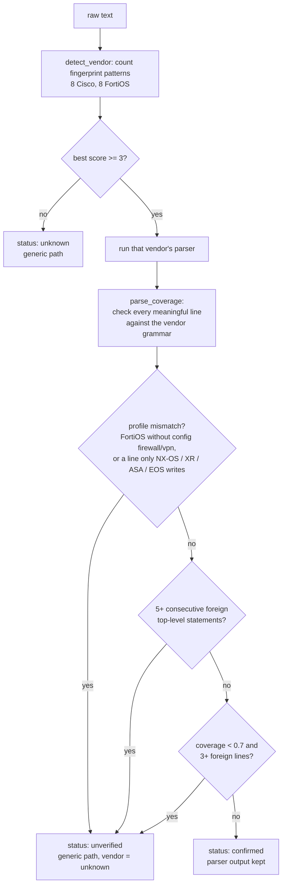
```mermaid
flowchart TD
    T["raw text"] --> FP["detect_vendor: count fingerprint patterns<br/>8 Cisco, 8 FortiOS"]
    FP --> MIN{"best score >= 3?"}
    MIN -->|"no"| UNK["status: unknown<br/>generic path"]
    MIN -->|"yes"| RUN["run that vendor's parser"]
    RUN --> COV["parse_coverage:<br/>check every meaningful line<br/>against the vendor grammar"]
    COV --> PM{"profile mismatch?<br/>FortiOS without config firewall/vpn,<br/>or a line only NX-OS / XR / ASA / EOS writes"}
    PM -->|"yes"| UNV["status: unverified<br/>generic path, vendor = unknown"]
    PM -->|"no"| RUNQ{"5+ consecutive foreign<br/>top-level statements?"}
    RUNQ -->|"yes"| UNV
    RUNQ -->|"no"| RAT{"coverage < 0.7 and<br/>3+ foreign lines?"}
    RAT -->|"yes"| UNV
    RAT -->|"no"| CONF["status: confirmed<br/>parser output kept"]
```

| Constant | Value | Purpose |
|---|---|---|
| fingerprint minimum | 3 patterns | below it the file is `unknown` without running a parser |
| `MIN_UNCOVERED_LINES` | 3 | tiny files make the ratio noisy; the ratio alone never rejects with fewer foreign lines |
| `MAX_FOREIGN_RUN` | 5 | a block of another dialect pasted into a valid file |
| `vendor_parse_coverage_threshold` | 0.7 | `VENDOR_PARSE_COVERAGE_THRESHOLD` |

A **confirmed** vendor selects four things: its parser, its documented defaults (`app/facts/defaults.py`), its
remediation recipes and its CIS benchmark mappings. An **unverified** configuration takes the generic path with
`device.vendor = unknown`, exactly like a file nothing recognised. The detector's verdict and reason are returned
in `vendor_identification[]`.

Dedicated parsers exist for **Cisco IOS / IOS-XE** and **Fortinet FortiGate** only. Palo Alto, Juniper, Arista and
every other vendor are read by the generic path and shown as "Generic / adaptive analysis". The full grammar rules
are in [parser-design.md](parser-design.md).

**Device identification** reads only what the file states: the Cisco `version` line gives the OS version, a leading
FortiOS `#config-version=<model>-<version>-FW-<build>` header gives model and firmware, and
`facts/heuristics.py: stated_identity` reads hostname, serial, model and version where any file states them (for
example `show version` output pasted in). Nothing is guessed when absent.

---

## 4. Generic path: tokenizer, flattening, heuristics

### 4.1 Tokenizer

`app/structure/tokenizer.py` turns every line into a `Statement(line, text, scope_path, key_tokens, values,
polarity)`:

* scope from indentation, braces, `config`/`edit`/`next`/`end`, `/section` headers and flat prefix blocks;
* statement terminators (`;`) are punctuation, in configuration lines and in recognizer templates alike;
* `set` dropped, `key=value` split, IPs, numbers (with units) and quoted strings as values;
* polarity from `no` / `unset` / `delete` / `undo`, `enable(d)` / `disable(d)` / `on` / `off` / `yes` / `no`,
  and switches such as `disabled=yes`;
* descriptions, remarks, comments (`#`, `!`, `/* … */`) and banner bodies never yield keywords;
* a line or block marked `inactive:` configures nothing and yields no statement.

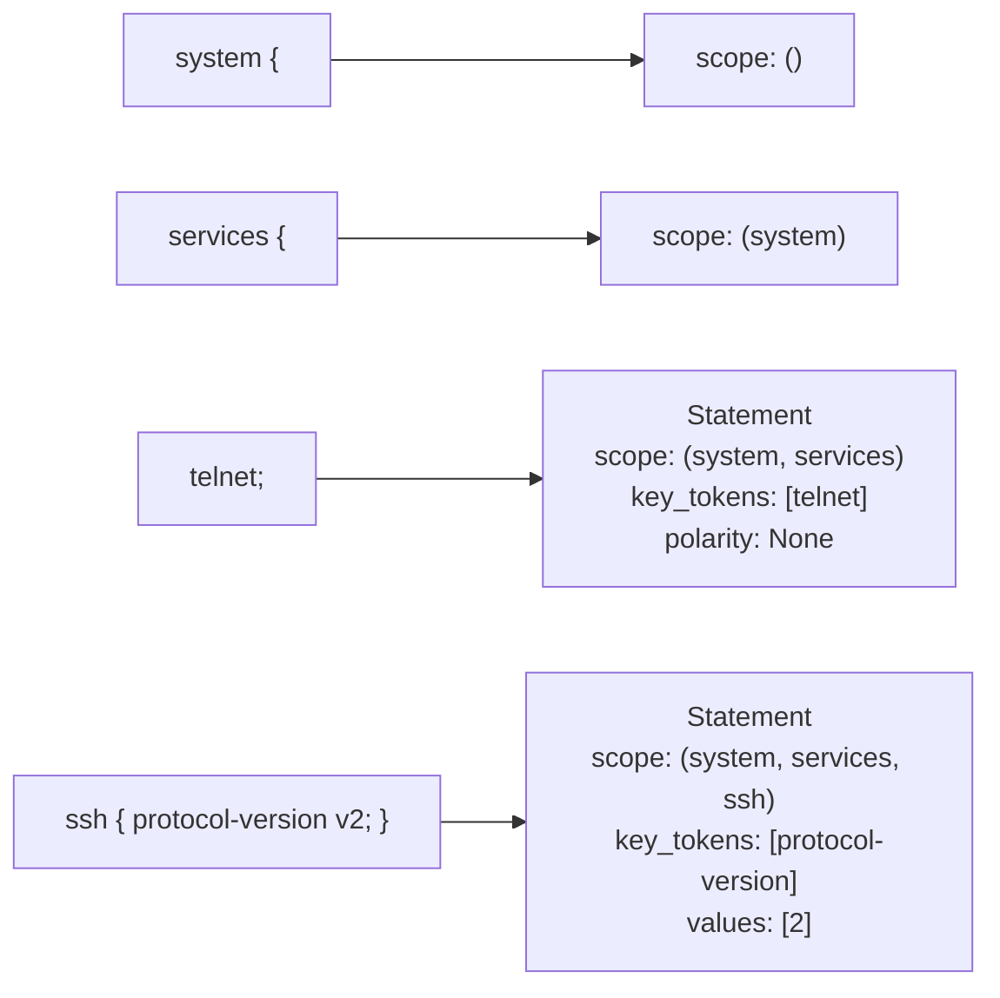
```mermaid
flowchart LR
    L1["system {"] --> S1["scope: ()"]
    L2["    services {"] --> S2["scope: (system)"]
    L3["        telnet;"] --> S3["Statement<br/>scope: (system, services)<br/>key_tokens: [telnet]<br/>polarity: None"]
    L4["        ssh { protocol-version v2; }"] --> S4["Statement<br/>scope: (system, services, ssh)<br/>key_tokens: [protocol-version]<br/>values: [2]"]
```

### 4.2 Structured formats are flattened first

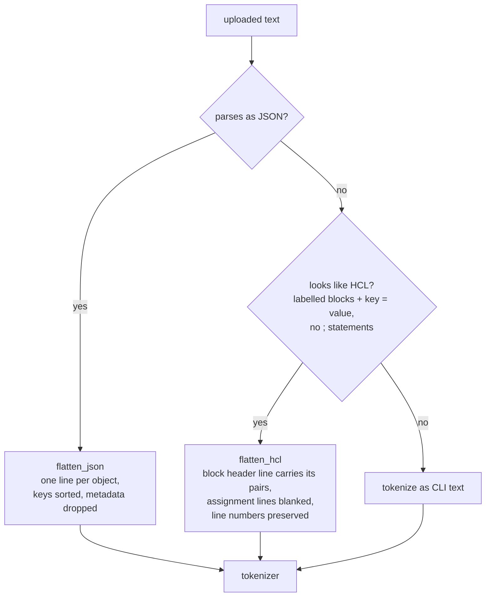
```mermaid
flowchart TD
    IN["uploaded text"] --> J{"parses as JSON?"}
    J -->|"yes"| FJ["flatten_json<br/>one line per object,<br/>keys sorted, metadata dropped"]
    J -->|"no"| H{"looks like HCL?<br/>labelled blocks + key = value,<br/>no ; statements"}
    H -->|"yes"| FH["flatten_hcl<br/>block header line carries its pairs,<br/>assignment lines blanked,<br/>line numbers preserved"]
    H -->|"no"| RAW["tokenize as CLI text"]
    FJ --> TOK["tokenizer"]
    FH --> TOK
    RAW --> TOK
```

**JSON exports** (AWS security groups, Azure NSGs, GCP firewall rules, SONiC `config_db.json`) are flattened in
`app/structure/structured.py: flatten_json`: one line per object, the keys leading to it first, then its own
`key value` pairs, keys sorted. An object holding only scalars (or lists of scalars) and no `name` is inlined into
its parent under its own key (`IpRanges CidrIp 0.0.0.0/0`, GCP `allowed IPProtocol tcp ports 22`), so a GCP rule
keeps its ports and source on one line and `allowed` never reads like `denied`. A named object (an Azure security
rule) is its own line. Metadata that is never a setting (`etag`, `id`, `selfLink`, `creationTimestamp`, `kind`,
`provisioningState`, `resourceGuid`) and free-text `description` are dropped. An object whose values are all
objects is a table keyed by name or address (SONiC): each entry becomes its own line
(`SNMP_COMMUNITY public TYPE RO`), and an entry with no attributes still states its key
(`SYSLOG_SERVER 10.0.0.5`).

**Terraform (HCL)** is flattened by `flatten_hcl`, chosen from structure. Each block's header line becomes its type,
labels and own pairs, keys sorted
(`ingress cidr_blocks 0.0.0.0/0 from_port 22 protocol tcp to_port 22 {`); assignment lines are blanked and braces
kept, so the text keeps the file's line numbers and a child block is read inside its parent. A reference the file
does not resolve (`var.x`, `"${local.p}/32"`, a function call, a heredoc) is kept as `${…}`, which no `{enum}` slot
matches, so it never decides a result. Evidence cites the rule block in the uploaded `.tf` file.

**Junos brace form.** A `;`-terminated leaf inside brace blocks is also matched by unscoped recognizers in its
**set form** (`snmp { community public { authorization read-only; } }` →
`set snmp community public authorization read-only`, `app/facts/recognizers.py: set_form`), so knowledge taught in
either Junos form reads both. The statement keeps its own line number. The choice is structural (a terminated leaf
inside a block), never a vendor name. When a block header already answered a setting (`user admin {`), a leaf under
it does not answer the same setting again.

### 4.3 Lexicon heuristics

`app/facts/heuristics.py` reads statements with the synonym lexicon (`app/facts/lexicon.py`, whole tokens only) and
produces HEURISTIC facts only with a predicate keyword, a typed value and a resolved polarity. Disagreeing
candidates become one undetermined fact citing all of them (UNKNOWN). Three readings use structure rather than the
single line, and none lets an absent line state anything:

* **Presence as polarity.** A bare statement whose single keyword is a management protocol, inside a block that
  already identifies it as a service (`services { telnet; }`), states the protocol is on. A block switched off wins
  over it; a negation of the same feature contradicts it (UNKNOWN).
* **Version values.** A version fact reads `v2` / `ver2` / `version2` as 2. Elsewhere a token with a letter is not a
  number.
* **Rule composition.** When a rule states selectors and action in separate statements
  (`source-address any; … permit;`), the rule is the action's own block or its parent: the first block wide enough
  to state both wildcards, never one holding a second action or a narrowing selector (protocol, port, application).
  A selector naming a wildcard itself (`application any`) widens the rule. Evidence cites every line of the rule.

### 4.4 Who answers a line on the generic path

`facts/from_normalized.py: facts_from_config` merges sources in a fixed order:

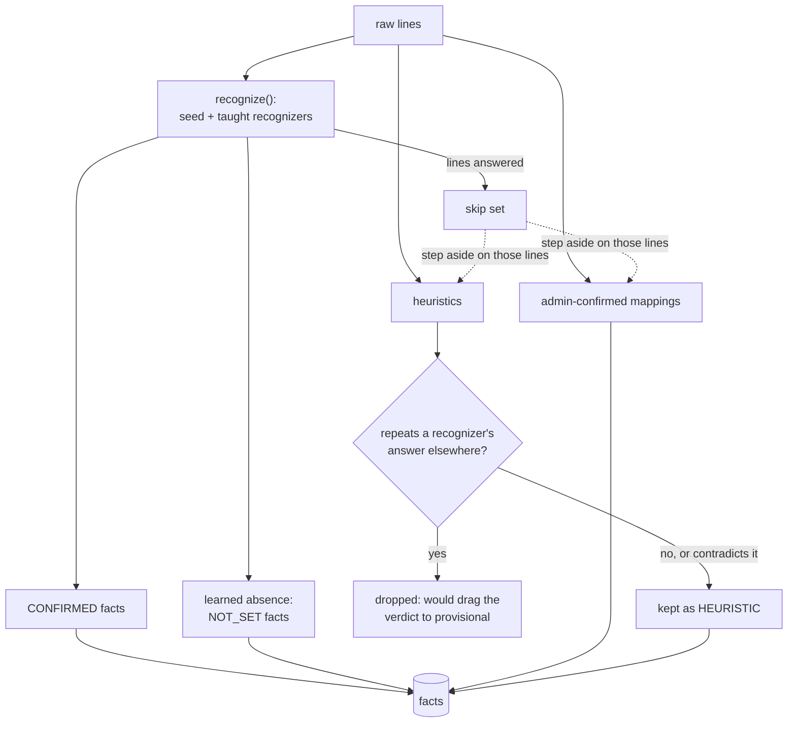
```mermaid
flowchart TD
    LINES["raw lines"] --> R["recognize():<br/>seed + taught recognizers"]
    R -->|"lines answered"| SKIP["skip set"]
    R --> RF["CONFIRMED facts"]
    R --> ABS["learned absence:<br/>NOT_SET facts"]
    LINES --> M["admin-confirmed mappings"]
    LINES --> HE["heuristics"]
    SKIP -.->|"step aside on those lines"| M
    SKIP -.->|"step aside on those lines"| HE
    HE --> DUP{"repeats a recognizer's<br/>answer elsewhere?"}
    DUP -->|"yes"| DROP["dropped: would drag the<br/>verdict to provisional"]
    DUP -->|"no, or contradicts it"| KEEP["kept as HEURISTIC"]
    RF --> OUT[("facts")]
    ABS --> OUT
    M --> OUT
    KEEP --> OUT
```

A recognizer answers the lines it matches; mappings and heuristics on those lines step aside. A heuristic elsewhere
that merely repeats a recognizer's answer (same predicate, subject and value) also steps aside, because citing it
would report a decided control as provisional. A heuristic that **contradicts** a recognizer still speaks, so a
recognizer never hides a line that disagrees with it.

---

## 5. SecurityFacts and assurance

`app/facts/predicates.py` defines **23 predicates**, each consumed by at least one control (a predicate exists only
if a control reads it). The full list with value types is in [data-model.md](data-model.md#predicates).

A `SecurityFact` has `predicate`, `value`, `assurance`, `evidence` (line numbers and text), `subject`, `scope`,
`unit`, `provenance` and, for AI facts only, `control_id`. Value conventions:

* a concrete value: what the configuration states;
* `None`: present but undetermined (`provenance` says why);
* `NOT_SET`: a confirmed parser read the whole configuration and the setting is absent (the control decides what
  absence means).

### Assurance

| Source | Assurance | Decisive | Shown as |
|---|---|---|---|
| Confirmed vendor parser (`_ParserFacts`) | `parser` | yes | decided |
| Recognizer (shipped seed or administrator-confirmed) or learned mapping | `confirmed` | yes | decided |
| Documented default of a confirmed vendor (`facts/defaults.py`) | `default` | yes | decided, reason names the default |
| Lexicon heuristic | `heuristic` | no | "Suspected FAIL", "Probable PASS" |
| AI judge proposal that passed verification | `ai_verified` | no | "AI proposes …, awaiting confirmation" |

A verdict takes the **weakest** assurance it cites (`weakest()`), so one heuristic citation makes a whole verdict
provisional.

### Documented defaults

Used only for a confirmed vendor, only when no fact at all was found for the control, and only for defaults that are
documented and stable across releases:

| Vendor | Predicate | Default value | Source |
|---|---|---|---|
| FortiGate | idle timeout | 5 min | `set admintimeout 5` |
| FortiGate | SSH version | 2 | `set admin-ssh-v1 disable` |
| FortiGate | login banner | off | `set pre-login-banner disable` |
| FortiGate | source routing | off | `set ip-src-routing disable` |
| FortiGate | failed-login limit | 3 | `set admin-lockout-threshold 3` |
| FortiGate | admin account name | `admin` | every FortiGate ships with it |
| FortiGate | weak management crypto | not allowed | `set strong-crypto enable` |
| FortiGate | SNMP community | none | no `config system snmp community` entry |
| Cisco IOS | SNMP community | none | no `snmp-server community` |

Deliberately **not** assumed for IOS: `ip source-route` and `ip ssh version` (differ by release),
`exec-timeout` (CIS requires it set explicitly), `ip http server` and VTY `transport input` (differ by platform).

### Learned absence on the generic path

`NOT_SET` on the generic path comes only from **learned absence** (`app/facts/recognizers.py`, `_dialect` /
`_absence`), for the five settings no device ships with: an AAA server, a remote syslog server, a login banner, an
NTP server and NTP authentication. It needs all of:

* the configuration is **understood**: one dialect's learned knowledge (the vendor label of the seeds that matched,
  clear winner, plus taught recognizers whose fingerprint matches) answered at least 3 settings in it;
* that dialect **knows how it writes** the missing setting (a seed or taught recognizer for it);
* **nothing** states it: no fact of any assurance, and no line even names the concept in the lexicon's words.

The fact is `confirmed`, cites no line, and its FAIL reason says how the dialect would write it ("Palo Alto PAN-OS
states it as 'set deviceconfig system syslog-server …'"). Every other absence on the generic path stays
`NOT_CONFIGURED`.

A second, narrower source is `backend/data/factory_defaults.json`: a reviewed vendor factory default with its source,
today only PAN-OS password length (Minimum Password Complexity off by default).

---

## 6. Controls and ControlResult

`app/controls/catalog.py` declares 23 controls (MGMT-001 to MGMT-011, AUTH-001 to AUTH-003, BOUNDARY-001 to
BOUNDARY-004, LOG-001 to LOG-003, CRYPTO-001 and CRYPTO-002) with `question`, `kind`, `severity`, `category`,
`needs` (predicates), `optional_feature` and versioned framework `mappings`. `app/controls/judges.py` says what one
fact means for one control; `app/controls/evaluate.py` combines the outcomes. No vendor decides whether a control
runs. The per-control reference is [detection-rules.md](detection-rules.md).

| Kind | Meaning | Controls |
|---|---|---|
| `prohibition` | something must not be on | MGMT-001, 002, 004, 005, 007, 010, 011, AUTH-003, BOUNDARY-002, 003, 004, CRYPTO-002 |
| `requirement` | something must exist | MGMT-008, 009, LOG-001, 002, 003 |
| `threshold` | a value must be within a limit | MGMT-006, AUTH-001, AUTH-002, CRYPTO-001 |
| `relational` | depends on how objects relate | MGMT-003, BOUNDARY-001 |

### How one control is decided

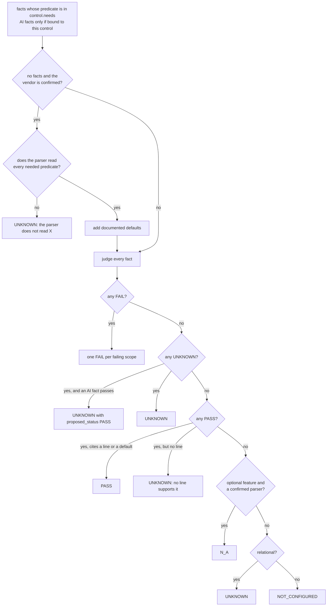
```mermaid
flowchart TD
    START["facts whose predicate is in control.needs<br/>AI facts only if bound to this control"] --> NONE{"no facts and the<br/>vendor is confirmed?"}
    NONE -->|"yes"| READ{"does the parser read<br/>every needed predicate?"}
    READ -->|"no"| U1["UNKNOWN: the parser does not read X"]
    READ -->|"yes"| DEF["add documented defaults"]
    NONE -->|"no"| JUDGE
    DEF --> JUDGE["judge every fact"]
    JUDGE --> F{"any FAIL?"}
    F -->|"yes"| FAIL["one FAIL per failing scope"]
    F -->|"no"| UQ{"any UNKNOWN?"}
    UQ -->|"yes, and an AI fact passes"| PROP["UNKNOWN with proposed_status PASS"]
    UQ -->|"yes"| UNK["UNKNOWN"]
    UQ -->|"no"| PQ{"any PASS?"}
    PQ -->|"yes, cites a line or a default"| PASS["PASS"]
    PQ -->|"yes, but no line"| U2["UNKNOWN: no line supports it"]
    PQ -->|"no"| OPT{"optional feature and<br/>a confirmed parser?"}
    OPT -->|"yes"| NA["N_A"]
    OPT -->|"no"| REL{"relational?"}
    REL -->|"yes"| U3["UNKNOWN"]
    REL -->|"no"| NC["NOT_CONFIGURED"]
```

After that, a **platform profile** (`backend/data/platform_profiles.json`) can turn an undecided answer into `N_A`
when every top-level statement belongs to a platform that cannot have the setting at all. Four profiles exist: AWS
security groups, Terraform, Azure NSG and GCP firewall rules. Each marks the 20 device-only checks N/A with a
reason; only the three traffic checks remain.

A control that throws is reported `UNKNOWN` ("could not be evaluated"), never a crash, and fact extraction that
throws makes every control `UNKNOWN`.

| Status | Meaning |
|---|---|
| `PASS` | A fact says the setting is secure, with a cited line or a documented default |
| `FAIL` | A fact says the setting is insecure; one FAIL per failing scope (interface, VTY range, policy) |
| `UNKNOWN` | Something relevant exists but could not be decided (conflict, missing unit, parser does not read it, relational control with no facts, an AI proposal awaiting confirmation) |
| `NOT_CONFIGURED` | Nothing relevant was found. Never scored, never a PASS |
| `N_A` | Proven not to apply: an optional feature a confirmed parser found none of, or a platform profile |

A PASS / FAIL whose weakest evidence is `ai_verified` is reported as UNKNOWN with `proposed_status`. An AI fact is
bound to the control that asked (`SecurityFact.control_id`), so it never answers another control. Findings are the
view of decisive and heuristic FAIL results (`app/controls/views.py`); heuristic findings are labelled "Suspected".

### Organisation policy

`app/controls/policy.py` holds the active policy in a context variable, set where a scan is created (`run_scan`) and
where an action on a stored scan starts (`live_scan`). Judges read `policy.current()` for the idle-timeout limit,
login-attempt limit, minimum password length and approved NTP / syslog servers. A policy can only tighten. See
[policy.md](policy.md).

---

## 7. Posture, coverage and critical controls not assessed

`app/analysis/scoring.py`. Each (device, control) pair collapses to one outcome before counting, so a control failing
on five interfaces counts once, at its worst failure severity.

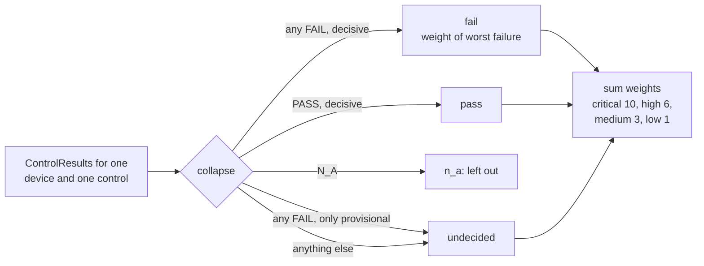
```mermaid
flowchart LR
    R["ControlResults for one<br/>device and one control"] --> C{"collapse"}
    C -->|"any FAIL, decisive"| FL["fail<br/>weight of worst failure"]
    C -->|"any FAIL, only provisional"| UD["undecided"]
    C -->|"N_A"| NA["n_a: left out"]
    C -->|"PASS, decisive"| PS["pass"]
    C -->|"anything else"| UD
    FL --> SUM["sum weights<br/>critical 10, high 6,<br/>medium 3, low 1"]
    PS --> SUM
    UD --> SUM
```

```text
posture  = Σw(pass) / Σw(pass + fail) × 100                       "-" (null) when nothing decided
coverage = Σw(pass + fail) / Σw(pass + fail + undecided) × 100      N_A is not applicable, so not counted
bounds   = ( Σw(pass) / Σw(applicable) ,  Σw(pass + undecided) / Σw(applicable) ) × 100
critical_unassessed = critical controls whose outcome is undecided
```

**Worked example.** One device. Decided: MGMT-001 FAIL (critical, 10), MGMT-007 PASS (high, 6), LOG-001 PASS (high,
6), MGMT-009 FAIL (low, 1). Undecided: MGMT-008 (high, 6), MGMT-003 (critical, 10). Everything else N_A.

* posture = 12 / 23 = **52**
* coverage = 23 / 39 = **59**
* bounds = 12 / 39 to 28 / 39 = **31 to 72**
* critical not assessed = **MGMT-003**

With all 23 controls applicable the maximum weight is 133 (6 critical, 8 high, 8 medium, 1 low). A configuration with
nothing decided shows posture "-" and coverage 0, never 100. The legacy `score` (100 minus penalties) is still
returned, deprecated, and not used by the UI, remediation or framework views.

`control_outcomes()` exposes the same per-(device, control) outcome to the resolution queue, so what the queue calls
unresolved is exactly what coverage left out.

---

## 8. Analysis on top of results

These layers read the **redacted** scan response, never the configuration, and none of them changes a verdict,
posture or coverage.

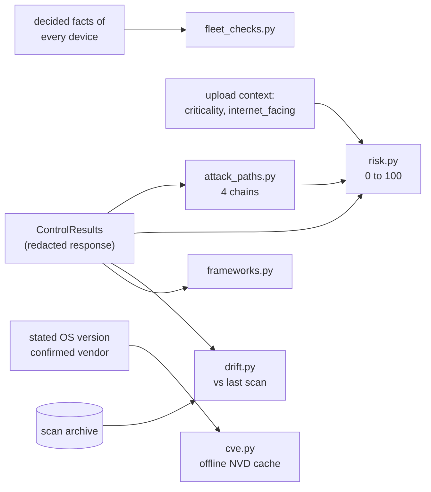
```mermaid
flowchart LR
    RES["ControlResults<br/>(redacted response)"] --> AP["attack_paths.py<br/>4 chains"]
    RES --> RK["risk.py<br/>0 to 100"]
    AP --> RK
    CTX["upload context:<br/>criticality, internet_facing"] --> RK
    FACTS["decided facts of<br/>every device"] --> FLT["fleet_checks.py"]
    VER["stated OS version<br/>confirmed vendor"] --> CVE["cve.py<br/>offline NVD cache"]
    ARC[("scan archive")] --> DR["drift.py<br/>vs last scan"]
    RES --> DR
    RES --> FW["frameworks.py"]
```

### 8.1 Attack paths

`app/analysis/attack_paths.py` defines four chains. A path opens only when **every step** has at least one decided
FAIL (parser, confirmed or default); heuristic and AI verdicts never open one.

| Path | Severity | Steps (any listed control decided FAIL opens the step) |
|---|---|---|
| `remote-takeover` | critical | Reach the login (MGMT-010, MGMT-003) → Capture the password (MGMT-001, 002, 007) → Log in as an administrator (AUTH-003, AUTH-001, MGMT-008) |
| `password-guessing` | high | Reach the login (MGMT-010, MGMT-003) → Guess without limit (AUTH-001, 002, 003) → Stay unseen (LOG-001) |
| `snmp-exposure` | high | Guess the community (MGMT-004) → Speak SNMPv1/v2c (MGMT-011) → Stay unseen (LOG-001) |
| `perimeter-bypass` | high | Pass the filter (BOUNDARY-001) → Steer the traffic (BOUNDARY-002, BOUNDARY-004) |

`break_with` is the set of failing checks on the step with the fewest of them: fixing all of those closes the path.
Each chain is proven by `scripts/build_path_validation.py` against a positive configuration (shows exactly that
chain) and a copy with only the fix applied (shows none of it). The record in `data/path_validation.json` carries a
hash of the chain catalog and is ignored once the catalog changes.

### 8.2 Contextual risk

`app/analysis/risk.py`, per device:

```text
points = worst decided FAIL severity (critical 60, high 45, medium 25, low 10, none 0)
       + 20 if a decided MGMT-010 FAIL exists, or the device was marked internet-facing at upload
       + 10 per attack path, at most 20
risk   = min(100, round(points × criticality))   criticality: low 0.8, medium 1.0 (default), high 1.15, critical 1.3
level  = low < 25 <= medium < 50 <= high < 75 <= critical
```

The formula and its reasons are returned with every device and printed in the PDF.

### 8.3 Fleet checks

`app/analysis/fleet_checks.py`, for scans of two or more devices, decided facts only:

* `shared-snmp-community`: the same community on several devices, compared by **hash**, never shown;
* `ntp-mismatch` and `syslog-mismatch`: devices using different NTP or syslog servers.

### 8.4 Changes since the last audit

`app/analysis/drift.py` compares each device with the most recent earlier archived scan of the same hostname and
vendor. Decided verdicts only: `fixed` (decided FAIL → decided PASS), `new_problems` (→ decided FAIL),
`no_longer_decided` (decided FAIL → undecided: the evidence went away, which is **not** a fix), and attack paths
closed or opened.

### 8.5 Known CVEs

`app/analysis/cve.py` reads the committed `data/cve_cache.json` (built by `scripts/build_cve_cache.py`), never the
network. A match needs a confirmed parser and a version the file states, reduced to its train (IOS `15.2(4)M11` →
`15.2`, IOS-XE `17.3.4a` → `17.3`, FortiOS `7.0.12` → `7.0`). It is context with a caveat, never a finding or part of
any score.

---

## 9. AI: role and boundaries

Details: [ai-design.md](ai-design.md). The AI judge (`app/ai/judge.py`) runs only for unknown / unverified vendors,
only for controls that are UNKNOWN (then NOT_CONFIGURED, as evidence discovery), only when a cited or related line
exists, most severe first, up to `CONTROLS_PER_CALL` (4) controls per call and `ai_judge_max_calls_per_scan` (2)
calls per scan.

* The whole configuration is redacted, and every excerpt and prompt is scrubbed of every known secret.
* The excerpt is the tokenizer scope of the relevant lines (at most 15 lines of block plus enclosing headers), never
  the whole configuration. Configuration text is fenced as data (`app/ai/fence.py`).
* A deterministic verifier checks every proposal: the control asked, the predicate is needed, line references exist,
  quoted evidence is on a cited line, all cited lines share one scope, and the cited line itself states the value.
  Anything else is discarded.
* Verified proposals are `ai_verified`: shown as "AI proposes PASS/FAIL, awaiting confirmation", never counted in
  posture, coverage, findings, severity counts, framework status, risk, attack paths or remediation.
* AI never infers PASS from absence (absence cannot be cited), never selects a vendor, never writes remediation and
  never saves a recognizer.
* Cache: `ai_judge_cache`, key = hash(prompt version + model + system prompt + redacted prompt). Only answers with at
  least one verified proposal are stored; a cached answer is verified again, and one that no longer verifies is asked
  again and replaced.

If AI is unavailable, over budget or fails, controls keep their deterministic and heuristic results and the scan
completes.

---

## 10. Human in the loop: recognizers

A fresh deployment does not start blank. `backend/data/seed_recognizers.json` ships **243** reviewed recognizers for
**13 dialects** with no dedicated parser (Juniper Junos, Palo Alto PAN-OS, Arista EOS, Huawei VRP, MikroTik RouterOS,
HPE Aruba AOS-CX, Check Point Gaia, Extreme EXOS, Cisco NX-OS, ASA, IOS-XR, SONiC `config_db.json`, NVIDIA Cumulus
NVUE) plus AWS security group, Azure NSG and GCP firewall exports and Terraform for AWS, Azure and GCP. One
generalized entry per concept per dialect. `app/facts/seed.py` loads them the first time a process opens the
database, idempotently, never overwriting or reviving a row an administrator changed or stopped. See
[seed-knowledge.md](seed-knowledge.md).

### Recognizer lifecycle

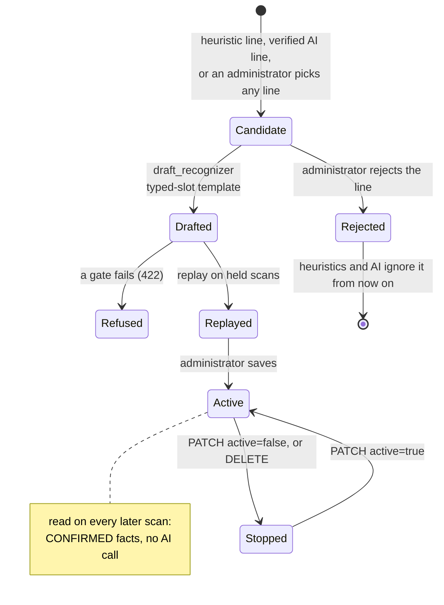
```mermaid
stateDiagram-v2
    [*] --> Candidate: heuristic line, verified AI line,<br/>or an administrator picks any line
    Candidate --> Drafted: draft_recognizer<br/>typed-slot template
    Drafted --> Refused: a gate fails (422)
    Drafted --> Replayed: replay on held scans
    Replayed --> Active: administrator saves
    note right of Active
        read on every later scan:
        CONFIRMED facts, no AI call
    end note
    Active --> Stopped: PATCH active=false, or DELETE
    Stopped --> Active: PATCH active=true
    Candidate --> Rejected: administrator rejects the line
    Rejected --> [*]: heuristics and AI ignore it from now on
```

### The resolution queue

An UNKNOWN or NOT_CONFIGURED control is the reason to ask, not the end of the assessment.
`GET /api/adaptive/scans/{id}/unresolved` lists every applicable control coverage left out, built from the same
`control_outcomes` the posture is counted from. Each item carries why the engine could not decide, the evidence it
did cite, lines of this configuration that mention the setting, and either `teach` or `blocked` with a reason.
When no line is suggested the administrator can pick any line (`…/configs/{i}/lines`, read-only) and state what it
means (`…/meanings`). The answer becomes an asserted candidate and goes through the same drafting and gates.

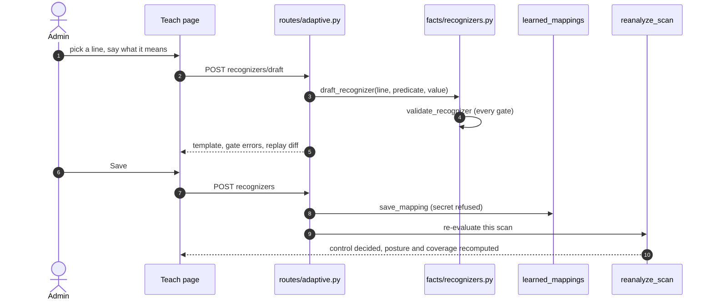
```mermaid
sequenceDiagram
    autonumber
    actor Admin
    participant Teach as Teach page
    participant API as routes/adaptive.py
    participant REC as facts/recognizers.py
    participant DB as learned_mappings
    participant SCAN as reanalyze_scan

    Admin->>Teach: pick a line, say what it means
    Teach->>API: POST recognizers/draft
    API->>REC: draft_recognizer(line, predicate, value)
    REC->>REC: validate_recognizer (every gate)
    API-->>Teach: template, gate errors, replay diff
    Admin->>Teach: Save
    Teach->>API: POST recognizers
    API->>DB: save_mapping (secret refused)
    API->>SCAN: re-evaluate this scan
    SCAN-->>Teach: control decided, posture and coverage recomputed
```

### Drafting and gates

The backend drafts a typed-slot template (`{int}`, `{host}`, `{ip}`, `{duration[:unit]}`, `{enum:name}`,
`{polarity}`, `{neg}`, `{any}`, `{rest}`; never raw regex), predicate, subject, optional scope template, dialect
fingerprint and value table. It generalizes what varies (addresses, hostnames, numbers, durations, facility and
instance names go into slots) and keeps what identifies (keywords and polarity stay literal). A *leading* negator
becomes `{neg}`, so one recognizer reads `telnet server` and `no telnet server` as opposites.

Gates (`app/facts/recognizers.validate_recognizer`, `app/db/mappings.validate_mapping`):

| Gate | Rule |
|---|---|
| Specific enough | at least two keywords besides stopwords **counting the scope template**; narrow one-word exception for whole feature statements (`_one_word_feature`) |
| Right block | the scope is the block the statement is *in*, never an outer ancestor |
| Value lines | a line carrying a value can only teach a boolean in `PRESENCE_PREDICATES` (source restriction, central AAA, login banner) |
| About the setting | a line that states no on/off of its own, or is read through a value slot, must name the concept (`CONCEPT_WORDS`) |
| Meaning | stated polarity or a true/false table, or presence for a scoped bare statement (which can only mean "on") |
| Units | a duration needs a unit |
| Self-consistent | the template must match its example line |
| Unique | no identical active recognizer (pattern **and** scope) and no dialect overlap unless "any dialect" |
| No secret | no secret in any stored text (`_holds_secret`, `_refuse_secrets`) |

Rejecting a line records it (redacted) so heuristics and AI ignore it on later scans. Nothing is learned without an
administrator; AI output never becomes a recognizer by itself.

---

## 11. Persistence

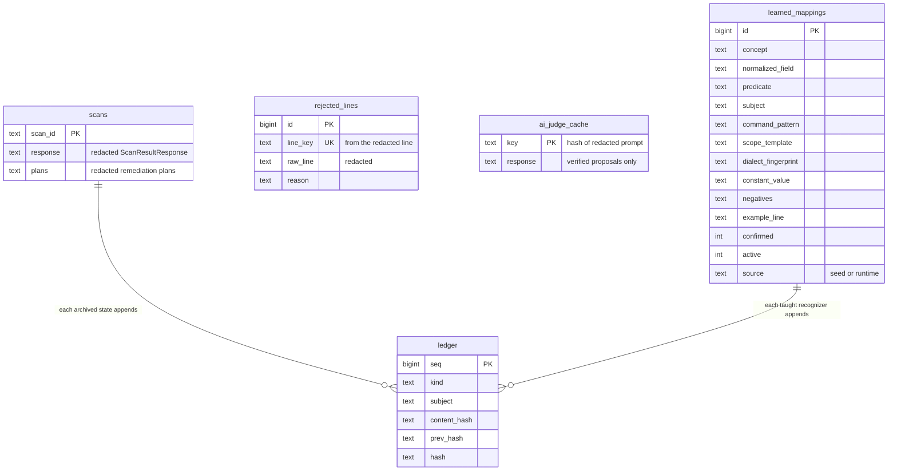
```mermaid
erDiagram
    learned_mappings {
        bigint id PK
        text concept
        text normalized_field
        text predicate
        text subject
        text command_pattern
        text scope_template
        text dialect_fingerprint
        text constant_value
        text negatives
        text example_line
        int confirmed
        int active
        text source "seed or runtime"
    }
    rejected_lines {
        bigint id PK
        text line_key UK "from the redacted line"
        text raw_line "redacted"
        text reason
    }
    ai_judge_cache {
        text key PK "hash of redacted prompt"
        text response "verified proposals only"
    }
    scans {
        text scan_id PK
        text response "redacted ScanResultResponse"
        text plans "redacted remediation plans"
    }
    ledger {
        bigint seq PK
        text kind
        text subject
        text content_hash
        text prev_hash
        text hash
    }
    scans ||--o{ ledger : "each archived state appends"
    learned_mappings ||--o{ ledger : "each taught recognizer appends"
```

| Store | Contents | Survives restart | Secrets |
|---|---|---|---|
| `learned_mappings` | Recognizers (shipped `seed` and taught `runtime`) and learned field mappings | Yes | Refused at save |
| `rejected_lines` | Rejected lines (redacted text, key from the redacted line) | Yes | Redacted |
| `ai_judge_cache` | Verified AI answers keyed by a hash of the redacted prompt | Yes | Prompts were redacted |
| `scans` | Each scan's redacted response and remediation plans | Yes | Redacted; the configuration itself is never stored |
| `ledger` | Hash chain of scans, recognizers, fix decisions, reports | Yes | Content hashes only |
| Backend memory (`_scan_store`) | Parsed configurations of scans being worked on, candidates | No | Held in process memory |
| Browser `localStorage` | History summaries (hostnames, vendors, posture, coverage, counts) | Browser only | None stored |

The tables live in SQLite at `ADAPTIVE_DB_PATH` (default `backend/data/adaptive.db`) or in Postgres when
`DATABASE_URL` is set. `app/db/database.py` writes the SQL once for both (`ON CONFLICT`, `RETURNING`); Postgres
connections are pooled and reads are cached per process, cleared on every write. Migrations are tracked with
`PRAGMA user_version` on SQLite and a `schema_version` table on Postgres. Tests always use SQLite.

After a restart an archived scan reopens **read-only** (results, frameworks, remediation plan, PDF);
`GET /api/scan/{id}` falls back to the archive. Teaching or fixing it returns `409` and asks for the configuration
again, because the configuration holds secrets and is not kept (`tests/test_scan_archive.py`).

---

## 12. Remediation

Three routes produce a change, chosen by vendor status and by what read the failing line.

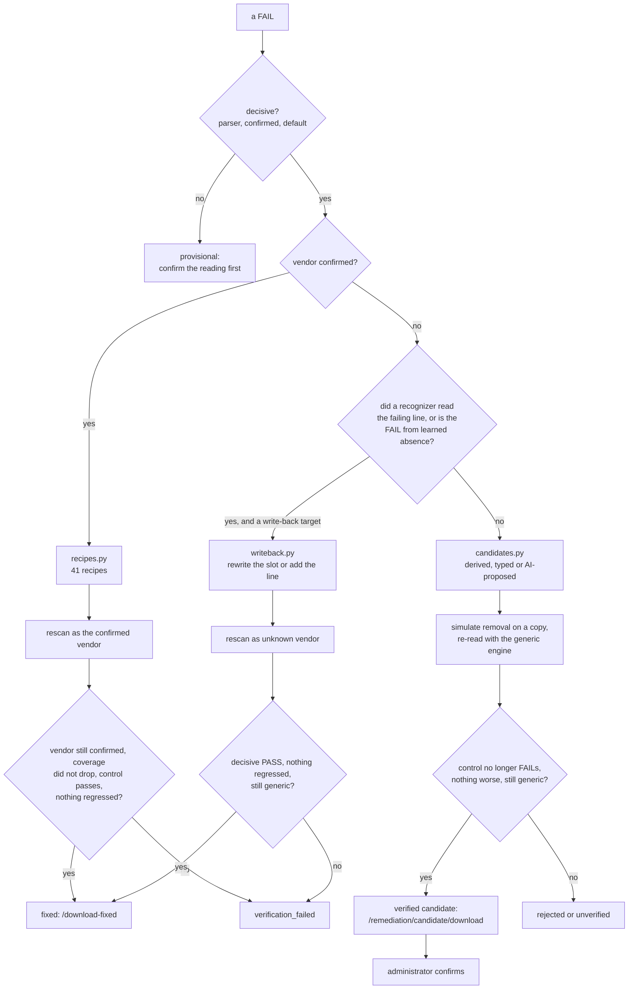
```mermaid
flowchart TD
    F["a FAIL"] --> D{"decisive?<br/>parser, confirmed, default"}
    D -->|"no"| PROV["provisional:<br/>confirm the reading first"]
    D -->|"yes"| V{"vendor confirmed?"}
    V -->|"yes"| RCP["recipes.py<br/>41 recipes"]
    V -->|"no"| WBQ{"did a recognizer read<br/>the failing line, or is the<br/>FAIL from learned absence?"}
    WBQ -->|"yes, and a write-back target"| WB["writeback.py<br/>rewrite the slot or add the line"]
    WBQ -->|"no"| CAND["candidates.py<br/>derived, typed or AI-proposed"]
    RCP --> RS1["rescan as the confirmed vendor"]
    WB --> RS2["rescan as unknown vendor"]
    CAND --> RS3["simulate removal on a copy,<br/>re-read with the generic engine"]
    RS1 --> OK1{"vendor still confirmed, coverage<br/>did not drop, control passes,<br/>nothing regressed?"}
    RS2 --> OK2{"decisive PASS, nothing regressed,<br/>still generic?"}
    RS3 --> OK3{"control no longer FAILs,<br/>nothing worse, still generic?"}
    OK1 -->|"yes"| FIXED["fixed: /download-fixed"]
    OK1 -->|"no"| VF["verification_failed"]
    OK2 -->|"yes"| FIXED
    OK2 -->|"no"| VF
    OK3 -->|"yes"| VERIF["verified candidate:<br/>/remediation/candidate/download"]
    OK3 -->|"no"| REJ["rejected or unverified"]
    VERIF --> HUM["administrator confirms"]
```

### 12.1 Deterministic recipes (confirmed vendors)

`app/remediation/recipes.py` holds **41** recipes keyed by (control, vendor): 21 for Cisco IOS and 20 for FortiGate.
Every control has a Cisco or FortiGate recipe; LOG-003 and MGMT-010 are FortiGate only (IOS has no per-policy
logging or interface-bound management), BOUNDARY-004, MGMT-005 and MGMT-008 are Cisco only. Some recipes only ever
return `manual_review` (any-to-any rules, weak stored passwords, AAA without a strong local account).

* Runs only for a **decisive FAIL** on a **confirmed** vendor. Heuristic / AI verdicts → `provisional`; unknown or
  unverified vendors → `vendor_unverified`.
* Parameters come from the parser model and the FAIL citations (VTY ranges, interfaces, proposals); edits are local:
  replace a setting in place with its indentation, or add it as the last child of its block.
* Operator values (`syslog_server`, `ntp_server`, `ntp_key_id`, `ntp_key`, `management_subnet`) are validated by
  `parse_inputs`, never placeholders. Missing → `needs_input`. No known-safe change → `manual_review`. No recipe →
  `no_recipe`.
* The generated configuration is rescanned like an upload. **Fixed** only if the vendor is still confirmed, parse
  coverage did not drop, the control PASSes decisively on every scope and no other control regressed; otherwise
  `verification_failed`, with the output kept for review.
* Idempotent: a fixed configuration has no decisive FAIL, so running again changes nothing.

| Status | Meaning |
|---|---|
| `fixed` | generated and verified by a full rescan |
| `needs_input` | a change exists once the operator supplies a value |
| `manual_review` | no known-safe deterministic change |
| `verification_failed` | generated, but the rescan did not confirm it (output kept) |
| `no_recipe` | no strategy for this control on this vendor |
| `vendor_unverified` | unknown or unverified vendor: vendor commands are blocked |
| `provisional` | heuristic or AI verdict: confirm it before remediation |
| `not_failing` | nothing to change |

### 12.2 Seed write-back (unconfirmed vendors)

`app/remediation/writeback.py`. The recognizer that **read** a failing line can **write** its secure form: the same
reviewed template with only the slot changed. Nobody supplies command text, human or AI.

| Predicate read | Control | Secure value written |
|---|---|---|
| Telnet enabled | MGMT-001 | off (`disable-telnet no` → `yes`, `telnet yes` → `no`) |
| HTTP enabled | MGMT-002 | off |
| SSH version | MGMT-007 | 2 (`protocol-version v1` → `v2`) |
| Idle timeout | MGMT-006 | 10 minutes |
| LLDP / CDP | BOUNDARY-003 | off |
| Source routing | BOUNDARY-002 | off |
| Source restriction (wildcard) | MGMT-003 | the operator's `management_subnet` |
| Failed-login limit | AUTH-001 | 3 |
| Minimum password length | AUTH-002 | 12 |

**Added when missing** (a FAIL read from learned absence): LOG-001 from `syslog_server` and MGMT-009 from
`banner_text`, using the understood dialect's own reviewed template, appended only if its first word opens a
top-level line of this file. NTP (needs a key too) and AAA (needs a shared secret) are never added from one value.

Not written: a secure form that needs more than the slot, a `{neg}` toggle (the negator differs by dialect), and
anything read only by heuristics. Those keep the candidate path.

A command someone else wrote (typed or AI-drafted) is held to the same standard: if reviewed recognizers for the
control's settings read **every line** of it, it is applied to a copy and must make the control a decisive PASS
(`effect: "applied"`). Otherwise a negation goes to the removal check below (`effect: "removal"`).

### 12.3 Candidate remediation (unconfirmed vendors)

`app/remediation/candidates.py`. The command text comes from outside the engine: derived from the configuration's
own words (`source: "derived"`), typed (`manual`), or proposed by the AI (`ai`, `app/ai/remediation.py`).

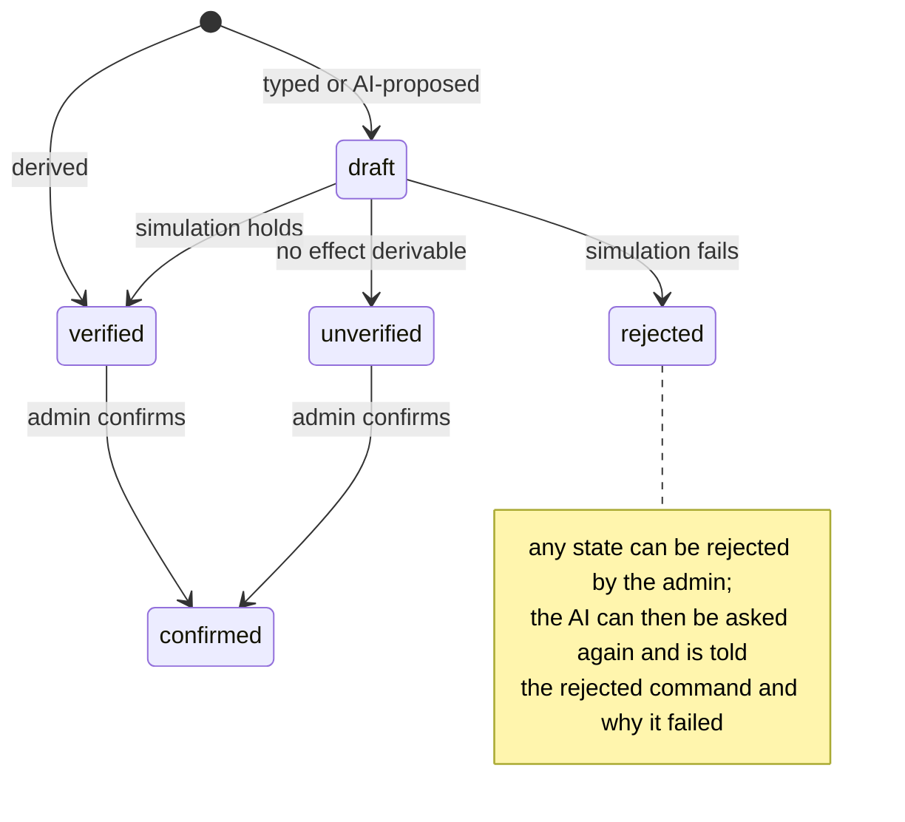
```mermaid
stateDiagram-v2
    [*] --> draft: typed or AI-proposed
    [*] --> verified: derived
    draft --> verified: simulation holds
    draft --> unverified: no effect derivable
    draft --> rejected: simulation fails
    verified --> confirmed: admin confirms
    unverified --> confirmed: admin confirms
    note right of rejected
        any state can be rejected by the admin;
        the AI can then be asked again and is told
        the rejected command and why it failed
    end note
```

* **Eligibility:** a decisive FAIL on an unconfirmed vendor. Heuristic or AI verdicts are refused (confirm the
  reading first); a confirmed vendor is refused with `409`.
* **Validation:** at most 2000 characters and 20 lines, no control characters; then *coverage*: a statement of the
  command must negate (`delete` / `no` / `unset` / `undo` / a `disable` keyword) the failing statement and name every
  word of its block path, and every statement must be about one of the cited lines.
* **Simulation:** the cited statements are removed from an **in-memory copy**, re-read by the generic engine
  (no AI) and every control re-evaluated. The upload is never modified.
* **Derived candidates** (`derive`) only for `DERIVABLE_KINDS` (prohibitions and relational controls). A requirement
  or threshold control is refused, because deleting an idle timeout would make the check stop failing while
  leaving the device worse. A block opener is never removed on its own (`block_openers`).
* **Outcome:** `verified` when the control no longer FAILs (typically `FAIL → NOT_CONFIGURED`: absence is never a
  PASS), nothing else got worse and the copy is still generic; `rejected` when the simulation does not hold;
  `unverified` when no effect could be derived.
* A verified candidate keeps the exact copy it was verified against (`verified_config`), downloadable from
  `POST /api/remediation/candidate/download`. Every other status clears it.
* A candidate changes nothing else: not results, posture, coverage, findings or `/download-fixed`. It lives in the
  scan's memory only and is never persisted as knowledge.

### 12.4 Final review

`POST /api/remediation/final` (the Fix page's **Next**) builds one file per device from every verified fix plus every
confirmed candidate whose effect could be simulated, rescans it once, and returns before / after posture, what was
included and what must be done by hand. `/download-fixed` with `include_confirmed: true` downloads exactly that file.

| | Confirmed vendor | Unconfirmed vendor |
|---|---|---|
| Change comes from | A fixed recipe | A reviewed recognizer (write-back), or text derived, typed or AI-proposed |
| Verified by | Full rescan as the confirmed vendor | Rescan or simulation on a copy, re-read by the generic engine |
| Download | `POST /api/download-fixed` | `/download-fixed` for write-back fixes; `/remediation/candidate/download` for one verified candidate |
| Claim | This change is deterministic for this vendor | This text removes the finding from **this file**; not known to be safe for the device |

NetAuditAI performs detection → candidate remediation → verification against the file → human confirmation. It
does **not** execute commands on devices.

---

## 13. Framework views

`app/controls/frameworks.py` regroups the scan's control results by framework requirement; nothing is evaluated
again. Mappings live in the catalog with exact versions:

| Framework | Version in the catalog | Mappings | Applies to |
|---|---|---|---|
| NIST SP 800-53 | Rev. 5 (OSCAL release 5.2.0) | 49 | every control, every vendor |
| ISO/IEC 27001:2022 | Annex A | 46 | every control, every vendor (evidence towards an organisational control, never proof it is met) |
| DISA | Network Device Management SRG V4 | 21 | only requirements a control actually answers |
| CIS | Cisco IOS XE 17.x v2.2.1 (L1 16, L2 1) and v2.1.0 (L1 1) | 18 | confirmed Cisco IOS only |
| CIS | FortiGate 7.4.x v1.0.1 (L1 12, L2 1) | 13 | confirmed FortiGate only |

Those 147 mappings point at **78 distinct requirements** (`GET /api/catalog`, the Rules catalog page): NIST 25,
CIS 27, DISA SRG 10, ISO 16.

A requirement is FAIL if any mapped control FAILs decisively, PASS only if every applicable mapped control PASSes
decisively, PARTIAL if some pass and the rest are undecided, NOT_CONFIGURED if every mapped control is, otherwise
UNKNOWN. Provisional verdicts mark a requirement `provisional` and never make it PASS or FAIL. PCI DSS and CIS
Controls v8 are **not mapped**: no mapping was verified.

---

## 14. Reporting and the audit ledger

### 14.1 PDF reports

`app/reporting/report.py` builds the report in two steps: `report_blocks` produces a plain document model
(headings, paragraphs, tables, monospace blocks) and `render_pdf` lays it out with ReportLab. Tests read the model,
so what the report says is asserted without parsing PDF streams. Its input is the same redacted
`ScanResultResponse` the browser gets plus the remediation plan, so report and application cannot disagree.

Two variants: `full` (technical) and `executive` (one page). One device → a PDF; several → a zip of one PDF each.
Serial numbers and hardware inventory are printed only when the file states them.

### 14.2 Hash-chained ledger

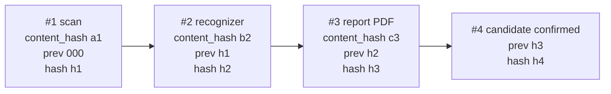
```mermaid
flowchart LR
    E1["#1 scan<br/>content_hash a1<br/>prev 000<br/>hash h1"] --> E2["#2 recognizer<br/>content_hash b2<br/>prev h1<br/>hash h2"]
    E2 --> E3["#3 report PDF<br/>content_hash c3<br/>prev h2<br/>hash h3"]
    E3 --> E4["#4 candidate confirmed<br/>prev h3<br/>hash h4"]
```

`app/ledger.py`: every archived scan state, taught recognizer, confirmed or rejected candidate and generated report
appends `hash = SHA-256(seq, at, kind, subject, content_hash, prev_hash)`. `content_hash` is the SHA-256 of the
redacted artefact, never a secret. Changing, deleting or reordering any entry breaks every hash after it, and
`GET /api/ledger/verify` names the first bad entry. A PDF (or a multi-device zip) can be checked byte for byte with
`POST /api/ledger/verify-report`. It is a hash chain in the project's own database, not a distributed ledger: it
proves the record was not edited, as long as the latest hash is kept elsewhere (the PDF prints it).

---

## 15. Legacy and deprecated parts

* `score` / `calculate_score`: deprecated penalty score, still returned for existing scripts.
* `adaptive_ai_for_known_vendors` (default off): the line-by-line interpreter, `FIELD_REGISTRY` AI vocabulary and the
  line review queue for confirmed vendors; its interpretations only reach the review queue.
* `generate_remediation` / `apply_remediation`: compatibility shims over the remediation engine (command text passed
  in is ignored).
* `NormalizedConfig`: the parsers' internal model; controls read facts, not this model.
* `app/remediation/templates/`: an empty legacy package.

See the [README](../README.md#known-limitations) for current limitations.
