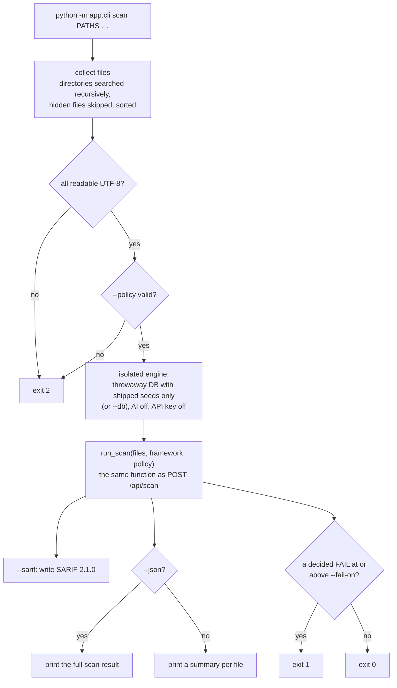

# Command line (CI pipelines)

Check configurations before they reach a device, the way code is checked before it is merged. Same engine as the web
app, no server, no AI.

```bash
cd backend
python -m app.cli scan ../configs/ --fail-on high --sarif netaudit.sarif
```

**Code:** `backend/app/cli.py` · **Tests:** `backend/tests/test_cli.py`

---

## 1. What it does



All files are scanned **together**, so the fleet checks (shared SNMP community, NTP / syslog mismatch) apply across
them.

---

## 2. Options

| Option | Meaning |
|---|---|
| `paths` | Files or directories (searched recursively; hidden files skipped). |
| `--fail-on low\|medium\|high\|critical` | Exit 1 when a **decided** FAIL at or above this severity exists. Default `high`. |
| `--framework` | `NIST_800_53`, `CIS`, `DISA_STIG` or `ISO_27001` (reporting only; every check still runs). |
| `--sarif FILE` | Also write SARIF 2.1.0: each decided FAIL on the first line it cites. |
| `--json` | Print the full scan result (the same JSON as `POST /api/scan`) instead of the summary. |
| `--policy FILE` | Check against an organisation policy ([policy.md](policy.md)). |
| `--db FILE` | Use this knowledge database (with what was taught there) instead of the shipped knowledge. |

| Exit code | Meaning |
|---|---|
| `0` | no decided FAIL at or above `--fail-on` |
| `1` | at least one decided FAIL at or above `--fail-on` |
| `2` | bad arguments, a missing path, unreadable or non-UTF-8 input, an invalid policy, or an input the scan refuses (empty, over 2 MB) |

---

## 3. Output

### Summary (default)

```text
../configs/edge.cfg: cisco_ios | score 41 | 6 problem(s)
  CRITICAL MGMT-001      Insecure Management Protocol (Telnet) Enabled (line 42,43)
  CRITICAL MGMT-003      Unrestricted Management Access (line 42)
  HIGH     LOG-001       No Remote Syslog Server Configured
  …
../configs/fw.conf: unknown | score 72 | 2 problem(s)
  …

4 decided problem(s) at or above high: FAILED
```

"score" is the device's **posture**. Each line lists a decided FAIL with up to three cited line numbers; a FAIL read
from absence has none.

### SARIF

Every decided FAIL becomes a SARIF result on the first line it cites (line 1 when it cites none, such as a missing
syslog server). Levels map from severity:

| Severity | SARIF level |
|---|---|
| critical, high | `error` |
| medium | `warning` |
| low | `note` |

```json
{
  "version": "2.1.0",
  "runs": [{
    "tool": {"driver": {"name": "NetAuditAI", "rules": [
      {"id": "MGMT-001", "shortDescription": {"text": "Insecure Management Protocol (Telnet) Enabled"},
       "fullDescription": {"text": "Is cleartext Telnet disabled for remote management?"}}]}},
    "results": [{
      "ruleId": "MGMT-001", "level": "error",
      "message": {"text": "Insecure Management Protocol (Telnet) Enabled: Telnet is allowed for remote management on line vty 0 4. …"},
      "locations": [{"physicalLocation": {"artifactLocation": {"uri": "configs/edge.cfg"}, "region": {"startLine": 42}}}]
    }]
  }]
}
```

---

## 4. Why it is safe in a pipeline

* **Deterministic.** AI is off whatever `.env` says (`ai_judge_max_calls_per_scan = 0`, Groq keys and `LOCAL_AI_URL`
  cleared), and by default a throwaway database holds only the shipped knowledge, so the same files always give the
  same result.
* **Nothing written** to the deployment's database, and nothing sent anywhere.
* **Only decided FAILs fail the build.** Suspected problems (heuristic) and AI proposals are in `--json` output but
  never block.
* **Redacted.** Summary, JSON and SARIF quote no password, key or community string.

---

## 5. GitHub Actions

```yaml
name: config-audit
on: [pull_request]
jobs:
  audit:
    runs-on: ubuntu-latest
    permissions: { contents: read, security-events: write }
    steps:
      - uses: actions/checkout@v4
      - uses: actions/setup-python@v5
        with: { python-version: "3.10" }
      - run: pip install -r backend/requirements.txt
      - run: cd backend && python -m app.cli scan ../configs --fail-on high --sarif ../netaudit.sarif
      - if: always()
        uses: github/codeql-action/upload-sarif@v3
        with: { sarif_file: netaudit.sarif }
```

The upload step shows each problem on its line in the pull request, under *Security → Code scanning*.

### GitLab CI

```yaml
config-audit:
  image: python:3.10
  script:
    - pip install -r backend/requirements.txt
    - cd backend && python -m app.cli scan ../configs --fail-on high --json > ../netaudit.json
  artifacts:
    when: always
    paths: [netaudit.json]
```

---

## 6. Recipes

```bash
# block only on critical problems, report everything
python -m app.cli scan ../configs --fail-on critical

# include what administrators taught on the server (copy its SQLite file first)
python -m app.cli scan ../configs --db ./adaptive.db

# your own baseline: 10-minute timeout, approved NTP / syslog servers
python -m app.cli scan ../configs --policy ../policy.json

# list every decided FAIL as JSON for another tool
python -m app.cli scan ../configs --json | jq '.results[] | select(.status=="fail" and (.assurance=="parser" or .assurance=="confirmed" or .assurance=="default"))'
```
