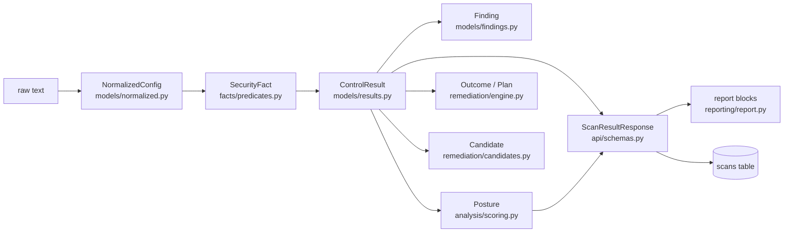
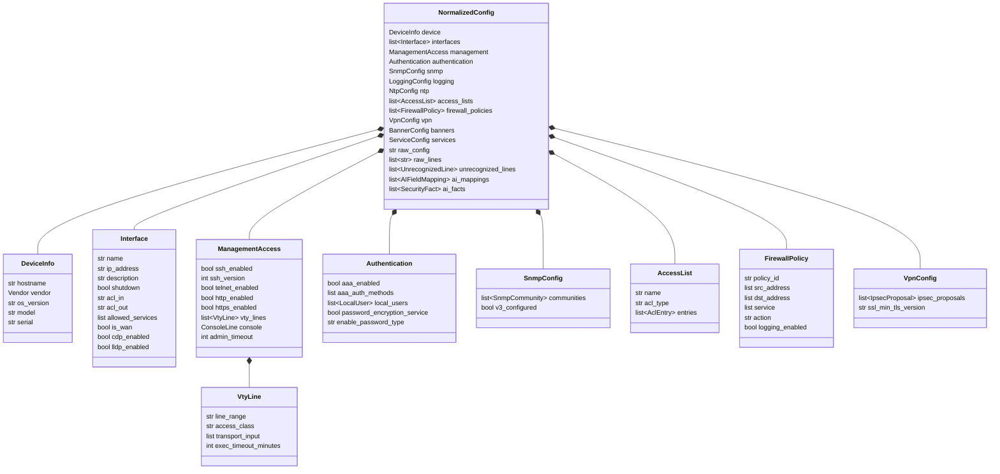
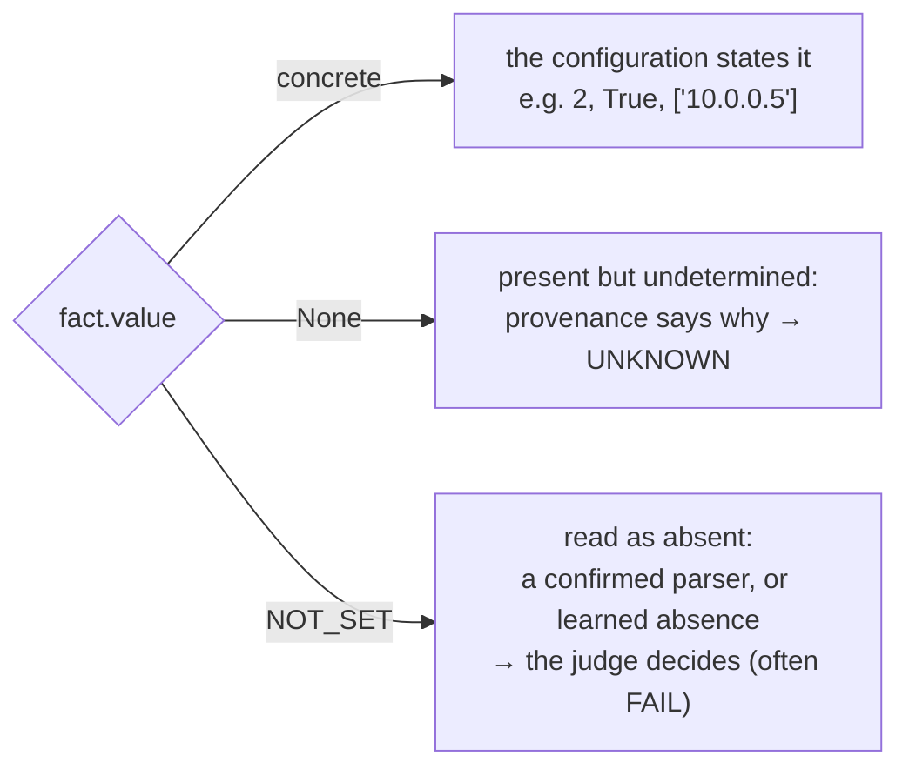
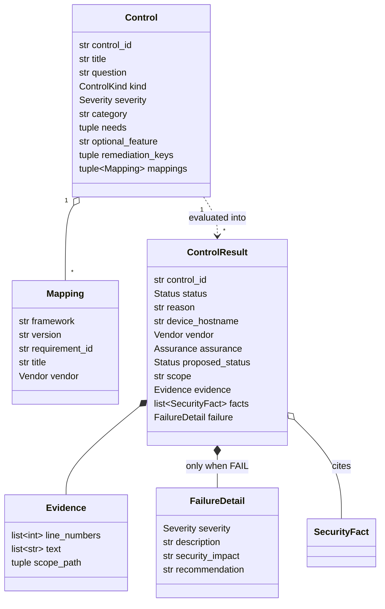
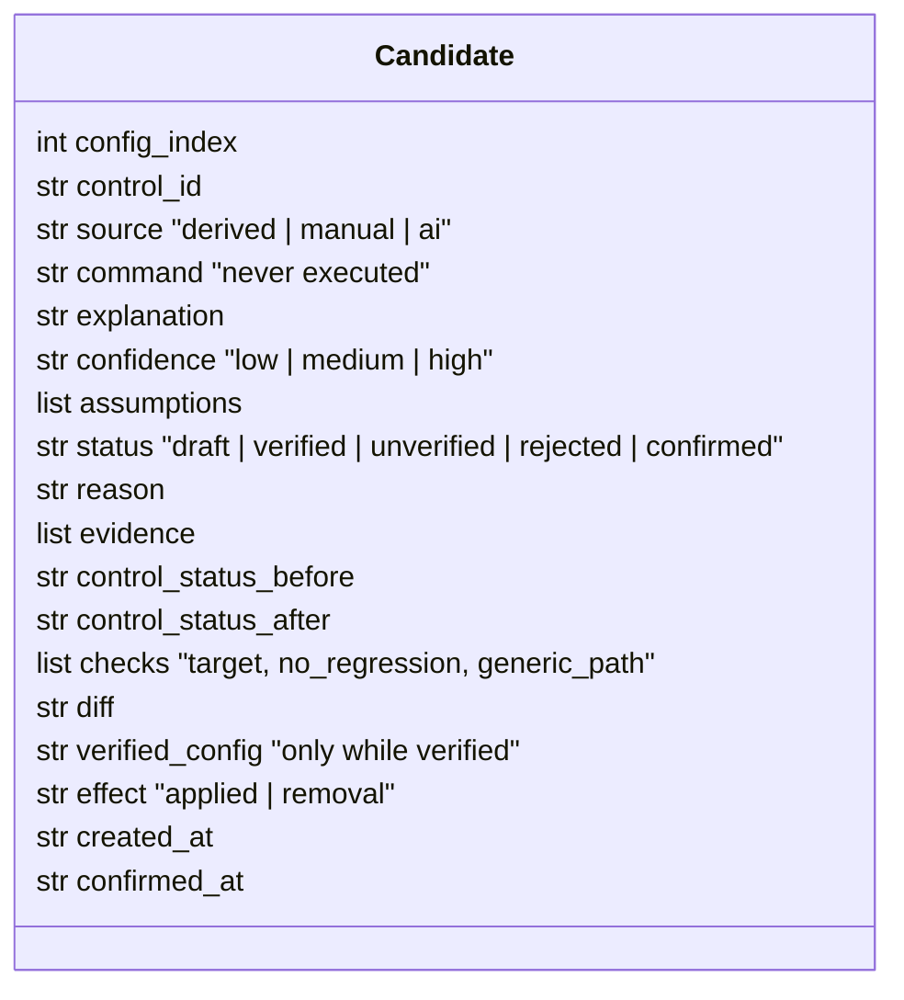
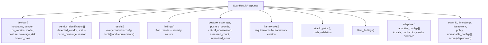
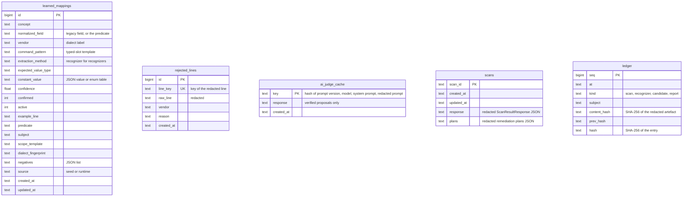

# Data Model

Every object a configuration passes through, from parsed text to API response, and every table that persists.
Field lists are taken from the code; the module is named in each heading.

**Related:** [architecture.md](architecture.md) (how the objects flow) · [api.md](api.md) (JSON shapes on the
wire) · [detection-rules.md](detection-rules.md) (which control reads which predicate)

---

## 1. The objects in order



Controls never read `NormalizedConfig` directly. They read `SecurityFact`s, which is what lets every control run on
every configuration regardless of which parser, recognizer or heuristic produced the facts.

---

## 2. `NormalizedConfig` (`app/models/normalized.py`)

The parsers' internal model. For a confirmed vendor it is filled by `CiscoIOSParser` or `FortinetParser`; for every
other configuration it carries only `raw_config`, `raw_lines`, `unrecognized_lines` and the AI / adaptive records.



Every sub-object also carries `source_lines: list[int]`, the line numbers it was read from. That list is what makes
every parser verdict citable.

| Class | Fields |
|---|---|
| `DeviceInfo` | `hostname`, `vendor`, `os_version`, `model`, `serial`, `source_lines` |
| `Interface` | `name`, `ip_address`, `subnet_mask`, `description`, `shutdown`, `acl_in`, `acl_out`, `allowed_services`, `is_wan`, `cdp_enabled`, `lldp_enabled`, `source_lines` |
| `ManagementAccess` | `ssh_enabled`, `ssh_version`, `ssh_timeout`, `ssh_retries`, `telnet_enabled`, `http_enabled`, `https_enabled`, `vty_lines`, `console`, `admin_timeout`, `source_lines` |
| `VtyLine` | `line_range`, `access_class`, `transport_input`, `exec_timeout_minutes`, `exec_timeout_seconds`, `login_method`, `source_lines` |
| `ConsoleLine` | `exec_timeout_minutes`, `exec_timeout_seconds`, `login_method`, `password_type`, `source_lines` |
| `Authentication` | `aaa_enabled`, `aaa_auth_methods`, `local_users`, `password_encryption_service`, `enable_password_type`, `source_lines` |
| `LocalUser` | `username`, `privilege`, `password_type`, `source_lines` (the password value is never kept) |
| `SnmpConfig` / `SnmpCommunity` | `enabled`, `communities`, `v3_configured` / `name`, `permission`, `acl` |
| `LoggingConfig` | `buffered`, `buffer_size`, `remote_hosts`, `trap_level`, `timestamps_enabled`, `timestamps_msec` |
| `NtpConfig` | `servers`, `authentication_enabled` |
| `AccessList` / `AclEntry` | `name`, `acl_type`, `entries` / `action`, `protocol`, `source`, `source_wildcard`, `destination`, `dest_wildcard`, `port`, `port_operator`, `log` |
| `FirewallPolicy` | `policy_id`, `name`, `src_interface`, `dst_interface`, `src_address`, `dst_address`, `service`, `action`, `logging_enabled`, `utm_enabled`, `nat_enabled`, `schedule` |
| `VpnConfig` / `IpsecProposal` | `ipsec_proposals`, `ssl_min_tls_version` / `name`, `encryption`, `hash_algorithm`, `dh_group`, `ike_version` |
| `BannerConfig` | `login_banner`, `motd_banner`, `pre_login_banner_enabled` |
| `ServiceConfig` | `ip_source_route`, `cdp_globally_enabled`, `lldp_globally_enabled`, `password_encryption` |
| `UnrecognizedLine` | `raw_line`, `line_number`, `vendor`, `context_before`, `context_after`, `structural_path`, `context_before_paths`, `context_after_paths` |
| `AIFieldMapping` (legacy interpreter) | `line_number`, `raw_line`, `normalized_field`, `extracted_value`, `confidence`, `confidence_tier`, `reasoning`, `source`, `status`, `likely_vendor`, `security_concept`, `final_value`, `mapping_id`, `reason` |

`Vendor` is `cisco_ios`, `fortinet`, `palo_alto` (declared, never set: there is no Palo Alto parser) or `unknown`.

---

## 3. `SecurityFact` (`app/facts/predicates.py`)

```python
@dataclass
class SecurityFact:
    predicate: str            # one of the 23 predicates below
    value: Any                # concrete value | None (undetermined) | NOT_SET (read as absent)
    assurance: Assurance      # parser | confirmed | default | heuristic | ai_verified
    evidence: Evidence        # line_numbers, text, scope_path
    subject: str | None       # telnet / http, cdp / lldp, enable / user <name> / console …
    scope: str | None         # the object it is about: "line vty 0 4", "interface port1", "acl 101"
    unit: str | None          # "min" for timeouts
    provenance: str           # where it came from, or why the value is undetermined
    control_id: str | None    # set on AI judge facts only: no other control may read them
```

### Predicates

| Predicate | Subject | Value | Read by |
|---|---|---|---|
| `mgmt.remote_access.protocol_enabled` | `telnet` / `http` | bool | MGMT-001, MGMT-002 |
| `mgmt.remote_access.source_restricted` | - | bool | MGMT-003 |
| `mgmt.remote_access.exposed_externally` | - | bool, scope = interface or zone | MGMT-010 |
| `mgmt.ssh.version` | - | int | MGMT-007 |
| `mgmt.session.idle_timeout` | - | number, unit `min` | MGMT-006 |
| `mgmt.crypto.weak_allowed` | - | bool | CRYPTO-002 |
| `auth.central_aaa.enabled` | - | bool | MGMT-008 |
| `auth.password.storage` | `enable` / `user <name>` / `console` | storage type (`plaintext`, `type7`, `type9_scrypt`, …) | MGMT-005 |
| `auth.password.encryption_service` | - | bool | MGMT-005 |
| `auth.login.max_attempts` | - | int | AUTH-001 |
| `auth.password.min_length` | - | int | AUTH-002 |
| `auth.account.name` | - | str, scope = the account | AUTH-003 |
| `snmp.community` | - | `{name, permission, acl}` | MGMT-004, MGMT-011 |
| `log.remote.destination` | - | list of hosts | LOG-001 |
| `time.ntp.server` | - | list of servers | LOG-002 |
| `time.ntp.authenticated` | - | bool | LOG-002 |
| `banner.login.present` | - | bool | MGMT-009 |
| `boundary.source_routing.enabled` | - | bool | BOUNDARY-002 |
| `boundary.discovery_protocol.enabled` | `cdp` / `lldp` | bool, scope = `global` or an interface | BOUNDARY-003 |
| `boundary.interface.unsafe_service` | `redirects` / `proxy-arp` / `directed-broadcast` | bool, scope = interface | BOUNDARY-004 |
| `boundary.policy.permit_any` | - | bool, scope = the ACL or policy | BOUNDARY-001 |
| `boundary.policy.logging` | - | bool, scope = the rule | LOG-003 |
| `crypto.ipsec.proposal` | - | `{encryption, hash, dh_group}` | CRYPTO-001 |

A predicate exists only if a control consumes it. Adding a question to NetAuditAI means one predicate plus one
control plus one judge.

### The three kinds of value



---

## 4. `Assurance` and `Status` (`app/models/results.py`)

| `Assurance` | Decisive | Source |
|---|---|---|
| `parser` | yes | confirmed Cisco IOS / FortiGate parser |
| `confirmed` | yes | shipped seed or administrator-confirmed recognizer, learned mapping, learned absence |
| `default` | yes | documented default of a confirmed vendor |
| `heuristic` | no | lexicon heuristic |
| `ai_verified` | no | AI judge proposal that passed the citation verifier |

| `Status` | Counted in posture | Counted in coverage |
|---|---|---|
| `pass` | yes, when decisive | yes, when decisive |
| `fail` | yes, when decisive | yes, when decisive |
| `unknown` | no | as undecided |
| `not_configured` | no | as undecided |
| `n_a` | no | no (not applicable) |

---

## 5. `Control`, `Mapping` and `ControlResult`



* `Control` (`app/controls/catalog.py`): `kind` is `prohibition`, `requirement`, `threshold` or `relational`;
  `severity` is `critical`, `high`, `medium` or `low`; `optional_feature` names the feature whose absence makes it
  N/A on a confirmed parser.
* `Mapping`: `framework` is `NIST_800_53`, `CIS`, `DISA_STIG` or `ISO_27001`; `vendor` is set only for product
  benchmarks (CIS for Cisco IOS or FortiGate).
* `ControlResult` (`app/models/results.py`): one per control per failing scope (several FAILs) or one per control
  otherwise. `failure` is present exactly when the status is FAIL. `proposed_status` is the AI's verdict awaiting
  confirmation; the status itself is then UNKNOWN.
* `Finding` (`app/models/findings.py`) is the view of a FAIL result used by the findings table; heuristic findings
  are labelled "Suspected".

---

## 6. Remediation objects

### `Outcome` and `Plan` (`app/remediation/engine.py`)

`Outcome`: `control_id`, `status` (`fixed`, `needs_input`, `manual_review`, `verification_failed`, `no_recipe`,
`vendor_unverified`, `provisional`, `not_failing`), `reason`, `explanation`, `warnings`, `scopes`, `evidence`,
`inputs` / `missing_inputs`, `diff`, `checks` (`vendor`, `parse_coverage`, `target`, `no_regression`), `before` /
`after` summaries and `fixed_config`. `Plan` holds the outcomes of every failing control of one configuration and
the combined verified output.

### `Candidate` (`app/remediation/candidates.py`)



`effect` says how the copy was produced: `applied` (reviewed recognizers read every line of the command, so it was
written into the copy) or `removal` (the cited statements were removed). `verified_config` is the edited **copy** the candidate was verified against, byte for byte the text the generic
engine re-analysed. Any status other than `verified` (or `confirmed` after verifying) clears it. Candidates live in
`_scan_store[scan_id]["candidates"]` for that scan only: never persisted, never applied to the stored
configuration, never part of the confirmed-vendor `/download-fixed` output. The API exposes a
`download_available` flag, never the text; the copy leaves the backend only through
`POST /api/remediation/candidate/download`.

### Operator inputs (`app/remediation/recipes.py: INPUTS`)

| Input | Validation | Used by |
|---|---|---|
| `syslog_server` | IPv4 address | LOG-001 (recipes and write-back) |
| `ntp_server` | IPv4 address | LOG-002 |
| `ntp_key_id` | 1 to 65535 | LOG-002 |
| `ntp_key` | 8 to 32 characters of `A-Z a-z 0-9 . _ + = @ % -` | LOG-002 |
| `banner_text` | the warning text shown before login | MGMT-009 (write-back) |
| `management_subnet` | IPv4 CIDR, not `/0` | MGMT-003 |

---

## 7. Scan response (`ScanResultResponse` in `app/api/schemas.py`)



Every configuration quote inside it (evidence, reasons, adaptive lines, fact values) is redacted with that
configuration's own secrets. Field-by-field descriptions are in [api.md](api.md#post-apiscan).

### Security Baseline Model (`GET /api/scan/{id}/baseline`)

The vendor-neutral export of one configuration, schema `netauditai.security-baseline/1`: `device`, `settings[]`
(`field`, `subject`, `scope`, `value`, `unit`, `assurance`, `lines[]`, `note`), `not_stated[]` (predicates nothing in
the file answers) and `read_by` (which checks read each field). A Cisco IOS file and a Junos file produce the same
fields.

### Resolution queue (`UnresolvedQueueResponse`)

The undecided side of coverage, built from the same `control_outcomes` as posture: `assessed_count`,
`unresolved_count` and `items[]`, each with the control, its `status` (`unknown` / `not_configured`), why it could
not be decided, the evidence it did cite, the `needs` predicates, `suggested_lines[]` and `action` (`teach`, or
`blocked` with a reason). `app/facts/teaching.py` turns an administrator's answer about one line into the asserted
candidate `draft_recognizer` validates.

---

## 8. Knowledge store and archive (`app/db/`)



| Table | Written by | Read by |
|---|---|---|
| `learned_mappings` | `MappingRepository.save_mapping` (Teach page, review queue, seed loader) | every scan (`facts/recognizers.py`, `adaptive/matcher.py`), Learned mappings page |
| `rejected_lines` | rejecting a provisional or review line | heuristics, AI judge, legacy interpreter (skip those lines) |
| `ai_judge_cache` | AI judge, only after at least one proposal verified | AI judge (re-verified on every hit) |
| `scans` | `archive_scan` after every scan, re-evaluation and plan | `GET /api/scan/{id}` after a restart, drift, History |
| `ledger` | `app/ledger.py: append` | `/api/ledger`, `/api/ledger/verify`, `/api/ledger/verify-report`, PDF footer |

SQLite migrations are tracked with `PRAGMA user_version` (6 versions); Postgres uses a `schema_version` table and the
same SQL (`app/db/database.py`).

### Recognizer row, by example

```json
{
  "concept": "Telnet service",
  "vendor": "Palo Alto PAN-OS",
  "predicate": "mgmt.remote_access.protocol_enabled",
  "subject": "telnet",
  "command_pattern": "set deviceconfig system service disable-telnet {enum:disabled}",
  "constant_value": "{\"no\": true, \"false\": true, \"yes\": false, \"true\": false}",
  "example_line": "set deviceconfig system service disable-telnet no",
  "extraction_method": "recognizer",
  "confirmed": 1,
  "active": 1,
  "source": "seed"
}
```

The value table inverts the word: `disable-telnet no` means Telnet **is** on. That is exactly the kind of
knowledge a lexicon gets wrong and a reviewed recognizer gets right.

---

## 9. Report document model (`app/reporting/report.py`)

The per-device report is a list of blocks (`h1` / `h2` / `h3` / `p` / `note`, `table`, `mono`), rendered to PDF by
`render_pdf`. It is built from the redacted `ScanResultResponse` plus the remediation plan; nothing is evaluated
there. Tests assert on the block list, not on PDF bytes.
