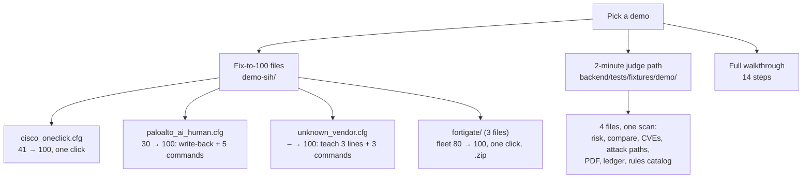
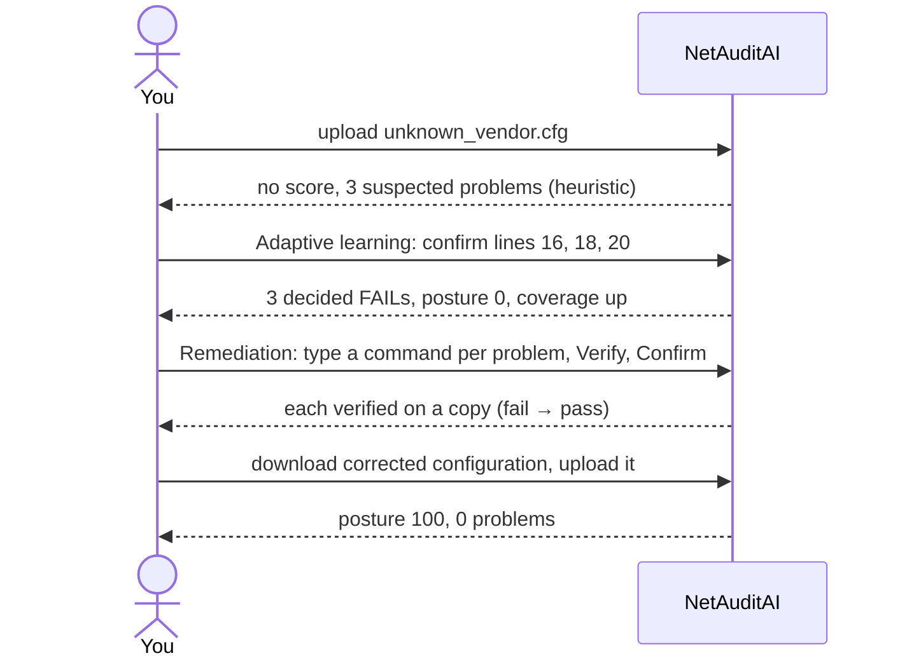

# Demo Script (SIH)

The three files in `demo-sih/` each go from a bad first scan to posture 100 (see its README).
The two-minute judge path below uses the earlier demo configurations, now in `backend/tests/fixtures/demo/`.

## Demo map

## Fix-to-100 flows (`demo-sih/`)

Each file goes from a bad first scan to **posture 100 with 0 problems** once the corrected file is rescanned, pinned by
`backend/tests/test_demo_fix_to_100.py`. The commands to type are in [demo-sih/README.md](../demo-sih/README.md).

| File | First scan | How it gets to 100 | What it shows |
|---|---|---|---|
| `cisco_oneclick.cfg` | posture 41, 15 problems | Remediation → *Download corrected configuration* → upload it | deterministic recipes, every one verified by rescan, no input needed |
| `paloalto_ai_human.cfg` | posture 30, 10 problems | 5 fixed by seed write-back (Telnet, HTTP, SSH v1, idle timeout, LLDP); 5 by a typed or AI-drafted command, each verified and confirmed | no parser, yet reviewed recognizers both read and write the dialect |
| `unknown_vendor.cfg` | no score, 3 suspected problems | teach lines 16, 18, 20 under **Adaptive learning** → problems become decided (posture 0) → 3 verified commands | learning without AI or redeployment |
| `fortigate/` (3 files, one upload) | fleet posture 80, 13 problems | one click; the download is a `.zip` of 3 corrected files | fleet view (NTP mismatch across devices), attack path closed by the fix |

Taught knowledge is kept: to repeat the unknown-vendor flow, stop those three recognizers first under
**Adaptive learning → Learned mappings**.

## The 2-minute judge path

Four files in one scan: a parser-read Cisco router, and three dialects with no parser at all (PAN-OS, brace-style
Junos, Terraform). Machine seconds are measured by the automated browser test that runs this exact path
(`cd frontend && npx playwright test`, which writes `demo-timings.json`); the talking time is our budget.

| # | Step | Machine (measured) | Talk (budget) |
|---|---|---|---|
| 1 | **New scan:** add `backend/tests/fixtures/demo/cisco_edge_vulnerable.cfg`, `paloalto_fw_vulnerable.cfg`, `juniper_edge_braces.conf` and `aws_edge.tf` together, set *How important is this device?* to **High**, tick **faces the internet**, **Start scan**. Overview: risk **CRITICAL**, *Across 4 devices*, "the same SNMP community string is used on 2 devices". | 9.7 s | 15 s |
| 2 | **Compare the devices field by field:** Cisco (parser), PAN-OS and Junos (shipped knowledge) and Terraform land in the *same* vendor-neutral fields from completely different syntax. | 13.1 s | 10 s |
| 3 | **Devices:** each platform as it was read. The Cisco router states IOS-XE 16.9: *Known CVEs for 16.9*, 4 critical and 72 high in NVD, top five linked, with the caveat "context, not an assessment" (offline cache). | 0.1 s | 15 s |
| 4 | **Attack paths:** "Remote takeover through the management plane": reach the login → capture the password → log in as admin, every step citing its line; "Break it: fix MGMT-003". Under it: *each path and its fix were checked against a positive and a negative configuration (commit …)*. | 0.1 s | 20 s |
| 5 | **Executive summary (PDF)** (four devices: a .zip of one PDF each). | 6.5 s | 5 s |
| 6 | **Audit ledger → Verify the ledger** (intact), then **Check a report PDF** with the file just downloaded: "Genuine"; change one byte: "Not found". | 0.5 s | 15 s |
| 7 | **Rules catalog:** 23 checks answer 78 requirements. Close on the numbers: 18/20 planted; 89/112 on labelled fixtures; **held-out, never-seen real configs 21/21** (first run 20/21, the miss was a parser bug, fixed); 0 false alarms; 0 of 6 prompt-injection attacks succeeded. | 0.1 s | 10 s |
| | **Total: 30 s on screen + 90 s of talk = 2 min** | **30 s** | **90 s** |

Teaching an unknown line is left out of the two minutes (it needs about 40 s on its own): it is step 7 of the full
walkthrough below.

## The full walkthrough

Uses files in the repository. Run with AI off (no Groq key) unless step 9 is shown; check the Groq quota first if it is.
Start from an empty recognizer database for a clean replay (`ADAPTIVE_DB_PATH` pointing at a new file). A new file
is not empty for long: the shipped seed recognizers load into it on first use, which is what steps 6a and 8 show.

1. **Problem.** Multi-vendor configurations are audited by hand; a tool that guesses is worse than none.
2. **Upload `backend/tests/fixtures/cisco_vulnerable.cfg`.** The **Overview** page names the device
   "Cisco IOS -read by a dedicated parser": posture 0, coverage 100%, problems by severity. Open MGMT-001 in the
   drawer (from **Findings**): cited lines, impact, NIST / CIS mappings. With AI on, *Explain this* adds a
   plain-language explanation labelled *AI-written, commentary, not evidence*.
3. **Frameworks** (sidebar, under *Intelligence*). NIST SP 800-53 Rev. 5, the DISA NDM SRG, ISO/IEC 27001:2022 Annex A and the Cisco CIS benchmark: requirement status comes from the same control
   results; point out the "not a certification" note.
4. **Remediation.** The page groups the problems into *can be fixed automatically*, *needs your input*, *needs manual action*
   and *cannot be fixed safely* (weak passwords, AAA lockout risk, any-any ACL). Enter a syslog server, NTP key ID and key, and a management subnet; regenerate. Expand a
   fixed control: cited evidence → diff → rescan checks → posture before/after. Download, then upload the downloaded
   file: vendor still confirmed, posture 72, remaining findings exactly the three human-review controls.
5. **Upload `backend/tests/fixtures/fortinet_vulnerable.cfg`.** Same controls, FortiGate facts. Its PDF report (step 13) names the model `FG100F` and firmware `7.0.5 build0304`, read from the file's `#config-version=` header. Posture 4, coverage 82%,
   *critical not assessed: MGMT-005* -the FortiGate parser does not read password storage, and the tool says so.
6. **Upload `sample/unknown.cfg`.** "Unfamiliar device -checked with generic analysis"; no vendor commands are generated. Posture "-",
   coverage 0. Provisional results: *Suspected FAIL* Telnet on lines 70–71 with evidence, never scored.
7. **Adaptive learning.** The page asks in plain language what an unfamiliar line means. Confirm line 71 for MGMT-001: drafted template `remote-console protocol {enum:protocol}`,
   gates, replay diff. Save: MGMT-001 becomes a decisive *confirmed* FAIL, coverage rises, zero AI calls.
8. **Restart the backend and upload `sample/unknown.cfg` again.** The recognizer is reused from the knowledge store (see **Adaptive learning → Learned mappings**): still decisive,
   still no AI. Upload `sample/paloalto.cfg`: still generic analysis and no invented parser, but Telnet, HTTP
   management and the syslog servers are already decisive -that is shipped seed knowledge, not learning. Open
   **Adaptive learning → Learned mappings** and switch between *Shipped* and *Taught here*.
9. **Upload `backend/tests/fixtures/seed_dialects/huawei.conf`** -a dialect nobody taught this deployment. Five
   controls are answered decisively out of the box (Telnet, HTTP management, session timeout, remote syslog, NTP),
   coverage is above 0, and every one cites a real line. AAA stays `NOT_CONFIGURED` rather than being guessed:
   nobody taught how Huawei writes an AAA server, so its absence is not read as a missing setting. (On
   `backend/tests/fixtures/demo/paloalto_fw_vulnerable.cfg`, where PAN-OS knowledge does know it, the missing AAA server, syslog server
   and banner are decided FAILs that say how PAN-OS would write them; **Fix** asks for the syslog server and banner
   text and adds those lines.) Now **teach** the SSH-version line under **Adaptive learning**: the taught recognizer and the shipped ones are used
   side by side on the rescan. See [seed-knowledge.md](seed-knowledge.md).
10. **Remediation, for the unconfirmed vendor -one click.** Press **Fix it for me**. NetAuditAI derives the change from
    the configuration itself (`delete system services telnet`, built from the file's own block path), applies it to a
    **copy**, re-reads the copy with the generic engine and shows `target`, `no_regression` and `generic_path` all
    passing -no AI, no vendor grammar, nothing taught. Then point at what it refuses: **Fix it for me** never appears
    for a check that needs a setting *added*, and it will not delete an idle timeout to make a threshold check stop
    failing. Those stay with the person who owns the command.
11. **Remediation, the other two ways.** The problem is **"Needs your command"**, not a dead end. Press
    *Generate candidate fix* (AI on) or *Enter command manually* and type `delete system services telnet;`. The
    candidate is labelled **AI-generated candidate · Not checked yet** and NetAuditAI has changed nothing.
    Press *Verify candidate*: it is applied to a **copy** of the uploaded file, the copy is re-read by the generic
    engine, and MGMT-001 moves **fail → not_configured** with `target`, `no_regression` and `generic_path` all
    passing. Press *Confirm*. Point out what the page says and does not say:
    * "Verified against this configuration" -the command removes the finding from the uploaded **file**;
    * it does **not** say the command is safe to run on the device, and it does not say the device was changed;
    * posture, coverage and the findings do not move: the problem is still a problem until the device is changed
      and scanned again, and *Download corrected configuration* still refuses (`409`) -NetAuditAI writes no device
      configuration for a vendor it could not confirm.
    Then press **Download verified corrected copy**. That file is the configuration you uploaded with this one
    change, exactly as it was re-analysed -the page says so: *"Verified against a copy of your uploaded
    configuration. This file has not been applied to a device."* Before verifying, that button does not exist.
12. **(Optional, AI on.)** The judge is asked only about undecided controls, with a redacted excerpt; a verified answer
    appears as "AI proposes …, awaiting confirmation" and changes neither posture nor coverage.
13. **Download the PDF report** (*Download PDF report*, on Overview). One PDF per device: device identification,
    posture and coverage, every control with the assurance behind it and the lines it cites, the framework view,
    the remediation paths, and the checks still needing input. Two things to point at: the passwords and SNMP
    community strings are redacted in the report exactly as in the browser, and the identification section states
    plainly that serial numbers and hardware inventory are not in a configuration file rather than inventing them.
14. **Close.** Architecture: parser or tokenizer → facts → controls → posture + coverage → AI only for what is
    unresolved → human confirmation → recognizer → future scans; remediation only where it can be verified.

NetAuditAI does five separable things, and only the first four:

| # | Stage | NetAuditAI |
|---|---|---|
| 1 | Detection -is there a problem, on what evidence? | yes |
| 2 | Candidate remediation -what command would change it? | yes, proposed by a person or the AI, never invented as fact |
| 3 | Verification -does that change remove the finding from this configuration? | yes, on a copy, deterministically |
| 4 | Human confirmation -does an administrator accept it? | yes, required |
| 5 | Execution on the physical device | **no** -NetAuditAI reads a device (live collection) but never writes to one |

Do not claim dedicated support for vendors other than Cisco IOS and FortiGate, AI-decided compliance, or automatic
learning without confirmation.
