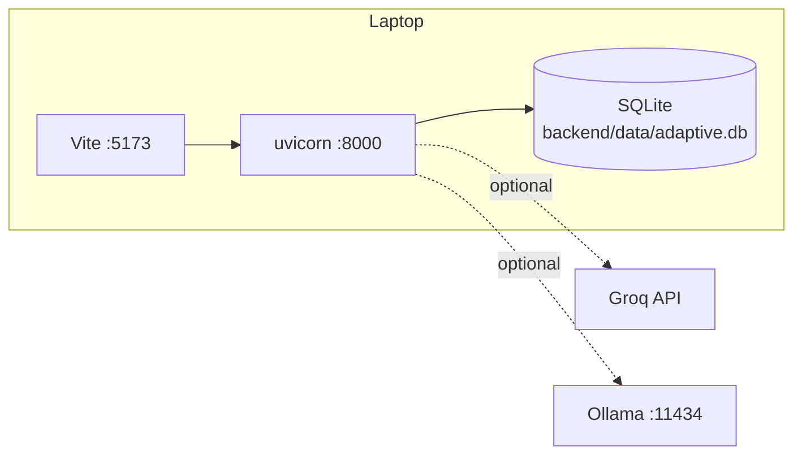
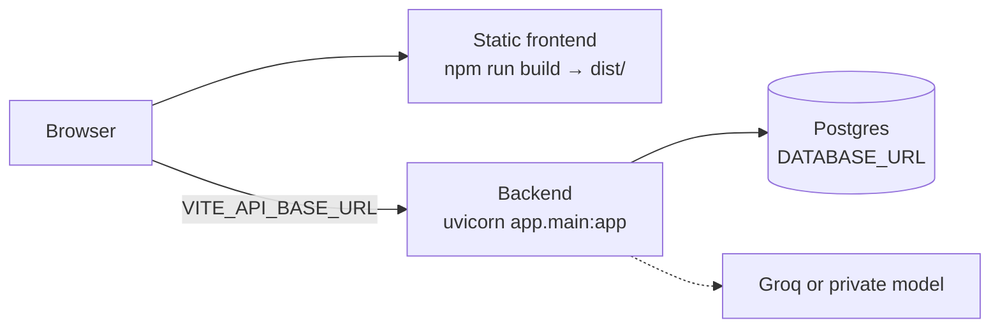

# Deployment

*Status: built and tested for a local hackathon deployment. Not production-ready; the gaps are listed below.*

---

## 1. Local (the supported deployment)

The whole stack runs on one laptop for the demo.

* **Backend:** uvicorn on `localhost:8000`, configured by `backend/.env`.
* **Frontend:** Vite on `localhost:5173`; `VITE_API_BASE_URL` must point at the backend.
* **Storage:** uploads are never written to disk; the active scans are held in memory. Recognizers, learned mappings,
  rejected lines (redacted), the AI judge cache, the redacted scan archive and the ledger persist in SQLite. Seed
  recognizers load into a fresh database automatically, so there is no setup step for them. The UI keeps scan
  summaries in browser storage.
* **AI:** optional. Check the Groq daily quota before a demo; keys in the same organization share it. When it runs
  out, the AI judge is skipped and every check keeps its deterministic and heuristic result.

---

## 2. A hosted instance (for example Render + Supabase)

| Concern | Setting |
|---|---|
| Host wipes its disk on restart | `DATABASE_URL` to Postgres, or every taught recognizer and the archive are lost |
| Collection from a public host | `LIVE_COLLECTION_ENABLED=false` |
| Who may call the API | `API_KEY`, plus a proxy that adds `X-API-Key` for the UI |
| Which sites may call it from a browser | `CORS_ORIGINS=https://your-frontend.example` |
| Build the frontend for that backend | `VITE_API_BASE_URL=https://your-backend.example/api npm run build` |

Backend start command: `uvicorn app.main:app --host 0.0.0.0 --port $PORT` from `backend/`.

The in-memory scan store is per process: run **one** worker. With several workers, a scan created on one worker is
not held by another, and teaching or fixing it would answer `409` there.

---

## 3. Hardening an exposed instance

Do all of these before anyone other than you can reach the backend:

- [ ] `LIVE_COLLECTION_ENABLED=false`. The endpoint opens SSH sessions to hosts it is given; on a public host that is
      a pivot into whatever network the backend can see.
- [ ] Never `LIVE_COLLECTION_NETWORKS=any` on a public host. `private` (default) is what stops the endpoint becoming a
      server-side request forgery, including to the cloud metadata address.
- [ ] `API_KEY` set, and a reverse proxy that injects `X-API-Key` for the bundled UI (the UI does not send it).
      `/health` stays open for load balancers.
- [ ] `CORS_ORIGINS` set to the frontend's origin(s) instead of `*`.
- [ ] `DATABASE_URL` set on any host that loses its disk on restart.
- [ ] HTTPS in front of both frontend and backend (uploads carry secrets).
- [ ] A single uvicorn worker (see above).
- [ ] Record the latest ledger hash somewhere outside the database if the audit trail matters (`GET /api/ledger/verify`
      returns `head`).

---

## 4. What production would still need

These are known gaps, not configuration options:

1. **Users and roles.** Today there is one optional shared key. Recognizer confirmation, remediation downloads and
   collection should each be a permission, with the acting user recorded in the ledger.
2. **Shared scan state.** Active scans live in process memory; a production deployment needs them in a store that
   several workers can share, encrypted at rest, with expiry.
3. **Rate limiting** on every route, and on AI-backed routes in particular (the AI budget is per scan, not per
   client).
4. **Containers.** No Dockerfile ships; the backend is a plain ASGI app and the frontend a static build.
5. **Secrets handling** for typed operator values (NTP key) beyond memory for the life of a scan.
6. **An external anchor for the ledger** (for example a periodic signed export of the head hash).

See [security-model.md §8](security-model.md#8-not-protected-prototype) for the threat-side view of the same list.
