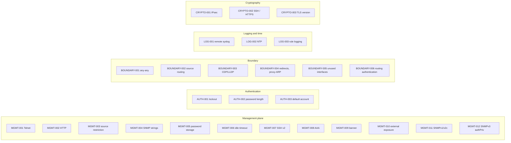

# Controls Reference

The 27 security checks in `backend/app/controls/catalog.py`, how each one is decided, which configuration lines feed
it on every path, how it is fixed, and which framework requirements it answers.

This file is generated by `backend/scripts/build_detection_rules.py` from the catalog, the shipped recognizers and
the recipe table, plus hand-written notes checked against `app/controls/judges.py` and `app/facts/from_normalized.py`. Framework mappings, seed counts and
recipe availability are therefore exactly what the code ships.

**How to read a section**

* **Reads**: the predicate(s) the check consumes ([data-model.md](data-model.md#predicates)).
* **PASS / FAIL / UNKNOWN when**: what the judge decides for one fact. Combination across facts is always: any FAIL →
  FAIL per failing scope; else any UNKNOWN → UNKNOWN; else PASS with a cited line or a documented default; else
  NOT_CONFIGURED (or N_A / UNKNOWN, see [architecture.md §6](architecture.md#6-controls-and-controlresult)).
* **Cisco IOS / FortiGate**: what the confirmed parser reads. **Generic path**: what shipped recognizers read for
  other dialects (heuristics may read more, provisionally).
* **Fix**: the deterministic recipe for a confirmed vendor, and what an unconfirmed vendor can get.
* "Policy" means the organisation policy can tighten the limit ([policy.md](policy.md)).

---

## Summary

| ID | Severity | Kind | Check | Recipes | Shipped seeds |
|---|---|---|---|---|---|
| [MGMT-001](#mgmt-001) | Critical | prohibition | Insecure Management Protocol (Telnet) Enabled | Cisco IOS, FortiGate | 15 |
| [MGMT-002](#mgmt-002) | High | prohibition | Insecure HTTP Management Enabled | Cisco IOS, FortiGate | 14 |
| [MGMT-003](#mgmt-003) | Critical | relational | Unrestricted Management Access | Cisco IOS, FortiGate | 46 |
| [MGMT-004](#mgmt-004) | Critical | prohibition | Weak or Default SNMP Community Strings | Cisco IOS, FortiGate | 22 |
| [MGMT-005](#mgmt-005) | Critical | prohibition | Plaintext or Weakly Encrypted Passwords | Cisco IOS | 17 |
| [MGMT-006](#mgmt-006) | Medium | threshold | Missing or Disabled Session Timeout | Cisco IOS, FortiGate | 17 |
| [MGMT-007](#mgmt-007) | High | prohibition | SSH Version 1 or Weak SSH Configuration | Cisco IOS, FortiGate | 7 |
| [MGMT-008](#mgmt-008) | High | requirement | AAA (Authentication, Authorization, Accounting) Not Configured | Cisco IOS | 26 |
| [MGMT-009](#mgmt-009) | Low | requirement | Missing Login Banner | Cisco IOS, FortiGate | 14 |
| [MGMT-010](#mgmt-010) | Critical | prohibition | Management Reachable from an Untrusted Interface | FortiGate | 2 |
| [MGMT-011](#mgmt-011) | High | prohibition | SNMPv1/v2c in Use | Cisco IOS, FortiGate | 22 |
| [MGMT-012](#mgmt-012) | High | prohibition | SNMPv3 Without Authentication and Encryption | Cisco IOS, FortiGate | 4 |
| [AUTH-001](#auth-001) | High | threshold | No Login Brute-Force Protection | Cisco IOS, FortiGate | 15 |
| [AUTH-002](#auth-002) | Medium | threshold | Weak Password Policy | Cisco IOS, FortiGate | 10 |
| [AUTH-003](#auth-003) | Medium | prohibition | Default Administrator Account in Use | Cisco IOS, FortiGate | 16 |
| [BOUNDARY-001](#boundary-001) | Critical | relational | Overly Permissive Firewall/ACL Rules | Cisco IOS, FortiGate | 35 |
| [BOUNDARY-002](#boundary-002) | Medium | prohibition | IP Source Routing Enabled | Cisco IOS, FortiGate | 9 |
| [BOUNDARY-003](#boundary-003) | Medium | prohibition | Discovery Protocol (CDP/LLDP) Enabled on External Interface | Cisco IOS, FortiGate | 11 |
| [BOUNDARY-004](#boundary-004) | Medium | prohibition | Router Interface Hardening (Redirects, Proxy-ARP, Directed Broadcast) | Cisco IOS | 11 |
| [BOUNDARY-005](#boundary-005) | Medium | prohibition | Unused Interfaces Left Enabled | Cisco IOS, FortiGate | 0 |
| [BOUNDARY-006](#boundary-006) | Medium | requirement | Routing Protocol Without Authentication | Cisco IOS, FortiGate | 0 |
| [LOG-001](#log-001) | High | requirement | No Remote Syslog Server Configured | Cisco IOS, FortiGate | 19 |
| [LOG-002](#log-002) | Medium | requirement | NTP Not Configured or Unauthenticated | Cisco IOS, FortiGate | 29 |
| [LOG-003](#log-003) | Medium | requirement | Traffic Rules That Do Not Log | FortiGate | 1 |
| [CRYPTO-001](#crypto-001) | High | threshold | Weak VPN/IPsec Cryptographic Algorithms | Cisco IOS, FortiGate | 27 |
| [CRYPTO-002](#crypto-002) | High | prohibition | Weak Management Cryptography (SSH/HTTPS) | Cisco IOS, FortiGate | 17 |
| [CRYPTO-003](#crypto-003) | Medium | threshold | Weak TLS for Web Management | Cisco IOS, FortiGate | 2 |

### Severity weights

| Severity | Weight in posture | Controls |
|---|---|---|
| Critical | 10 | MGMT-001, MGMT-003, MGMT-004, MGMT-005, MGMT-010, BOUNDARY-001 (6) |
| High | 6 | MGMT-002, MGMT-007, MGMT-008, MGMT-011, MGMT-012, AUTH-001, LOG-001, CRYPTO-001, CRYPTO-002 (9) |
| Medium | 3 | MGMT-006, AUTH-002, AUTH-003, BOUNDARY-002, BOUNDARY-003, BOUNDARY-004, BOUNDARY-005, BOUNDARY-006, LOG-002, LOG-003, CRYPTO-003 (11) |
| Low | 1 | MGMT-009 (1) |

A failing result can carry its own severity (MGMT-004 is critical for a read-write community, high for read-only;
MGMT-005 high for a missing encryption service, critical for a weak password; LOG-001 / LOG-002 medium for an
unapproved server). The posture weight uses the worst failing severity.

---

## MGMT-001

**Insecure Management Protocol (Telnet) Enabled**  
*Is cleartext Telnet disabled for remote management?*

Severity **critical** · kind `prohibition` · category `management`

| | |
|---|---|
| Reads | `mgmt.remote_access.protocol_enabled` with subject `telnet` |
| PASS when | every fact says Telnet is off |
| FAIL when | a fact says Telnet is on (one FAIL per VTY range, interface or block that allows it) |
| UNKNOWN when | Telnet is mentioned but on/off cannot be read; IOS VTY lines with no `transport input` (the default differs by release) |
| Cisco IOS | VTY `transport input` (`telnet` or `all` = on; `ssh` only = off) |
| FortiGate | `telnet` in an interface `allowaccess` list |
| Generic path | Junos `services { telnet; }` / `set system services telnet`, PAN-OS `disable-telnet no`, Huawei `telnet server enable` / `undo telnet server enable`, RouterOS `/ip service set telnet disabled=yes`, Aruba `no telnet server`, EXOS `disable telnet`, Gaia `set telnet-server enabled false`, Arista `no management telnet`, NX-OS `feature telnet`, Dell OS10 `ip telnet server enable` / `no …`, IOS-XR `telnet vrf … ipv4 server`; documented defaults: NX-OS and ASA Telnet off unless a line enables it |
| Shipped seeds | 15: Huawei VRP 2, Juniper Junos 2, MikroTik RouterOS 2, Palo Alto PAN-OS 2, Arista EOS 1, Check Point Gaia 1, Cisco IOS-XR 1, Cisco NX-OS 1, Dell OS10 1, Extreme Networks EXOS 1, HPE Aruba AOS-CX 1 |
| Fix: Cisco IOS | `transport input ssh` on every failing VTY range |
| Fix: FortiGate | remove `telnet` from `allowaccess` on the interface |
| Fix: other vendors | seed write-back flips the slot (`disable-telnet no` → `yes`, `telnet yes` → `no`); a removal candidate (`delete system services telnet`) can be derived |
| Recipes in `recipes.py` | Cisco IOS, FortiGate |

| Framework | Version | Requirement | Title |
|---|---|---|---|
| NIST SP 800-53 Rev. 5 | SP 800-53 Rev. 5 (5.2.0) | AC-17(2) | Protection of Confidentiality and Integrity Using Encryption |
| NIST SP 800-53 Rev. 5 | SP 800-53 Rev. 5 (5.2.0) | SC-8 | Transmission Confidentiality and Integrity |
| CIS (Cisco IOS only) | Cisco IOS XE 17.x Benchmark v2.2.1 (Level 1) | 1.2.2 | Set 'transport input ssh' for 'line vty' connections |
| CIS (FortiGate only) | FortiGate 7.4.x Benchmark v1.0.1 (Level 1) | 2.4.5 | Ensure only encrypted access channels are enabled |
| DISA NDM SRG | Network Device Management SRG V4 | SRG-APP-000142-NDM-000245 | The network device must be configured to prohibit the use of all unnecessary and nonsecure functions, ports, protocols, and services |
| DISA NDM SRG | Network Device Management SRG V4 | SRG-APP-000412-NDM-000331 | The network device must be configured to implement cryptographic mechanisms to protect the confidentiality of remote maintenance sessions |
| ISO/IEC 27001:2022 | ISO/IEC 27001:2022 Annex A | A.8.20 | Networks security |
| ISO/IEC 27001:2022 | ISO/IEC 27001:2022 Annex A | A.8.24 | Use of cryptography |
| ISO/IEC 27001:2022 | ISO/IEC 27001:2022 Annex A | A.5.14 | Information transfer |

---

## MGMT-002

**Insecure HTTP Management Enabled**  
*Is cleartext HTTP management disabled?*

Severity **high** · kind `prohibition` · category `management`

| | |
|---|---|
| Reads | `mgmt.remote_access.protocol_enabled` with subject `http` |
| PASS when | HTTP management is off |
| FAIL when | cleartext HTTP management is on |
| UNKNOWN when | HTTP is mentioned but its state cannot be read |
| Cisco IOS | `ip http server` / `no ip http server` |
| FortiGate | `http` in a WAN interface `allowaccess` |
| Generic path | PAN-OS `disable-http no` and interface-management profile `http no`, Junos `set system services web-management http`, Huawei `http server enable` / `undo …`, RouterOS `set www disabled=yes`, Arista `management http-commands`, Gaia `set web-server enabled false`, EXOS `disable web`, Aruba `no http vrf default`, NX-OS `nxapi http port` |
| Shipped seeds | 14: Juniper Junos 3, Arista EOS 2, Huawei VRP 2, Palo Alto PAN-OS 2, Check Point Gaia 1, Cisco NX-OS 1, Extreme Networks EXOS 1, HPE Aruba AOS-CX 1, MikroTik RouterOS 1 |
| Fix: Cisco IOS | `no ip http server` (and `ip http secure-server`) |
| Fix: FortiGate | remove `http` from `allowaccess` on WAN interfaces |
| Fix: other vendors | seed write-back flips the slot; removal candidate derivable |
| Recipes in `recipes.py` | Cisco IOS, FortiGate |

| Framework | Version | Requirement | Title |
|---|---|---|---|
| NIST SP 800-53 Rev. 5 | SP 800-53 Rev. 5 (5.2.0) | AC-17(2) | Protection of Confidentiality and Integrity Using Encryption |
| NIST SP 800-53 Rev. 5 | SP 800-53 Rev. 5 (5.2.0) | SC-8 | Transmission Confidentiality and Integrity |
| CIS (FortiGate only) | FortiGate 7.4.x Benchmark v1.0.1 (Level 1) | 1.3 | Disable all management related services on WAN port |
| CIS (FortiGate only) | FortiGate 7.4.x Benchmark v1.0.1 (Level 1) | 2.4.5 | Ensure only encrypted access channels are enabled |
| DISA NDM SRG | Network Device Management SRG V4 | SRG-APP-000142-NDM-000245 | The network device must be configured to prohibit the use of all unnecessary and nonsecure functions, ports, protocols, and services |
| DISA NDM SRG | Network Device Management SRG V4 | SRG-APP-000412-NDM-000331 | The network device must be configured to implement cryptographic mechanisms to protect the confidentiality of remote maintenance sessions |
| ISO/IEC 27001:2022 | ISO/IEC 27001:2022 Annex A | A.8.20 | Networks security |
| ISO/IEC 27001:2022 | ISO/IEC 27001:2022 Annex A | A.8.24 | Use of cryptography |

---

## MGMT-003

**Unrestricted Management Access**  
*Is management access restricted to trusted sources?*

Severity **critical** · kind `relational` · category `management`

| | |
|---|---|
| Reads | `mgmt.remote_access.source_restricted` |
| PASS when | management access is limited to named sources |
| FAIL when | a VTY range has no `access-class`, a management rule is open to `0.0.0.0/0`, or a cloud rule allows SSH / RDP / Telnet from anywhere |
| UNKNOWN when | relational: with no fact at all the control is UNKNOWN, never NOT_CONFIGURED |
| Cisco IOS | VTY `access-class` (per range; the first open range is the failing scope) |
| FortiGate | management services on WAN interfaces |
| Generic path | PAN-OS `permitted-ip`, Junos `allow-address` / `allow-sources`, Arista `ip access-group` under `management ssh`, EXOS SSH `access-profile`, NX-OS `access-class … in`; Terraform and cloud JSON rules open to `0.0.0.0/0` or `::/0` on port 22 / 23 / 3389, Huawei `acl … inbound` under `user-interface vty`, AOS-CX `apply access-list ip … control-plane`, Dell OS10 `ip access-group … mgmt|data in` under `control-plane`, IOS-XR `ssh server vrf … ipv4 access-list` |
| Shipped seeds | 46: Terraform (AWS) 12, Azure NSG (JSON) 6, Terraform (Azure) 6, GCP firewall rules (JSON) 4, AWS security group (JSON) 3, Dell OS10 2, Juniper Junos 2, Palo Alto PAN-OS 2, Terraform (GCP) 2, Arista EOS 1, Check Point Gaia 1, Cisco IOS-XR 1, Cisco NX-OS 1, Extreme Networks EXOS 1, HPE Aruba AOS-CX 1, Huawei VRP 1 |
| Fix: Cisco IOS | a management ACL from `management_subnet` plus `access-class MGMT in` on each VTY range |
| Fix: FortiGate | remove management services from WAN interfaces |
| Fix: other vendors | write-back replaces the wildcard with the operator's `management_subnet`; cloud rules get no generated command |
| Recipes in `recipes.py` | Cisco IOS, FortiGate |

| Framework | Version | Requirement | Title |
|---|---|---|---|
| NIST SP 800-53 Rev. 5 | SP 800-53 Rev. 5 (5.2.0) | AC-3 | Access Enforcement |
| NIST SP 800-53 Rev. 5 | SP 800-53 Rev. 5 (5.2.0) | AC-17(1) | Monitoring and Control |
| NIST SP 800-53 Rev. 5 | SP 800-53 Rev. 5 (5.2.0) | SC-7 | Boundary Protection |
| CIS (Cisco IOS only) | Cisco IOS XE 17.x Benchmark v2.2.1 (Level 1) | 1.2.4 | Create 'access-list' for use with 'line vty' |
| CIS (Cisco IOS only) | Cisco IOS XE 17.x Benchmark v2.2.1 (Level 1) | 1.2.5 | Set 'access-class' for 'line vty' |
| CIS (FortiGate only) | FortiGate 7.4.x Benchmark v1.0.1 (Level 1) | 1.3 | Disable all management related services on WAN port |
| CIS (FortiGate only) | FortiGate 7.4.x Benchmark v1.0.1 (Level 1) | 2.4.2 | Ensure all the login accounts having specific trusted hosts enabled |
| DISA NDM SRG | Network Device Management SRG V4 | SRG-APP-000033-NDM-000212 | The network device must be configured to enforce approved authorizations for logical access to information and system resources |
| ISO/IEC 27001:2022 | ISO/IEC 27001:2022 Annex A | A.5.15 | Access control |
| ISO/IEC 27001:2022 | ISO/IEC 27001:2022 Annex A | A.8.3 | Information access restriction |
| ISO/IEC 27001:2022 | ISO/IEC 27001:2022 Annex A | A.8.20 | Networks security |

---

## MGMT-004

**Weak or Default SNMP Community Strings**  
*Are SNMP communities free of default strings and unrestricted write access?*

Severity **critical** · kind `prohibition` · category `management`

| | |
|---|---|
| Reads | `snmp.community` (value: `{name, permission, acl}`) |
| PASS when | no community, or none with a default string and no read-write community without an ACL |
| FAIL when | a default string (`public`, `private`, `community`, `snmp`, `default`), or RW without an ACL. Severity is critical for RW, high for RO |
| UNKNOWN when | a community line that cannot be read |
| Cisco IOS | `snmp-server community NAME RO|RW [acl]`; none configured = PASS by documented default |
| FortiGate | `config system snmp community` entries; none = PASS by documented default |
| Generic path | seed-only `{community:RO}` / `{community:RW}` slots (read at scan time, never stored) for Junos, NX-OS, Arista (also read on Dell OS10), Huawei, PAN-OS, Gaia, Aruba, EXOS, RouterOS, SONiC, Cumulus, VyOS (read-only) |
| Shipped seeds | 22: Arista EOS 4, MikroTik RouterOS 3, Huawei VRP 2, NVIDIA Cumulus Linux (NVUE) 2, SONiC (config_db.json) 2, VyOS 2, Check Point Gaia 1, Cisco NX-OS 1, Extreme Networks EXOS 1, Fortinet FortiSwitchOS 1, HPE Aruba AOS-CX 1, Juniper Junos 1, Palo Alto PAN-OS 1 |
| Fix: Cisco IOS | comment out the failing `snmp-server community` lines |
| Fix: FortiGate | comment out the failing community block (the whole nested block) |
| Fix: other vendors | removal candidate only; cannot be taught (the line holds the secret) |
| Recipes in `recipes.py` | Cisco IOS, FortiGate |

| Framework | Version | Requirement | Title |
|---|---|---|---|
| NIST SP 800-53 Rev. 5 | SP 800-53 Rev. 5 (5.2.0) | IA-5 | Authenticator Management |
| NIST SP 800-53 Rev. 5 | SP 800-53 Rev. 5 (5.2.0) | AC-3 | Access Enforcement |
| CIS (Cisco IOS only) | Cisco IOS XE 17.x Benchmark v2.2.1 (Level 1) | 1.5.2 | Unset 'private' for 'snmp-server community' |
| CIS (Cisco IOS only) | Cisco IOS XE 17.x Benchmark v2.2.1 (Level 1) | 1.5.3 | Unset 'public' for 'snmp-server community' |
| CIS (Cisco IOS only) | Cisco IOS XE 17.x Benchmark v2.2.1 (Level 1) | 1.5.4 | Do not set 'RW' for any 'snmp-server community' |
| CIS (Cisco IOS only) | Cisco IOS XE 17.x Benchmark v2.2.1 (Level 1) | 1.5.5 | Set the ACL for each 'snmp-server community' |
| CIS (FortiGate only) | FortiGate 7.4.x Benchmark v1.0.1 (Level 1) | 2.3.1 | Ensure only SNMPv3 is enabled |
| DISA NDM SRG | Network Device Management SRG V4 | SRG-APP-000142-NDM-000245 | The network device must be configured to prohibit the use of all unnecessary and nonsecure functions, ports, protocols, and services |
| ISO/IEC 27001:2022 | ISO/IEC 27001:2022 Annex A | A.5.17 | Authentication information |
| ISO/IEC 27001:2022 | ISO/IEC 27001:2022 Annex A | A.8.21 | Security of network services |

---

## MGMT-005

**Plaintext or Weakly Encrypted Passwords**  
*Are stored passwords protected with strong, non-reversible encoding?*

Severity **critical** · kind `prohibition` · category `management`

| | |
|---|---|
| Reads | `auth.password.storage` (subject `enable`, `user <name>`, `console`) and `auth.password.encryption_service` |
| PASS when | every stored password uses a strong type (`secret`, `type5_md5`, `type8_sha256`, `type9_scrypt`, `encrypted`, `hashed`) and the encryption service is on |
| FAIL when | a `plaintext`, `type0` or `type7` password (critical), or no `service password-encryption` (high) |
| UNKNOWN when | a storage type that cannot be classified |
| Cisco IOS | `enable secret|password [type]`, `username … secret|password [type]`, `service password-encryption` |
| FortiGate | not read: UNKNOWN with the reason "the fortinet parser does not read …" |
| Generic path | password lines read with `{enum:type}` slots so the type is read and the value never stored (Arista, Huawei, Aruba, EXOS, NX-OS, Junos `encrypted-password`, PAN-OS `phash`, RouterOS `password=` read as plaintext), Gaia `password-hash`, ASA `pbkdf2` / `encrypted`, IOS-XR `secret 5|8|9|10` / `password 7`, FortiSwitchOS `password ENC` |
| Shipped seeds | 17: MikroTik RouterOS 4, Arista EOS 2, Cisco IOS-XR 2, Check Point Gaia 1, Cisco ASA 1, Cisco NX-OS 1, Extreme Networks EXOS 1, Fortinet FortiSwitchOS 1, HPE Aruba AOS-CX 1, Huawei VRP 1, Juniper Junos 1, Palo Alto PAN-OS 1 |
| Fix: Cisco IOS | `service password-encryption` only; changing a weak password needs a person (`manual_review`) |
| Fix: FortiGate | none |
| Fix: other vendors | none: a new password must come from a person |
| Recipes in `recipes.py` | Cisco IOS |

| Framework | Version | Requirement | Title |
|---|---|---|---|
| NIST SP 800-53 Rev. 5 | SP 800-53 Rev. 5 (5.2.0) | IA-5 | Authenticator Management |
| NIST SP 800-53 Rev. 5 | SP 800-53 Rev. 5 (5.2.0) | IA-5(1) | Password-based Authentication |
| CIS (Cisco IOS only) | Cisco IOS XE 17.x Benchmark v2.2.1 (Level 1) | 1.4.1 | Set 'password' for 'enable secret' |
| CIS (Cisco IOS only) | Cisco IOS XE 17.x Benchmark v2.2.1 (Level 1) | 1.4.2 | Enable 'service password-encryption' |
| CIS (Cisco IOS only) | Cisco IOS XE 17.x Benchmark v2.2.1 (Level 1) | 1.4.3 | Set 'username secret' for all local users |
| DISA NDM SRG | Network Device Management SRG V4 | SRG-APP-000172-NDM-000259 | The network device must be configured to use an encrypted representation of passwords |
| ISO/IEC 27001:2022 | ISO/IEC 27001:2022 Annex A | A.5.17 | Authentication information |
| ISO/IEC 27001:2022 | ISO/IEC 27001:2022 Annex A | A.8.5 | Secure authentication |

---

## MGMT-006

**Missing or Disabled Session Timeout**  
*Do idle management sessions time out?*

Severity **medium** · kind `threshold` · category `management`

| | |
|---|---|
| Reads | `mgmt.session.idle_timeout` (unit `min`) |
| PASS when | every scope times out within the limit (15 minutes, or the organisation policy's tighter value) |
| FAIL when | no timeout, `0` (disabled), or longer than the limit |
| UNKNOWN when | a timeout with no known unit |
| Cisco IOS | VTY and console `exec-timeout M [S]` (worst VTY range is the scope); no timeout = FAIL (CIS requires it set) |
| FortiGate | `set admintimeout N`; default 5 minutes (PASS by documented default) |
| Generic path | Junos `idle-timeout`, PAN-OS `idle-timeout` (minutes), Arista `idle-timeout` (minutes), Huawei, Gaia (`session-timeout`, seconds), EXOS (`inactivity-timeout`, seconds), NX-OS, ASA `ssh timeout` / `console timeout` / `http server idle-timeout` (minutes), FortiSwitchOS `admintimeout`, AOS-CX top-level `session-timeout` (minutes), Dell OS10 top-level `exec-timeout` (seconds), IOS-XR `exec-timeout <min> 0`, ASA `telnet timeout` |
| Shipped seeds | 17: Cisco ASA 4, Juniper Junos 2, Palo Alto PAN-OS 2, Arista EOS 1, Check Point Gaia 1, Cisco IOS-XR 1, Cisco NX-OS 1, Dell OS10 1, Extreme Networks EXOS 1, Fortinet FortiSwitchOS 1, HPE Aruba AOS-CX 1, Huawei VRP 1 |
| Fix: Cisco IOS | `exec-timeout 5 0` on failing lines |
| Fix: FortiGate | `set admintimeout 5` |
| Fix: other vendors | write-back sets 10 minutes in the dialect's own unit; never a removal (a threshold control is not derivable) |
| Recipes in `recipes.py` | Cisco IOS, FortiGate |

| Framework | Version | Requirement | Title |
|---|---|---|---|
| NIST SP 800-53 Rev. 5 | SP 800-53 Rev. 5 (5.2.0) | AC-11 | Device Lock |
| NIST SP 800-53 Rev. 5 | SP 800-53 Rev. 5 (5.2.0) | AC-12 | Session Termination |
| NIST SP 800-53 Rev. 5 | SP 800-53 Rev. 5 (5.2.0) | SC-10 | Network Disconnect |
| CIS (Cisco IOS only) | Cisco IOS XE 17.x Benchmark v2.2.1 (Level 1) | 1.2.7 | Set 'exec-timeout' to less than or equal to 10 minutes 'line console 0' |
| CIS (Cisco IOS only) | Cisco IOS XE 17.x Benchmark v2.2.1 (Level 1) | 1.2.8 | Set 'exec-timeout' to less than or equal to 10 minutes 'line vty' |
| CIS (FortiGate only) | FortiGate 7.4.x Benchmark v1.0.1 (Level 1) | 2.4.4 | Ensure Admin idle timeout time is configured |
| DISA NDM SRG | Network Device Management SRG V4 | SRG-APP-000190-NDM-000267 | The network device must be configured to terminate a management session after an organization-defined period of inactivity |
| ISO/IEC 27001:2022 | ISO/IEC 27001:2022 Annex A | A.5.15 | Access control |
| ISO/IEC 27001:2022 | ISO/IEC 27001:2022 Annex A | A.8.5 | Secure authentication |

---

## MGMT-007

**SSH Version 1 or Weak SSH Configuration**  
*Is SSH restricted to protocol version 2?*

Severity **high** · kind `prohibition` · category `management`

| | |
|---|---|
| Reads | `mgmt.ssh.version` |
| PASS when | version 2 |
| FAIL when | version 1 (including `v1` / `1.99` compatibility read as 1) |
| UNKNOWN when | a version that cannot be interpreted |
| Cisco IOS | `ip ssh version N`; absent = NOT_CONFIGURED (no default assumed: it differs by release) |
| FortiGate | `set admin-ssh-v1 enable|disable`; default disable = version 2 |
| Generic path | Junos `protocol-version v2`, PAN-OS, Arista, ASA `ssh version 2`, IOS-XR `ssh server v2`, FortiSwitchOS `admin-ssh-v1 enable|disable`; documented defaults: NX-OS and EXOS support SSH version 2 only |
| Shipped seeds | 7: Juniper Junos 2, Arista EOS 1, Cisco ASA 1, Cisco IOS-XR 1, Fortinet FortiSwitchOS 1, Palo Alto PAN-OS 1 |
| Fix: Cisco IOS | `ip ssh version 2` |
| Fix: FortiGate | `set admin-ssh-v1 disable` |
| Fix: other vendors | write-back `protocol-version v1` → `v2` |
| Recipes in `recipes.py` | Cisco IOS, FortiGate |

| Framework | Version | Requirement | Title |
|---|---|---|---|
| NIST SP 800-53 Rev. 5 | SP 800-53 Rev. 5 (5.2.0) | SC-8 | Transmission Confidentiality and Integrity |
| NIST SP 800-53 Rev. 5 | SP 800-53 Rev. 5 (5.2.0) | AC-17(2) | Protection of Confidentiality and Integrity Using Encryption |
| CIS (Cisco IOS only) | Cisco IOS XE 17.x Benchmark v2.2.1 (Level 1) | 2.1.1.2 | Set version 2 for 'ip ssh version' |
| DISA NDM SRG | Network Device Management SRG V4 | SRG-APP-000412-NDM-000331 | The network device must be configured to implement cryptographic mechanisms to protect the confidentiality of remote maintenance sessions |
| DISA NDM SRG | Network Device Management SRG V4 | SRG-APP-000142-NDM-000245 | The network device must be configured to prohibit the use of all unnecessary and nonsecure functions, ports, protocols, and services |
| ISO/IEC 27001:2022 | ISO/IEC 27001:2022 Annex A | A.8.24 | Use of cryptography |
| ISO/IEC 27001:2022 | ISO/IEC 27001:2022 Annex A | A.8.20 | Networks security |

---

## MGMT-008

**AAA (Authentication, Authorization, Accounting) Not Configured**  
*Is AAA enabled for administrative access?*

Severity **high** · kind `requirement` · category `management`

| | |
|---|---|
| Reads | `auth.central_aaa.enabled` |
| PASS when | central AAA (TACACS+ / RADIUS) is enabled |
| FAIL when | no AAA |
| UNKNOWN when | AAA mentioned but not readable |
| Cisco IOS | `aaa new-model` |
| FortiGate | not read: UNKNOWN |
| Generic path | Junos `authentication-order`, `tacplus-server`, `radius-server`; PAN-OS TACACS+ / RADIUS profiles; NX-OS; ASA (`LOCAL` alone is not central); SONiC and Cumulus TACACS+ entries; VyOS `set system login radius-server`; learned absence fails it for an understood dialect; Huawei `authentication-mode hwtacacs|radius|local`, Gaia `aaa tacacs-servers state`, EXOS `enable tacacs` / `radius mgmt-access`, RouterOS `use-radius`, FortiSwitchOS `remote-auth` |
| Shipped seeds | 26: Juniper Junos 8, Check Point Gaia 2, Cisco NX-OS 2, Extreme Networks EXOS 2, NVIDIA Cumulus Linux (NVUE) 2, Palo Alto PAN-OS 2, SONiC (config_db.json) 2, Arista EOS 1, Cisco ASA 1, Fortinet FortiSwitchOS 1, Huawei VRP 1, MikroTik RouterOS 1, VyOS 1 |
| Fix: Cisco IOS | AAA with local login only if a strong local account exists, otherwise `manual_review` (lockout risk) |
| Fix: FortiGate | none |
| Fix: other vendors | never added: AAA needs a shared secret |
| Recipes in `recipes.py` | Cisco IOS |

| Framework | Version | Requirement | Title |
|---|---|---|---|
| NIST SP 800-53 Rev. 5 | SP 800-53 Rev. 5 (5.2.0) | IA-2 | Identification and Authentication (Organizational Users) |
| NIST SP 800-53 Rev. 5 | SP 800-53 Rev. 5 (5.2.0) | AC-2 | Account Management |
| CIS (Cisco IOS only) | Cisco IOS XE 17.x Benchmark v2.2.1 (Level 1) | 1.1.1 | Enable 'aaa new-model' |
| DISA NDM SRG | Network Device Management SRG V4 | SRG-APP-000516-NDM-000336 | The network device must be configured to use an authentication server to authenticate users prior to granting administrative access |
| ISO/IEC 27001:2022 | ISO/IEC 27001:2022 Annex A | A.5.16 | Identity management |
| ISO/IEC 27001:2022 | ISO/IEC 27001:2022 Annex A | A.8.5 | Secure authentication |
| ISO/IEC 27001:2022 | ISO/IEC 27001:2022 Annex A | A.8.2 | Privileged access rights |

---

## MGMT-009

**Missing Login Banner**  
*Is a legal warning banner shown before login?*

Severity **low** · kind `requirement` · category `management`

| | |
|---|---|
| Reads | `banner.login.present` |
| PASS when | a login or MOTD banner exists |
| FAIL when | no banner (`NOT_SET`), or the FortiGate pre-login banner is disabled |
| UNKNOWN when | a banner statement that cannot be read |
| Cisco IOS | `banner login` / `banner motd` |
| FortiGate | `set pre-login-banner enable|disable`; default disable = FAIL |
| Generic path | Junos `message`, PAN-OS `login-banner`, Arista `banner login`, Huawei `header login`, RouterOS `/system note`, Aruba, EXOS, Gaia, Dell OS10 `banner login ^C`, VyOS `set system login banner pre-login`; learned absence fails it for an understood dialect, NX-OS `banner motd`, IOS-XR `banner login`, FortiSwitchOS `pre-login-banner` |
| Shipped seeds | 14: Juniper Junos 2, Arista EOS 1, Check Point Gaia 1, Cisco IOS-XR 1, Cisco NX-OS 1, Dell OS10 1, Extreme Networks EXOS 1, Fortinet FortiSwitchOS 1, HPE Aruba AOS-CX 1, Huawei VRP 1, MikroTik RouterOS 1, Palo Alto PAN-OS 1, VyOS 1 |
| Fix: Cisco IOS | adds a fixed legal-warning `banner login` |
| Fix: FortiGate | `set pre-login-banner enable` |
| Fix: other vendors | added from `banner_text` with the dialect's own template |
| Recipes in `recipes.py` | Cisco IOS, FortiGate |

| Framework | Version | Requirement | Title |
|---|---|---|---|
| NIST SP 800-53 Rev. 5 | SP 800-53 Rev. 5 (5.2.0) | AC-8 | System Use Notification |
| CIS (Cisco IOS only) | Cisco IOS XE 17.x Benchmark v2.2.1 (Level 1) | 1.3.2 | Set the 'banner-text' for 'banner login' |
| CIS (FortiGate only) | FortiGate 7.4.x Benchmark v1.0.1 (Level 1) | 2.1.1 | Ensure 'Pre-Login Banner' is set |
| DISA NDM SRG | Network Device Management SRG V4 | SRG-APP-000068-NDM-000215 | The network device must be configured to display the Standard Mandatory DoD Notice and Consent Banner before granting access |
| ISO/IEC 27001:2022 | ISO/IEC 27001:2022 Annex A | A.5.10 | Acceptable use of information and other associated assets |

---

## MGMT-010

**Management Reachable from an Untrusted Interface**  
*Are management services kept off external (internet-facing) interfaces and zones?*

Severity **critical** · kind `prohibition` · category `management` · optional feature: management services bound to interfaces (N/A when a confirmed parser finds none)

| | |
|---|---|
| Reads | `mgmt.remote_access.exposed_externally` (scope: interface or zone) |
| PASS when | no management service is reachable on an external interface |
| FAIL when | SSH, HTTP(S), Telnet, SNMP or FortiManager (`fgfm`) access on a WAN interface or untrusted zone (ping is not counted) |
| UNKNOWN when | exposure mentioned but not readable |
| Cisco IOS | N/A: IOS binds no management service to an interface (MGMT-003 asks about VTY sources) |
| FortiGate | management services in a WAN interface's `allowaccess` |
| Generic path | Junos `host-inbound-traffic system-services` on an `untrust` / `outside` / `internet` zone |
| Shipped seeds | 2: Juniper Junos 2 |
| Fix: Cisco IOS | none |
| Fix: FortiGate | remove every management service from WAN `allowaccess` |
| Fix: other vendors | removal candidate (cites only the first exposing service line: see the roadmap) |
| Recipes in `recipes.py` | FortiGate |

| Framework | Version | Requirement | Title |
|---|---|---|---|
| NIST SP 800-53 Rev. 5 | SP 800-53 Rev. 5 (5.2.0) | SC-7 | Boundary Protection |
| NIST SP 800-53 Rev. 5 | SP 800-53 Rev. 5 (5.2.0) | AC-17(1) | Monitoring and Control |
| NIST SP 800-53 Rev. 5 | SP 800-53 Rev. 5 (5.2.0) | CM-7 | Least Functionality |
| CIS (FortiGate only) | FortiGate 7.4.x Benchmark v1.0.1 (Level 1) | 1.3 | Disable all management related services on WAN port |
| DISA NDM SRG | Network Device Management SRG V4 | SRG-APP-000142-NDM-000245 | The network device must be configured to prohibit the use of all unnecessary and nonsecure functions, ports, protocols, and services |
| ISO/IEC 27001:2022 | ISO/IEC 27001:2022 Annex A | A.8.20 | Networks security |
| ISO/IEC 27001:2022 | ISO/IEC 27001:2022 Annex A | A.8.22 | Segregation of networks |

---

## MGMT-011

**SNMPv1/v2c in Use**  
*Is SNMP limited to version 3, with no community-based (v1/v2c) access?*

Severity **high** · kind `prohibition` · category `management`

| | |
|---|---|
| Reads | `snmp.community` |
| PASS when | no community at all |
| FAIL when | any community exists: v1/v2c sends it in cleartext with no per-user login |
| UNKNOWN when | never: any community fact fails |
| Cisco IOS | any `snmp-server community` (none = PASS by default) |
| FortiGate | any SNMP community block |
| Generic path | the same community seeds as MGMT-004 |
| Shipped seeds | 22: Arista EOS 4, MikroTik RouterOS 3, Huawei VRP 2, NVIDIA Cumulus Linux (NVUE) 2, SONiC (config_db.json) 2, VyOS 2, Check Point Gaia 1, Cisco NX-OS 1, Extreme Networks EXOS 1, Fortinet FortiSwitchOS 1, HPE Aruba AOS-CX 1, Juniper Junos 1, Palo Alto PAN-OS 1 |
| Fix: Cisco IOS | `manual_review`: SNMPv3 users and keys are the operator's to choose |
| Fix: FortiGate | the same |
| Fix: other vendors | removal candidate |
| Recipes in `recipes.py` | Cisco IOS, FortiGate |

| Framework | Version | Requirement | Title |
|---|---|---|---|
| NIST SP 800-53 Rev. 5 | SP 800-53 Rev. 5 (5.2.0) | SC-8 | Transmission Confidentiality and Integrity |
| NIST SP 800-53 Rev. 5 | SP 800-53 Rev. 5 (5.2.0) | IA-2 | Identification and Authentication (Organizational Users) |
| CIS (FortiGate only) | FortiGate 7.4.x Benchmark v1.0.1 (Level 1) | 2.3.1 | Ensure only SNMPv3 is enabled |
| DISA NDM SRG | Network Device Management SRG V4 | SRG-APP-000142-NDM-000245 | The network device must be configured to prohibit the use of all unnecessary and nonsecure functions, ports, protocols, and services |
| ISO/IEC 27001:2022 | ISO/IEC 27001:2022 Annex A | A.8.21 | Security of network services |
| ISO/IEC 27001:2022 | ISO/IEC 27001:2022 Annex A | A.8.24 | Use of cryptography |

---

## MGMT-012

**SNMPv3 Without Authentication and Encryption**  
*Does every SNMPv3 group or user require both authentication and encryption (authPriv)?*

Severity **high** · kind `prohibition` · category `management` · optional feature: SNMPv3 (N/A when a confirmed parser finds none)

| | |
|---|---|
| Reads | `snmp.v3.security_level` (value `noauth`, `auth` or `priv`; scope: the group or user) |
| PASS when | every SNMPv3 group or user requires authPriv |
| FAIL when | noAuthNoPriv (high) or authNoPriv (medium) |
| UNKNOWN when | a user whose security level is not stated |
| Cisco IOS | `snmp-server group NAME v3 noauth|auth|priv`; no group = N/A |
| FortiGate | `config system snmp user` → `set security-level no-auth-no-priv|auth-no-priv|auth-priv`; no user = N/A |
| Generic path | `snmp-server group <name> v3 noauth|auth|priv` (Arista EOS, IOS-XR, ASA), Huawei `snmp-agent group v3 <name> noauthentication|authentication|privacy`; an understood configuration that never names SNMPv3 is N/A |
| Shipped seeds | 4: Arista EOS / Cisco IOS-XR / Cisco ASA 2, Huawei VRP 2 |
| Fix: Cisco IOS | `manual_review`: privacy keys are the operator's to choose and every manager must match |
| Fix: FortiGate | the same |
| Fix: other vendors | none |
| Recipes in `recipes.py` | Cisco IOS, FortiGate |

| Framework | Version | Requirement | Title |
|---|---|---|---|
| NIST SP 800-53 Rev. 5 | SP 800-53 Rev. 5 (5.2.0) | SC-8 | Transmission Confidentiality and Integrity |
| NIST SP 800-53 Rev. 5 | SP 800-53 Rev. 5 (5.2.0) | SC-13 | Cryptographic Protection |
| CIS (Cisco IOS only) | Cisco IOS XE 17.x Benchmark v2.2.1 (Level 1) | 1.5.9 | Set 'priv' for each 'snmp-server group' using SNMPv3 |
| DISA NDM SRG | Network Device Management SRG V4 | SRG-APP-000395-NDM-000310 | The network device must be configured to authenticate SNMP messages using a FIPS-validated Keyed-Hash Message Authentication Code (HMAC) |
| ISO/IEC 27001:2022 | ISO/IEC 27001:2022 Annex A | A.8.21 | Security of network services |
| ISO/IEC 27001:2022 | ISO/IEC 27001:2022 Annex A | A.8.24 | Use of cryptography |

---

## AUTH-001

**No Login Brute-Force Protection**  
*Does the device limit failed login attempts (10 or fewer before a lockout or disconnect)?*

Severity **high** · kind `threshold` · category `authentication`

| | |
|---|---|
| Reads | `auth.login.max_attempts` |
| PASS when | 1 to 10 failed attempts before lockout or disconnect (or the policy's tighter limit) |
| FAIL when | no limit, `0`, or more than the limit |
| UNKNOWN when | a limit that cannot be read |
| Cisco IOS | `login block-for … attempts N`, `aaa local authentication attempts max-fail N`; none = FAIL |
| FortiGate | `set admin-lockout-threshold N`; default 3 (PASS by documented default) |
| Generic path | Junos `retry-options tries-before-disconnect`, Aruba `ssh server max-auth-attempts`, PAN-OS `admin-lockout failed-attempts`, ASA `aaa local authentication attempts max-fail`, NX-OS `ssh login-attempts`, Arista `aaa authentication policy lockout failure`, Dell OS10 `password-attributes max-retry`, FortiSwitchOS `admin-lockout-threshold`, Huawei `ssh server authentication-retries`, Gaia `deny-on-fail` (off by default: a reviewed factory default), EXOS `max-failed-logins` / `lockout-on-login-failures`; every limit is its own fact and the weakest decides |
| Shipped seeds | 15: Arista EOS 2, Check Point Gaia 2, Dell OS10 2, Extreme Networks EXOS 2, Cisco ASA 1, Cisco NX-OS 1, Fortinet FortiSwitchOS 1, HPE Aruba AOS-CX 1, Huawei VRP 1, Juniper Junos 1, Palo Alto PAN-OS 1 |
| Fix: Cisco IOS | `login block-for 900 attempts 3 within 120` |
| Fix: FortiGate | `set admin-lockout-threshold 3` |
| Fix: other vendors | write-back sets 3 |
| Recipes in `recipes.py` | Cisco IOS, FortiGate |

| Framework | Version | Requirement | Title |
|---|---|---|---|
| NIST SP 800-53 Rev. 5 | SP 800-53 Rev. 5 (5.2.0) | AC-7 | Unsuccessful Logon Attempts |
| NIST SP 800-53 Rev. 5 | SP 800-53 Rev. 5 (5.2.0) | IA-2 | Identification and Authentication (Organizational Users) |
| ISO/IEC 27001:2022 | ISO/IEC 27001:2022 Annex A | A.8.5 | Secure authentication |

---

## AUTH-002

**Weak Password Policy**  
*Does the device enforce a minimum password length of at least 8 characters?*

Severity **medium** · kind `threshold` · category `authentication`

| | |
|---|---|
| Reads | `auth.password.min_length` |
| PASS when | at least 8 characters (or the policy's longer minimum) |
| FAIL when | no minimum, or below it |
| UNKNOWN when | a length that cannot be read |
| Cisco IOS | `security passwords min-length N`; none = FAIL |
| FortiGate | `config system password-policy` with `status enable` and `minimum-length`; default off = FAIL |
| Generic path | Junos `password minimum-length`, PAN-OS `password-complexity minimum-length` (and its reviewed factory default: off), ASA `password-policy minimum-length`, Gaia `set password-controls min-password-length`, NX-OS `userpassphrase min-length`, Arista `password minimum length` (under `management security`), Dell OS10 `password-attributes min-length`, EXOS `password-policy min-length`, RouterOS `minimum-password-length`, FortiSwitchOS `minimum-length` |
| Shipped seeds | 10: Arista EOS 1, Check Point Gaia 1, Cisco ASA 1, Cisco NX-OS 1, Dell OS10 1, Extreme Networks EXOS 1, Fortinet FortiSwitchOS 1, Juniper Junos 1, MikroTik RouterOS 1, Palo Alto PAN-OS 1 |
| Fix: Cisco IOS | `security passwords min-length 12` |
| Fix: FortiGate | enable the password policy with length 12 |
| Fix: other vendors | write-back sets 12 |
| Recipes in `recipes.py` | Cisco IOS, FortiGate |

| Framework | Version | Requirement | Title |
|---|---|---|---|
| NIST SP 800-53 Rev. 5 | SP 800-53 Rev. 5 (5.2.0) | IA-5(1) | Password-based Authentication |
| NIST SP 800-53 Rev. 5 | SP 800-53 Rev. 5 (5.2.0) | IA-5 | Authenticator Management |
| ISO/IEC 27001:2022 | ISO/IEC 27001:2022 Annex A | A.5.17 | Authentication information |

---

## AUTH-003

**Default Administrator Account in Use**  
*Are local administrative accounts renamed from vendor defaults such as 'admin' or 'root'?*

Severity **medium** · kind `prohibition` · category `authentication`

| | |
|---|---|
| Reads | `auth.account.name` (scope: the account) |
| PASS when | no account uses a default name |
| FAIL when | an account named `admin`, `administrator`, `root`, `cisco`, `manager` or `vyos` (lexicon `DEFAULT_ACCOUNT_NAMES`) |
| UNKNOWN when | an account name that cannot be read |
| Cisco IOS | `username NAME …`; no users = PASS |
| FortiGate | `config system admin` → `edit NAME`; no section = the shipped `admin` (FAIL by documented default) |
| Generic path | value table of default names, seed-only (teaching does not draft value tables): Junos `login user … class`, PAN-OS `mgt-config users … superuser yes`, Aruba, Arista, EXOS, Huawei, Dell OS10 `username … role`, VyOS `set system login user … authentication`, Gaia `set user … password-hash`, ASA `username … privilege`, NX-OS `username … role`, RouterOS `/user add|set` |
| Shipped seeds | 16: Arista EOS 2, Dell OS10 2, Juniper Junos 2, MikroTik RouterOS 2, Check Point Gaia 1, Cisco ASA 1, Cisco NX-OS 1, Extreme Networks EXOS 1, HPE Aruba AOS-CX 1, Huawei VRP 1, Palo Alto PAN-OS 1, VyOS 1 |
| Fix: Cisco IOS | `manual_review`: a named account needs new credentials |
| Fix: FortiGate | the same |
| Fix: other vendors | removal candidate |
| Recipes in `recipes.py` | Cisco IOS, FortiGate |

| Framework | Version | Requirement | Title |
|---|---|---|---|
| NIST SP 800-53 Rev. 5 | SP 800-53 Rev. 5 (5.2.0) | AC-2 | Account Management |
| NIST SP 800-53 Rev. 5 | SP 800-53 Rev. 5 (5.2.0) | IA-2 | Identification and Authentication (Organizational Users) |
| ISO/IEC 27001:2022 | ISO/IEC 27001:2022 Annex A | A.5.16 | Identity management |
| ISO/IEC 27001:2022 | ISO/IEC 27001:2022 Annex A | A.8.2 | Privileged access rights |

---

## BOUNDARY-001

**Overly Permissive Firewall/ACL Rules**  
*Does every ACL and firewall policy avoid permitting all traffic from any source to any destination?*

Severity **critical** · kind `relational` · category `boundary`

| | |
|---|---|
| Reads | `boundary.policy.permit_any` (scope: the ACL or policy) |
| PASS when | no rule permits any source to any destination for any service |
| FAIL when | an any-to-any permit |
| UNKNOWN when | relational: no rule found at all, or a rule that cannot be resolved |
| Cisco IOS | numbered and named ACL entries (`permit ip any any`) |
| FortiGate | `config firewall policy` with `all` addresses and service `ALL`, action accept |
| Generic path | heuristic rule composition across statements (Junos, PAN-OS policies); seeds for Arista, ASA, Huawei, Aruba, EXOS, RouterOS, Gaia, NX-OS; Terraform and cloud JSON any-protocol rules from anywhere, Dell OS10 `seq N permit ip any any`, IOS-XR `permit ipv4 any any` |
| Shipped seeds | 35: Azure NSG (JSON) 6, Terraform (Azure) 6, Terraform (AWS) 5, GCP firewall rules (JSON) 4, Huawei VRP 2, Terraform (GCP) 2, AWS security group (JSON) 1, Arista EOS 1, Arista EOS / Cisco NX-OS 1, Check Point Gaia 1, Cisco ASA 1, Cisco IOS-XR 1, Dell OS10 1, Extreme Networks EXOS 1, HPE Aruba AOS-CX 1, MikroTik RouterOS 1 |
| Fix: Cisco IOS | always `manual_review`: a replacement rule needs the intended traffic |
| Fix: FortiGate | the same |
| Fix: other vendors | removal candidate (deleting a rule is a decision a person must own) |
| Recipes in `recipes.py` | Cisco IOS, FortiGate |

| Framework | Version | Requirement | Title |
|---|---|---|---|
| NIST SP 800-53 Rev. 5 | SP 800-53 Rev. 5 (5.2.0) | AC-4 | Information Flow Enforcement |
| NIST SP 800-53 Rev. 5 | SP 800-53 Rev. 5 (5.2.0) | SC-7 | Boundary Protection |
| NIST SP 800-53 Rev. 5 | SP 800-53 Rev. 5 (5.2.0) | SC-7(5) | Deny by Default -Allow by Exception |
| CIS (FortiGate only) | FortiGate 7.4.x Benchmark v1.0.1 (Level 1) | 3.2 | Ensure that policies do not use "ALL" as Service |
| ISO/IEC 27001:2022 | ISO/IEC 27001:2022 Annex A | A.8.20 | Networks security |
| ISO/IEC 27001:2022 | ISO/IEC 27001:2022 Annex A | A.8.22 | Segregation of networks |
| ISO/IEC 27001:2022 | ISO/IEC 27001:2022 Annex A | A.8.3 | Information access restriction |

---

## BOUNDARY-002

**IP Source Routing Enabled**  
*Is IP source routing disabled?*

Severity **medium** · kind `prohibition` · category `boundary`

| | |
|---|---|
| Reads | `boundary.source_routing.enabled` |
| PASS when | source routing is off |
| FAIL when | source routing is on |
| UNKNOWN when | mentioned but not readable |
| Cisco IOS | `ip source-route` / `no ip source-route`; absent = NOT_CONFIGURED (the default differs by release) |
| FortiGate | `set ip-src-routing`; default disable |
| Generic path | Arista, Huawei, Gaia, VyOS `set firewall ip-src-route`, RouterOS `accept-source-route` (and its default: off), EXOS `enable ip-option …-source-route` and PAN-OS zone protection `discard-…-source-routing no` (read when they fail only: one option says nothing of the other) |
| Shipped seeds | 9: Extreme Networks EXOS 2, Palo Alto PAN-OS 2, Arista EOS 1, Check Point Gaia 1, Huawei VRP 1, MikroTik RouterOS 1, VyOS 1 |
| Fix: Cisco IOS | `no ip source-route` |
| Fix: FortiGate | `set ip-src-routing disable` |
| Fix: other vendors | write-back flips the slot |
| Recipes in `recipes.py` | Cisco IOS, FortiGate |

| Framework | Version | Requirement | Title |
|---|---|---|---|
| NIST SP 800-53 Rev. 5 | SP 800-53 Rev. 5 (5.2.0) | SC-7 | Boundary Protection |
| NIST SP 800-53 Rev. 5 | SP 800-53 Rev. 5 (5.2.0) | CM-7 | Least Functionality |
| CIS (Cisco IOS only) | Cisco IOS XE 17.x Benchmark v2.1.0 (Level 1) | 3.1.1 | Set 'no ip source-route' |
| DISA NDM SRG | Network Device Management SRG V4 | SRG-APP-000142-NDM-000245 | The network device must be configured to prohibit the use of all unnecessary and nonsecure functions, ports, protocols, and services |
| ISO/IEC 27001:2022 | ISO/IEC 27001:2022 Annex A | A.8.20 | Networks security |
| ISO/IEC 27001:2022 | ISO/IEC 27001:2022 Annex A | A.8.9 | Configuration management |

---

## BOUNDARY-003

**Discovery Protocol (CDP/LLDP) Enabled on External Interface**  
*Are discovery protocols disabled on external interfaces?*

Severity **medium** · kind `prohibition` · category `boundary`

| | |
|---|---|
| Reads | `boundary.discovery_protocol.enabled` with subject `cdp` or `lldp` |
| PASS when | off globally, or off on every external interface |
| FAIL when | on for an interface identified as external |
| UNKNOWN when | on, but no interface is identified as external |
| Cisco IOS | `cdp run` / `no cdp run` and per-interface CDP on WAN-identified interfaces |
| FortiGate | `lldp-transmission` on WAN interfaces |
| Generic path | LLDP seeds for Junos, Arista, Huawei, Gaia, EXOS, RouterOS, PAN-OS, NX-OS; tied to an interface only when an external-named zone holds it or names it in its `interface` block; elsewhere a per-interface line is read and stays undecided; VyOS LLDP off by default (documented) |
| Shipped seeds | 11: Juniper Junos 3, Arista EOS 1, Arista EOS / Cisco NX-OS 1, Check Point Gaia 1, Cisco NX-OS 1, Extreme Networks EXOS 1, Huawei VRP 1, MikroTik RouterOS 1, Palo Alto PAN-OS 1 |
| Fix: Cisco IOS | `no cdp enable` on the failing interfaces |
| Fix: FortiGate | `set lldp-transmission disable` |
| Fix: other vendors | write-back flips the slot |
| Recipes in `recipes.py` | Cisco IOS, FortiGate |

| Framework | Version | Requirement | Title |
|---|---|---|---|
| NIST SP 800-53 Rev. 5 | SP 800-53 Rev. 5 (5.2.0) | CM-7 | Least Functionality |
| CIS (Cisco IOS only) | Cisco IOS XE 17.x Benchmark v2.2.1 (Level 1) | 2.1.2 | Set 'no cdp run' |
| DISA NDM SRG | Network Device Management SRG V4 | SRG-APP-000142-NDM-000245 | The network device must be configured to prohibit the use of all unnecessary and nonsecure functions, ports, protocols, and services |
| ISO/IEC 27001:2022 | ISO/IEC 27001:2022 Annex A | A.8.20 | Networks security |
| ISO/IEC 27001:2022 | ISO/IEC 27001:2022 Annex A | A.8.9 | Configuration management |

---

## BOUNDARY-004

**Router Interface Hardening (Redirects, Proxy-ARP, Directed Broadcast)**  
*Do routed interfaces refuse to send ICMP redirects, answer proxy-ARP or forward directed broadcasts?*

Severity **medium** · kind `prohibition` · category `boundary` · optional feature: IOS-style routed interface services (N/A when a confirmed parser finds none)

| | |
|---|---|
| Reads | `boundary.interface.unsafe_service` with subject `redirects`, `proxy-arp` or `directed-broadcast` (scope: interface) |
| PASS when | all three off on every routed interface |
| FAIL when | any of them on |
| UNKNOWN when | mentioned but not readable |
| Cisco IOS | per routed interface: `no ip redirects`, `no ip proxy-arp` (IOS default: both on, assurance `default`), `ip directed-broadcast` |
| FortiGate | N/A (optional feature a confirmed parser found none of) |
| Generic path | Arista / NX-OS interface `ip redirects`, `ip proxy-arp`, `ip directed-broadcast` (switched on: decided; switched off on one interface: undecided, the others keep the default); device-wide: Junos `set system no-redirects`, Huawei `undo icmp redirect send`, AOS-CX `no ip icmp redirect`, RouterOS `send-redirects`, VyOS `set firewall send-redirects`, EXOS `disable icmp redirects vlan all` |
| Shipped seeds | 11: Arista EOS / Cisco NX-OS 3, Extreme Networks EXOS 2, Juniper Junos 2, HPE Aruba AOS-CX 1, Huawei VRP 1, MikroTik RouterOS 1, VyOS 1 |
| Fix: Cisco IOS | add the three `no …` lines to the failing interfaces |
| Fix: FortiGate | none |
| Fix: other vendors | removal candidate |
| Recipes in `recipes.py` | Cisco IOS |

| Framework | Version | Requirement | Title |
|---|---|---|---|
| NIST SP 800-53 Rev. 5 | SP 800-53 Rev. 5 (5.2.0) | SC-7 | Boundary Protection |
| NIST SP 800-53 Rev. 5 | SP 800-53 Rev. 5 (5.2.0) | CM-7 | Least Functionality |
| ISO/IEC 27001:2022 | ISO/IEC 27001:2022 Annex A | A.8.20 | Networks security |
| ISO/IEC 27001:2022 | ISO/IEC 27001:2022 Annex A | A.8.22 | Segregation of networks |

---

## BOUNDARY-005

**Unused Interfaces Left Enabled**  
*Are physical interfaces that carry no configuration of their own shut down?*

Severity **medium** · kind `prohibition` · category `boundary`

| | |
|---|---|
| Reads | `boundary.interface.unused_enabled` (scope: the interface) |
| PASS when | every physical interface carries configuration of its own or is shut down |
| FAIL when | a physical interface with nothing configured on it that is not shut down |
| UNKNOWN when | mentioned but not readable |
| Cisco IOS | physical interfaces (`GigabitEthernet`, `TenGigabitEthernet`, `Ethernet`, `Serial`, …) whose only lines are factory ones (`no ip address`, `duplex auto`, `speed auto`, `negotiation auto`, `media-type`, `no shutdown`) and no `shutdown`; subinterfaces are skipped |
| FortiGate | `config system interface` entries with `set type physical`, no `set status down`, no IP / allowaccess / role / alias / description, and named nowhere else in the file |
| Generic path | none (an interface with nothing on it is usually not written at all) |
| Shipped seeds | 0 (none) |
| Fix: Cisco IOS | `shutdown` on the failing interfaces; warns that an unconfigured switch port may still be in use |
| Fix: FortiGate | `set status down` on the failing ports; the same warning |
| Fix: other vendors | none |
| Recipes in `recipes.py` | Cisco IOS, FortiGate |

| Framework | Version | Requirement | Title |
|---|---|---|---|
| NIST SP 800-53 Rev. 5 | SP 800-53 Rev. 5 (5.2.0) | CM-7 | Least Functionality |
| ISO/IEC 27001:2022 | ISO/IEC 27001:2022 Annex A | A.8.20 | Networks security |

---

## BOUNDARY-006

**Routing Protocol Without Authentication**  
*Do BGP neighbors and OSPF areas authenticate routing updates (MD5 or SHA, not a cleartext key)?*

Severity **medium** · kind `requirement` · category `boundary` · optional feature: a dynamic routing protocol (BGP or OSPF) (N/A when a confirmed parser finds none)

| | |
|---|---|
| Reads | `boundary.routing.authenticated` with subject `bgp` or `ospf` (scope: neighbor or area) |
| PASS when | every BGP neighbor has a password and every OSPF area or interface uses MD5 / message-digest |
| FAIL when | a BGP neighbor without a password, an OSPF area with no authentication, or cleartext (`text`) OSPF authentication |
| UNKNOWN when | an OSPF area without area authentication while some interfaces authenticate (which interfaces belong to which area is not read) |
| Cisco IOS | `router bgp` `neighbor X remote-as` with `neighbor X password` (directly or through its peer-group); `router ospf` areas from `network … area N` and `ip ospf N area N`, with `area N authentication [message-digest]` or interface `ip ospf authentication message-digest|key-chain`; no routing process = N/A |
| FortiGate | `config router bgp` → `config neighbor` entries with `set password`; `config router ospf` → `config area` / `config ospf-interface` `set authentication` |
| Generic path | none read from a line (a key on one BGP group says nothing of the others); an understood configuration that never names `bgp` or `ospf` is N/A |
| Shipped seeds | 0 (none) |
| Fix: Cisco IOS | `manual_review`: the key has to change on both peers together |
| Fix: FortiGate | the same |
| Fix: other vendors | none |
| Recipes in `recipes.py` | Cisco IOS, FortiGate |

| Framework | Version | Requirement | Title |
|---|---|---|---|
| NIST SP 800-53 Rev. 5 | SP 800-53 Rev. 5 (5.2.0) | IA-3 | Device Identification and Authentication |
| NIST SP 800-53 Rev. 5 | SP 800-53 Rev. 5 (5.2.0) | SC-8 | Transmission Confidentiality and Integrity |
| CIS (Cisco IOS only) | Cisco IOS XE 17.x Benchmark v2.1.1 (Level 2) | 3.3.3.1 | Set 'neighbor password' |
| ISO/IEC 27001:2022 | ISO/IEC 27001:2022 Annex A | A.8.20 | Networks security |

---

## LOG-001

**No Remote Syslog Server Configured**  
*Are logs forwarded to a remote log server?*

Severity **high** · kind `requirement` · category `logging`

| | |
|---|---|
| Reads | `log.remote.destination` (value: list of hosts) |
| PASS when | logs go to at least one remote host (and only approved hosts when a policy names them) |
| FAIL when | no remote destination (high), or a destination not on the policy's list (medium) |
| UNKNOWN when | a destination line that cannot be read |
| Cisco IOS | `logging host X` / `logging X.X.X.X` |
| FortiGate | `config log syslogd setting` with `status enable` and `server` |
| Generic path | 13 dialects including PAN-OS syslog server profiles, Junos `syslog host`, SONiC `SYSLOG_SERVER`, Cumulus; learned absence fails it for an understood dialect |
| Shipped seeds | 19: Palo Alto PAN-OS 4, Arista EOS 2, Check Point Gaia 1, Cisco ASA 1, Cisco IOS-XR 1, Cisco NX-OS 1, Extreme Networks EXOS 1, Fortinet FortiSwitchOS 1, HPE Aruba AOS-CX 1, Huawei VRP 1, Juniper Junos 1, Juniper Junos / VyOS 1, MikroTik RouterOS 1, NVIDIA Cumulus Linux (NVUE) 1, SONiC (config_db.json) 1 |
| Fix: Cisco IOS | add `logging host` from `syslog_server` |
| Fix: FortiGate | enable syslogd with `syslog_server` |
| Fix: other vendors | added from `syslog_server` with the dialect's own template |
| Recipes in `recipes.py` | Cisco IOS, FortiGate |

| Framework | Version | Requirement | Title |
|---|---|---|---|
| NIST SP 800-53 Rev. 5 | SP 800-53 Rev. 5 (5.2.0) | AU-4(1) | Transfer to Alternate Storage |
| NIST SP 800-53 Rev. 5 | SP 800-53 Rev. 5 (5.2.0) | AU-9(2) | Store on Separate Physical Systems or Components |
| CIS (FortiGate only) | FortiGate 7.4.x Benchmark v1.0.1 (Level 2) | 7.2.1 | Centralized Logging and Reporting |
| DISA NDM SRG | Network Device Management SRG V4 | SRG-APP-000515-NDM-000325 | The network device must be configured to offload audit records onto a different system than the system being audited |
| ISO/IEC 27001:2022 | ISO/IEC 27001:2022 Annex A | A.8.15 | Logging |
| ISO/IEC 27001:2022 | ISO/IEC 27001:2022 Annex A | A.8.16 | Monitoring activities |

---

## LOG-002

**NTP Not Configured or Unauthenticated**  
*Is the clock synchronized from authenticated NTP servers?*

Severity **medium** · kind `requirement` · category `logging`

| | |
|---|---|
| Reads | `time.ntp.server` (list of servers) and `time.ntp.authenticated` |
| PASS when | servers configured and authentication on |
| FAIL when | no servers, authentication off, or a server not on the policy's list |
| UNKNOWN when | servers configured but authentication cannot be read |
| Cisco IOS | `ntp server X`, `ntp authenticate` |
| FortiGate | `config system ntp` `authentication`, `config ntpserver` entries |
| Generic path | NTP server seeds for 9 dialects (SONiC most), authentication seeds for Arista (`ntp authenticate`, `ntp authenticate servers`), Gaia, Aruba, Huawei, PAN-OS; Junos / VyOS `set system ntp server`; learned absence for servers; authentication also Junos `trusted-key`, IOS-XR `authenticate` / `trusted-key`, EXOS `enable ntp authentication`, FortiSwitchOS; documented default: VyOS 1.3 has no NTP authentication |
| Shipped seeds | 29: SONiC (config_db.json) 6, Arista EOS 3, Extreme Networks EXOS 3, Check Point Gaia 2, Cisco IOS-XR 2, Fortinet FortiSwitchOS 2, Huawei VRP 2, Juniper Junos 2, MikroTik RouterOS 2, Palo Alto PAN-OS 2, HPE Aruba AOS-CX 1, Juniper Junos / VyOS 1, NVIDIA Cumulus Linux (NVUE) 1 |
| Fix: Cisco IOS | add key and authentication (needs `ntp_key_id`, `ntp_key`; `ntp_server` if none) |
| Fix: FortiGate | enable authentication with the key |
| Fix: other vendors | never added: NTP authentication needs a key the recognizer does not describe |
| Recipes in `recipes.py` | Cisco IOS, FortiGate |

| Framework | Version | Requirement | Title |
|---|---|---|---|
| NIST SP 800-53 Rev. 5 | SP 800-53 Rev. 5 (5.2.0) | AU-8 | Time Stamps |
| NIST SP 800-53 Rev. 5 | SP 800-53 Rev. 5 (5.2.0) | SC-45 | System Time Synchronization |
| NIST SP 800-53 Rev. 5 | SP 800-53 Rev. 5 (5.2.0) | SC-45(1) | Synchronization with Authoritative Time Source |
| CIS (Cisco IOS only) | Cisco IOS XE 17.x Benchmark v2.2.1 (Level 2) | 2.3.1.4 | Set 'key' for each 'ntp server' |
| CIS (FortiGate only) | FortiGate 7.4.x Benchmark v1.0.1 (Level 1) | 2.1.4 | Ensure correct system time is configured through NTP |
| DISA NDM SRG | Network Device Management SRG V4 | SRG-APP-000373-NDM-000298 | The network device must be configured to synchronize internal information system clocks with the primary and secondary time sources |
| DISA NDM SRG | Network Device Management SRG V4 | SRG-APP-000395-NDM-000347 | The network device must be configured to authenticate Network Time Protocol sources |
| ISO/IEC 27001:2022 | ISO/IEC 27001:2022 Annex A | A.8.17 | Clock synchronisation |
| ISO/IEC 27001:2022 | ISO/IEC 27001:2022 Annex A | A.8.15 | Logging |

---

## LOG-003

**Traffic Rules That Do Not Log**  
*Does every firewall rule that permits traffic log what it matches?*

Severity **medium** · kind `requirement` · category `logging` · optional feature: firewall policies (N/A when a confirmed parser finds none)

| | |
|---|---|
| Reads | `boundary.policy.logging` (scope: the rule) |
| PASS when | every permitting rule logs |
| FAIL when | a permitting rule with logging off |
| UNKNOWN when | mentioned but not readable |
| Cisco IOS | N/A (ACL logging is not a benchmark item; optional feature) |
| FortiGate | policy `logtraffic` (unset means `utm`; only `disable` fails) |
| Generic path | PAN-OS rule `log-end` |
| Shipped seeds | 1: Palo Alto PAN-OS 1 |
| Fix: Cisco IOS | none |
| Fix: FortiGate | `set logtraffic all` on the failing policies |
| Fix: other vendors | none generated (a requirement cannot be met by removal) |
| Recipes in `recipes.py` | FortiGate |

| Framework | Version | Requirement | Title |
|---|---|---|---|
| NIST SP 800-53 Rev. 5 | SP 800-53 Rev. 5 (5.2.0) | AU-2 | Event Logging |
| NIST SP 800-53 Rev. 5 | SP 800-53 Rev. 5 (5.2.0) | AU-12 | Audit Record Generation |
| ISO/IEC 27001:2022 | ISO/IEC 27001:2022 Annex A | A.8.15 | Logging |
| ISO/IEC 27001:2022 | ISO/IEC 27001:2022 Annex A | A.8.16 | Monitoring activities |

---

## CRYPTO-001

**Weak VPN/IPsec Cryptographic Algorithms**  
*Do VPN proposals avoid weak encryption, hashing and Diffie-Hellman groups?*

Severity **high** · kind `threshold` · category `cryptography` · optional feature: a VPN or IPsec tunnel (N/A when a confirmed parser finds none)

| | |
|---|---|
| Reads | `crypto.ipsec.proposal` (value: `{encryption, hash, dh_group}`) |
| PASS when | no proposal uses DES / 3DES, MD5 or DH group 1, 2 or 5 |
| FAIL when | any weak algorithm in any proposal |
| UNKNOWN when | a proposal that does not state its encryption (the platform default applies) |
| Cisco IOS | ISAKMP policies (`encr`, `hash`, `group`), transform sets |
| FortiGate | phase1-interface `proposal`, `dhgrp` |
| Generic path | seeds read a proposal written one algorithm per line (Junos, PAN-OS, Huawei, ASA, VyOS): each line's table names the part it states and a weak part on any line fails; a list on one line is not read; heuristics otherwise |
| Shipped seeds | 27: Cisco ASA 6, Palo Alto PAN-OS 6, Huawei VRP 5, Juniper Junos 5, VyOS 5 |
| Fix: Cisco IOS | upgrades ISAKMP policies and transform sets to AES-256 / SHA-256 / DH 14; warns that VPN peers must match |
| Fix: FortiGate | removes weak proposals (DES / 3DES / MD5) and DH groups 1, 2, 5 from the failing phase1 interfaces |
| Fix: other vendors | none |
| Recipes in `recipes.py` | Cisco IOS, FortiGate |

| Framework | Version | Requirement | Title |
|---|---|---|---|
| NIST SP 800-53 Rev. 5 | SP 800-53 Rev. 5 (5.2.0) | SC-13 | Cryptographic Protection |
| NIST SP 800-53 Rev. 5 | SP 800-53 Rev. 5 (5.2.0) | SC-8 | Transmission Confidentiality and Integrity |
| DISA NDM SRG | Network Device Management SRG V4 | SRG-APP-000412-NDM-000331 | The network device must be configured to implement cryptographic mechanisms to protect the confidentiality of remote maintenance sessions |
| ISO/IEC 27001:2022 | ISO/IEC 27001:2022 Annex A | A.8.24 | Use of cryptography |
| ISO/IEC 27001:2022 | ISO/IEC 27001:2022 Annex A | A.8.20 | Networks security |

---

## CRYPTO-002

**Weak Management Cryptography (SSH/HTTPS)**  
*Do SSH and HTTPS management avoid weak ciphers, MACs and key exchange (DES, 3DES, RC4, CBC, MD5, DH group 1)?*

Severity **high** · kind `prohibition` · category `cryptography`

| | |
|---|---|
| Reads | `mgmt.crypto.weak_allowed` |
| PASS when | management SSH / HTTPS accepts no weak algorithm |
| FAIL when | DES, 3DES, RC4, CBC ciphers, MD5 MACs or DH group 1 allowed |
| UNKNOWN when | mentioned but not readable |
| Cisco IOS | `ip ssh server algorithm encryption|mac|kex …`, `ip http secure-ciphersuite …`; no list = NOT_CONFIGURED (the release decides) |
| FortiGate | `strong-crypto` (default enable), `ssh-cbc-cipher`, `ssh-hmac-md5`, `ssh-kex-sha1` |
| Generic path | RouterOS `/ip ssh set strong-crypto=`, VyOS `set service ssh ciphers` / `macs` (weak ones only: CBC, 3DES, arcfour, blowfish, cast, MD5), FortiSwitchOS `strong-crypto`, Junos `ciphers` / `macs` / `key-exchange`, NX-OS `ssh cipher-mode weak` (default: CTR only), ASA `ssh cipher encryption` (every predefined level, and the default, includes CBC), Gaia `cipher|mac|kex … on`, PAN-OS a CBC cipher in an SSH server profile; one weak algorithm makes the answer weak |
| Shipped seeds | 17: VyOS 4, Check Point Gaia 3, Juniper Junos 3, Cisco ASA 2, MikroTik RouterOS 2, Cisco NX-OS 1, Fortinet FortiSwitchOS 1, Palo Alto PAN-OS 1 |
| Fix: Cisco IOS | replaces each weak list with AES-CTR ciphers, SHA-2 MACs and ECDH / DH group 14 key exchange; an HTTPS cipher-suite list goes to `manual_review` |
| Fix: FortiGate | `set strong-crypto enable`, weak switches off |
| Fix: other vendors | removal candidate |
| Recipes in `recipes.py` | Cisco IOS, FortiGate |

| Framework | Version | Requirement | Title |
|---|---|---|---|
| NIST SP 800-53 Rev. 5 | SP 800-53 Rev. 5 (5.2.0) | SC-13 | Cryptographic Protection |
| NIST SP 800-53 Rev. 5 | SP 800-53 Rev. 5 (5.2.0) | SC-8 | Transmission Confidentiality and Integrity |
| DISA NDM SRG | Network Device Management SRG V4 | SRG-APP-000412-NDM-000331 | The network device must be configured to implement cryptographic mechanisms to protect the confidentiality of remote maintenance sessions |
| ISO/IEC 27001:2022 | ISO/IEC 27001:2022 Annex A | A.8.24 | Use of cryptography |

---

## CRYPTO-003

**Weak TLS for Web Management**  
*Does HTTPS management refuse TLS 1.0 and 1.1 (TLS 1.2 or later only)?*

Severity **medium** · kind `threshold` · category `cryptography` · optional feature: HTTPS management (N/A when a confirmed parser finds none)

| | |
|---|---|
| Reads | `mgmt.https.tls_min_version` (value: 1.0, 1.1, 1.2 or 1.3) |
| PASS when | HTTPS management accepts TLS 1.2 or later only |
| FAIL when | TLS 1.0 or 1.1 accepted |
| UNKNOWN when | HTTPS management is on and no TLS version is set (the release default decides) |
| Cisco IOS | `ip http tls-version TLSv1.x`; `ip http secure-server` without it = UNKNOWN; no HTTPS server = N/A |
| FortiGate | `set admin-https-ssl-versions` in system global (the lowest listed version); HTTPS in an allowaccess without it = UNKNOWN |
| Generic path | ASA `ssl server-version tlsv1|tlsv1.1|tlsv1.2|tlsv1.3` (the lowest version it accepts as a server) |
| Shipped seeds | 2: Cisco ASA 2 |
| Fix: Cisco IOS | `ip http tls-version TLSv1.2` |
| Fix: FortiGate | `set admin-https-ssl-versions tlsv1-2 tlsv1-3` |
| Fix: other vendors | none |
| Recipes in `recipes.py` | Cisco IOS, FortiGate |

| Framework | Version | Requirement | Title |
|---|---|---|---|
| NIST SP 800-53 Rev. 5 | SP 800-53 Rev. 5 (5.2.0) | SC-8 | Transmission Confidentiality and Integrity |
| NIST SP 800-53 Rev. 5 | SP 800-53 Rev. 5 (5.2.0) | SC-13 | Cryptographic Protection |
| DISA NDM SRG | Network Device Management SRG V4 | SRG-APP-000412-NDM-000331 | The network device must be configured to implement cryptographic mechanisms to protect the confidentiality of remote maintenance sessions |
| ISO/IEC 27001:2022 | ISO/IEC 27001:2022 Annex A | A.8.24 | Use of cryptography |

---

## Where the remaining coverage gaps are

* **IPsec proposals (CRYPTO-001)** are read by seeds only when written one algorithm per line; a list on one line is
  read by heuristics only, provisionally.
* **Measured coverage per dialect** (checks decided when the configuration states them) and why each dialect stops
  where it does: [seed-knowledge.md](seed-knowledge.md#coverage-per-dialect-measured).
* **Password storage and AAA on FortiGate** are UNKNOWN by design (the parser does not read them).
* **SNMP communities** cannot be taught, only shipped as seeds, because the line holds the secret.
* **Default account names** are seed-only because teaching does not draft value tables.

The resolution queue on the Teach page lists every undecided check per configuration and why; see
[architecture.md §10](architecture.md#10-human-in-the-loop-recognizers).

