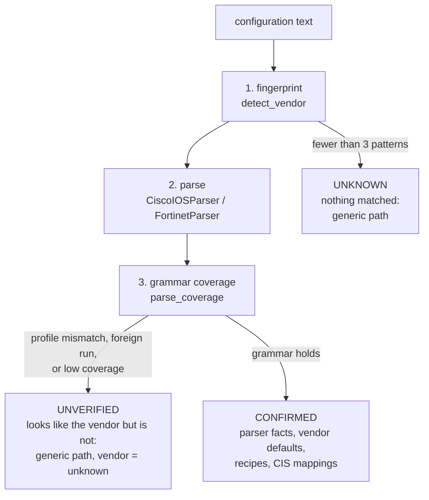
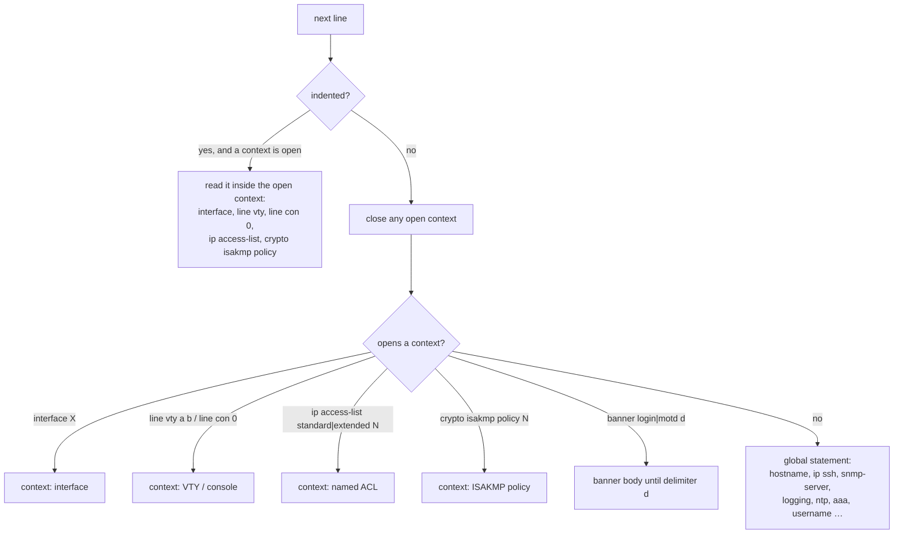
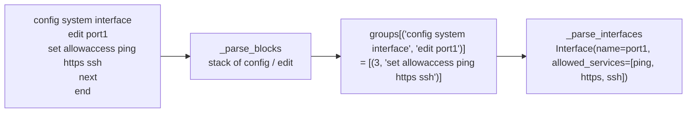
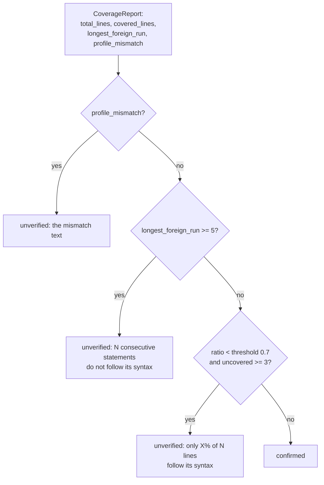
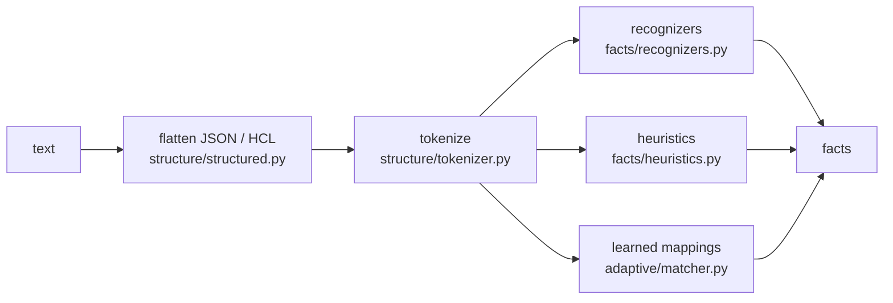

# Parser Design

How NetAuditAI decides **which** grammar a configuration follows, how the two dedicated parsers read Cisco IOS and
FortiGate, and how everything else is read without a parser.

The rule behind every choice here: **a parser that looks more trustworthy than it is does more harm than no
parser.** A half-finished Junos parser would read every setting it cannot see as *absent*, and absence becomes
FAIL or PASS. So there are exactly two parsers, each confirmed by grammar coverage before its output is trusted, and
a generic path that never pretends to know a dialect.

**Code:** `backend/app/parsers/` (`detector.py`, `coverage.py`, `cisco_ios.py`, `fortinet.py`, `base.py`),
`backend/app/structure/` (generic path), `backend/app/facts/from_normalized.py` (parser output → facts).

---

## 1. The three outcomes



| Status | `device.vendor` | Facts from | Defaults | Remediation | CIS view |
|---|---|---|---|---|---|
| `confirmed` | `cisco_ios` / `fortinet` | parser (`parser` assurance) | yes | deterministic recipes | yes |
| `unverified` | `unknown` | recognizers, mappings, heuristics, AI | no | write-back, candidates | no |
| `unknown` | `unknown` | recognizers, mappings, heuristics, AI | no | write-back, candidates | no |

An unverified configuration is treated **exactly** like an unknown one. The detected vendor and the reason are
reported in `vendor_identification[]` so the user sees why: "only 41% of 212 lines follow its syntax", "line 3
(feature telnet) is Cisco NX-OS syntax, not IOS".

---

## 2. Stage 1: fingerprints

`detect_vendor` counts characteristic patterns. It needs at least 3 matches; the higher score wins.

| Cisco IOS patterns (8) | FortiOS patterns (8) |
|---|---|
| `^version \d+\.\d+` | `^config \S+` |
| `^hostname \S+` | `^\s+edit \S+` |
| `^interface (GigabitEthernet\|FastEthernet\|Loopback\|Vlan)` | `^\s+set \S+ .+` |
| `^line vty \d+` | `^\s+next\s*$` |
| `^(ip access-list\|access-list \d+)` | `^end\s*$` |
| `^service (timestamps\|password-encryption)` | `config system global` |
| `^enable (secret\|password)` | `config firewall policy` |
| `^!\s*$` (section separator) | `config system interface` |

Fingerprints are deliberately loose. Arista EOS, NX-OS, IOS-XR and Dell OS10 all have `hostname`, `!` and
`interface`. A fingerprint only nominates a candidate; stage 3 decides.

---

## 3. Stage 2: the parsers

Both implement `BaseParser.parse(raw_config) -> NormalizedConfig` and record the **source line numbers** of every
object they read, which is what makes every later verdict citable.

### 3.1 Cisco IOS / IOS-XE (`cisco_ios.py`)

A single pass over the lines. A top-level line either matches a global statement or opens a context
(`interface`, `line vty`, `line con 0`, `ip access-list`, `crypto isakmp policy`); indented lines are read inside
that context; any unmatched top-level line closes it.



| Context | Lines read | Model fields |
|---|---|---|
| Global | `hostname`, `version` | device hostname, OS version |
| Global | `ip source-route`, `no ip source-route`, `cdp run`, `no cdp run`, `service password-encryption`, `service timestamps` | services |
| Global | `ip ssh version N`, `ip ssh time-out`, `ip ssh authentication-retries`, `ip http server`, `no ip http server`, `ip http secure-server` | management |
| Global | `aaa new-model`, `aaa authentication login …`, `enable secret|password [type] …`, `username … [privilege N] secret|password [type] …` | authentication (storage type only; the value is never needed) |
| Global | `snmp-server community NAME RO|RW [acl]`, `snmp-server group … v3` | SNMP |
| Global | `logging host X`, `logging X.X.X.X`, `logging buffered`, `logging trap` | logging |
| Global | `ntp server X`, `ntp authenticate` | NTP |
| Global | `access-list N permit|deny …` (standard 1-99 / 1300-1999, extended 100-199 / 2000-2699) | numbered ACLs |
| Interface | `ip address`, `description`, `shutdown`, `ip access-group X in|out`, CDP, redirects, proxy-ARP, directed broadcast | interfaces |
| VTY / console | `access-class X`, `transport input …`, `exec-timeout M [S]`, `login …` | management lines |
| Named ACL | `permit|deny …` entries | access lists |
| ISAKMP | `encr`, `hash`, `group` | VPN proposals |
| Global | `crypto ipsec transform-set NAME …` | transform sets |
| Banner | `banner login|motd <d> … <d>` across lines | banners |

Lines the parser reads by pattern after parsing (`facts/from_normalized.py`): `login block-for … attempts N`,
`aaa local authentication attempts max-fail N`, `security passwords min-length N`,
`ip ssh server algorithm encryption|mac|kex …`, `ip http secure-ciphersuite …`.

**External interfaces** (for CDP exposure): an interface is treated as external when its name contains `outside`,
its description contains `wan`, `internet` or `uplink`, or it has an inbound or outbound ACL applied. With none
identified, CDP exposure stays UNKNOWN ("No interface is identified as external") rather than guessed.

**IOS behaviours that become facts:**

| Situation | Fact |
|---|---|
| VTY with no `transport input` | Telnet undetermined (UNKNOWN): the default differs by release |
| A VTY range with `transport input telnet` or `all` | Telnet on, scope that range |
| A VTY range without `access-class` | management source not restricted, scope that range |
| VTY with `exec-timeout 0 0` | idle timeout disabled (FAIL) |
| No `service password-encryption` | `NOT_SET` → FAIL for MGMT-005 |
| No `aaa new-model` | `NOT_SET` → FAIL for MGMT-008 |
| No banner | `NOT_SET` → FAIL for MGMT-009 |
| No `login block-for` / `max-fail` | `NOT_SET` → FAIL for AUTH-001 |
| Routed interface without `no ip redirects` / `no ip proxy-arp` | on, assurance `default` (IOS sends both unless told not to) |
| No `ip ssh server algorithm` list | no fact: the release's defaults decide, which is not claimed |

### 3.2 FortiGate (`fortinet.py`)

FortiOS is a closed block grammar. The parser first turns lines into `(context stack, line number, set command)`
triples, then groups them by exact context and reads each section it knows.



| Section (exact context) | Keys read |
|---|---|
| `#config-version=` header (before the first statement) | model, firmware and build |
| `config system global` | `hostname`, `admintimeout`, `admin-ssh-v1`, `pre-login-banner` (parser model); `admin-lockout-threshold`, `strong-crypto disable`, `ssh-cbc-cipher enable`, `ssh-hmac-md5 enable`, `ssh-kex-sha1 enable` (read by pattern in `facts/from_normalized.py`) |
| `config system interface` → `edit X` | `ip`, `description`, `allowaccess`, `role`, `lldp-transmission` |
| `config system admin` → `edit X` | account names (password values are never read) |
| `config system password-policy` | `status`, `minimum-length` |
| `config system snmp community` → `edit N` | `name`, `query-v1-status`, `query-v2c-status` |
| `config log syslogd setting` | `status`, `server` |
| `config log disk setting` | `status` |
| `config system ntp` and `config ntpserver` → `edit N` | `authentication`, `server` |
| `config firewall policy` → `edit N` | `name`, `srcintf`, `dstintf`, `srcaddr`, `dstaddr`, `service`, `action`, `schedule`, `utm-status`, `logtraffic`, `nat` |
| `config vpn ipsec phase1-interface` → `edit X` | `proposal`, `dhgrp`, `ike-version` |
| `config vpn ssl settings` | `ssl-min-proto-ver` |
| `config system settings` | `ip-src-routing` |

**External interfaces:** `set role wan`, or an interface name containing `wan`.

**Not read, on purpose:** password storage and AAA. FortiOS stores admin passwords as `ENC` hashes and AAA lives in
user groups and remote server objects the parser does not resolve. Rather than guess, the parser coverage map
(`PARSER_COVERAGE`) excludes those predicates, so MGMT-005 and MGMT-008 report UNKNOWN for FortiGate with the reason
"The fortinet parser does not read …".

### 3.3 Normalization example

Both parsers produce the same `NormalizedConfig`, and from there the same facts.

```text
Cisco IOS                                  FortiGate
interface GigabitEthernet0/1               config system interface
 ip address 192.168.1.1 255.255.255.0          edit "port1"
 no shutdown                                       set ip 192.168.1.1 255.255.255.0
                                                   set allowaccess ping https
                                               next
                                           end
```

```json
{"interfaces": [{"name": "GigabitEthernet0/1 | port1", "ip_address": "192.168.1.1",
                 "subnet_mask": "255.255.255.0", "allowed_services": [], "is_wan": false,
                 "source_lines": [1, 2]}]}
```

Controls never read this model. `facts/from_normalized.py: _ParserFacts` turns it into SecurityFacts with
`parser` assurance, which is what every control reads.

---

## 4. Stage 3: grammar coverage

`coverage.py: parse_coverage` checks **every meaningful line** (non-blank, not starting with `!` or `#`) against the
vendor's grammar. A covered line is one the vendor would accept, whether or not a control reads it. This is a
syntax check, not extraction.

### 4.1 FortiOS grammar

A closed statement grammar whose nesting must balance:

| Verb | Valid when |
|---|---|
| `config` | always (pushes `config`) |
| `edit` | the innermost open block is a `config` (pushes `edit`) |
| `next` | the innermost open block is an `edit` (pops it) |
| `end` | some `config` is open (pops back to it) |
| `set`, `unset`, `append`, `select`, `unselect`, `purge`, `rename`, `move`, `delete`, `clone` | inside any block; an odd number of quotes opens a multi-line quoted value |

**Product profile:** a FortiGate-only section (`config firewall …` or `config vpn …`) or a `#config-version=FG…`
header must appear. FortiSwitchOS and other Fortinet products share the grammar and fail this check.

### 4.2 Cisco IOS grammar

| Line kind | Rule |
|---|---|
| Top-level | the root word must be in a curated list of 121 IOS command roots (`_IOS_ROOTS`); `no` forms are checked the same way |
| Root with arguments checked | `interface` (case-sensitive canonical names such as `GigabitEthernet0/1`, `Port-channel1`), `line` (ranges), `username`, `enable`, `service` (known services only), `vrf` (`definition` / `list`), `router` (known protocols), `ip access-list` (known kinds), `transceiver`, `password encryption aes` |
| Block roots (`aaa`, `crypto`, `router`, `policy-map`, …) | children accepted without validation |
| `interface` children | must be one of 86 interface child roots (`ip`, `description`, `shutdown`, `switchport`, `cdp`, …); `vrf forwarding` only |
| `line` children | must be one of 48 line child roots (`transport`, `exec-timeout`, `access-class`, `login`, …) |
| Indented line under a leaf command | foreign |
| Banner body | free text, covered for every banner type until the delimiter |

**Other platforms named in the file** make it a profile mismatch, because a short config can follow the IOS grammar
line for line and still be another device:

| Pattern | Platform |
|---|---|
| `!RANCID-CONTENT-TYPE: <not cisco>` | named by RANCID |
| `ASA Version`, `PIX Version`, `FWSM Version`, an indented `nameif` | Cisco ASA |
| `!! IOS XR Configuration`, indented `ipv4 address`, `route-policy` | Cisco IOS-XR |
| `feature …`, `vrf context …` | Cisco NX-OS |
| `! device: … EOS-`, `interface Port-Channel1` (IOS writes `Port-channel`) | Arista EOS |

### 4.3 The decision



The **foreign run** catches a block of another dialect pasted into an otherwise valid file
(`tests/fixtures/lookalikes/mixed_ios_foreign_block.cfg`). The **minimum of 3 uncovered lines** stops a 6-line
fixture from being rejected because one line is unusual.

The look-alike fixtures in `backend/tests/fixtures/lookalikes/` (Arista EOS, Brocade ICX, Cisco ASA, IOS-XE exec
banner, IOS-XR, NX-OS, Dell OS10, FortiSwitch, mixed) each pin one of these rules
(`tests/test_phase1_vendor_identification.py`).

---

## 5. The generic path (every other configuration)

There is no parser for Palo Alto, Juniper, Arista, Huawei, MikroTik or anything else. Those files go through:



`app/adaptive/context.py` gives each line a generic **block path** in a single pass, with no vendor knowledge:

* **Braces:** `system {` … `}`
* **Keyword blocks:** `config` / `edit` opened, and `end` / `next` / `exit` closed
* **Indentation**
* **RouterOS sections:** `/ip service` headers

For example, `set admin-ssh enable` inside `config system global` gets the path `config system global`, and
`telnet;` inside `system { services { … } }` gets `system > services`. The tokenizer builds statements on those
paths; recognizers and heuristics turn statements into facts. Details: [architecture.md §4](architecture.md#4-generic-path-tokenizer-flattening-heuristics).

The configuration's hostname on the generic path is the one a single statement states (`hostname X`,
`system-name X`, `set … hostname X`); `unknown` when absent or conflicting.

### Lines a confirmed parser does not read

For a confirmed vendor, lines the parser skipped are captured (`capture_unrecognized_lines`) with their block path.
Administrator-confirmed learned mappings are applied to them. The legacy AI line interpreter can be switched on for
them (`ADAPTIVE_AI_FOR_KNOWN_VENDORS`, off by default); its results only reach a review queue.

---

## 6. Why not more parsers

| Option | Why it was not taken |
|---|---|
| A parser per vendor | Does not scale, and every vendor ships new syntax with firmware. A partial parser reads unread settings as absent. |
| Vendor-agnostic config libraries (ciscoconfparse, Batfish) | Either IOS-only, or a heavyweight JVM service; neither gives cited, assurance-tagged facts per security question. |
| An LLM as the parser | Not reproducible, cannot be audited, and can be prompt-injected by a banner. Used only as a bounded, verified escalation. |

What scales instead is the **recognizer**: one typed template per concept per dialect, shipped as seeds or taught by
an administrator in the UI, decisive on the next scan. See [seed-knowledge.md](seed-knowledge.md).

---

## 7. Known limitations

* The parsers cover common configuration patterns. Unusual syntax, version differences and complex ACL options
  (object groups, time ranges) may be missed.
* The IOS grammar is a curated list of command roots, so an unusual but genuine IOS file can come out unverified. The
  fix is adding the root to `_IOS_ROOTS` with a test, not lowering the threshold.
* The FortiGate parser does not read password storage or AAA, so those controls are UNKNOWN for FortiGate.
* FortiGate object references (address groups, service groups) are not resolved, so an any-to-any rule written with a
  group named `all-hosts` is not recognized as any-to-any.
* External-interface detection is a heuristic over names, descriptions, ACLs and `role wan`; it never decides on its
  own that an interface is internal.
