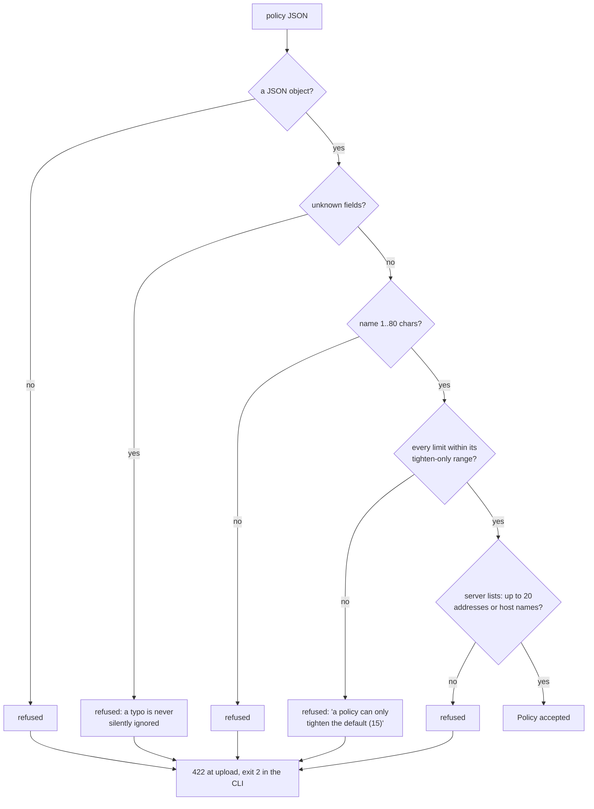
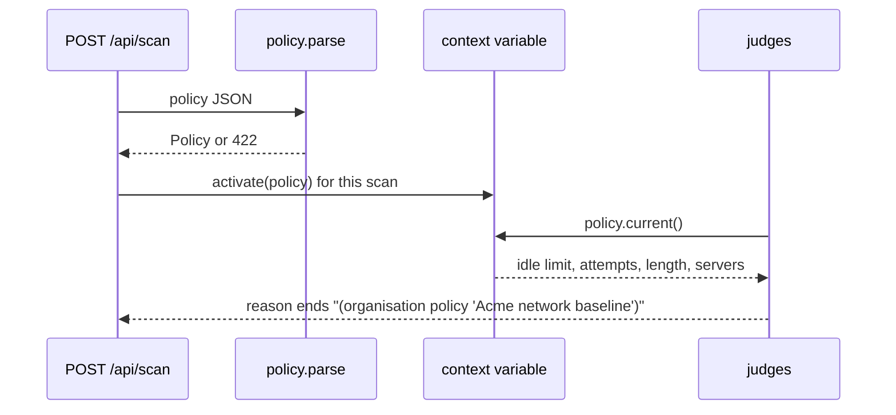

# Organisation policy

Frameworks set minimums. An organisation usually has its own, stricter baseline: a shorter idle timeout, fewer login
attempts, a longer minimum password, and a list of the NTP and syslog servers devices may use. A policy file states
it, and the checks apply it on top of the frameworks.

**Code:** `backend/app/controls/policy.py` · **Tests:** `backend/tests/test_policy.py`

---

## 1. The file

```json
{
  "name": "Acme network baseline",
  "idle_timeout_minutes": 10,
  "login_attempts": 5,
  "password_min_length": 12,
  "ntp_servers": ["10.1.0.10", "10.1.0.11"],
  "syslog_servers": ["10.1.0.50"]
}
```

| Field | Default | Allowed | Check it changes | Effect |
|---|---|---|---|---|
| `name` | required | 1 to 80 characters | all below | named in every result the policy changed |
| `idle_timeout_minutes` | 15 | 1 to 15 | MGMT-006 | a timeout above this is a FAIL |
| `login_attempts` | 10 | 1 to 10 | AUTH-001 | a limit above this is a FAIL |
| `password_min_length` | 8 | 8 to 128 | AUTH-002 | a minimum below this is a FAIL |
| `ntp_servers` | any | up to 20 addresses or host names | LOG-002 | a server not on the list is a FAIL (medium) |
| `syslog_servers` | any | up to 20 addresses or host names | LOG-001 | a destination not on the list is a FAIL (medium) |

---

## 2. A policy can only tighten



A value looser than the default is refused (422 at upload, exit code 2 in the CLI) because a PASS must still mean the
framework requirement is met. A policy can never turn a FAIL into a PASS.

---

## 3. Where it applies

| Surface | How |
|---|---|
| Upload page | *Organisation policy*, optional |
| `POST /api/scan` | `policy` form field holding the JSON text |
| CLI | `--policy FILE` |

The active policy is held in a context variable, set where a scan is created (`run_scan`) and where an action on a
stored scan starts (`live_scan`). Every later evaluation of that scan therefore uses the same policy without passing it
through every call: teaching a recognizer, the rescans behind verified remediation, the final review.



The scan response echoes the policy in `policy`; Results names it; a result it changed ends its reason with
*(organisation policy '…')*, for example:

> The idle timeout of line vty 0 4 is 15 minutes, longer than 10 minutes (organisation policy 'Acme network baseline').

---

## 4. Limits

* Automatic fixes write a 5-minute idle timeout (Cisco `exec-timeout 5 0`, FortiGate `admintimeout 5`) and seed
  write-back writes 10 minutes. A policy under those values makes that fix fail its re-check, so it is not offered as
  verified; set the timeout by hand.
* Server lists are compared as written: `ntp1.example.com` and its IP address are different entries.
* The policy tightens thresholds and server lists only. It cannot add a check, change a severity or remove a check.
