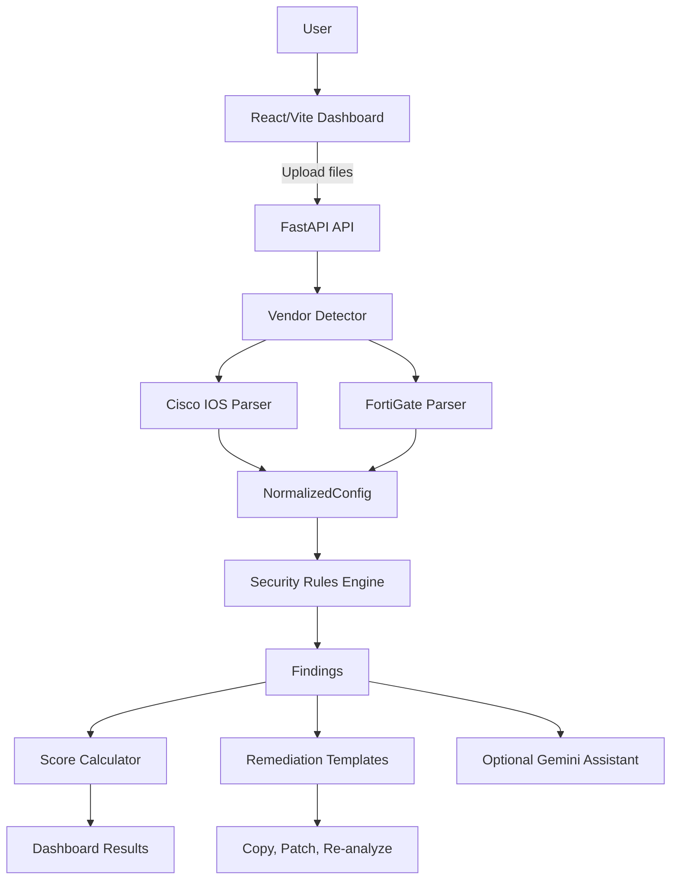

# NetAuditAI Project Overview

NetAuditAI is an AI-assisted, multi-vendor network security compliance auditor. It analyzes uploaded network device configuration files, detects security weaknesses, assigns a security score, provides evidence and compliance mappings, generates deterministic remediation commands, and verifies proposed fixes on a copy of the configuration.

The project is designed for the Smart India Hackathon 2026 cybersecurity problem SIH26155.

## What the Project Does

A user uploads one or more network configuration files. NetAuditAI then:

1. Detects the configuration vendor.
2. Parses the vendor-specific syntax.
3. Converts the result into a shared normalized data model.
4. Runs security rules against the normalized model.
5. Calculates a score from 0 to 100.
6. Displays findings with severity, evidence, impact, recommendations, and compliance references.
7. Generates vendor-specific remediation commands.
8. Applies the commands to a copy of the configuration.
9. Re-runs the analysis to show before-and-after results.

The system currently supports Cisco IOS and FortiGate configurations.

## Architecture



The central design decision is the normalized model. Vendor-specific parsers translate different configuration syntaxes into the same `NormalizedConfig` structure. The security rules operate on that common structure, so most rules do not need separate Cisco and FortiGate implementations.

## Repository Structure

```text
backend/
  app/
    main.py                 FastAPI application and router registration
    config.py               Environment settings and upload limits
    api/
      schemas.py            Request and response models
      routes/               Scan, remediation, and assistant endpoints
    ai/
      client.py             Gemini API wrapper
      prompts.py            Explanation and summary prompts
    analysis/
      engine.py             Runs all security rules
      scoring.py            Calculates the security score
      rules/                Management, boundary, logging, and crypto rules
    models/
      normalized.py         Shared vendor-neutral configuration dataclasses
      findings.py           Finding and scan result dataclasses
    parsers/
      detector.py           Cisco/FortiGate vendor detection
      cisco_ios.py          Cisco IOS parser
      fortinet.py           FortiGate parser
    remediation/
      engine.py             Deterministic fix templates and verification patching
  tests/                    Backend pipeline and parser tests
frontend/
  src/
    App.jsx                 Main UI state and workflow
    api/client.js           HTTP client for backend endpoints
    components/             Dashboard, findings, remediation, and comparison UI
  index.css                 Application styling
  package.json              Frontend dependencies and scripts
docs/                       Architecture, API, rules, setup, and project documentation
```

## Backend

The FastAPI application is defined in [backend/app/main.py](../backend/app/main.py). It registers three route groups under `/api`:

- Scan routes
- Remediation routes
- Assistant routes

CORS is currently open to all origins to simplify local development. This should be restricted before production deployment.

### Scan Processing

The main scan workflow is implemented in [backend/app/api/routes/scan.py](../backend/app/api/routes/scan.py).

For each uploaded file, the API:

- Reads the file into memory.
- Enforces a 2 MB maximum size.
- Requires valid UTF-8 text.
- Rejects empty files.
- Detects the vendor.
- Selects a parser.
- Produces a `NormalizedConfig`.

One file is analyzed with `analyze()`. Multiple files are analyzed individually and merged with `analyze_multiple()`.

Scan results are stored in a process-local dictionary. They are not persisted to SQLite or another database.

### Normalized Configuration

The shared data model is defined in [backend/app/models/normalized.py](../backend/app/models/normalized.py).

`NormalizedConfig` represents:

- Device hostname, vendor, and OS version
- Interfaces and interface services
- VTY and console management lines
- SSH, HTTP, HTTPS, and Telnet access
- AAA and local users
- Password encoding types
- SNMP communities and SNMPv3 state
- Logging and remote syslog
- NTP servers and authentication
- Cisco ACLs
- FortiGate firewall policies
- VPN/IPsec proposals
- Login banners
- Global services such as IP source routing and CDP
- The original raw configuration and source line numbers

Keeping the raw lines and line numbers allows the application to show the exact configuration evidence behind each finding.

## Security Rules

The rules are combined in [backend/app/analysis/engine.py](../backend/app/analysis/engine.py). There are currently 15 implemented rules.

### Management Rules

Defined in [backend/app/analysis/rules/management.py](../backend/app/analysis/rules/management.py):

| Rule | Finding | Severity |
|---|---|---|
| MGMT-001 | Telnet enabled | Critical |
| MGMT-002 | Insecure HTTP management enabled | High |
| MGMT-003 | Unrestricted management access | Critical |
| MGMT-004 | Weak or default SNMP communities | High or Critical |
| MGMT-005 | Plaintext or weakly encrypted passwords | Critical |
| MGMT-006 | Missing or disabled session timeout | Medium |
| MGMT-007 | SSH version 1 or weak SSH configuration | High |
| MGMT-008 | AAA not configured | High |
| MGMT-009 | Missing login banner | Low |

Cisco-specific checks include password encoding and AAA. FortiGate checks use interface management services, admin timeout, and FortiOS global settings.

### Boundary Rules

Defined in [backend/app/analysis/rules/boundary.py](../backend/app/analysis/rules/boundary.py):

| Rule | Finding | Severity |
|---|---|---|
| BOUNDARY-001 | Overly permissive ACL or firewall rule | Critical |
| BOUNDARY-002 | IP source routing enabled | Medium |
| BOUNDARY-003 | CDP or LLDP exposed on an external interface | Medium |

The any-any check detects Cisco rules such as `permit ip any any` and FortiGate policies that accept all sources, destinations, and services.

### Logging Rules

Defined in [backend/app/analysis/rules/logging_rules.py](../backend/app/analysis/rules/logging_rules.py):

| Rule | Finding | Severity |
|---|---|---|
| LOG-001 | No remote syslog server configured | High |
| LOG-002 | NTP missing or unauthenticated | Medium |

### Cryptography Rules

Defined in [backend/app/analysis/rules/crypto.py](../backend/app/analysis/rules/crypto.py):

| Rule | Finding | Severity |
|---|---|---|
| CRYPTO-001 | Weak VPN/IPsec cryptographic algorithms | High |

The rule flags DES, 3DES, MD5, and weak Diffie-Hellman groups 1, 2, and 5.

## Findings and Scoring

Findings are defined in [backend/app/models/findings.py](../backend/app/models/findings.py). Each finding includes:

- Rule ID and title
- Severity
- Description
- Security impact
- Recommendation
- Device and vendor
- Exact evidence lines
- Original line numbers
- CIS and NIST 800-53 compliance mappings
- Finding category
- Optional AI explanation

Scoring is implemented in [backend/app/analysis/scoring.py](../backend/app/analysis/scoring.py).

The calculation starts at 100 and subtracts penalties:

| Severity | Penalty |
|---|---:|
| Critical | 12 |
| High | 6 |
| Medium | 3 |
| Low | 1 |

The score cannot fall below zero.

## API Endpoints

API request and response schemas are defined in [backend/app/api/schemas.py](../backend/app/api/schemas.py).

| Method | Endpoint | Purpose |
|---|---|---|
| GET | `/health` | Check whether the backend is running |
| POST | `/api/scan` | Upload and analyze one or more configurations |
| GET | `/api/scan/{scan_id}` | Retrieve an in-memory scan result |
| POST | `/api/remediate` | Generate remediation commands for a finding |
| POST | `/api/verify` | Apply commands to a copy and re-analyze it |
| POST | `/api/assistant/chat` | Ask Gemini about a scan |
| GET | `/api/assistant/explain/{scan_id}/{rule_id}/{hostname}` | Generate a finding explanation |
| GET | `/api/assistant/summary/{scan_id}` | Generate a scan summary |
| GET | `/api/assistant/status` | Check Gemini availability |

## Remediation

Remediation is implemented in [backend/app/remediation/engine.py](../backend/app/remediation/engine.py).

The system intentionally uses deterministic templates rather than asking an AI model to invent network commands. Templates are selected by rule ID and vendor. This makes command generation predictable and reduces the risk of invalid or dangerous syntax.

Examples include:

```text
no ip http server
ip http secure-server
```

```text
ip ssh version 2
ip ssh time-out 60
ip ssh authentication-retries 3
```

The generated commands are never applied to a real device. Verification modifies a copy of the original text and re-runs the parser and rules engine.

The patching logic is a simplified demo implementation. It handles known replacements and selected `no` and FortiGate `set` commands; it is not a complete vendor configuration editing engine.

## Optional AI Assistant

Gemini integration is implemented in [backend/app/ai/client.py](../backend/app/ai/client.py). It is enabled by setting `GEMINI_API_KEY` in `backend/.env`.

Without an API key:

- The scanner still works.
- Finding explanations fall back to static recommendations.
- Scan summaries use static text.
- Chat reports that AI is not configured.

With an API key, Gemini can provide:

- Plain-language explanations of findings
- Executive scan summaries
- Chat answers using scan context

The AI does not generate remediation commands.

## Frontend

The main frontend workflow is controlled by [frontend/src/App.jsx](../frontend/src/App.jsx).

The interface provides:

- Drag-and-drop configuration upload
- Multi-file selection
- Loading progress display
- Security score dashboard
- Severity counts and distribution
- Device inventory
- Findings table
- Search and filtering by severity, device, and rule
- Finding detail drawer
- Configuration evidence display
- Compliance mapping display
- Remediation command drawer
- Copy-to-clipboard actions
- Before-and-after verification results

The frontend API client is [frontend/src/api/client.js](../frontend/src/api/client.js). Its default backend URL is:

```text
http://localhost:8000/api
```

This can be overridden with the `VITE_API_BASE_URL` environment variable.

The assistant API exists, but there is currently no complete chat or AI summary component connected to the frontend. The Remediation and Settings sidebar entries are also placeholders rather than separate full pages.

## Local Setup

### Requirements

- Python 3.11 or newer
- Node.js 18 or newer
- Gemini API key only if AI features are required

### Backend

```powershell
cd backend
python -m venv venv
.\venv\Scripts\activate
pip install -r requirements.txt
uvicorn app.main:app --reload --host 0.0.0.0 --port 8000
```

### Frontend

```powershell
cd frontend
npm install
npm run dev
```

The Vite frontend normally runs at `http://localhost:5173`.

### Environment

Create `backend/.env` if Gemini is needed:

```text
GEMINI_API_KEY=your_key_here
```

## Testing

Backend tests are in [backend/tests/test_pipeline.py](../backend/tests/test_pipeline.py) and [backend/tests/test_cisco_acl.py](../backend/tests/test_cisco_acl.py).

They cover:

- Cisco and FortiGate vendor detection
- Basic parser behavior
- Vulnerable configuration detection
- Secure configuration behavior
- Score calculation
- Empty and unknown configurations
- Cisco extended ACL parsing
- Any-any ACL detection

Run them with:

```powershell
cd backend
pytest tests/ -v
```

The current test suite passes 12 tests. The frontend production build can be checked with:

```powershell
cd frontend
npm run build
```

## Current Limitations

- Scan data is lost when the backend restarts.
- The in-memory store is unsuitable for multiple production workers.
- Vendor detection is heuristic.
- Parsers cover common syntax, not every vendor configuration edge case.
- Remediation patching is simplified string manipulation.
- Multi-file verification currently analyzes the first uploaded configuration.
- AI can produce incorrect explanations and should be reviewed.
- There are no live device connections.
- PDF and image configurations are unsupported.
- Palo Alto support is planned but not implemented.
- There are no frontend automated tests.
- Gemini, remediation, and extensive FortiGate behavior have limited automated coverage.
- CORS is permissive for development.

## Current Status

The core prototype is functional:

- Cisco and FortiGate parsers are implemented.
- The normalized data model is implemented.
- Fifteen deterministic security rules are implemented.
- Scoring and compliance mappings are implemented.
- Remediation templates and before/after verification are implemented.
- The React dashboard is implemented.
- Optional Gemini support is implemented.

The main next steps are persistence, stronger parser coverage, robust vendor-aware remediation, correct multi-device verification, frontend AI integration, production security hardening, and broader automated tests.

## Source of Truth

Some older documents still describe the project as planned or incomplete. The current implementation and tests are more reliable than those descriptions. In particular:

- [backend/app/](../backend/app/) describes the actual backend behavior.
- [frontend/src/](../frontend/src/) describes the actual UI behavior.
- [docs/detection-rules.md](detection-rules.md) is the closest rules reference.
- [docs/project-audit.md](project-audit.md) records known implementation and documentation issues.
