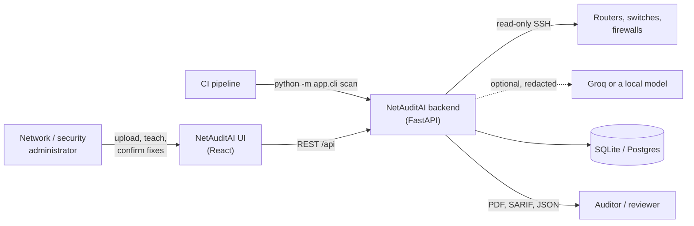
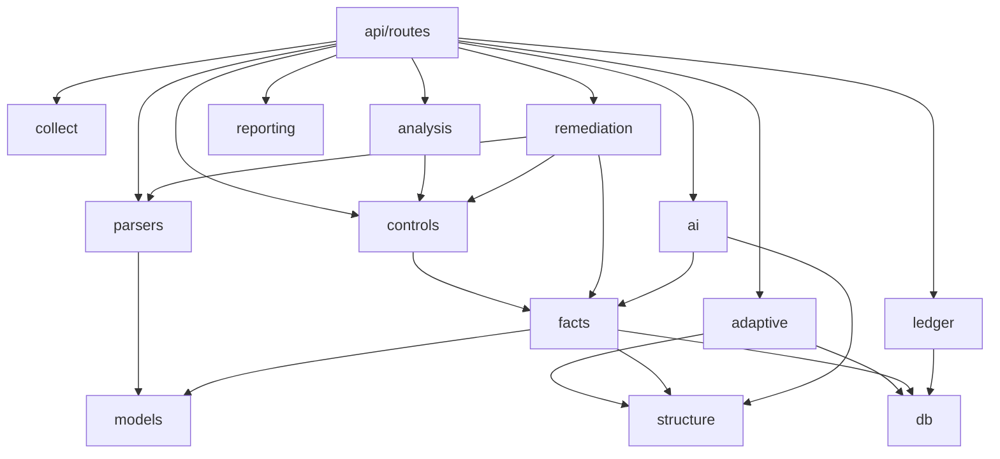
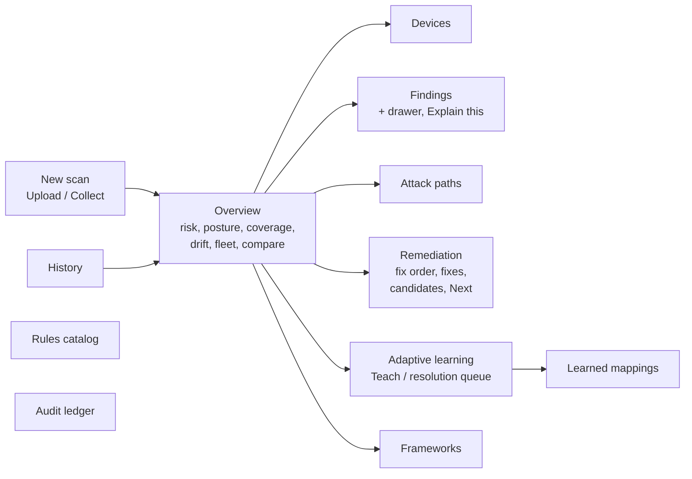

# Project Overview

NetAuditAI audits network device and cloud firewall configurations against 24 security checks, with cited evidence,
honest UNKNOWN / NOT_CONFIGURED results, posture and coverage, framework views, human-confirmed recognizers for
unfamiliar vendors, and fixes verified by rescan. Built for Smart India Hackathon 2026, problem SIH26155 (NTRO).

Start with the [README](../README.md) (what it does, quickstart, limits), then [architecture.md](architecture.md) (how
it works). The full reading order is in the [docs index](README.md).

---

## 1. System context


```mermaid
flowchart LR
    ADM["Network / security<br/>administrator"] -->|"upload, teach,<br/>confirm fixes"| UI["NetAuditAI UI<br/>(React)"]
    CI["CI pipeline"] -->|"python -m app.cli scan"| CORE
    UI -->|"REST /api"| CORE["NetAuditAI backend<br/>(FastAPI)"]
    CORE -->|"read-only SSH"| DEV["Routers, switches,<br/>firewalls"]
    CORE -.->|"optional, redacted"| LLM["Groq or a local model"]
    CORE --> DB[("SQLite / Postgres")]
    CORE -->|"PDF, SARIF, JSON"| AUD["Auditor / reviewer"]
```

---

## 2. Repository structure

```text
backend/
  app/
    main.py, config.py        FastAPI app (CORS, optional API key, Server-Timing), settings
    cli.py                    command line for CI pipelines (exit codes, SARIF)
    ledger.py                 hash-chained audit ledger
    api/routes/               scan, collect, remediation, adaptive (teach & recognizers), assistant, report, ledger
    api/schemas.py            request / response models
    collect/                  SSH collection (Netmiko, optional NAPALM), private-network bound
    parsers/                  detector + grammar coverage, Cisco IOS and FortiGate parsers
    structure/                generic tokenizer; JSON and Terraform flattening
    facts/                    predicates, parser facts, defaults, lexicon, heuristics, recognizers, seed loader, teaching
    controls/                 catalog (24 checks), judges, evaluator, finding view, frameworks, organisation policy
    analysis/                 scoring (posture, coverage; legacy score), attack paths, risk, drift, fleet checks, CVE
    ai/                       model client, redaction, prompt fence, AI judge, remediation drafts, prompts
    adaptive/                 line capture, block paths, relevance, matcher, legacy interpreter / mapper, service
    remediation/              recipes (41), verifying engine, seed write-back, candidates (templates/ is empty legacy)
    reporting/                per-device PDF report (full and executive)
    db/                       SQLite / Postgres migrations, recognizer repository, scan archive
    models/                   NormalizedConfig, findings, results, legacy field catalog
  data/                       seed_recognizers.json (396), factory_defaults.json, platform_profiles.json,
                              cve_cache.json, path_validation.json
  scripts/                    benchmark, CVE cache builder, attack-path proof, injection probe, architecture PDF
  tests/                      67 pytest files, fixtures, Phase 0 golden snapshots
frontend/
  src/App.jsx, home/          landing page and hash routing
  src/app/                    one component per page (see below), plus Assistant, FindingDrawer, LearningFlow
  src/lib/domain.js           the one backend-state → user-facing-state mapping (states, counts, fix order)
  src/lib/useAudit.js         scan-scoped remediation plan, review queue, the inputs a download may use
  src/lib/panel.js, hooks.js  assistant panel geometry, shared hooks
  src/api/client.js           API client
  src/components/             Markdown renderer (no HTML), ui/ primitives (SeverityMeter, StatusLabel, Drawer, Evidence, FileDiff …)
  src/styles/, index.css      design tokens and hand-written CSS (no Tailwind, no component library)
  src/utils/                  summary-only history, form validation
  e2e/demo.spec.js            Playwright judge path
benchmark/                    labels.json (ground truth), RESULTS.md (generated), held-out reasons
demo-sih/                     the three demo files (Cisco, PAN-OS, unknown vendor) + FortiGate fleet
sample/                       extra Cisco, FortiGate, Juniper, Arista, Palo Alto and unknown-vendor samples
docs/                         this documentation
```

### Backend module dependencies


```mermaid
flowchart TD
    ROUTES["api/routes"] --> COLLECT["collect"]
    ROUTES --> PARSERS["parsers"]
    ROUTES --> ADAPT["adaptive"]
    ROUTES --> CONTROLS["controls"]
    ROUTES --> ANALYSIS["analysis"]
    ROUTES --> REM["remediation"]
    ROUTES --> REP["reporting"]
    ROUTES --> LEDGER["ledger"]
    ROUTES --> AIJ["ai"]
    PARSERS --> MODELS["models"]
    ADAPT --> STRUCT["structure"]
    ADAPT --> DB["db"]
    CONTROLS --> FACTS["facts"]
    FACTS --> STRUCT
    FACTS --> DB
    FACTS --> MODELS
    ANALYSIS --> CONTROLS
    REM --> PARSERS
    REM --> CONTROLS
    REM --> FACTS
    AIJ --> FACTS
    AIJ --> STRUCT
    LEDGER --> DB
```

---

## 3. API at a glance

`/api/scan`, `/api/scan/{id}` (+ `/baseline`, `/drift`, `/status`), `/api/catalog`, `/api/collect`
(+ `/capabilities`), `/api/remediate`, `/api/remediation/plan`, `/api/remediation/candidate*`,
`/api/remediation/final`, `/api/download-fixed`, `/api/report`, `/api/ledger` (+ `/verify`, `/verify-report`),
`/api/assistant/*`, `/api/adaptive/*`. Every `/api` route requires `X-API-Key` when `API_KEY` is set. Details in
[api.md](api.md).

---

## 4. Frontend pages


```mermaid
flowchart LR
    NEW["New scan<br/>Upload / Collect"] --> OV["Overview<br/>risk, posture, coverage,<br/>drift, fleet, compare"]
    OV --> DEVS["Devices"]
    OV --> FIND["Findings<br/>+ drawer, Explain this"]
    OV --> PATHS["Attack paths"]
    OV --> FIX["Remediation<br/>fix order, fixes,<br/>candidates, Next"]
    OV --> TEACH["Adaptive learning<br/>Teach / resolution queue"]
    TEACH --> LEARNED["Learned mappings"]
    OV --> FW["Frameworks"]
    HIST["History"] --> OV
    RULES["Rules catalog"]
    LEDGERP["Audit ledger"]
```

| Sidebar | Component | Route |
|---|---|---|
| New scan | `Upload.jsx`, `Collect.jsx` | `#/app` |
| Overview | `Results.jsx`, `Fleet.jsx`, `Drift.jsx`, `Baseline.jsx` | `#/app/scan/{id}` |
| Devices | `Devices.jsx` | `…/devices` |
| Findings | `Checks.jsx`, `FindingDrawer.jsx` | `…/checks` |
| Attack paths | `AttackPaths.jsx` | `…/paths` |
| Remediation | `Fix.jsx` | `…/fix` |
| Adaptive learning | `Teach.jsx`, `Unresolved.jsx`, `LearningFlow.jsx` | `…/teach` |
| Learned mappings | `Learned.jsx` | `#/app/learned` |
| Frameworks | `Frameworks.jsx` | `…/frameworks` |
| History | `History.jsx` | `#/app/history` |
| Rules catalog | `Rules.jsx` | `#/app/rules` |
| Audit ledger | `Ledger.jsx` | `#/app/ledger` |
| (rail) Assistant | `Assistant.jsx` | panel, any page |

The legacy review queue (`LegacyInterpretations.jsx`) appears only when `ADAPTIVE_AI_FOR_KNOWN_VENDORS` produced
items.
