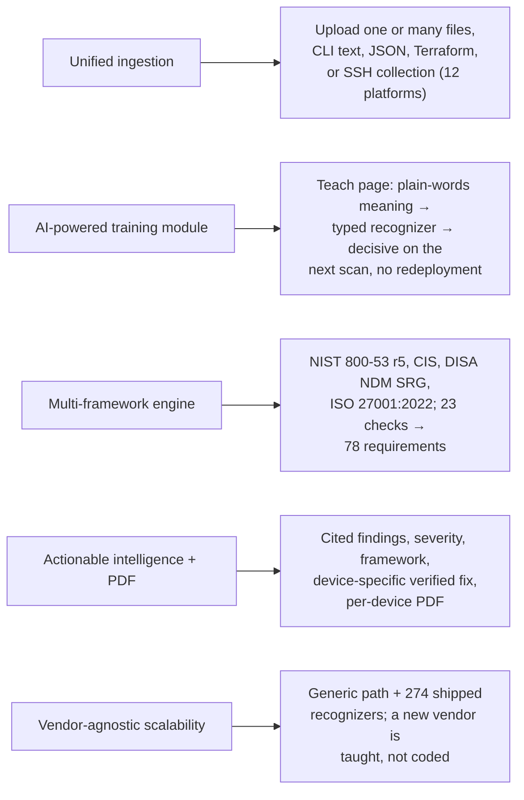

# Project Requirements (SIH26155)

What problem statement SIH26155 (*AI-Driven Multi-Vendor Network Security Compliance Auditor*, NTRO, Cybersecurity)
asks for, and where NetAuditAI meets it.

---

## 1. The five required capabilities

| Required | How it is met | Where |
|---|---|---|
| **Unified ingestion** | One dashboard: single or bulk upload, CLI text or JSON exports, Terraform, or pull straight from devices over SSH | `routes/scan.py`, `collect/`, `structure/structured.py` |
| **AI-powered training module** | The Teach page: an undecided check, a line, a meaning in plain words; a typed recognizer is drafted, gated, replayed and saved; live on the next scan | `routes/adaptive.py`, `facts/recognizers.py`, `facts/teaching.py` |
| **Multi-framework engine** | NIST SP 800-53 Rev. 5, CIS (Cisco IOS XE 17.x, FortiGate 7.4.x), DISA NDM SRG, ISO/IEC 27001:2022 Annex A; one chosen at upload or all four | `controls/catalog.py`, `controls/frameworks.py` |
| **Actionable intelligence and PDF report** | Per device: identification (when the file states it), PASS / FAIL with severity and cited lines, framework mapping, verified remediation, undecided checks with what they need | `reporting/report.py`, `remediation/` |
| **Vendor-agnostic scalability** | Every check runs on every configuration through vendor-neutral facts; new dialects are taught or shipped as seeds; a new structured format is flattened automatically | `facts/`, `data/seed_recognizers.json` |

---

## 2. Must have

- [x] Upload configurations and detect the vendor deterministically
- [x] Dedicated parsers for two distinct vendors (Cisco IOS, FortiGate)
- [x] Vendor-agnostic analysis for every other vendor (generic tokenizer, heuristics, recognizers), honestly provisional
- [x] Deterministic security checks with evidence (23 checks)
- [x] Compliance mappings to NIST SP 800-53 Rev. 5, CIS Benchmarks, DISA STIG (NDM SRG) and ISO/IEC 27001:2022, with versions
- [x] Posture and coverage scoring
- [x] Optional AI for explanations, chat and proposals on undecided checks
- [x] Deterministic, verified remediation for confirmed vendors
- [x] Verified remediation for unconfirmed vendors: seed write-back, and derived / typed / AI-drafted candidates simulated on a copy
- [x] A resolution queue for UNKNOWN / NOT_CONFIGURED checks: teach a line, rescan, updated posture
- [x] React dashboard: New scan, Overview, Devices, Findings, Attack paths, Remediation, Adaptive learning, Learned mappings, Frameworks, History, Rules catalog, Audit ledger

## 3. Stretch

- [x] Human-in-the-loop learning that persists (recognizers), plus 274 shipped seeds
- [x] Assistant chat panel and *Explain this* in the finding drawer
- [x] Per-device PDF report (full and executive) and multi-device zip
- [x] Historical scan comparison (changes since the last audit)
- [x] Live collection over SSH
- [x] Attack paths, contextual risk, fleet checks, fix order
- [x] Tamper-evident audit ledger
- [x] CI command line with SARIF
- [x] Offline AI for air-gapped sites
- [ ] A third dedicated parser: deliberately not built ([decisions.md §1](decisions.md#1-dedicated-parsers-for-cisco-ios-and-fortigate-only))
- [ ] Users and roles ([roadmap.md](roadmap.md))

## 4. Non-functional requirements

| Requirement | Target | Evidence |
|---|---|---|
| No false PASS | an insecure setting is never reported secure | benchmark: 0 missed on planted, fixtures and held-out sets (`test_benchmark.py`) |
| No false alarm | a secure setting is never reported insecure | benchmark: 0 false alarms |
| Reproducible | same files, same verdicts, with or without AI | AI facts never scored; CLI forces AI off |
| Traceable | every verdict cites its lines | `test_citations.py` |
| No secret leaves the process | redaction before AI, in every response, report, archive and ledger | [security-model.md §3.1](security-model.md#31-secrets) |
| Works offline | no network needed to scan, score, fix or report | AI optional; CVE data from a committed cache; `LOCAL_AI_URL` |
| Never writes to a device | read-only collection, no command executed | `collect/collector.py`, `test_live_collection.py` |
