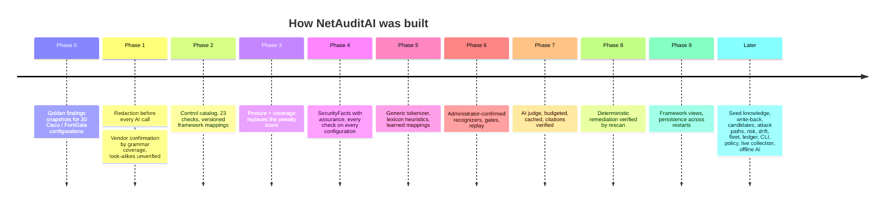

# Roadmap

What is built, what is known to be missing, and what would come next. Items in **Gaps** are defects or holes a
reviewer could hit today; items in **Next** are new capability.

---

## Done

- [x] Cisco IOS and FortiGate parsers with grammar-coverage vendor confirmation (look-alikes stay unverified)
- [x] Secret redaction before every AI call, prompt fence on every configuration-carrying prompt
- [x] Control catalog (23 checks) with PASS / FAIL / UNKNOWN / NOT_CONFIGURED / N_A and versioned mappings
- [x] Posture + coverage scoring with bounds and critical checks not assessed
- [x] Security facts with assurance; every check runs on every configuration
- [x] Generic tokenizer and lexicon heuristics for unknown vendors (provisional, no AI needed)
- [x] Administrator-confirmed recognizers persisted (SQLite, or Postgres via `DATABASE_URL`)
- [x] Shipped seed knowledge: 380 recognizers for 16 dialects, AWS / Azure / GCP exports and Terraform
- [x] Seed expansion: lockout and password length for ASA, PAN-OS, NX-OS, Arista, Gaia; SSH and timeouts for ASA;
      new families Dell OS10, VyOS, FortiSwitchOS; ASA `http server enable` no longer a decided HTTP failure
- [x] Seed coverage pass: 106 more recognizers (380), documented value defaults, `{top}` and chained scopes, IPsec
      proposals read one algorithm per line; seven of fourteen commercial dialects decide 18 or more of 23 checks when
      the configuration states them ([measured](seed-knowledge.md#coverage-per-dialect-measured))
- [x] JSON and Terraform flattened to one statement per object
- [x] Serial / model / OS version reported only when the text states them
- [x] Redacted scan archive survives a restart (read-only)
- [x] AI judge: budgeted, cached, citations verified, proposals never scored
- [x] Deterministic, vendor-aware remediation (41 recipes) verified by rescan
- [x] Seed write-back for unconfirmed vendors, including adding a missing syslog server or banner
- [x] Candidate remediation for unconfirmed vendors (derived, typed or AI-drafted), simulated on a copy
- [x] Final review: verified fixes plus confirmed candidates rescanned once
- [x] Framework views: NIST SP 800-53 Rev. 5, CIS (confirmed vendors), DISA NDM SRG, ISO/IEC 27001:2022 Annex A
- [x] Per-device PDF report (full and executive) and multi-device zip
- [x] Sidebar UI with assistant rail, *Explain this*, resolution queue
- [x] Optional shared API key and configurable CORS origins
- [x] Accuracy benchmark with labelled ground truth and a held-out set (0 missed, 0 false alarms)
- [x] Attack paths with recorded proof, evidence chain per finding, field-by-field compare, fleet checks
- [x] Contextual risk, recommended fix order
- [x] Hash-chained audit ledger; report PDF (or zip) verification
- [x] Changes since the last audit (drift)
- [x] Platform N/A for cloud formats, rules catalog
- [x] Offline AI (`LOCAL_AI_URL`), CI command line with SARIF, organisation policy
- [x] Live collection over SSH for 12 platforms, private-network bound
- [x] End-to-end browser test of the demo path

---

## Gaps (known defects and holes)

| Gap | Impact | Fix size |
|---|---|---|
| The frontend does not send `X-API-Key` | setting `API_KEY` breaks the bundled UI | small: read a key from settings in `api/client.js` and send the header |
| No CI workflow in the repository | "a test fails the build" only holds when someone runs the suite | small: a GitHub Actions workflow running pytest, Vitest and the build |
| `/api/assistant/status` reports AI available when the quota is exhausted | the UI offers AI actions that will fail | small |
| MGMT-010 cites only the first exposing service line | a derived fix removes one service and fails its re-check; removing the profile from the interface does not clear it | medium |
| Teach page says "couldn't find a line" when a line is already read but the check still cannot decide | confusing for the administrator | small |
| CORS allows every origin with credentials by default | any page the operator visits can call a local backend without `API_KEY` | small: default to the dev origin |
| The in-memory scan store is per process | several uvicorn workers do not share active scans | medium |
| Replay of new recognizers covers only scans held in memory | the archive holds results, not configurations | by design; would need stored configurations |

---

## Next (new capability)

- [ ] Users and roles for review, recognizer and remediation endpoints, with the acting user in the ledger
- [ ] Adding a *missing* setting for an unconfirmed vendor beyond syslog and banner. Held back: with no line in the
      file, nothing proves the dialect writes it that way, the rescan only re-reads what the seed wrote, and some
      settings need a second object (a PAN-OS syslog profile does nothing until a log-forwarding profile uses it).
      Prerequisite: seeds tagged by source, writing only from syntax seen in real exports.
- [ ] AI escalation for UNKNOWN checks of confirmed vendors (or drop the legacy interpreter)
- [ ] A list slot (`set allowaccess ping https ssh`, `cipher aes256-ctr aes128-ctr`) and multi-line joins (a firewall
      rule's fields, a password policy and the users it applies to): the walls that keep seven dialects under 75 %
- [ ] Nokia SR OS seeds (Batfish's SR OS configs hold no management settings; needs real or lab exports)
- [ ] Pin DISA SRG ids to a downloaded NDM SRG revision; verified CIS Controls v8 and PCI DSS mappings
- [ ] Remove the deprecated `score` once no script depends on it
- [ ] A Dockerfile and a compose file for backend, frontend and Postgres
- [ ] Rate limiting, especially on AI-backed routes
