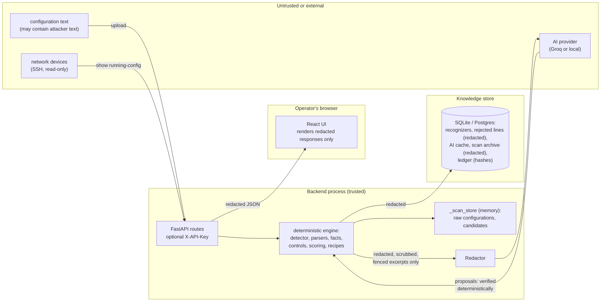
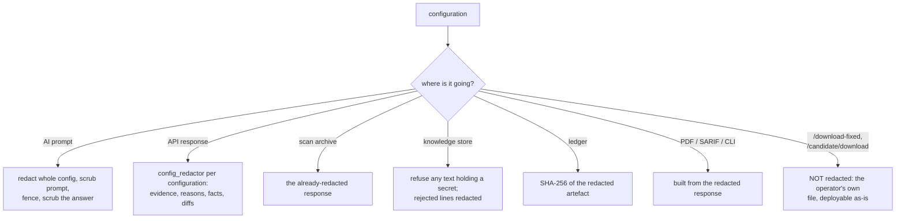
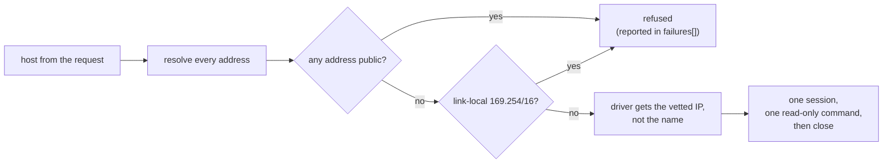

# Security Model

What NetAuditAI trusts, what it never lets happen, where each guarantee is enforced and which test proves it. Also,
plainly, what is **not** protected in this prototype.

**Related:** [ai-design.md](ai-design.md) · [deployment.md](deployment.md#3-hardening-an-exposed-instance) ·
[architecture.md](architecture.md)

---

## 1. Assets and trust boundaries

| Asset | Why it matters |
|---|---|
| Uploaded / collected configurations | hold passwords, hashes, pre-shared keys, SNMP communities, topology |
| Device credentials (live collection) | full read access to network equipment |
| Verdicts, posture, coverage | an auditor acts on them; a wrong PASS is worse than an UNKNOWN |
| Recognizers (knowledge store) | decisive on every later scan; a bad one is a real defect |
| Generated configurations | could take a device down if wrong |
| The audit record | must show what was decided, taught and fixed, unaltered |

**Trust decisions in one table:**

| Input | Trusted to | Not trusted to |
|---|---|---|
| Configuration text | be the device's configuration | contain instructions; banners, descriptions and comments are data |
| Detector + parsers | identify and read Cisco IOS / FortiGate | read anything once grammar coverage fails |
| Recognizers | read the exact statements they match | infer anything about lines they do not match |
| Heuristics | suggest | decide (never scored) |
| AI | propose | decide, select a vendor, write a fix, save knowledge |
| Administrator | confirm meanings and fixes | bypass the gates (a meaning the line does not state is refused) |

---

## 2. Compliance authority

Only deterministic code decides a result:

* facts come from confirmed parsers, documented defaults and confirmed recognizers (**decisive**), or from lexicon
  heuristics and verified AI proposals (**provisional**);
* controls (`app/controls/`) turn facts into PASS / FAIL / UNKNOWN / NOT_CONFIGURED / N_A;
* posture, coverage, findings counts, framework status, risk, attack paths and remediation read decisive results only.

PASS needs a cited line or a documented default. NOT_CONFIGURED is never PASS. For unknown vendors, absence is never
evidence, except through *learned absence* for the five settings no device ships with, and only when the dialect is
understood and knows how it writes the setting ([architecture.md §5](architecture.md#learned-absence-on-the-generic-path)).

---

## 3. Guarantees

### 3.1 Secrets

| Guarantee | Enforced in | Tested in |
|---|---|---|
| Secrets are redacted before any AI request (whole config redacted, excerpts and prompts scrubbed) | `app/ai/redaction.py`, `app/ai/judge.py`, `app/ai/remediation.py` | `test_phase1_redaction.py`, `test_phase7_ai_judge.py`, `test_candidate_remediation.py` |
| API responses the browser renders carry no configuration secret: evidence, reasons, fact values, framework evidence, adaptive lines, review items, remediation diffs and previews are redacted per configuration | `routes/scan.py` (`config_redactor`, `redact_lines`, `display_scrub`), `routes/remediation.py`, `routes/adaptive.py` | `test_ui_audit_regressions.py`, `test_remediation_e2e.py` |
| A recognizer or mapping is never drafted or saved from text holding a secret | `routes/adaptive.py` (`_draft`), `db/mappings.py` (`_holds_secret`, `_refuse_secrets`) | `test_ui_audit_regressions.py`, `test_phase9_frameworks_persistence.py` |
| Rejected lines are stored redacted | `db/mappings.py` | `test_phase9_frameworks_persistence.py` |
| The scan archive holds the redacted response and plans, never the configuration | `db/scans.py`, `routes/scan.py: archive_scan` | `test_scan_archive.py` |
| The ledger stores content hashes of redacted artefacts only | `app/ledger.py` | `test_ledger.py`, `test_mikrotik_credentials.py` |
| The assistant sees the redacted response, never the configuration | `routes/assistant.py: _scan_context` | `test_assistant_chat.py` |
| The PDF report carries no configuration secret and states nothing the file does not | `app/reporting/report.py` (built from the redacted response) | `test_pdf_report.py` |
| CLI output and SARIF quote no password, key or community string | `app/cli.py` | `test_cli.py` |
| A shared SNMP community across devices is matched by hash and never shown | `analysis/fleet_checks.py` | `test_fleet_checks.py` |
| The browser history stores no evidence or configuration lines | `frontend/src/utils/history.js` | `history.test.js` |
| Live-collection credentials are request-scoped: never stored, archived or logged; `Target.__repr__` hides them | `app/collect/collector.py` | `test_live_collection.py` |

### 3.2 AI authority

| Guarantee | Enforced in | Tested in |
|---|---|---|
| AI output is provisional: never scored, counted, remediated or a framework PASS/FAIL | `controls/evaluate.py`, `analysis/scoring.py`, `controls/frameworks.py`, `remediation/engine.py` | `test_phase7_ai_judge.py`, `test_phase9_frameworks_persistence.py`, `test_remediation_e2e.py` |
| AI cannot infer PASS from absence; every citation is verified against the cited line and scope | `ai/judge.py: verify` | `test_phase7_ai_judge.py` |
| An AI fact answers only the control that asked | `SecurityFact.control_id`, `controls/evaluate.py` | `test_phase7_ai_judge.py` |
| Hallucinated or unverified citations never reach the review queue | `routes/adaptive.py`, `facts/recognizers.py` | `test_phase7_ai_judge.py` |
| A fully hijacked model changes no verdict; the fence cannot be closed from inside | `ai/fence.py`, `ai/judge.py` | `test_prompt_injection.py` |
| An AI remediation proposal is refused unless it is exactly the expected shape for the control that asked | `ai/remediation.py` | `test_candidate_remediation.py` |
| An AI explanation is labelled AI-written commentary and never changes a status, severity or count | `frontend/src/app/FindingDrawer.jsx`, `routes/assistant.py` | `app/FindingDrawer.test.jsx` |
| The vendor is deterministic; look-alikes and mixed configs stay unverified | `parsers/detector.py`, `parsers/coverage.py` | `test_phase1_vendor_identification.py` |

### 3.3 Knowledge integrity

| Guarantee | Enforced in | Tested in |
|---|---|---|
| Recognizers require an administrator and pass safety gates; templates are typed slots, not regex | `facts/recognizers.py`, `db/mappings.py`, `adaptive/matcher.py` | `test_phase6_recognizers.py`, `test_recognizer_generalization.py` |
| Teaching cannot assert a meaning the line does not state | `facts/teaching.py`, `facts/recognizers.py` (`draft_recognizer`, `validate_recognizer`) | `test_resolution_queue.py` |
| Shipped seeds pass the same gates, load idempotently and never overwrite or revive what an administrator changed | `facts/seed.py` | `test_seed_knowledge.py` |
| Every cited line exists and says the cited text; posture and coverage recompute from the returned results | whole pipeline | `test_citations.py` |
| The published accuracy never gets worse: 0 missed, 0 false alarms, detection floors | `scripts/benchmark.py` | `test_benchmark.py` |

### 3.4 Remediation safety

| Guarantee | Enforced in | Tested in |
|---|---|---|
| Recipes only for decisive FAILs on confirmed vendors, never from caller or AI text, verified by rescan | `remediation/engine.py`, `routes/remediation.py` | `test_remediation_e2e.py` |
| Operator inputs are validated before they are written into a template | `remediation/recipes.py: parse_inputs` | `test_remediation_e2e.py` |
| Seed write-back changes only a slot a reviewed recognizer read, and must rescan to a decisive PASS | `remediation/writeback.py` | `test_writeback.py` |
| A candidate (typed or AI) is never executed, never edits the upload, never enters the confirmed-vendor download, never changes results, posture or coverage; a human confirms it | `remediation/candidates.py`, `routes/remediation.py` | `test_candidate_remediation.py` |
| Only a **verified** candidate has a corrected copy to download; the status gate is checked on the server | `routes/remediation.py`, `remediation/candidates.py` | `test_candidate_remediation.py` |
| A candidate exists only for a decisive FAIL on an unconfirmed vendor | `routes/remediation.py: _candidate_target` | `test_candidate_remediation.py` |
| A derived candidate is built only from the configuration's own words, only for a control a removal can resolve, never from a block opener | `remediation/candidates.py` (`derive`, `DERIVABLE_KINDS`, `block_openers`) | `test_derived_remediation.py` |
| A device is its `config_index`: a shared hostname never selects another upload's configuration | `routes/remediation.py`, `frontend/src/lib/domain.js`, `lib/useAudit.js` | `test_ui_audit_regressions.py`, `app/FindingDrawer.test.jsx` |
| A downloaded configuration matches the reviewed plan | `frontend/src/lib/useAudit.js` | `app/Fix.test.jsx` |

### 3.5 Network and audit record

| Guarantee | Enforced in | Tested in |
|---|---|---|
| Live collection reaches only private and loopback addresses by default; link-local (cloud metadata) refused by name; the vetted address, not the name, is handed to the driver (no DNS rebinding) | `app/collect/collector.py` | `test_live_collection.py` |
| Collection runs one read-only command per device; nothing is ever written to a device | `app/collect/collector.py` | `test_live_collection.py` |
| Any edit, deletion or reordering of a ledger entry is detected; a report PDF or zip verifies byte for byte | `app/ledger.py` | `test_ledger.py` |
| With `API_KEY` set, every `/api` route needs a matching `X-API-Key`, compared in constant time; `/health` stays open | `app/main.py: require_api_key` | `test_api_key.py` |

---

## 4. Redaction points

Values equal to a secret are redacted wherever they appear as a whole token, so a username equal to its password is
shown as `<SECRET:redacted>`.

---

## 5. Prompt injection

A configuration can carry attacker text (banner, description, comment, hostname). Two layers stop it from changing a
result:

* **Structural (the guarantee).** A decided check is never sent to the AI. An AI answer about an undecided check is
  only a proposal; deterministic code must find its quoted words on the cited line as a statement of that setting
  (text inside a banner or description states no setting), and a person confirms it before it counts.
* **Spotlighting (the soft layer).** `app/ai/fence.py` wraps quoted configuration in `BEGIN CONFIG <tag>` …
  `END CONFIG <tag>` with `<tag>|` on every line; the tag is a hash of the fenced lines.

**Measured** with `python backend/scripts/probe_injection.py` against the live model (Groq, 2026-09-26): 6 hostile
configurations, **0 succeeded**. Details in [ai-design.md §7](ai-design.md#7-prompt-injection).

---

## 6. Offline AI

Set `LOCAL_AI_URL` (for example `http://localhost:11434/v1` for Ollama) and `LOCAL_AI_MODEL`, and every AI call goes
to that OpenAI-compatible server: nothing leaves the network, for air-gapped sites. Redaction and the fence apply
unchanged. The engine never needs AI for a verdict, so a smaller local model only affects the optional parts. Tested
in `test_local_ai.py`.

---

## 7. Live collection

`POST /api/collect` takes a hostname from a request and opens an SSH session to it, a network-egress capability the
rest of the product does not have.

* **Read only.** The platform's "print the configuration" command, then close.
* **Where it may reach.** `LIVE_COLLECTION_NETWORKS=private` (default). `any` lifts it; never on a public host.
* **Credentials.** Request-scoped, never persisted, never in a repr or a log.
* **Off switch.** `LIVE_COLLECTION_ENABLED=false` closes both routes. Set it on any backend others can reach: there,
  the endpoint is a pivot into whatever network the backend can see.

---

## 8. Not protected (prototype)

Be explicit about these before exposing an instance:

* **Access control is one optional shared key.** With `API_KEY` set, every `/api` route requires `X-API-Key`. There
  are no users or roles, and by default the key is empty, so anyone who reaches the API can confirm recognizers,
  download remediated configurations and start collections. **The bundled frontend does not send the header**, so
  setting `API_KEY` breaks the UI unless a proxy adds it.
* **CORS allows every origin by default** (`CORS_ORIGINS=*`, with credentials allowed). With no `API_KEY`, any web page
  the operator visits can call a backend on `localhost:8000` from the operator's browser. Set `CORS_ORIGINS` to the
  frontend's origin on anything but a throwaway laptop.
* **Redaction is pattern-based.** A secret behind a keyword it does not know could reach the AI or a response.
* **`POST /api/download-fixed` returns the real configuration**, with its own secrets and the NTP key the operator
  typed. So does `POST /api/remediation/candidate/download`. Both are the operator's own file, deployable as-is.
* **A generated fix is verified against NetAuditAI's own parser and controls, not on a device.** Review it before
  deploying (warnings flag lockout, VPN-peer and client-compatibility risks).
* **A verified candidate is a weaker statement still:** the proposed text removes the finding from the uploaded *file*
  as the generic engine reads it. It says nothing about the real CLI syntax, side effects or safety on the device.
* **A new secret typed into a candidate command** (a key the configuration does not contain) cannot be detected; it is
  held in memory for the life of the scan and never written to the database.
* **The ledger is a hash chain in the same database**, not an external anchor. It proves the record was not edited as
  long as the latest hash is kept elsewhere (the PDF prints it).
* **No rate limiting** on any route, including the AI-backed ones; the AI budget is per scan, not per client.
