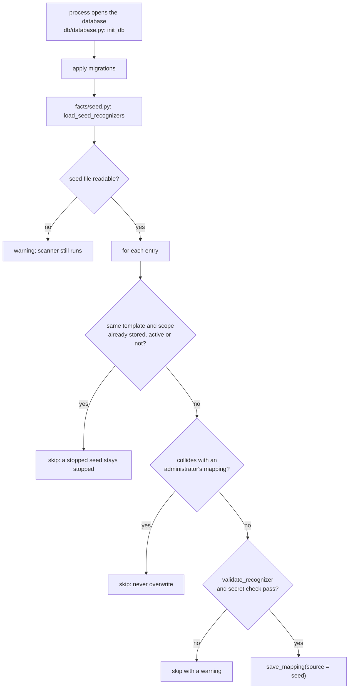

# Shipped seed knowledge

## What it is

Seed knowledge is a set of **recognizers NetAuditAI ships with**, so a fresh deployment can already read
common security settings in unfamiliar vendor syntax before an administrator teaches anything.

A seed recognizer is an ordinary recognizer (see `architecture.md` §8): the same typed-slot template, the same
safety gates, the same decisive `confirmed` fact. The only difference is **provenance** -it was written,
reviewed and released with the product instead of confirmed on this deployment.

It is **not** training and **not** a second learning system. Nothing is inferred, generalized or written back
into the seed file at runtime. The file is version-controlled and reviewed like code.

| | Seed knowledge | Runtime learning |
|---|---|---|
| Written by | the project, reviewed in a pull request | the administrator, under Adaptive learning |
| Lives in | `backend/data/seed_recognizers.json`, copied into `learned_mappings` | `learned_mappings` only (SQLite or Postgres) |
| `source` column | `seed` | `runtime` |
| Loaded into the store | the first time a process opens the database (idempotent) | when the administrator saves it |
| Read | on every scan | on every scan |
| Decisive | yes -it passes the same gates | yes |
| Can be stopped | yes, on the Learned mappings page (stays stopped across restarts and reloads) | yes |

Neither one decides compliance: both produce **facts**, and deterministic controls decide. Absence of a seed
recognizer is never evidence -an unread concept stays `UNKNOWN` or `NOT_CONFIGURED`.

## Where it lives and how it is loaded



* File: `backend/data/seed_recognizers.json` (an `_README` key, then `recognizers[]`).
* Loader: `backend/app/facts/seed.py` → `load_seed_recognizers()`.
* Hook: `app/db/database.init_db()` calls it the first time a process opens a database, which means every
  entry point -API, tests, a fresh container -gets it, including when SQLite is empty.

The loader is deterministic and idempotent:

* an entry whose template **and scope** is already stored is skipped, active or not -so a second load
  changes nothing, and a seed an administrator stopped stays stopped;
* an entry colliding with a mapping confirmed on this deployment is skipped, never overwritten;
* an entry that fails `validate_recognizer` -or holds a secret -is skipped with a warning, so one bad line
  can never stop a deployment from starting;
* a store failure is logged and the scanner still runs.

Every entry goes through `MappingRepository.save_mapping`, so it passes exactly the gates a human-confirmed
recognizer passes: two keywords besides stopwords counting the scope, stated polarity or a true/false table,
a unit for durations, a template that matches its example line, and no secret in any stored text.

## Slot types

| Slot | Reads | Example |
|---|---|---|
| `{int}` | a whole number, with or without a version prefix | `protocol-version v2` |
| `{host}` | an address (IPv4 or IPv6) **or** a hostname / FQDN | `ntp server ntp1.example.com` |
| `{ip}` | an address only -kept for recognizers written before `{host}` | `logging host 192.0.2.20` |
| `{duration}` / `{duration:<unit>}` | a number, with the unit the line states or the one the template names | `idle-timeout 600` |
| `{enum:<name>}` | one word, looked up in a value table | `disable-telnet no` |
| `{polarity}` | a polarity word anywhere in the line | `telnet server enable` |
| `{neg}` | an **optional leading negator** (`no` / `unset` / `delete` / `undo`) | `no telnet server` |
| `{rest}` | any trailing options, last token only, destinations and AAA servers only (see Limitations) | `ntp server 192.0.2.10 key 1` |
| `{community:RO}` / `{community:RW}` | an SNMP community string, read at scan time and never stored; seed-only (see Limitations) | `snmp-server community <SECRET> ro` |

`{neg}` is what lets one entry read both forms of a concept: `{neg} telnet server` says Telnet is on for
`telnet server` and off for `no telnet server`, and `{neg} telnet` scoped to `services` does the same for a
bare Junos statement. It may only be a template's first token, because a *leading* negator negates the whole
statement -which is why it outranks any `enable` word later in the line (`undo telnet server enable` is off).

A `{host}` slot refuses a polarity word and a bare number rather than reading one as a destination: an
undetermined destination leaves the control undecided instead of guessing one.

### Settings stated by naming a thing

Most booleans are toggles, and a line carrying a value says nothing about them: `server 10.0.0.1` names an
NTP server and states nothing about authenticating it, so it cannot teach "NTP authenticated".

Three are different, and are listed in `PRESENCE_PREDICATES` (`app/facts/recognizers.py`): **management
source restriction**, **central AAA** and **login banner**. No dialect writes "source restriction: on" -it writes
`permitted-ip 10.0.0.0/24`, `allow-address …` or `trusthost1 …`, and the line being there *is* the
restriction. For these, the address or name becomes `{any}` and `{neg}` reads the polarity, so one
recognizer covers every subnet:

```
taught:  set deviceconfig system permitted-ip 10.10.10.0/24
stored:  {neg} set deviceconfig system permitted-ip {any}
reads:   set deviceconfig system permitted-ip 192.0.2.0/24        -> restricted
         set deviceconfig system ntp-servers … 192.0.2.10         -> no fact
```

The list is short and deliberate: adding a predicate to it lets a line that merely mentions the setting
teach it. The rule is enforced in `validate_recognizer`, not only in the draft, so hand-writing
`{neg} ntp server {any}` for "NTP authenticated" is refused the same way.

### The line has to be about the setting

A recognizer is decisive, so the line it is built from has to be the line that answers the question.
`validate_recognizer` splits this in two:

* **The line states its own on/off.** Then the administrator names it, in any words. This is what
  teaching is for: `management-plane legacy-access disabled` may well be how a device says Telnet is
  off, and no word list will ever contain every vendor's spelling.
* **The line states nothing of its own** -it is evidence only because it is *there* -or it is read
  through a value slot, which has no polarity to anchor it. Then the line must name the concept, using
  the vocabulary in `CONCEPT_WORDS` (the same lexicon the queue suggests lines with).

Without the second rule any statement taught anything. Measured on the 49-line `sample/juniper.cfg`,
the Teach page accepted **146** nonsense combinations -`uid 2001;` teaching "management access is
restricted", `login {` teaching "stored passwords are encrypted" (a decisive PASS), `class ops;`
teaching a syslog destination of `ops`. With the rule: **2**, and both are real (`encrypted-password …`
is a password-storage line, `server …` under `ntp` is an NTP server).

The cost is the opposite error: a line that genuinely configures a setting in wording the lexicon does
not know is refused until the word is added. Extending `CONCEPT_WORDS` is the fix, and it is how the
Junos spelling `tacplus` was found -the shipped Junos TACACS+ recognizer was being rejected by its
own gate.

A login banner joined the list with the second `teach/` pass: `set login-banner "…"`, `message "…"` and
`header login information "…"` carry the message, and the message being there *is* the banner. `{any}`
reads a quoted string as one value however many words it holds, so one template covers every banner.

### One word, when the word is the feature

The two-keyword gate has one narrow exception (`_one_word_feature`): `disable telnet`, `lldp enable`,
`set lldp enabled false`, `set source-routing disabled` and `logging 192.0.2.20` are whole statements
about one feature. One keyword is enough when nothing else varies (no `{any}`) and either the switch is
spelled out in words, the word is a feature compound (`source-routing`, `telnet-server`), or an `{ip}`
slot follows a word that names the concept. `set telnet {polarity}` is none of these -inside a block it
may be a client or per-interface setting- and is still refused.

### Password storage without a password

A password-storage line always holds the secret, so its template puts slots there:
`username {any} privilege {any} secret {enum:type} {any}`. The store refuses any text that redaction
would change *unless* everything redaction removes is a slot or an existing `<SECRET:…>` placeholder
(`_holds_secret` in `app/db/mappings.py`), so the type is read and no value is ever stored. Example lines
use the placeholder: `secret 0 <SECRET:type0>`. The cited line does hold a secret, exactly as a vendor
parser's password fact does; every path to the AI redacts evidence first.

## What is covered

396 recognizers under 24 `vendor` labels: **16 device dialects** with no dedicated parser (Junos, PAN-OS, Arista EOS,
Huawei VRP, MikroTik RouterOS, Check Point Gaia, Extreme EXOS, HPE Aruba AOS-CX, Cisco NX-OS, ASA, IOS-XR, SONiC,
Cumulus NVUE, Dell OS10, VyOS, Fortinet FortiSwitchOS), two shared labels (Arista and NX-OS; Junos and VyOS, whose
`set system syslog host` and `set system ntp server` spellings are identical), three cloud exports (AWS security groups, Azure NSG, GCP firewall
rules) and Terraform for AWS, Azure and GCP. All of them stay generic / unconfirmed. The `vendor` field is a label for
readability, never a claim of parser support and never used to select a code path (it does name the *dialect* for
learned absence, see [architecture.md §5](architecture.md#learned-absence-on-the-generic-path)).

### Coverage matrix

How many shipped recognizers read each setting, per dialect (generated from `seed_recognizers.json`). An empty cell
means that setting is answered only by heuristics (provisional) or by teaching.

Columns: **Telnet**, **HTTP** management (MGMT-001/002) · **Src** source restriction (MGMT-003) · **Ext** external
exposure (MGMT-010) · **SSH** version (MGMT-007) · **Idle** timeout (MGMT-006) · **Cry** weak management crypto
(CRYPTO-002) · **AAA** (MGMT-008) · **Pwd** password storage (MGMT-005) · **Lock** failed-login limit (AUTH-001) ·
**Len** password length (AUTH-002) · **Acct** default account (AUTH-003) · **SNMP** community (MGMT-004/011) ·
**Syslog** (LOG-001) · **NTP** server, **NTPa** NTP authentication (LOG-002) · **Ban** banner (MGMT-009) · **SrcR**
source routing (BOUNDARY-002) · **LLDP** (BOUNDARY-003) · **Rtr** redirects / proxy-ARP / directed broadcast
(BOUNDARY-004) · **Any** any-any rule (BOUNDARY-001) · **RLog** rule logging (LOG-003) · **VPN** IPsec / IKE
proposal (CRYPTO-001).

| Dialect | Total | Telnet | HTTP | Src | Ext | SSH | Idle | Cry | AAA | Pwd | Lock | Len | Acct | SNMP | Syslog | NTP | NTPa | Ban | SrcR | LLDP | Rtr | Any | RLog | VPN |
|---|---|---|---|---|---|---|---|---|---|---|---|---|---|---|---|---|---|---|---|---|---|---|---|---|
| Juniper Junos | 47 | 2 | 3 | 2 | 2 | 2 | 2 | 3 | 8 | 1 | 1 | 1 | 2 | 1 | 1 | 1 | 1 | 2 |  | 3 | 2 |  |  | 5. Coverage pass: `set system no-redirects` (and per-interface `family inet no-redirects`, read but undecided), NTP `trusted-key`, SSH `ciphers` / `macs` / `key-exchange` one per line, IKE and IPsec `proposal` encryption / authentication / DH group |
| Palo Alto PAN-OS | 34 | 2 | 2 | 2 |  | 1 | 2 | 1 | 2 | 1 | 1 | 1 | 1 | 1 | 4 | 1 | 1 | 1 | 2 | 1 |  |  | 1 | 6. Coverage pass: zone-protection `discard-strict-source-routing` / `discard-loose-source-routing no` (only `no` is read: `yes` on one option says nothing of the other), a CBC cipher in an SSH server profile (a strong list proves nothing about the profile in force), IKE and IPsec crypto profiles (one value per line) |
| Arista EOS | 33 | 3 | 3 | 1 |  | 1 | 1 |  | 1 | 5 | 2 | 1 | 2 | 4 | 2 | 1 | 2 | 1 | 1 | 1 |  | 1 |  | . Coverage pass: `no lldp transmit` under an interface (read; decided only on an interface an external zone holds) |
| Huawei VRP | 29 | 2 | 2 | 1 |  |  | 1 |  | 1 | 2 | 1 |  | 1 | 2 | 1 | 2 | 1 | 1 | 1 | 1 | 1 | 3 |  | 5. Coverage pass: `acl … inbound` under `user-interface vty`, `authentication-mode hwtacacs |radius|local` under `authentication-scheme`, `ssh server authentication-retries`, `undo icmp redirect send`, `ike proposal` / `ipsec proposal` algorithms |
| MikroTik RouterOS | 29 | 2 | 1 |  |  |  |  | 2 | 1 | 5 |  | 1 | 2 | 3 | 2 | 2 |  | 2 | 1 | 1 | 1 | 3 |  | . Coverage pass: `/ip settings set accept-source-route=` and `send-redirects=` (one property per line; RouterOS prints several on one line, which is then left undecided), `/user aaa set use-radius=`, `/user settings set minimum-password-length=`, a default account in `/user add name=` or `/user set admin …` |
| Extreme Networks EXOS | 23 | 1 | 1 | 1 |  |  | 1 |  | 2 | 1 | 2 | 1 | 1 | 1 | 1 | 2 | 1 | 1 | 2 | 1 | 2 | 1 |  | . Coverage pass: `configure cli max-failed-logins`, `password-policy lockout-on-login-failures on` (three attempts) / `off`, `password-policy min-length`, `enable|disable tacacs` and `radius mgmt-access`, `enable ip-option loose-|strict-source-route`, `disable icmp redirects [ipv4] vlan all`, `enable ntp authentication`, `configure ntp server add` |
| Check Point Gaia | 22 | 1 | 1 | 1 |  |  | 1 | 3 | 2 | 1 | 2 | 1 | 1 | 1 | 1 | 1 | 1 | 1 | 1 | 1 |  | 1 |  | . Coverage pass: `set user … password-hash` (hashed) and the default `admin` account, `set aaa tacacs-servers state on|off`, `deny-on-fail failures-allowed` and `deny-on-fail enable off` (no limit), a weak cipher / MAC / key exchange switched `on` |
| Cisco ASA | 20 |  |  |  |  | 1 | 4 | 2 | 1 | 1 | 1 | 1 | 1 |  | 1 |  |  |  |  |  |  | 1 |  | 6. Coverage pass: `username … pbkdf2|encrypted privilege` storage and the default account, `telnet timeout`, `ssh cipher encryption <level>` (every predefined level includes CBC) and four CTR-only `custom` lists, `crypto ikev1|ikev2 policy` encryption / hash / integrity / group. A one-line `banner login <text>` no longer hides the lines after it |
| Terraform (AWS) | 17 |  |  | 12 |  |  |  |  |  |  |  |  |  |  |  |  |  |  |  |  |  | 5 |  |  |
| VyOS | 16 |  |  |  |  |  |  | 4 | 1 |  |  |  | 1 | 2 |  |  |  | 1 | 1 |  | 1 |  |  | 5. Coverage pass (1.3): `set firewall ip-src-route`, `set firewall send-redirects`, `set service ssh mac` and `key-exchange`, `set vpn ipsec esp-group|ike-group … proposal N encryption|hash|dh-group` |
| Cisco NX-OS | 15 | 1 | 1 | 1 |  |  | 1 | 1 | 2 | 1 | 1 | 1 | 1 | 1 | 1 |  |  | 1 |  | 1 |  |  |  | . Coverage pass: `banner motd` (single-line or delimited), the default account in `username … role`, `ssh cipher-mode weak`, `nxapi http port …` (cleartext HTTP) |
| HPE Aruba AOS-CX | 13 | 1 | 1 | 1 |  |  | 1 |  |  | 1 | 1 |  | 1 | 1 | 1 |  | 1 | 1 |  |  | 1 | 1 |  | . Coverage pass: top-level `session-timeout` (minutes), `no ip icmp redirect`, `apply access-list ip … control-plane vrf …` |
| Azure NSG (JSON) | 12 |  |  | 6 |  |  |  |  |  |  |  |  |  |  |  |  |  |  |  |  |  | 6 |  |  |
| Fortinet FortiSwitchOS | 12 |  |  |  |  | 1 | 1 | 1 | 1 | 1 | 1 | 1 |  | 1 | 1 | 1 | 1 | 1 |  |  |  |  |  |  |
| Terraform (Azure) | 12 |  |  | 6 |  |  |  |  |  |  |  |  |  |  |  |  |  |  |  |  |  | 6 |  |  |
| Cisco IOS-XR | 11 | 1 |  | 1 |  | 1 | 1 |  |  | 2 |  |  |  |  | 1 |  | 2 | 1 |  |  |  | 1 |  | . Coverage pass: `ssh server v2`, `ssh server vrf … ipv4 access-list`, `telnet vrf … ipv4 server max-servers`, `secret 5|8|9|10` and `password 0|7` under `username`, `exec-timeout <min> 0` under `line`, `banner login`, `authenticate` / `trusted-key` under `ntp`, `permit ipv4 any any` under `ipv4 access-list` |
| Dell OS10 | 11 | 1 |  | 2 |  |  | 1 |  |  |  | 2 | 1 | 2 |  |  |  |  | 1 |  |  |  | 1 |  | . Coverage pass: top-level `exec-timeout` (seconds; the scope `{top}` keeps it off NX-OS `line vty`), `ip access-group … mgmt|data in` under `control-plane`, `seq N permit ip any any` |
| SONiC (config_db.json) | 11 |  |  |  |  |  |  |  | 2 |  |  |  |  | 2 | 1 | 6 |  |  |  |  |  |  |  |  |
| GCP firewall rules (JSON) | 8 |  |  | 4 |  |  |  |  |  |  |  |  |  |  |  |  |  |  |  |  |  | 4 |  |  |
| NVIDIA Cumulus Linux (NVUE) | 6 |  |  |  |  |  |  |  | 2 |  |  |  |  | 2 | 1 | 1 |  |  |  |  |  |  |  |  |
| Arista EOS / Cisco NX-OS | 5 |  |  |  |  |  |  |  |  |  |  |  |  |  |  |  |  |  |  | 1 | 3 | 1 |  |  |
| AWS security group (JSON) | 4 |  |  | 3 |  |  |  |  |  |  |  |  |  |  |  |  |  |  |  |  |  | 1 |  |  |
| Terraform (GCP) | 4 |  |  | 2 |  |  |  |  |  |  |  |  |  |  |  |  |  |  |  |  |  | 2 |  |  |
| Juniper Junos / VyOS | 2 |  |  |  |  |  |  |  |  |  |  |  |  |  | 1 | 1 |  |  |  |  |  |  |  |  |
| **All** | **396** | **17** | **15** | **46** | **2** | **7** | **17** | **17** | **26** | **22** | **15** | **10** | **16** | **22** | **20** | **19** | **11** | **15** | **9** | **11** | **11** | **38** | **1** | **27** |

**VPN** is CRYPTO-001: a proposal written one algorithm per line (`encryption-algorithm 3des-cbc`, `dh-group group2`)
is read line by line, each line's value table naming the part it states (`{"group2": {"dh_group": 2}}`); a weak part
on any line fails the proposal. A list on one line (`encryption [ aes-128-cbc 3des ]`) is not read.

### Coverage per dialect, measured

`backend/scripts/seed_coverage.py` scans one reference configuration per dialect (`backend/tests/fixtures/seed_coverage/`,
every line written as the vendor documents it) through the real pipeline with the shipped seeds only, no AI, and counts
the checks that come out **decided**: PASS or FAIL from a parser, a recognizer or a documented default. A heuristic
suspicion or an UNKNOWN does not count. `tests/test_seed_coverage.py` holds each dialect at its measured floor.

```bash
cd backend && python scripts/seed_coverage.py
```

This measures what the engine can decide **when the configuration states the setting**. A real file that leaves a
setting out still leaves it undecided, unless the setting is one no device ships with (learned absence) or a
documented default covers it.


| Dialect | Before | After | Still undecided, and why |
|---|---|---|---|
| Juniper Junos | 15 | **20** (87 %) | BOUNDARY-001: a policy's `match` conditions are separate `set` lines, and no single line says any-any. BOUNDARY-002: no Junos statement for IP source routing was found in Juniper's documentation. LOG-003: `then log` exists, but a policy without it says nothing on its own line, so only a PASS could be read |
| Palo Alto PAN-OS | 16 | **20** (87 %) | MGMT-010: exposure joins a zone, an interface and a management profile (read by heuristics, provisional). BOUNDARY-001: rule fields are separate `set` lines. BOUNDARY-004: PAN-OS states no redirect / proxy-ARP switch |
| Extreme Networks EXOS | 12 | **19** (83 %) | MGMT-010: no zones on a switch. LOG-003 (see Junos). CRYPTO-001: no IPsec. CRYPTO-002: `configure ssh2 enable cipher` was not verified against Extreme's reference |
| Arista EOS | 18 | **18** (78 %) | MGMT-010. BOUNDARY-003: `lldp run` switches LLDP on everywhere; `no lldp transmit` on one interface says nothing of the others. LOG-003. CRYPTO-001. CRYPTO-002: `cipher aes256-ctr aes128-ctr` lists several words on one line |
| Cisco NX-OS | 13 | **18** (78 %) | MGMT-010. BOUNDARY-002: no NX-OS source-route command is documented. BOUNDARY-003 (see Arista). LOG-003. CRYPTO-001 |
| Huawei VRP | 12 | **18** (78 %) | MGMT-007: `ssh server compatible-ssh1x` was not verified. MGMT-010. AUTH-002: no minimum-length command was found in Huawei's documentation. LOG-003. CRYPTO-002: `ssh server cipher` lists several ciphers on one line |
| Check Point Gaia | 13 | **18** (78 %) | MGMT-007: no source states Gaia's SSH protocol version. MGMT-010. BOUNDARY-004: no clish setting. LOG-003 and CRYPTO-001: the rulebase and VPN communities live in the management server, not in clish |
| Cisco ASA | 7 | **16** (70 %) | MGMT-002: `http server enable` starts HTTPS (ASDM), and the same words mean cleartext HTTP on Huawei, so they stay a suspicion. MGMT-003: `ssh <net> <mask> <interface>` has one keyword and three free words; a template that loose would also read `ssh key-exchange group …`. MGMT-010. BOUNDARY-002/003/004: no ASA setting a configuration states. LOG-003 (see Junos) |
| MikroTik RouterOS | 10 | **15** (65 %) | MGMT-003: `/ip service set ssh address=` covers one service of six. MGMT-006 and AUTH-001: RouterOS has no idle timeout or login lockout setting. MGMT-007: RouterOS 3.0 still offered SSH 1.x and no current source says otherwise. MGMT-010. LOG-002: the NTP client has no authentication. LOG-003 (see Junos). CRYPTO-001: the export prints every proposal property on one line |
| HPE Aruba AOS-CX | 12 | **15** (65 %) | MGMT-007: no source. MGMT-010. AUTH-002: `minimum-length` counts only after `enable` in the same `password complexity` block, which a line template cannot see. BOUNDARY-002 and BOUNDARY-003: global commands not verified. LOG-003. CRYPTO-001. CRYPTO-002: cipher lists |
| Dell OS10 | 7 | **13** (57 %) | MGMT-002: no cleartext HTTP server is documented (REST is HTTPS). MGMT-005: the password line holds the hash with no storage keyword. MGMT-007: no source. MGMT-010. BOUNDARY-002/003/004: not found as configuration lines in Dell's documentation or the DISA OS10 STIGs. LOG-003. CRYPTO-001. CRYPTO-002: cipher lists |
| VyOS | 7 | **13** (57 %) | MGMT-001 and MGMT-002: VyOS 1.3 documents no Telnet or HTTP management service to read. MGMT-003: `listen-address` is not a source restriction. MGMT-006: only `client-keepalive-interval`. MGMT-007: no VyOS source. MGMT-010. AUTH-001 and AUTH-002: 1.3 has no lockout or password policy. BOUNDARY-001: firewall rule fields are separate lines. LOG-003 |
| Cisco IOS-XR | 2 | **12** (52 %) | MGMT-002: no HTTP management server. MGMT-010. AUTH-001 and AUTH-002: `aaa password-policy` does nothing until a user names it, a link between two blocks a line template cannot follow. AUTH-003: the account name is the block header `username admin`. BOUNDARY-002/003/004. LOG-003. CRYPTO-001. CRYPTO-002: cipher lists |
| Fortinet FortiSwitchOS | 3 | **12** (52 %) | MGMT-001, MGMT-002, MGMT-003: `set allowaccess ping https ssh` is a list on one line. MGMT-010. AUTH-003: the account name is the `edit "admin"` header. BOUNDARY-001: ACL entries are several lines. BOUNDARY-002/003/004. LOG-003. CRYPTO-001 |

Seven of fourteen commercial dialects reach 18 of 23 (75 %). The other seven are held back by the same few walls,
and every one of them is a choice not to guess: **lists on one line** (cipher lists, `allowaccess`, RouterOS
properties), **objects spread over several lines** (firewall rules, a password policy and the user it applies to),
**interface-local settings** whose other interfaces keep a default the file does not show, and **settings no source
documents**. Getting past them needs engine work (a list slot, multi-line joins), not more seeds.

### Concepts per dialect

References to `teach/` below mean the corpus of configurations used while writing the seeds. Its eight
`teach/*_5_configs` dialect sets are committed (tests and the benchmark read them; secrets are `TEST-REDACTED`); the
rest of `teach/` stays git-ignored. Batfish test configurations (Apache-2.0) were used the same way and are not
committed.

| Dialect | Concepts read |
|---|---|
| Juniper Junos | Brace and `set` forms (each `set` seed also reads the brace form): Telnet, HTTP management, SSH version, session idle timeout, remote syslog, NTP server, LLDP (on, or `lldp disable`), RADIUS / TACACS+ servers, `authentication-order` (one method or a bracketed list), `allow-address` and `allow-sources` source restriction, login `message` banner, `encrypted-password` storage (set form), `host-inbound-traffic system-services` on an `untrust`/`outside`/`internet` zone (MGMT-010), SSH `root-login allow|deny` (AUTH-004; `deny-password` is not decided); documented default: no `idle-timeout` in a login class means sessions never time out (MGMT-006 FAIL by learned absence) |
| Palo Alto PAN-OS | Telnet (service and interface profile), HTTP management (service and interface profile), SSH version, session idle timeout (two spellings), remote syslog (`log-settings syslog` server profiles, shared and per vsys, plus two `deviceconfig` spellings), NTP server, NTP authentication, `permitted-ip` (system and interface profile; `0.0.0.0/0` reads as unrestricted), login banner, `phash` password storage, LLDP per interface, TACACS+ and RADIUS server profiles, admin lockout (`set deviceconfig setting management admin-lockout failed-attempts`) |
| Arista EOS | Telnet, HTTP management (both polarities), SSH version, session idle timeout, remote syslog, NTP server, NTP authentication, IP source routing, LLDP, login banner, management ACL applied under `management ssh`, permissive any-any rule, local-only login, password storage, lockout (`aaa authentication policy lockout failure N [duration …]`), minimum password length (`password minimum length N` under `management security`), `ntp authenticate servers`, `management api http-commands` with `protocol http` / `no protocol http` (a shut-down API serves nothing), `username … nopassword` (no credential) |
| Huawei VRP | Telnet (`enable` and `undo`), HTTP management (`enable` and `undo`), remote syslog, NTP server, NTP authentication, session idle timeout, IP source routing, LLDP, login banner, password storage, permissive ACL rule, `ntp-service unicast-server <address> …` with trailing options (`authentication-keyid`), advanced ACL `rule <n> permit ip` (any to any), `authentication-mode none` under `user-interface vty` (no credential); documented default: a VTY with no `acl … inbound` accepts any source |
| MikroTik RouterOS | Telnet (also with `port=`), HTTP management (`www`), NTP server (two spellings), remote syslog, LLDP, login note, permissive input rule, SNMP community (`/snmp community set [ find … ] name=` and `add name=`, read-only), a password written in the file (`/user set|add … password=`, either side of `group=`), the property order `/export` writes: `/ip firewall filter add action=accept chain=<chain>` with no condition (permit-any), `/system note set note=… show-at-login=yes`, `/system logging action add name=… remote=<address> target=remote`, `/user set [ find name=… ] password=""` (no credential); documented default: IP services accept any source address |
| HPE Aruba AOS-CX | Telnet, HTTP management, NTP authentication, login banner, permissive any-any rule, remote syslog, LLDP, local-only login, password storage |
| Check Point Gaia | Telnet, HTTP management, remote syslog, NTP server, NTP authentication, SNMP source restriction, LLDP, IP source routing, session idle timeout, login banner, permissive access rule, minimum password length (`set password-controls min-password-length`) |
| Terraform (AWS) | `aws_security_group` `ingress { }`, `aws_security_group_rule` (`type = "ingress"`), `aws_vpc_security_group_ingress_rule`: SSH / Telnet / RDP from `0.0.0.0/0` or `::/0` (or restricted to a prefix: PASS), any protocol (`-1`) or every TCP port from anywhere. A rule with other attributes (`self`, `security_groups`, several CIDRs) matches no template and stays undecided |
| Terraform (Azure) | `security_rule { }` inside `azurerm_network_security_group` and `azurerm_network_security_rule`: an Inbound Allow on port 22 / 23 / 3389 or on `*` from `*`, `Internet` or `0.0.0.0/0`. Open rules only: `*` cannot fill an `{enum}` slot (it is the table's wildcard), so the source is literal and a restricted rule is not read (undecided, never PASS) |
| Terraform (GCP) | `google_compute_firewall` with `source_ranges = ["0.0.0.0/0"]` (with or without `direction = "INGRESS"`), read on its `allow { }` block: port 22 / 23 / 3389 or `protocol = "all"`. Open rules only |
| SONiC (`config_db.json`) | `SNMP_COMMUNITY` entries with `TYPE` RO / RW (a default name fails MGMT-004), `SYSLOG_SERVER` and `NTP_SERVER` entries (an NTP server with `admin_state: disabled` is not read), `TACPLUS_SERVER` / `RADIUS_SERVER` entries (central AAA). Not seeded: `AAA authentication login "tacacs+,local"` (a comma cannot fill an `{enum}` slot) and `SSH_SERVER POLICIES` (one line of a dozen optional keys). Sources: [config_db reference](https://github.com/sonic-net/sonic-buildimage/blob/master/src/sonic-yang-models/doc/Configuration.md) (NTP, syslog, TACACS+, RADIUS, AAA, SSH_SERVER), [sonic-snmp.yang](https://github.com/sonic-net/sonic-buildimage/blob/master/src/sonic-yang-models/yang-models/sonic-snmp.yang) (SNMP_COMMUNITY) |
| NVIDIA Cumulus Linux (NVUE) | `nv set service snmp-server readonly-community <string> access <any\|prefix> [view …]`, `nv set service syslog <vrf> server <host> …`, `nv set service ntp <vrf> server <host> …`, `nv set system aaa tacacs server <priority> host <ip>` and `… tacacs enable on`. The `startup.yaml` form is not read (no YAML reader ships). Sources: [SNMP](https://docs.nvidia.com/networking-ethernet-software/cumulus-linux-59/Monitoring-and-Troubleshooting/Simple-Network-Management-Protocol-SNMP/Configure-SNMP/), [syslog](https://docs.nvidia.com/networking-ethernet-software/nvue-reference/Set-and-Unset-Commands/Syslog/), [NTP](https://docs.nvidia.com/networking-ethernet-software/cumulus-linux-59/System-Configuration/Date-and-Time/Network-Time-Protocol-NTP/), [TACACS+](https://docs.nvidia.com/networking-ethernet-software/cumulus-linux-59/System-Configuration/Authentication-Authorization-and-Accounting/TACACS/) |
| Azure NSG (JSON) | `az network nsg show` (`securityRules`) and `az network nsg rule list`: an `Allow` / `Inbound` rule on port 22 / 23 / 3389 or on `*`, from `*`, `Internet` or `0.0.0.0/0`. Open rules only (as for Terraform Azure); `defaultSecurityRules` are not read. Format: [az network nsg](https://learn.microsoft.com/cli/azure/network/nsg) |
| GCP firewall rules (JSON) | `gcloud compute firewall-rules list --format=json`: an `allowed` rule, `direction: INGRESS`, `disabled: false`, from `0.0.0.0/0`, on port 22 / 23 / 3389 or `IPProtocol: all` (with or without `logConfig`, with or without one `targetTags`). A `denied` or disabled rule is not read. Format: [gcloud compute firewall-rules](https://cloud.google.com/sdk/gcloud/reference/compute/firewall-rules/list) |
| AWS security group (JSON) | any-protocol rule open to `0.0.0.0/0`, SSH / Telnet / RDP open to the world (or restricted to a prefix). The 20 checks a security group cannot express are N/A with the reason (`backend/data/platform_profiles.json`) |
| Extreme Networks EXOS | Telnet, HTTP management (`web`), remote syslog, NTP server, LLDP, login banner, permissive any-any rule, session idle timeout, password storage, SSH `access-profile` source restriction |
| Cisco NX-OS | remote syslog (`logging server`), TACACS+ server, session idle timeout under `line`, permissive any-any rule, NTP server, `username … password 0` or `5` storage, `aaa authentication login default group`, `access-class … in` under `line vty`, `feature telnet` and `feature lldp` (on or off), `userpassphrase min-length`, `ssh login-attempts` |
| Cisco ASA | remote syslog (`logging host <interface> <address>`), permissive `extended` any-any rule, NTP server, `aaa authentication <service> console <group>` (`LOCAL` alone is not central), `ssh version`, idle timeouts (`ssh timeout`, `console timeout`, `http server idle-timeout`, minutes), `aaa local authentication attempts max-fail`, `password-policy minimum-length` |
| Cisco IOS-XR | remote syslog (`logging <address> vrf …`), NTP server, TACACS+ server |
| Dell OS10 | Telnet (`ip telnet server enable`, `no …`), minimum password length and lockout (`password-attributes min-length`, `password-attributes max-retry N [lockout-period …]`), default account (`username admin password … role …`), login banner (`banner login ^C`). Syslog, NTP, NTP authentication, SNMP communities and TACACS+ are already read by the NX-OS / Arista spellings, which OS10 shares |
| VyOS | Pre-login banner (`set system login banner pre-login`), RADIUS (`set system login radius-server`), SNMP read-only community (`set service snmp community … authorization ro`), weak SSH ciphers and MACs (`set service ssh ciphers` / `macs`), the default `vyos` account. Syslog host and NTP server are shared with Junos (label `Juniper Junos / VyOS`). Quoted leaf values (`'aes256-ctr'`) are read like unquoted ones |
| Fortinet FortiSwitchOS | Under `config system global`: `admintimeout` (minutes), `admin-lockout-threshold`, `strong-crypto`, `admin-ssh-v1` (version 1 or 2), `pre-login-banner` (the text on FortiSwitchOS; `enable` / `disable` on FortiGate both read correctly). Coverage pass, FortiOS-style tables through scope chains: `minimum-length` under `config system password-policy`, `server` under `config log syslogd setting` (a block with `set status disable` configures nothing), `set name` under `config system snmp community > edit …` (read-only), `set password ENC …` and `set remote-auth` under `config system admin > edit …`, `set authentication` under `config system ntp`, `set server` under `config system ntp > config ntpserver > edit …`. A FortiSwitch (or any FortiOS file without a FortiGate-only section) is unverified, so these are what make it decidable |

The third pass mined Batfish's multi-vendor test configurations (Apache-2.0, kept out of the repository):
servers written with trailing options (`{rest}`), NX-OS, ASA and IOS-XR spellings, and set-style Junos
(`set system tacplus-server`, `syslog host`, `ntp server`, `login class … idle-timeout`). Rejected from the
same pass: a BGP `idle-restart-timer` and an application `inactivity-timeout` read as session timeouts,
PAN-OS `from any;` read as an any-any rule on its own, a VLAN filter and a policy-routing entry read as
access rules, a PAN-OS syslog *profile* read as logs being sent, and a `key` on an NTP server read as NTP
authentication.

The second `teach/` pass read every setting the forty configurations state, where a control consumes it.
Shared spellings are one entry: `lldp enable` (Huawei, Aruba) and `aaa authentication login default local`
(Arista, Aruba). RouterOS one-line commands (`/system note set show-at-login=yes …`) are scoped to their
menu path; before this pass the tokenizer dropped them as bare headers.

One entry per concept per dialect: values, names and layout are read from slots, not memorized, so a second
address or a differently indented file needs no second entry.

Syntax examples, all of which generalize over addresses, names, numbers, indentation and block placement:

```
system { services { telnet; } }                       # Junos -Telnet reachable, "no telnet;" not
system { services { ssh { protocol-version v2; } } }  # Junos -SSH version 2
system { ntp { server 198.51.100.44; } }              # Junos -NTP server
set deviceconfig system service disable-telnet no     # PAN-OS -Telnet reachable
set deviceconfig setting management idle-timeout 30   # PAN-OS -30 minute timeout
management ssh
   idle-timeout 15                                    # Arista EOS -15 minute timeout
logging host 198.51.100.55                            # Arista EOS / IOS-like -remote syslog
telnet server enable                                  # Huawei VRP -Telnet reachable
ntp-service authentication enable                     # Huawei VRP -NTP authenticated
/ip service
set telnet disabled=yes                               # RouterOS -Telnet not reachable
no telnet server                                      # Aruba AOS-CX -off; "telnet server" is on
undo telnet server enable                             # Huawei VRP -off despite the trailing "enable"
set syslog remote logs.example.com                    # Gaia -a name, not only an address
configure syslog add 198.51.100.20 local4             # EXOS -the facility is read as {any}
set ntp server secondary 198.51.100.11                # Gaia -primary and secondary, one entry
banner login                                          # Arista -- a banner; "no banner login" is none
management ssh
   ip access-group MGMT-IN in                         # Arista -- scoped: an interface ACL is not this
ip access-list WAN-IN
   10 permit ip any any                               # Arista -- a permissive any-any rule
set network profiles interface-management-profile MGMT permitted-ip 192.0.2.0/24   # PAN-OS
system { login { profile OPS { allow-address 192.0.2.0/24; } } }                   # Junos
```

The last eleven entries were taught on the Teach page from the configurations in `teach/`, reviewed by
hand, generalized (an ACL name, a profile name, a rule number and an interface name each became `{any}`)
and then shipped here. What the same pass proposed and a person rejected is the other half of the lesson:
a `delete` / `no` line read as configuring the thing it removes, a local user read as central AAA, `set
ntp active on` read as NTP *authentication*, and a dozen templates that memorized one site's ACL or
interface names. Passing the gates makes a recognizer safe to store, not worth shipping.

## Limitations

* **Coverage is partial by design.** A setting a dialect's files never state has nothing to read, and some settings
  are written in shapes a line template cannot hold (a list on one line, an object spread over several lines). Those
  controls stay `UNKNOWN` / `NOT_CONFIGURED` until an administrator teaches them; the measured ceiling per dialect,
  and why, is in [Coverage per dialect, measured](#coverage-per-dialect-measured). IPsec proposals are read only one
  algorithm per line, by seeds (teaching does not draft the value tables).
* **Checks added later (MGMT-010, AUTH-001…003, CRYPTO-002, LOG-003, BOUNDARY-004)** read the same way. RouterOS
  `/ip ssh set strong-crypto=`, PAN-OS rule `log-end`, and Arista / NX-OS interface `ip redirects` / `ip proxy-arp` /
  `ip directed-broadcast` (stated only: other vendors' defaults are not assumed). Seeded: Junos `host-inbound-traffic
  system-services` on an `untrust`/`outside`/`internet` zone, `retry-options tries-before-disconnect`, `password
  minimum-length`, `login user … class`; PAN-OS `password-complexity minimum-length`, `mgt-config users …
  superuser yes`; Aruba `ssh server max-auth-attempts`, `user … group`; Arista `username … privilege`; EXOS
  `configure account`; Huawei `local-user … privilege level`. A default account is read through a value table
  of default names (`admin`, `administrator`, `root`, `cisco`, `manager`), so only those names produce a fact:
  any other name says nothing, and the account check is seed-only (teaching does not draft value tables).
* **A missing setting is decided only with a reviewed factory default.** For a dialect it understands, a
  setting no device ships with (AAA server, remote syslog, banner, NTP) that no line states is `NOT_SET`. Any other
  setting needs its vendor's factory default recorded, with its source, in `backend/data/factory_defaults.json`.
  Two kinds of entry:
  * *unset by default* (a string, the reason): PAN-OS password length (Minimum Password Complexity is off), Check
    Point lockout (`deny-on-fail enable off`). The setting is `NOT_SET`, so the check fails and says how the dialect
    would have written it;
  * *a value by default* (`{"value": …, "reason": …}`, a key may name a subject: `…protocol_enabled:telnet`): NX-OS
    SSH version 2, Telnet off and CTR-only SSH ciphers; EXOS SSH version 2; Cisco ASA Telnet refused and CBC ciphers
    accepted (`ssh cipher encryption medium`); RouterOS source routing refused; VyOS LLDP off and NTP
    unauthenticated. The fact is assurance `DEFAULT` and the reason quotes the source.

  Either kind applies only when nothing states the setting: no fact about it of any assurance, and no line that so
  much as names it (for length: a password line that also speaks of length or complexity). A line already read as
  *another* setting by a seed does not count: ASA `telnet timeout 5` is a session timeout, so the Telnet default
  still speaks, while `telnet 10.0.0.0 255.0.0.0 inside` silences it. A default whose source could not be found is
  left out, and the check stays undecided: RouterOS SSH (3.0 still offered SSH 1.x), Gaia, AOS-CX, OS10 and VyOS SSH
  versions.
* **Discovery protocols on external interfaces.** A seeded LLDP / CDP line that names an interface, or sits in an
  `interface …` block, is tied to it when a zone whose name says it is external holds that interface (`set zone
  untrust network layer3 ethernet1/1`), citing both lines; on any other interface it is read and stays undecided
  (`no lldp transmit` on one port says nothing about the others).
* **Interface-local router services.** `no ip redirects` (or Junos `family inet no-redirects`) on one interface leaves
  every other routed interface at the platform default, which a file read line by line cannot see, so it is read and
  left undecided. Switched **on** anywhere (`ip proxy-arp`) it fails; switched off for the whole device (`set system
  no-redirects`, Huawei `undo icmp redirect send`, AOS-CX `no ip icmp redirect`, RouterOS `send-redirects=no`) it
  passes.
* **Scopes beyond one block.** `{top}` matches top-level statements only (Dell OS10 `exec-timeout 300` is seconds;
  NX-OS `exec-timeout 15` under `line vty` is minutes). `A > B` names a chain of headers, innermost last, for
  FortiOS-style tables whose entries all sit in an `edit` block (`config system snmp community > edit {any}`).
* **Values that add up.** Every SSH cipher, MAC or key-exchange line is one more algorithm the server accepts, so one
  weak one makes the whole answer weak; one banner shown is a banner (`banner motd disable` beside `banner login`);
  each failed-login limit is its own fact and the weakest decides (Gaia `deny-on-fail enable false` beside
  `failures-allowed 3` is no limit). A `{neg}` template reads a trailing `disable` as off (`banner motd disable`).
* **Numbers from words.** A lockout or SSH version may be read from a word through a number table: EXOS
  `lockout-on-login-failures on` is three attempts (its documented fixed threshold), FortiSwitch `admin-ssh-v1
  enable` is version 1.
* **SNMP communities are seed-only.** The line holds the community string, so a `{community:RO}` /
  `{community:RW}` slot reads it at scan time and nothing stores it; a taught example could only be kept by
  storing the secret, so MGMT-004 cannot be taught. The access level is the template's own words, never
  guessed, and the ACL is not read: a read-write form is seeded only where the dialect writes the ACL on the
  same line, so `rw` with nothing after it really is open write access. Seeded: Junos `authorization read-only`,
  NX-OS `group network-operator`, Arista `ro` / `ro <acl>` / `ro access <acl>` / `rw`, Huawei `read` / `write`,
  PAN-OS `snmp-community-string` (PAN-OS SNMP is read-only), and read-only by the dialect's default: Check Point
  `set snmp community`, Aruba AOS-CX `snmp-server community`, EXOS `configure snmp add community` (added after
  the benchmark in `benchmark/` showed these lines only suspected). Left out: an encrypted community
  (`read cipher …`), Junos `clients …` lines, which name no access level, and EXOS `… community readonly|readwrite
  <name>`, which the secret gate refuses because the access word sits where a community string would.
* **Read from `teach/` and deliberately left out:** `ssh server timeout` (Huawei, Aruba) is the SSH login
  timeout, not an idle timeout; `/ip service set ssh address=…` (RouterOS) needs `address` as a
  source-restriction word, which would let any interface address teach it; `snmp-agent acl` (Huawei) binds
  SNMP, not management logins; `enable ssh2` (EXOS) names no version number.
* **RouterOS passwords and communities (added 2026-09-27).** `/user set|add … password=<value>` is read as a
  **plaintext** password: an export never shows a stored password, so a value in the file is the cleartext itself.
  The `{enum:storage}` slot captures the word `password` (table `{"password": "plaintext"}`) and `{any}` swallows
  the value, so neither the recognizer nor any fact holds it. A community read by
  `/snmp community … name=` fails MGMT-004 only for a default name (`public`, …). `add … write-access=yes` (RW) is
  not seeded: its options come in any order. The secret gate's one exception: a slot's argument is template
  syntax, so `name {community:RO}` is checked as `name {community}` (`app/db/mappings.py: _holds_secret`);
  every other text is checked unchanged. Redaction scopes a line by its RouterOS `/section` too
  (`app/adaptive/context.py: redaction_paths`), so a custom community name never leaves the process.
* **Read from Batfish's Junos configs and deliberately left out:** `set system services telnet
  connection-limit 5` does switch Telnet on in Junos, but the line states a value for another setting, so the
  gate refuses it (only the bare `set system services telnet` is seeded). The brace form of
  `encrypted-password` has no keyword of its own to anchor a template; it is read through the set-form seed,
  since every set-form seed also reads brace files (see `docs/architecture.md`, section 3). Any-any security policies
  (`… policy P match source-address any` / `then permit`) are read by the lexicon heuristics, not a seed.
* **Read from Batfish's NX-OS and ASA configs and deliberately left out:** ASA `telnet <address> <mask> <interface>`
  has one keyword, below the gate's minimum (it now silences the ASA Telnet default instead); ASA
  `http <address> <mask> <interface>` opens ASDM, which is HTTPS, so it is not cleartext HTTP management. The
  Batfish Nokia SR OS configs hold no management settings to seed from.
* **Inverted switches are not seeded.** `management telnet` + `no shutdown` (Arista) means Telnet is *on*,
  so only the unambiguous `no management telnet` is seeded; the bare block header states nothing on its own.
* **A unit is the product's.** `set ssh server session-timeout` (Gaia) and `configure ssh2
  inactivity-timeout` (EXOS) name no unit and are read as seconds; PAN-OS `session-timeout` and Arista
  `idle-timeout` as minutes. A timeout whose unit is not the product's own would be misread.
* Recognizers read whole tokens, so a template cannot match part of a word -and a template matches a whole
  statement, so `ntp server 192.0.2.10 iburst` is not read by `ntp server {host}`. The one exception is
  `{rest}`, which may end a template for a **remote log destination, an NTP server, a central AAA
  server or a login banner's text** only: `ntp server {host} {rest}` reads `ntp server 192.0.2.10 key 1 prefer`, because what
  follows a server says how to reach it, never whether it exists. A toggle cannot end in `{rest}` (a
  trailing word may be the switch), a one-keyword template cannot either, and before `{rest}` a `{host}`
  slot reads only an address or a dotted name -in `logging host inside 10.0.0.1`, `inside` is an
  interface, not a host.
* **Two teaching traps closed (October 2026).** Accepting every line the resolution queue offered on five real-world
  style files found two that saved and flipped a check to a confirmed PASS. A `{host}` slot now reads a bare word
  (no dots, not an address) only where the template says a host stands there (`host`, `server`, `loghost`,
  `remote`, …): Junos `syslog { file messages { … } }` names a local file, not a server. And `feature …` cannot be
  taught as central AAA: NX-OS `feature tacacs+` loads the client, it does not point logins at a server. Pinned by
  `tests/test_teach_safety.py`.
* A seed recognizer is decisive, so a wrong one is a real defect. Treat the file as production code.

## Correcting a seed a deployment already holds

The loader never rewrites a stored row (that is what keeps an administrator's changes safe), so a fix to an entry
that already shipped does **not** reach an existing database through the seed file alone. It needs a migration in
`app/db/database.py`, applied to `source = 'seed'` rows only, before the loader runs. Migration v7 is the first:

* the two Huawei `http server …` seeds get a Huawei-only `dialect_fingerprint`
  (`acl-policy header info-center ntp-service snmp-agent sysname user-interface`). Cisco ASA writes the same words,
  `http server enable`, to start ASDM, which is HTTPS; before the fix an ASA file got a **decided** MGMT-002
  failure for cleartext HTTP. The fingerprint needs half of those top-level keywords to be present, which a Huawei
  VRP file meets and an ASA file does not;
* the Junos `set system syslog host` and `set system ntp server` seeds are relabelled `Juniper Junos / VyOS`, so a
  VyOS file is understood to know how it writes them.

Pinned by `tests/test_seed_expansion.py::test_existing_databases_get_the_seed_corrections_by_migration`.

## Sources for the October 2026 expansion

Every spelling added in this round comes from vendor documentation or a DISA STIG / CIS benchmark that quotes the
configuration line, never from memory:

| Seeds | Source |
|---|---|
| Cisco ASA `ssh timeout`, `console timeout`, `http server idle-timeout` | DISA Cisco ASA NDM STIG, [V-239920](https://www.stigviewer.com/stigs/cisco_asa_ndm_v2/2025-05-19/finding/V-239920) |
| Cisco ASA `password-policy minimum-length` | DISA Cisco ASA NDM STIG, [V-239914](https://www.stigviewer.com/stigs/cisco_asa_ndm_v2/2025-05-19/finding/V-239914) |
| Cisco ASA `ssh version 2`, `aaa local authentication attempts max-fail` | CIS Cisco Firewall ASA 9 benchmark ([SSH](https://guides.g5cybersecurity.com/?p=21442), [max-fail](https://guides.g5cybersecurity.com/?p=10078)) |
| Palo Alto `admin-lockout failed-attempts` (0 to 10) | [Palo Alto `set deviceconfig setting management` reference](https://docs.paloaltonetworks.com/wildfire/9-1/wildfire-admin/use-the-wildfire-appliance-cli/wildfire-appliance-configuration-mode-command-reference/set-deviceconfig-setting-management) |
| Check Point `set password-controls min-password-length` | [Gaia R81.20 Administration Guide, password policy in clish](https://sc1.checkpoint.com/documents/R81.20/WebAdminGuides/EN/CP_R81.20_Gaia_AdminGuide/Content/Topics-GAG/Password-Policy-Gaia-Clish.htm) |
| Cisco NX-OS `userpassphrase min-length` | [CIS Cisco NX-OS benchmark 1.4.4](https://www.tenable.com/audits/items/CIS_Cisco_NX-OS_v1.2.0_L1.audit:4c52195e2e95513330d57f02546e03b2) |
| Cisco NX-OS `ssh login-attempts` | DISA Cisco NX-OS NDM STIG, [V-220480](https://www.stigviewer.com/stigs/cisco_nx_os_switch_ndm/2025-05-19/finding/V-220480) |
| Arista lockout, `password minimum length`, `ntp authenticate servers` | DISA Arista MLS EOS NDM STIG ([V-255949](https://www.stigviewer.com/stigs/arista_mls_eos_4x_ndm/2025-02-20/finding/V-255949), V-255954, V-255958) |
| Dell OS10 telnet, `password-attributes`, banner, accounts | DISA Dell OS10 Switch NDM STIG ([V-269771](https://www.stigviewer.com/stigs/dell_os10_switch_ndm/2024-12-11/finding/V-269771), [V-269781](https://www.stigviewer.com/stigs/dell_os10_switch_ndm/2024-12-11/finding/V-269781), V-269772, V-269776, V-269769) |
| VyOS banner, RADIUS, SNMP, SSH ciphers and MACs, syslog, NTP | VyOS 1.2 documentation ([login](https://docs.vyos.io/en/1.2/_sources/configuration/system/login.rst.txt), [ssh](https://docs.vyos.io/en/1.2/_sources/configuration/service/ssh.rst.txt), [snmp](https://docs.vyos.io/en/1.2/_sources/configuration/service/snmp.rst.txt), [syslog](https://docs.vyos.io/en/1.2/_sources/configuration/system/syslog.rst.txt), [ntp](https://docs.vyos.io/en/1.2/configuration/system/ntp.html)) |
| FortiSwitchOS `admintimeout`, `admin-lockout-threshold`, `strong-crypto` | [FortiSwitch `system global` attribute reference](https://ansible-galaxy-fortiswitch-docs.readthedocs.io/en/main/gen/fortiswitch_system_global.html) |

Deliberately **not** seeded in this round, and why:

* Huawei `ssh server compatible-ssh1x enable`: an SSH version is read from an `{int}` slot, and this toggle names none.
* Check Point `deny-on-fail failures-allowed`: the count only applies when `deny-on-fail enable on` is set on another
  line, so one line cannot decide it.
* Dell OS10 global `exec-timeout` (seconds): an unscoped template would also read NX-OS `line vty` timeouts (minutes).
* VyOS read-write SNMP: the restriction is written on separate `client` / `network` lines, so open write access cannot
  be told from one line.
* VyOS 1.3+ spellings (`set service ntp`, `set system login radius server … key`): not verified against the
  documentation of those releases.
* Extreme EXOS password policy: the command reference pages could not be read to confirm the syntax.

Four small engine changes came with the seeds, each with a test: the lexicon learned `userpassphrase` (NX-OS) and
`max-retry` (OS10) as setting names, `vyos` joined the default account names, the redactor no longer reads `minimum`
in `password minimum length 15` as a password (it was shown as `password <SECRET:password>`), and a typed slot may be
wrapped in one pair of quotes.

## Sources for the coverage pass (October 2026)

The coverage pass (`feat/seed-coverage-75`) added 106 seeds. Every spelling comes from vendor documentation, a DISA
STIG or a CIS / Tenable benchmark that quotes the line; where only a command index could be read, the row says so.

| Seeds | Source |
|---|---|
| Junos `no-redirects` (system, interface) | [Juniper, ICMP Features](https://www.juniper.net/documentation/us/en/software/junos/transport-ip/topics/topic-map/icmp.html) ("By default, devices send protocol redirect messages") |
| Junos NTP `trusted-key` | [Juniper, Configuring NTP Authentication Keys](https://www.juniper.net/documentation/us/en/software/junos/time-mgmt/Other/network-time-protocol-authentication-keys.html) |
| Junos SSH `ciphers`, `macs`, `key-exchange` | DISA Juniper SRX NDM STIG [V-223227](https://www.stigviewer.com/stigs/juniper_srx_services_gateway_ndm/2024-12-20/finding/V-223227) |
| Junos IKE / IPsec proposals | [Juniper, IPsec IKE proposal example](https://juniper.net/documentation/en_US/junos13.1/topics/example/ipsec-ike-proposal-configuring.html) |
| PAN-OS zone protection source routing | [PAN-OS IP Drop options](https://docs.paloaltonetworks.com/pan-os/11-0/pan-os-web-interface-help/network/network-network-profiles/network-network-profiles-zone-protection/packet-based-attack-protection/ip-drop), field names from the [PAN-OS provider schema](https://www.pulumi.com/registry/packages/panos/api-docs/zoneprotectionprofile/) |
| PAN-OS SSH server profile ciphers | [PAN-OS CLI Quick Start, SSH key options](https://docs.paloaltonetworks.com/pan-os/11-1/pan-os-cli-quick-start/get-started-with-the-cli/refresh-ssh-keys-mgt-port-connection) |
| PAN-OS IKE / IPsec crypto profiles | [PAN-OS, Define IKE Crypto Profiles](https://docs.paloaltonetworks.com/pan-os/10-1/pan-os-admin/vpns/set-up-site-to-site-vpn/define-cryptographic-profiles/define-ike-crypto-profiles) |
| Arista `lldp transmit` | [Arista EOS manual, LLDP](https://www.arista.com/en/um-eos/eos-link-layer-discovery-protocol) |
| NX-OS SSHv2 only, Telnet off by default | [Nexus 9000 Security Configuration Guide, SSH and Telnet](https://www.cisco.com/c/en/us/td/docs/switches/datacenter/nexus9000/sw/6-x/security/configuration/guide/b_Cisco_Nexus_9000_Series_NX-OS_Security_Configuration_Guide/b_Cisco_Nexus_9000_Series_NX-OS_Security_Configuration_Guide_chapter_01000.html) |
| NX-OS `ssh cipher-mode weak`, CTR-only default | [Cisco TechNote 200663](https://www.cisco.com/c/en/us/support/docs/switches/nexus-9000-series-switches/200663-Unable-to-SSH-into-Nexus-9K-fatal.html) |
| NX-OS `nxapi http port` (HTTP on by default with NX-API) | [cisco.nxos nxos_nxapi reference](https://docs.ansible.com/ansible/2.9/modules/nxos_nxapi_module.html) |
| NX-OS `banner motd` | [Nexus 9000 NX-API CLI reference, banner commands](https://developer.cisco.com/docs/cisco-nexus-9000-series-nx-api-cli-reference/latest/banner-commands) |
| Huawei VTY `acl … inbound` | [Huawei, Logging In to a Device](https://support.huawei.com/enterprise/en/doc/EDOC1000120969/81741786/logging-in-to-a-device) |
| Huawei `authentication-mode hwtacacs local` | [VRP TACACS+ configuration](https://uni-koeln.de/~pbogusze/posts/Configuring_TACACS+NG_authentication_for_VRP.html) |
| Huawei `ssh server authentication-retries` | Tenable Huawei VRP best practices, via [g5 guide](https://guides.g5cybersecurity.com/?p=25943) |
| Huawei `icmp redirect send` | [Huawei command reference, icmp redirect send](https://support.huawei.com/enterprise/en/doc/EDOC1100008283/22b21a33/icmp-redirect-send) (command index) |
| Huawei LLDP (on globally by default) | [Huawei S-series LLDP commands](https://support.huawei.com/enterprise/en/doc/EDOC1000178165/8def618c/lldp-configuration-commands) |
| Huawei `ike proposal` / `ipsec proposal` | [Huawei firewall VPN interoperation guide](https://support.huawei.com/enterprise/en/doc/EDOC1000154805/18220209/establishing-an-ipsec-tunnel-between-huawei-firewalls-and-cisco-firewalls-using-a-policy-template) |
| Gaia `deny-on-fail` (off by default), TACACS+, SSH algorithms | Gaia Administration Guide: [password policy](https://sc1.checkpoint.com/documents/R81.20/WebAdminGuides/EN/CP_R81.20_Gaia_AdminGuide/Content/Topics-GAG/Password-Policy-Gaia-Clish.htm), [TACACS+](https://sc1.checkpoint.com/documents/R81/WebAdminGuides/EN/CP_R81_Gaia_AdminGuide/Topics-GAG/TACACS-Servers.htm), [SSH ciphers, MACs, KEX](https://sc1.checkpoint.com/documents/R82/WebAdminGuides/EN/CP_R82_Gaia_AdminGuide/Content/Topics-GAG/Advanced-Gaia-Configuration-SSH-MAC-KEX.htm) |
| Gaia `password-hash` | [CheckMates, password hashes](https://community.checkpoint.com/t5/Security-Gateways/Password-hashes-sha512-and-the-expert-password/td-p/88860) |
| EXOS `max-failed-logins`, `lockout-on-login-failures`, `min-length`, TACACS+, `ip-option`, `icmp redirects`, NTP authentication | ExtremeXOS command reference ([max-failed-logins](https://documentation.extremenetworks.com/exos_commands_30.7/GUID-737727F6-0811-47A0-8857-E24F97AB6292.shtml), [lockout](https://documentation.extremenetworks.com/ExtremeXOS%20v33.1.1%20Command%20References/GUID-6E386317-A61E-456A-B1B5-EB4A2A86F83E.shtml), [min-length](https://documentation.extremenetworks.com/ExtremeXOS%20v33.1.1%20Command%20References/GUID-EED117D6-F1DC-4457-8FF0-9683BE3A5E08.shtml), [loose-source-route](https://documentation.extremenetworks.com/exos_commands_22.2/EXOS_21_1/EXOS_Commands_All/r_disable-ipoption-loosesourceroute.shtml), [icmp redirects](https://documentation.extremenetworks.com/ExtremeXOS%20v33.1.1%20Command%20References/GUID-745681B2-E90F-4213-9C02-24E26107412E.shtml), [ntp authentication](https://documentation.extremenetworks.com/exos_commands_31.6/GUID-EBAD3CAF-ABB8-4720-8D13-589A97FE863C.shtml)). These pages render client-side: the command names and their index were confirmed, the bodies could not be read |
| EXOS SSHv2 only | [ExtremeXOS 16.2.5 release notes, SSH server upgrade](https://documentation.extremenetworks.com/release_notes/ExtremeXOS/16.2.5/GUID-64C25DA7-4E24-480D-AB0C-8AB4A3CB9D3B.shtml) |
| AOS-CX `session-timeout` | Tenable ArubaOS-CX hardening, via [g5 guide](https://guides.g5cybersecurity.com/?p=29435) |
| AOS-CX `ip icmp redirect` | [AOS-CX 10.14 command reference](https://arubanetworking.hpe.com/techdocs/AOS-CX/10.14/HTML/vsx/Content/VSX_cmds/ip-icm-red-10.htm) |
| AOS-CX `apply access-list … control-plane` | [AOS-CX CLI bank](https://arubanetworking.hpe.com/techdocs/AOS-CX/AOSCX-CLI-Bank/cli_8400/Content/Chp_ACLs/ACLs_cmds/app-acc-lis-con-pla.htm) (command index) |
| RouterOS `/ip settings`, `/user settings`, `/user aaa` | RouterOS manual: [IP Settings](https://help.mikrotik.com/docs/spaces/ROS/pages/103841817/IP+Settings), [User](https://help.mikrotik.com/docs/spaces/ROS/pages/8978504/User) |
| ASA SSH cipher levels | [Cisco TechNote 213283](https://www.cisco.com/c/nl_nl/support/docs/security/asa-5500-x-series-firewalls/213283-disable-ssh-server-cbc-mode-ciphers-on-a.html) |
| ASA Telnet / SSH / ASDM access, `http server enable` is HTTPS | [ASA 9.1 General Operations Guide, Management Access](https://www.cisco.com/en/US/docs/security/asa/asa91/configuration/general/admin_management.html) |
| IOS-XR SSH (`v2`, VRF ACLs), Telnet | [Cisco IOS-XR SSH data model](https://netascode.cisco.com/docs/data_models/iosxr/device/ssh/), [IOS-XR infrastructure resilience](https://www.cisco.com/c/en/us/support/docs/ios-nx-os-software/ios-xr-software/225389-infrastructure-resilience-cisco-ios-xr.html) |
| Dell OS10 `exec-timeout`, `control-plane` ACLs, `seq … permit`, NTP authentication | DISA Dell OS10 Switch NDM STIG ([V-269789](https://www.stigviewer.com/stigs/dell_os10_switch_ndm/2024-12-11/finding/V-269789), [V-269770](https://www.stigviewer.com/stigs/dell_os10_switch_ndm/2024-12-11/finding/V-269770), V-269794) and Router STIG [V-269849](https://www.stigviewer.com/stigs/dell_os10_switch_router/2024-12-11/finding/V-269849) |
| VyOS 1.3 firewall globals, LLDP, SSH `mac` / `key-exchange`, IPsec groups, NTP | [vyos-documentation, branch `equuleus`](https://github.com/vyos/vyos-documentation/tree/equuleus/docs/configuration) (`firewall/index.rst`, `service/lldp.rst`, `service/ssh.rst`, `vpn/site2site_ipsec.rst`, `system/ntp.rst`) |
| FortiSwitchOS global, password policy, syslog, SNMP, admin, NTP | FortiSwitch attribute references: [system global](https://ansible-galaxy-fortiswitch-docs.readthedocs.io/en/main/gen/fortiswitch_system_global.html), [password-policy](https://ansible-galaxy-fortiswitch-docs.readthedocs.io/en/latest/gen/fortiswitch_system_password_policy.html), [syslogd](https://ansible-galaxy-fortiswitch-docs.readthedocs.io/en/latest/gen/fortiswitch_log_syslogd_setting.html), [snmp community](https://ansible-galaxy-fortiswitch-docs.readthedocs.io/en/latest/gen/fortiswitch_system_snmp_community.html), [admin](https://ansible-galaxy-fortiswitch-docs.readthedocs.io/en/latest/gen/fortiswitch_system_admin.html), [ntp](https://ansible-galaxy-fortiswitch-docs.readthedocs.io/en/latest/gen/fortiswitch_system_ntp.html) |

Earlier decisions this pass reversed, and why:

* Junos `trusted-key` is read as NTP authentication: a trusted key exists only to authenticate a time source, and both
  Juniper's guide and the DISA OS10 STIG list it among the lines that switch authentication on. A `key` on a server
  line alone is still not read.
* NX-OS `nxapi http port 80` is read as cleartext HTTP: NX-API serves HTTP by default once enabled, and the port line
  is what the configuration shows while it does.
* Check Point `deny-on-fail failures-allowed` is read: every failed-login limit is now its own fact and the weakest
  decides, so a count beside `deny-on-fail enable false` fails instead of passing.
* Dell OS10 global `exec-timeout` (seconds) is read through the new `{top}` scope, which never sees NX-OS `line vty`.
* VyOS 1.3 spellings were verified against the VyOS documentation repository; the 1.3 RADIUS form (`set system
  login radius server …`) is still not seeded, because a trailing `disable` on the same line turns the server off.

Still not seeded, and why: Huawei `ssh server compatible-ssh1x` (not verified), AOS-CX `password complexity`
`minimum-length` (counts only after `enable` in the same block), IOS-XR `aaa password-policy` (applies only to the
users that name it), RouterOS `/ip service set ssh address=` (one service of six: it is not read as restricted,
but it does withhold the RouterOS default below), any cipher list written on one
line, and every rule-logging keyword whose absence a single line cannot show.

## Sources for the detection-gaps pass (October 2026)

Branch `feat/defaults-and-gaps`: settings an independent benchmark found undecided or misread on the dialects without
a parser, each checked against a pair of configurations in `backend/tests/fixtures/gaps/` (one with the problem, one
hardened), `tests/test_gaps.py`.

| Seeds / defaults | Source |
|---|---|
| Arista `management telnet` + `shutdown` / `no shutdown`, `management api http-commands` + `protocol http` | Arista EOS User Manual, Management Interfaces (`management telnet`, `management api http-commands`: `protocol http`, `shutdown`) |
| Arista `username … nopassword` | Arista EOS User Manual, User Security (`username`: `nopassword` creates an account with no password) |
| Huawei `ntp-service unicast-server <ip> authentication-keyid <n>`, `ntp-service authentication enable` | Huawei VRP command reference, NTP (`ntp-service unicast-server`, `ntp-service authentication enable`) |
| Huawei `rule <n> permit ip` in an advanced ACL | Huawei VRP command reference, ACL (`rule` in an advanced ACL view: no source or destination matches every packet) |
| Huawei `authentication-mode none` under `user-interface vty` | Huawei VRP command reference, User Interface (`authentication-mode none`: no authentication) |
| RouterOS firewall `add action=… chain=…`, `/system note`, `/system logging action … target=remote`, `/user set … password=` | MikroTik RouterOS manual: Filter, Note, Logging, User |
| Junos `services ssh root-login allow|deny` | Junos OS Administration Library, `root-login` (SSH) |
| Junos: no `idle-timeout` means no timeout (`factory_defaults.json`, learned absence) | Junos OS User Access and Authentication Guide, `idle-timeout`: "If you omit this statement, a user is never forced off the system after extended idle times" |
| PAN-OS: management accepts any address until `permitted-ip` (value default) | PAN-OS Administrator's Guide, Perform Initial Configuration (Permitted IP Addresses); CIS Palo Alto Firewall Benchmark, "Ensure Permitted IP Addresses is set to those necessary for device management" |
| Huawei VRP: a VTY accepts any source until `acl <n> inbound` (value default) | Huawei VRP command reference, `acl` (user interface view): no ACL is configured by default |
| RouterOS: an IP service accepts any address until `address=` (value default) | MikroTik RouterOS manual, IP Services (`address`: the prefixes the service is accessible from; empty by default) |

Each value default applies only when no line so much as names the setting. For management sources a line now names
it only when it is also about management (a service, `vty`, `line`, `management`, `permitted-ip` …): an ACL definition
or a rule called `allow-web` restricts nothing until it is applied. For a remote log destination a line names it only
when it names a place off the device (`host`, `server`, `remote`, `loghost` …) or carries an address, so a log line
that keeps logs on the device (`memory-lines`, Junos `syslog { file … }`) no longer hides that none leaves it.

Considered and left out: a Junos default for failed-login limits. With no `retry-options` Junos still ends a session
after a few failed passwords (the statement has documented defaults), so silence is not "no limit"; AUTH-001 stays
undecided there.

## Adding a seed recognizer safely

1. Find a real configuration line from the dialect that **states** the setting -a polarity word, a number
   with a readable unit, an address, or a bare statement inside a block that only exists when the feature is
   on. If the line only hints at the setting, stop: leave it unresolved.
2. Add an entry to `backend/data/seed_recognizers.json`:

   ```json
   {
     "concept": "NTP server",
     "vendor": "Huawei VRP",
     "predicate": "time.ntp.server",
     "command_pattern": "ntp-service unicast-server {ip}",
     "example_line": "ntp-service unicast-server 192.0.2.10"
   }
   ```

   Optional: `subject` (`telnet`, `http`, `lldp`, …), `scope_template`, `constant_value` (JSON value or enum
   table), `dialect_fingerprint`, `negatives`. Use documentation addresses (`192.0.2.0/24`,
   `198.51.100.0/24`) and never a real hostname, credential or key.
3. Generalize, do not memorize: put the value in a typed slot (`{int}`, `{host}`, `{duration[:unit]}`,
   `{enum:name}`, `{polarity}`, `{neg}`) and facilities, ids and instance names in `{any}`, and let the scope
   carry the nouns a hierarchical dialect keeps in the block header. One entry per concept per dialect -if
   you are writing a second entry that differs only in an address, a name or a number, use a slot instead.
4. Check what it must *not* match. Traffic rules, descriptions and the same leaf word in another block are
   the usual traps; a scope template is the normal fix, `negatives` the exception. A scope matches the block
   the statement is **in**, never an outer ancestor, so `server {host}` scoped to `ntp` does not answer
   `ntp { traceoptions { server … } }`.
5. Add the dialect fixture or extend one under `backend/tests/fixtures/seed_dialects/`, then run
   `python -m pytest tests/test_seed_knowledge.py` and the full backend suite. The tests already assert that
   every shipped entry validates, answers a predicate a control consumes, and holds no secret.
