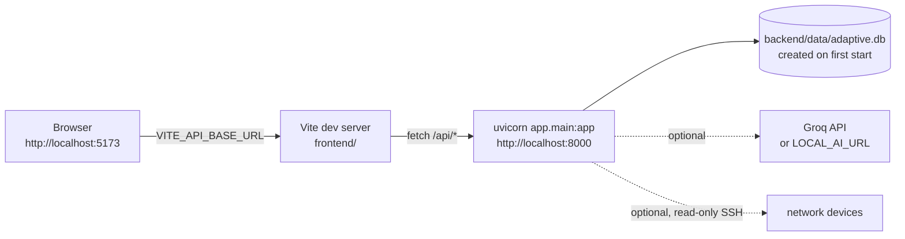

# Development Setup

How to get NetAuditAI running on your machine, check that it works, and fix the usual problems.

---

## 1. What runs where



| Part | Port | Started by |
|---|---|---|
| Backend (FastAPI) | 8000 | `uvicorn app.main:app` |
| Frontend (Vite) | 5173 | `npm run dev` |
| Knowledge store | file | created automatically at `backend/data/adaptive.db`, seeded with 243 recognizers |

---

## 2. Prerequisites

* Python 3.10 or newer
* Node.js 18 or newer
* Optional: a Groq API key (AI explanations, chat, AI judge proposals, AI-drafted candidate commands), or a local
  OpenAI-compatible model server

---

## 3. Backend

```bash
cd backend
python -m venv venv
source venv/bin/activate            # Windows PowerShell: venv\Scripts\Activate.ps1   cmd: venv\Scripts\activate
pip install -r requirements.txt
cp .env.example .env                # optional; every setting has a default
uvicorn app.main:app --reload --host 0.0.0.0 --port 8000
```

Check it:

```bash
curl http://localhost:8000/health
# {"status":"ok","service":"NetAuditAI"}
```

Interactive API docs: http://localhost:8000/docs

Optional extras:

```bash
pip install -r requirements-live.txt   # NAPALM for live collection (Netmiko is already included)
```

### Backend settings (`backend/.env`)

Every setting is optional. See the comments in `backend/.env.example`.

| Variable | Default | Purpose |
|---|---|---|
| `GROQ_API_KEY`, `GROQ_API_KEY_1` to `_4` | empty | Tried in order; the next key is used on 429 / 401 / 403 / 404. Keys from one Groq organization share one daily quota. |
| `LOCAL_AI_URL`, `LOCAL_AI_MODEL`, `LOCAL_AI_TIMEOUT` | empty, `llama3.1:8b`, `120` | A local OpenAI-compatible server (Ollama, llama.cpp, vLLM). When set, the Groq keys are not used. |
| `AI_JUDGE_MAX_CALLS_PER_SCAN` | `2` | AI judge requests per scan for unknown-vendor configurations; cache hits are free. |
| `API_KEY` | empty | When set, every `/api` request needs it in `X-API-Key` (`401` otherwise). The frontend does not send it: leave empty for local use. |
| `CORS_ORIGINS` | `*` | Comma-separated list of allowed origins. |
| `ADAPTIVE_DB_PATH` | `backend/data/adaptive.db` | SQLite file for recognizers, rejected lines, the AI cache, the scan archive and the ledger. A relative path is resolved from where uvicorn starts. |
| `DATABASE_URL` | empty | Postgres URI (for example a Supabase session pooler URI) instead of SQLite. `psycopg` is already in `requirements.txt`. |
| `VENDOR_PARSE_COVERAGE_THRESHOLD` | `0.7` | Share of lines that must follow a vendor's grammar before its parser is trusted. |
| `LIVE_COLLECTION_ENABLED` | `true` | SSH collection (`POST /api/collect`). Set `false` on a backend others can reach. |
| `LIVE_COLLECTION_NETWORKS` | `private` | Only RFC1918 and loopback hosts; link-local always refused. `any` lifts it. |
| `ADAPTIVE_AI_FOR_KNOWN_VENDORS` | `false` | Legacy line interpreter for Cisco / FortiGate lines the parsers skip; review queue only. |

### Offline AI with Ollama

```bash
ollama pull llama3.1:8b
# backend/.env
LOCAL_AI_URL=http://localhost:11434/v1
LOCAL_AI_MODEL=llama3.1:8b
```

The server must support JSON-schema `response_format` (current Ollama and llama.cpp do).

---

## 4. Frontend

```bash
cd frontend
cp .env.example .env                # VITE_API_BASE_URL=http://localhost:8000/api
npm install
npm run dev                         # http://localhost:5173
```

If uvicorn runs on another port, change `VITE_API_BASE_URL` and restart Vite: Vite only reads `.env` at startup.

Production build: `npm run build` (output in `frontend/dist/`), preview with `npm run preview`.

---

## 5. First scan

1. Open http://localhost:5173 and choose **New scan**.
2. Upload `demo-sih/cisco_oneclick.cfg`: Cisco IOS, read by the dedicated parser, posture 41 with 15 problems.
3. Open **Remediation** and apply the automatic fixes; download the corrected file and upload it: posture 100.
4. Upload `demo-sih/unknown_vendor.cfg` and open **Adaptive learning** to teach three lines.

Or from the command line, no UI:

```bash
cd backend
python -m app.cli scan ../demo-sih/ --fail-on high
```

The full demo script is [demo.md](demo.md).

---

## 6. Troubleshooting

| Symptom | Cause | Fix |
|---|---|---|
| Uploads fail with a network error | wrong `VITE_API_BASE_URL`, backend not running, or Vite started before `.env` changed | check `curl localhost:8000/health`, fix `.env`, restart `npm run dev` |
| Every request returns `401` | `API_KEY` is set; the frontend never sends it | empty `API_KEY` for local use |
| Browser console shows a CORS error | `CORS_ORIGINS` does not list the frontend's origin | add `http://localhost:5173` |
| AI features say "not configured" | no Groq key and no `LOCAL_AI_URL` | set one, restart uvicorn |
| AI worked yesterday, not today | Groq daily quota used up (keys of one org share it) | wait for the reset, or use a local model |
| Taught recognizers vanished after a redeploy | the host wiped `backend/data/adaptive.db` | set `DATABASE_URL` to Postgres |
| A scan reopened after a restart cannot be taught or fixed (`409`) | the configuration is never stored; the archive is read-only | upload the file again |
| `POST /api/collect` refuses a host | not RFC1918 / loopback (`LIVE_COLLECTION_NETWORKS=private`) | collect from a private address, or set `any` on a trusted backend only |
| A real Cisco file comes out "unverified" | a command root missing from the curated IOS grammar | see [parser-design.md §4.2](parser-design.md#42-cisco-ios-grammar) |

---

## 7. Running the tests

See [testing.md](testing.md). Short version:

```bash
cd backend && python -m pytest tests -q -n auto
cd frontend && npm test
```
