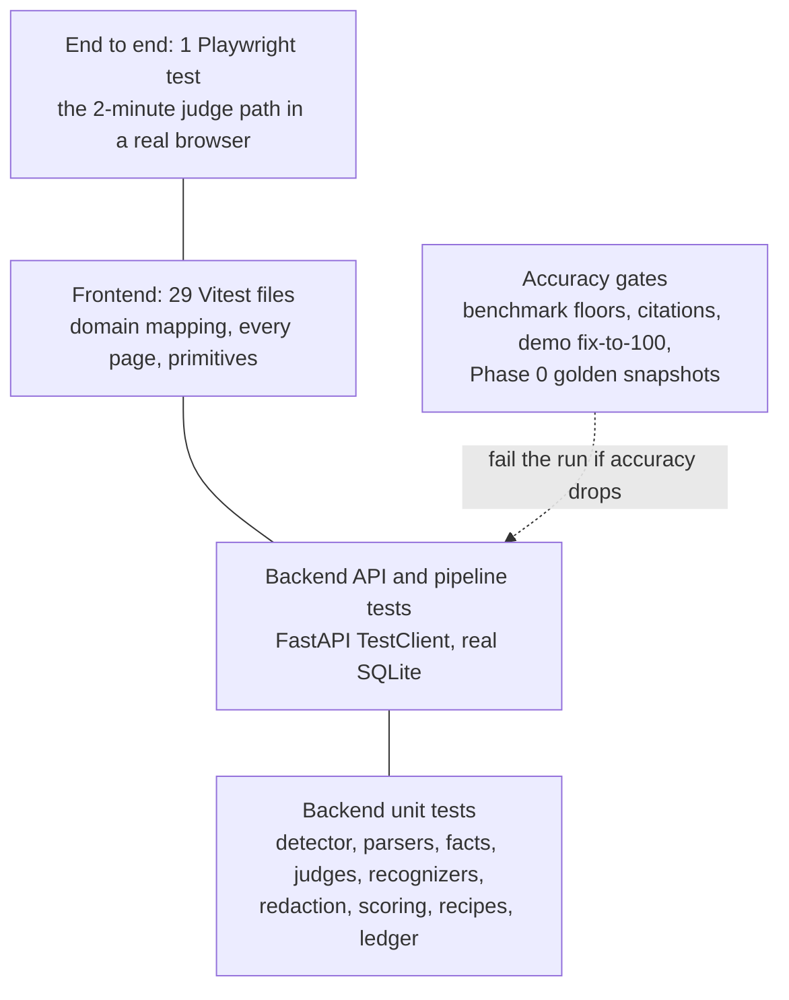
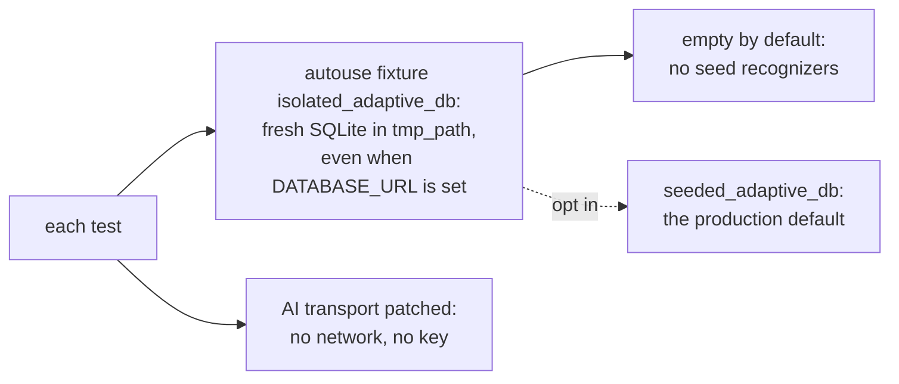

# Testing

How NetAuditAI is tested, what each suite proves, and how to run it. No test needs a network or an API key.

---

## 1. Shape of the suite



| Suite | Files | Test functions | Runner |
|---|---|---|---|
| Backend | 68 | 736 (parametrized into about 1,730 cases) | pytest, pytest-xdist |
| Frontend | 29 | about 150 | Vitest + Testing Library + jsdom |
| End to end | 1 | 1 | Playwright |

---

## 2. Isolation



* **Database.** `backend/tests/conftest.py` gives every test its own temporary SQLite database. It is empty by
  default, **including of the shipped seed recognizers**, so the rest of the suite keeps proving what the generic engine
  works out on its own. Tests about seed knowledge ask for the production default with `seeded_adaptive_db`.
* **AI.** The AI judge transport is patched in every test; `generate` is patched in assistant tests because a
  developer `.env` may hold a real key. Two live Groq tests in `test_adaptive_generic.py` are skipped unless
  `NETAUDIT_LIVE_AI=1` and a key are set.
* **Devices.** Live-collection tests stub Netmiko and NAPALM; no connection is ever opened.

---

## 3. Accuracy gates

These tests fail the run if NetAuditAI gets less accurate:

| Gate | What it pins | Test |
|---|---|---|
| Benchmark floors | planted ≥ 18 detected, fixtures ≥ 89, **0 missed, 0 false alarms** | `test_benchmark.py` |
| Held-out set | 0 missed and 0 false alarms on the pybatfish files (when fetched; see `scripts/benchmark.py`) | `test_benchmark.py`, `test_heldout_labels.py` |
| Citations | every cited line exists and says the cited text; every attack-path step cites a decided FAIL; posture and coverage recompute from the returned results | `test_citations.py` |
| Demo fix-to-100 | each `demo-sih/` file goes from its first scan to posture 100 with 0 findings | `test_demo_fix_to_100.py` |
| Golden snapshots | findings for 30 Cisco / FortiGate configurations unchanged since Phase 0 | `test_phase0_snapshots.py` |
| Attack-path proof | each chain appears on its positive configuration and disappears with only its fix | `test_path_proof.py` |
| Prompt injection | a fully hijacked AI changes no verdict; the fence cannot be closed from inside | `test_prompt_injection.py` |

---

## 4. Backend (`backend/tests/`)

| Area | Tests |
|---|---|
| Phase 0 -golden findings snapshots for 30 Cisco / FortiGate configs | `test_phase0_snapshots.py` |
| Phase 1 -redaction, vendor identification and look-alikes, honest unknowns | `test_phase1_redaction.py`, `test_phase1_vendor_identification.py`, `test_phase1_honest_unknowns.py` |
| Phase 2 -control catalog, NIST / CIS mappings, ControlResult | `test_phase2_controls.py` |
| Phase 3 -posture and coverage | `test_scoring_v2.py` |
| Phase 4 -security facts, decision tables, defaults | `test_phase4_facts.py` |
| Phase 5 -tokenizer and lexicon heuristics (`sample/unknown.cfg` acceptance) | `test_phase5_heuristics.py` |
| Phase 6 -recognizers, gates, replay, Training API | `test_phase6_recognizers.py`, `test_phase6_adaptive_e2e.py` |
| Phase 7 -AI judge: verifier, budget, cache, redaction, authority | `test_phase7_ai_judge.py` |
| Phase 8 -remediation: recipes, inputs, verification, idempotence, API rescan | `test_remediation_e2e.py`, `test_download_fixed.py` |
| Phase 9 -framework views, recognizer persistence across a restart, secret-free stores | `test_phase9_frameworks_persistence.py` |
| Candidate remediation for unconfirmed vendors: eligibility, validation, simulation on a copy, verified / rejected / unverified, human confirmation, AI answer shape and prompt redaction, no vendor branch; asking the AI again after a rejection sends it the rejected command (redacted) and the reason | `test_candidate_remediation.py` |
| The three demo files (`demo-sih/`) go from a bad first scan to posture 100 with 0 findings: Cisco by one-click fixes, Palo Alto by seed write-back plus verified typed commands, the unknown vendor by teaching three lines and then verified commands | `test_demo_fix_to_100.py` |
| The verified corrected copy: retained only on verification and exactly equal to the simulated result, cleared by rejection and by a re-check that fails, downloadable only when verified or confirmed-after-verifying, one copy per candidate, correct content type and safe filename, never in SQLite, gone with the scan, `/download-fixed` still confirmed-vendor only, and the original `sample/juniper.cfg` byte-identical throughout | `test_candidate_remediation.py` |
| Derived remediation: a verified change from the configuration alone on Junos / PAN-OS / RouterOS / Huawei, the words come from the file's own block path, a setting that must exist is never deleted to silence a check, a block opener is never removed alone, a provisional finding cannot be derived from, confirmed vendors keep recipes, the upload and the scan never move | `test_derived_remediation.py` |
| Generic engine on hierarchical, terminator-separated dialects | `test_generic_hierarchical.py` |
| Seed expansion: every new seed's lines and near-misses (61 cases), Dell OS10 / VyOS / FortiSwitchOS / ASA verdicts, the ASA `http server enable` false alarm, migration v7 on an existing database, the redaction and quoted-slot changes | `test_seed_expansion.py` |
| MGMT-010 (management on an untrusted interface) and MGMT-011 (SNMPv1/v2c) | `test_checks_pack_a.py` |
| AUTH-001 (failed-login limit), AUTH-002 (password length), AUTH-003 (default account names) | `test_checks_pack_b.py` |
| CRYPTO-002 (weak management cryptography) and LOG-003 (rules that do not log) | `test_checks_pack_c.py` |
| BOUNDARY-004 (ICMP redirects, proxy-ARP, directed broadcasts on routed interfaces) | `test_checks_pack_d.py` |
| Learned absence: a setting no device ships with, that an understood dialect would state and nothing states, is a decided FAIL; untaught syntax never is | `test_learned_absence.py` |
| Seed write-back: the recognizer that read a failing line writes its secure form, verified by a rescan; missing syslog / banner added in the dialect's own syntax | `test_writeback.py` |
| Final review: verified fixes plus confirmed candidates rescanned once, then downloaded | `test_final_review.py` |
| Live collection: driver choice, a collected configuration reaches the ordinary pipeline unchanged, unreachable devices reported, private-network bound, credentials never kept (drivers stubbed, no connection opened) | `test_live_collection.py` |
| Assistant: it sees the redacted results only, never the configuration; conversation history trimmed | `test_assistant_chat.py` |
| Scan archive: a redacted copy survives a simulated restart, reopens read-only, teaching or fixing it asks for the file again | `test_scan_archive.py` |
| Security Baseline Model: every configuration, whatever its vendor, normalized into the same fields | `test_baseline_model.py` |
| Resolution queue: the initial score is unchanged, the queue is exactly what coverage left out, a line can be picked and its meaning stated, an answer the line does not support is refused, teaching persists and the next scan reuses it, the resolved control becomes PASS or FAIL with recalculated posture and coverage, the uploaded configuration is unchanged, prose is reported unreadable and never scored | `test_resolution_queue.py` |
| Shipped seed knowledge: loading on a fresh database, idempotence, never overwriting what was taught, generalization across the seeded dialects, no accidental or secret matches, unchanged Cisco / FortiGate and unknown-vendor behaviour, the fresh-deployment demo and teaching on top of it | `test_seed_knowledge.py`, fixtures in `tests/fixtures/seed_dialects/` |
| Brace-block Junos read by set-style seeds (same verdicts as its set twin, the leaf's own line cited), `inactive:` and `/* */` | `test_structured_braces.py` |
| RouterOS default SNMP community and plaintext user passwords; neither secret reaches a recognizer, the scan, the PDF or the ledger | `test_mikrotik_credentials.py` |
| Terraform: blocks flattened in place, AWS / Azure / GCP rules decided on the rule's own line, unresolved variables never decide, device-only checks N/A | `test_terraform.py`, fixtures in `tests/fixtures/terraform/` |
| Azure NSG and GCP firewall JSON exports: one rule per line, only an open Allow / INGRESS rule counts (deny, outbound, disabled do not), device-only checks N/A | `test_cloud_json.py`, fixtures in `tests/fixtures/cloud_json/` |
| Independent citation check over every benchmark and demo file (and the demo fleet): each cited line exists and says the cited text (a `<SECRET:…>` placeholder stands for its value), each attack-path step cites a decided FAIL of the same device on lines that result cites, posture and coverage recomputed from the returned results match | `test_citations.py` |
| CVE context by OS version: matched on the stated train only, nothing inferred, a broken cache means no data, scores / findings / paths / risk identical with and without it, shown in the PDF with the caveat | `test_cve.py` |
| Attack-path proof: per chain a positive configuration showing exactly that chain and a copy with only its fix showing none (expectations written first), the diff is only the fix, the recorded proof matches the catalog | `test_path_proof.py`, fixtures in `tests/fixtures/attack_paths/` |
| SONiC `config_db.json` tables and Cumulus NVUE: default communities fail, custom pass, syslog / NTP / TACACS+ read, a disabled NTP server never decided, community strings and TACACS keys never leave | `test_sonic_cumulus.py` |
| Recognizer generalization: one recognizer over many addresses, names and numbers; indentation, whitespace and statement order ignored; positive and negative forms opposite; the same leaf word in another block not matched; a value-sensitive setting giving different control results from one recognizer; half a multi-fact control left undecided; a taught concept reused on the next scan; a line that states nothing teaching only a setting it names, while a line that states an on/off may be named in any words; and the acceptance loop -five concepts taught through the API, a configuration of seven variant lines scanned, only the genuinely new control left in the queue | `test_recognizer_generalization.py` |
| Compliance report (PDF): a PDF per device and a zip for several, a hostname cannot escape the download name, no secret of the configuration reaches the document or the rendered bytes, serial numbers are not invented, provisional readings are never shown as PASS/FAIL, no vendor commands for an unconfirmed vendor, the deterministic change and its rescan checks for a confirmed one, unmapped frameworks named, undecided checks listed, a prose file reported unreadable | `test_pdf_report.py` |
| Parsers, pipeline, ACLs, FortiGate model and firmware from the `#config-version=` header | `test_pipeline.py`, `test_cisco_acl.py` |
| Adaptive layer and legacy interpreter, learned mappings, review API | `test_adaptive.py`, `test_adaptive_generic.py`, `test_adaptive_api_integration.py`, `test_phase3_adaptive_mapper.py`, `test_phase3_e2e.py`, `test_phase4_review_api.py`, `test_phase5_learned_mappings.py` |
| Settings, Groq key rotation | `test_config_loading.py`, `test_ai_client_key_rotation.py` |
| Optional API key: open when unset, `401` without or with a wrong `X-API-Key`, `/health` always open | `test_api_key.py` |
| `DATABASE_URL`: a raw password holding `@` or `$` is percent-encoded so the right host is used | `test_database_url.py` |
| Browser UI audit regressions -no secret in API responses, `config_index` identity, generic hostnames, manual-review consistency, CIS banner mapping, scan status | `test_ui_audit_regressions.py` |
| Accuracy benchmark floors (planted ≥ 18, fixtures ≥ 89, 0 missed, 0 false alarms; held-out 0 missed and 0 false alarms wherever its files are fetched) | `test_benchmark.py` |
| Held-out labels well formed: every label names a real control, has evidence, and every cited line says the cited text (shapes only when the pybatfish files are absent) | `test_heldout_labels.py` |
| Prompt injection: the fence cannot be closed from inside, a fully hijacked AI changes no verdict | `test_prompt_injection.py` |
| Attack paths, evidence chain, contextual risk | `test_attack_paths.py`, `test_evidence_chain.py`, `test_risk.py` |
| Audit ledger: every scan and report recorded, a report PDF or a multi-device .zip verifies, any edit breaks the chain | `test_ledger.py` |
| Changes since the last audit (fixed, new, no longer decided) | `test_drift.py` |
| Checks across devices: shared SNMP community never shown, NTP / syslog mismatch | `test_fleet_checks.py` |
| Offline AI through a local OpenAI-compatible server | `test_local_ai.py` |
| Command line: exit codes, SARIF on the cited line, no secret in the output | `test_cli.py` |
| Organisation policy: tightens only, results cite it, CLI `--policy` | `test_policy.py` |
| Seed knowledge incl. LLDP on an external-zone interface and PAN-OS password length from its reviewed factory default | `test_seed_knowledge.py` |

Two live Groq tests in `test_adaptive_generic.py` are skipped unless `NETAUDIT_LIVE_AI=1` and a key are set.

### Fixtures

| Folder | Contents |
|---|---|
| `tests/fixtures/*.cfg` | Cisco and FortiGate secure / vulnerable pairs, a broken-SNMP FortiGate, a Juniper edge |
| `tests/fixtures/lookalikes/` | Arista, Brocade, ASA, IOS-XE exec banner, IOS-XR, NX-OS, Dell OS10, FortiSwitch, mixed: each must stay unverified |
| `tests/fixtures/seed_dialects/` | one or more files per seeded dialect (Junos set and brace, PAN-OS, Arista, Huawei, Aruba, Gaia, EXOS, RouterOS, NX-OS, ASA, IOS-XR, SONiC, Cumulus) |
| `tests/fixtures/terraform/`, `cloud_json/` | AWS / Azure / GCP secure and insecure pairs |
| `tests/fixtures/attack_paths/` | a positive and a negative configuration per chain |
| `tests/fixtures/demo/` | the two-minute judge path files |
| `tests/snapshots/phase0_findings.json` | golden findings (regenerate with `generate_phase0_snapshots.py` only on purpose) |

---

## 5. Frontend (`frontend/src/`)

| Area | Tests |
|---|---|
| Backend state to user-facing state, counts, next step, plain-language readings, safety-gate wording, fix order | `lib/domain.test.js` |
| Overview (`Results.jsx`): posture never overstated, honest counts, the resolution queue, a file holding no configuration, the PDF download | `app/Results.test.jsx` |
| Fix: remediation classes, inputs, verified fix, download of verified changes only, candidates (derive, generate, review, verify, reject, confirm), *Ask AI* again after a rejection, the refusal when a removal cannot resolve a check, the verified corrected copy and its "not applied to a device" warning | `app/Fix.test.jsx` |
| Teach: the undecided check, choosing a suggested line or any line, stating what it means, gate failures in plain English, the saved recognizer and the updated posture / coverage | `app/Teach.test.jsx` |
| Assistant: local-model label, no answer before a scan, earlier turns sent, openers the scan can answer | `app/Assistant.test.jsx` |
| Markdown rendering of AI answers: emphasis, tables, rules, headings; **never builds HTML** | `components/Markdown.test.jsx` |
| Assistant panel geometry: docked width, minimum size, pulled back on resize, draggable | `lib/panel.test.js` |
| Live collection form: "collection is off", missing driver named, credentials cleared after the request, unreachable devices named | `app/Collect.test.jsx` |
| Upload: framework choice, asset context, policy file (refused when not JSON), duplicate files | `app/Upload.test.jsx` |
| API client: "server cannot be reached" instead of "Failed to fetch", refused values named, baseline JSON export | `api/client.test.js` |
| Finding drawer: evidence, assurance, no invented commands, *Explain this* labelled as AI commentary | `app/FindingDrawer.test.jsx` |
| Devices (CVE context with caveat), Learned (seed vs taught), Progress strip, First-run tips (works when storage is blocked) | `app/Devices.test.jsx`, `app/Learned.test.jsx`, `app/ProgressStrip.test.jsx`, `app/FirstRunTips.test.jsx` |
| Attack paths, field-by-field compare, fleet, drift, ledger, rules catalog, frameworks, history, legacy review queue | `app/AttackPaths.test.jsx`, `app/Baseline.test.jsx`, `app/Fleet.test.jsx`, `app/Drift.test.jsx`, `app/Ledger.test.jsx`, `app/Rules.test.jsx`, `app/Frameworks.test.jsx`, `app/History.test.jsx`, `app/LegacyInterpretations.test.jsx` |
| Homepage claims, entering the application, expired scan | `App.test.jsx` |
| Shared hooks, UI primitives, summary-only history, mapping form validation | `lib/hooks.test.jsx`, `components/ui/ui.test.jsx`, `utils/history.test.js`, `utils/adaptiveValidation.test.js` |

---

## 6. End to end (`frontend/e2e/demo.spec.js`)

Runs the two-minute judge path in a real browser against the real backend, on their own ports (backend 8011, frontend
5183) with a throwaway database and AI off: scan Cisco + PAN-OS + Junos + Terraform, Overview, compare fields,
executive summary, attack paths, verify the ledger and the downloaded report, a one-byte edit is caught, rules catalog.
It writes `demo-timings.json` with the measured seconds per step. On Windows it uses the installed Chrome
(`PW_CHANNEL=msedge` to change); elsewhere run `npx playwright install chromium` once.

---

## 7. Run

```bash
# backend
cd backend
python -m pytest tests -q -n auto                    # parallel
python -m pytest tests/test_seed_knowledge.py -q     # one file
NETAUDIT_LIVE_AI=1 python -m pytest tests -q         # also the 2 live-AI tests (needs a Groq key)
python scripts/benchmark.py                          # the accuracy table in benchmark/RESULTS.md

# frontend
cd frontend
npm test                                             # Vitest
npm run e2e                                          # Playwright, starts its own servers
npm run build
```

Windows: `venv\Scripts\python -m pytest tests -q -n auto`.

No linter or type checker is configured in the repository, and no CI workflow ships: the suites run locally.

### On a clean clone

Expect **23 failed and 2 errors** that have nothing to do with the code under test:

| Tests | Why they fail on a clean clone |
|---|---|
| 16 `test_citations.py` cases, `test_baseline_model.py` (2 errors), 2 `test_learned_absence.py` cases | they read configurations from `teach/`, which `.gitignore` excludes |
| `test_benchmark.py` | the "fixtures" floor (89) counts labels whose files live in `teach/`; a clean clone measures 19 of 25 |
| 4 `test_config_loading.py` cases | they expect a developer `backend/.env` holding a Groq key |

Committing the `teach/` corpus (or moving those cases behind a skip when it is absent) and making the `.env` tests
create their own temporary file would make the suite green from a clone.
